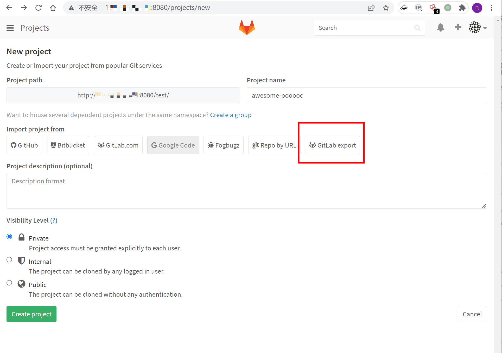
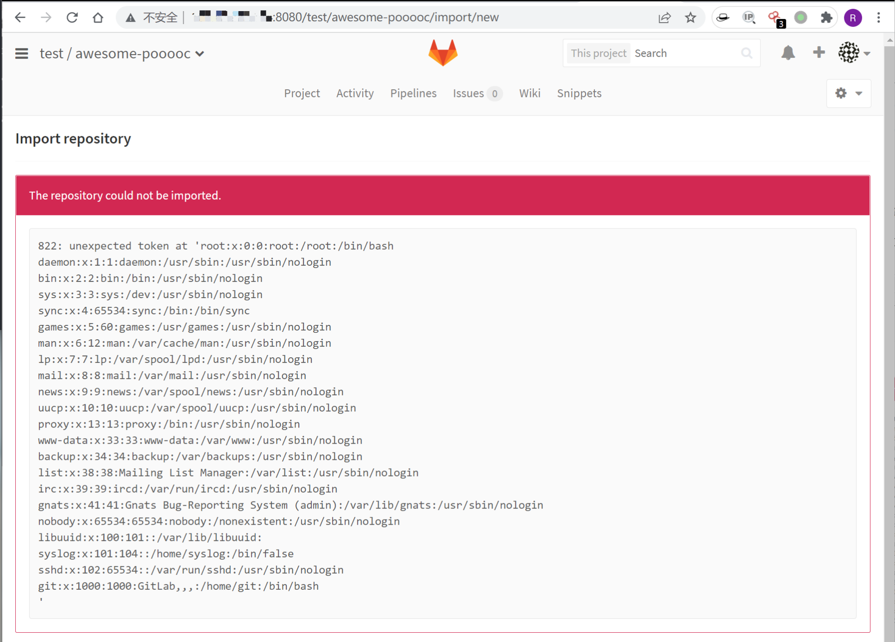

## 核对与使用边界

本文已按保存的全文审阅记录进行文字校订；本轮仅静态核对，未运行 PoC、请求目标或逐图验证。

适用条件与版本记录（来源主张，未列为明确更正的部分仍待权威资料核对）：Introduced8.9; lab8.13.1; logged-in project import; readable filesystem targets

代码与实验材料：External test.tar.gz and UI steps; tar contents/mechanism not transcribed; screenshots only success

来源证据范围：Official GitLab advisory,HackerOne178152,Seebug104,Vulhub fixture

- **代码与转录边界（1）**：Full affected/fixed branches missing; export versus import UI wording ambiguous。相应原代码作为存在此问题的历史样本保留，不能直接当作可运行、成功复现的 PoC；缺失内容需回原稿核对，不据此补造可执行攻击链。

历史原文标识：下文原技术材料按来源保留；仅本节明确确认的更正替代相应旧说法，标为待核的观察仍不是事实确认。

# GitLab 任意文件读取漏洞 CVE-2016-9086

## 漏洞描述

GitLab是一款Ruby开发的Git项目管理平台。在8.9版本后添加的“导出、导入项目”功能，因为没有处理好压缩包中的软连接，已登录用户可以利用这个功能读取服务器上的任意文件。

参考链接：

- https://about.gitlab.com/releases/2016/11/02/cve-2016-9086-patches/
- https://hackerone.com/reports/178152
- http://paper.seebug.org/104/

## 环境搭建

执行如下命令启动一个GitLab Community Server 8.13.1：

```
docker-compose up -d
```

环境运行后，访问`http://your-ip:8080`即可查看GitLab主页，其ssh端口为10022，默认管理员账号、密码是`root`、`vulhub123456`。

> 注意，请使用2G及以上内存的VPS或虚拟机运行该环境，实测1G内存的机器无法正常运行GitLab（运行后502错误）。

## 漏洞复现

注册并登录用户，新建一个项目，点击`GitLab export`。



在导入页面，将[test.tar.gz](https://github.com/vulhub/vulhub/blob/master/gitlab/CVE-2016-9086/test.tar.gz)上传，将会读取到`/etc/passwd`文件内容。




---

> 来源：Threekiii/Awesome-POC
