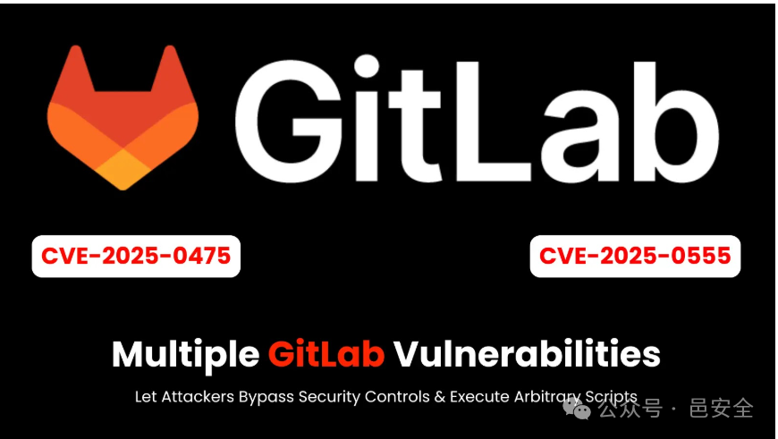

## 2026-10-03 编号核验

CNA 已撤销 CVE-2025-0307，当前记录未给出更具体的原因。本次仅将这一编号移入历史引用，保留本篇另外四个主编号；Planner 角色访问代码审查分析的描述仍是下文来源主张。浏览器 XSS 与服务器代码执行的结论继续分别判断。

## 核对与使用边界

本文已按保存的全文审阅记录进行文字校订；本轮仅静态核对，未运行 PoC、请求目标或逐图验证。

适用条件与版本记录（来源主张，未列为明确更正的部分仍待权威资料核对）：15.10–17.9.0 andEE16.6–17.9.0 broad; fixes17.9.1/17.8.4/17.7.6; per-CVEbackports absent

代码与实验材料：No PoC; browserXSS versusserverRCE headline; unauthorizedconsequences extrapolated

来源证据范围：Cybersecuritynews exactarticle; noGitLabadvisory

- **凭据与会话边界（1）**：document.cookie cannot generally readHttpOnlysessioncookie; inferredKubernetesdeploy/roleescalation require permissions/evidence。抓包中的会话不能视为未认证访问证明。需重新取得授权测试会话，不能复用文中值。

- **结论使用边界（2）**：UndergroundPoC and48hour riskthreshold unsupported; browser script execution mustn't be indexed as generic serverRCE。此项限制直接适用于下文对应结论；现有正文不足以作更宽泛推论，所列方法和原始证据均保留。

- **事实待核（3）**：Mergedaffectedranges include branchfixedversions;5entities needdistinctconditions。该项尚不能从转载本身确定外部事实；下文相应编号、版本或修复说法只作为来源记录，不能据此判定部署受影响或已修复。明确更正另列于本节。

历史原文标识：下文原技术材料按来源保留；仅本节明确确认的更正替代相应旧说法，标为待核的观察仍不是事实确认。

#  GitLab漏洞让攻击者绕过安全控制并执行任意代码   
邑安科技  邑安全   2025-02-27 08:35  
  
更多全球网络安全资讯尽在邑安全  
  
  
  
GitLab 已针对其 DevOps 平台中的多个高风险漏洞发布了安全咨询警告，其中包括两个关键的跨站点脚本 （XSS） 缺陷，使攻击者能够绕过安全控制并在用户浏览器中执行恶意脚本。  
  
这些漏洞被跟踪为 CVE-2025-0475 （CVSS 8.7） 和 CVE-2025-0555 （CVSS 7.7） - 影响多个版本的自我管理实例，利用漏洞场景允许会话劫持、凭证盗窃和未经授权的系统访问。  
### 关键 Kubernetes 代理漏洞 （CVE-2025-0475）  
  
GitLab 的 Kubernetes 代理终端节点中的高严重性 XSS 缺陷影响了从 15.10 到 17.9.0 的所有版本。  
  
利用此漏洞的攻击者可以通过未正确清理的代理响应注入恶意 JavaScript 负载，从而导致基于 DOM 的 XSS 攻击。  
  
“代理功能可能会允许在特定情况下意外呈现内容，从而导致 XSS，”GitLab 公告中写道。  
  
攻击媒介 （AV：N/AC：L/PR：L） 需要网络访问权限和低攻击者权限，但可以通过构建的 HTTP 响应完全破坏用户会话。成功利用此漏洞后，攻击者可以：  
- 通过 document.cookie 泄露窃取会话 cookie  
  
- 使用 XMLHttpRequest 修改 CI/CD 管道配置  
  
- 通过 Kubernetes API 交互部署恶意容器  
  
### Maven 依赖代理 XSS 绕过漏洞 （CVE-2025-0555）  
  
Maven Dependency Proxy 中的另一个 XSS 漏洞会影响 GitLab-EE 版本 16.6 到 17.9.0。  
  
此缺陷使攻击者能够使用包含 JavaScript 负载的特制依赖项元数据文件绕过内容安全策略 （CSP） 限制。该漏洞利用了 Maven 构件处理中不正确的输入验证。  
  
GitLab 确认这允许“绕过安全控制并在特定条件下在用户的浏览器中执行任意脚本”。  
  
攻击复杂性 （AC：H） 需要精确的时间，但支持从 Developer 到 Maintainer 角色的权限提升。  
###   
### 中等严重性漏洞  
  
三个中等严重性漏洞加剧了风险态势：  
- CVE-2024-8186 漏洞：通过子项目搜索 （CVSS 5.4） 进行 HTML 注入，从而在自托管实例中启用有限的 XSS。  
  
- CVE-2024-10925 漏洞： 来宾用户访问安全策略 YAML 文件 （CVSS 5.3），从而公开合规性规则。  
  
- CVE-2025-0307 漏洞：Planner 角色访问代码审查分析 （CVSS 4.3），揭示敏感指标。  
  
GitLab 的漏洞赏金计划感谢研究人员 joaxcar、yuki_osaki 和 weasterhacker 发现了这些漏洞，突显了该平台对社区驱动型安全性的依赖。  
  
GitLab 发布了修补版本 17.9.1、17.8.4 和 17.7.6。安全分析师警告说，未修补的 GitLab 实例仍然是 APT 组织的主要目标，XSS 漏洞越来越多地在软件供应链攻击中被武器化。  
  
所有使用受影响 GitLab 版本的组织都应将此视为关键基础设施更新。考虑到已发布的漏洞利用详细信息和地下论坛中现有的概念验证代码，将修补延迟到 48 小时以上会显著增加泄露风险。  
  
原文来自:   
cybersecuritynews.com  
  
原文链接: https://cybersecuritynews.com/gitlab-vulnerabilities-bypass-security-controls/  
  
欢迎收藏并分享朋友圈，让五邑人网络更安全  
  
  
  
欢迎扫描关注我们，及时了解最新安全动态、学习最潮流的安全姿势！  
  
推荐文章  
  
1  
  
[新永恒之蓝？微软SMBv3高危漏洞（CVE-2020-0796）分析复现](http://mp.weixin.qq.com/s?__biz=MzUyMzczNzUyNQ==&mid=2247488913&idx=1&sn=acbf595a4a80dcaba647c7a32fe5e06b&chksm=fa39554bcd4edc5dc90019f33746404ab7593dd9d90109b1076a4a73f2be0cb6fa90e8743b50&scene=21#wechat_redirect)  
  
  
2  
  
[重大漏洞预警：ubuntu最新版本存在本地提权漏洞（已有EXP）　](http://mp.weixin.qq.com/s?__biz=MzUyMzczNzUyNQ==&mid=2247483652&idx=1&sn=b2f2ec90db499e23cfa252e9ee743265&chksm=fa3941decd4ec8c83a268c3480c354a621d515262bcbb5f35e1a2dde8c828bdc7b9011cb5072&scene=21#wechat_redirect)  
  
  
  
  
  

---

> 来源：gelusus/wxvl（微信公众号漏洞文章自动归档，原文见文首链接）
