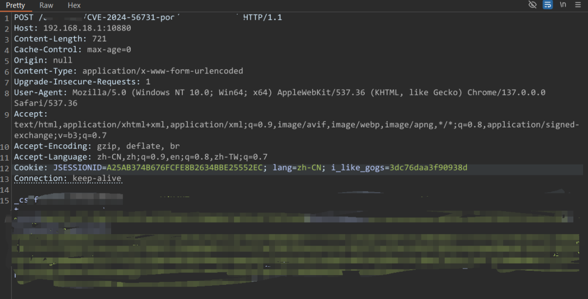
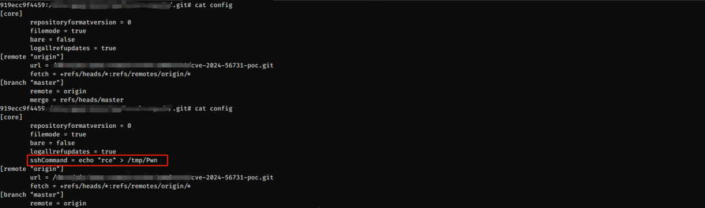
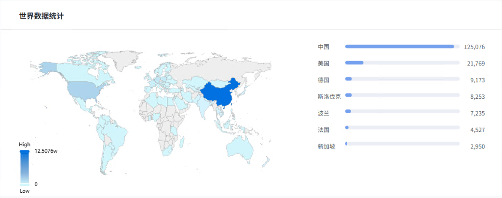
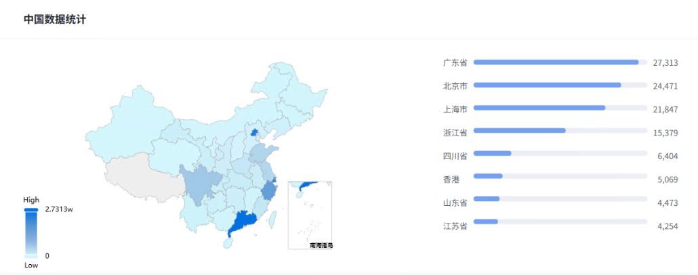

## 核对与使用边界

本文已按保存的全文审阅记录进行文字校订；本轮仅静态核对，未运行 PoC、请求目标或逐图验证。

适用条件与版本记录（来源主张，未列为明确更正的部分仍待权威资料核对）：&lt;0.13.3，0.13.3修复；普通非特权账号，执行权限为RUN_USER

代码与实验材料：复现仅两张图，公告表明确PoC/技术细节未公开，不等于无漏洞；无文本可复核链条

来源证据范围：官方GHSA-wj44-9vcg-wjq7、具体commit77a4a945和0.13.3release，来源可追溯

- **实验改动边界（1）**：部分临时缓解有效性及配置键需核实；依据：将注册来源限制项置于security，称按域/IP但只有邮箱域；强制私有仓库不能阻止已有用户写自身仓库触发；ufw多端口命令未给协议。以下步骤按原实验条件保留；人工改动后的行为只支持该修改环境，不用于证明未修改发行版默认可利用。

- **适用与权限边界（2）**：情报与图片证据需保留边界；依据：9.9无向量，在野未发现和未公开都是2025-06-25状态，资产分布及复现不可从文字判定。按此限制解释本文结论，版本相同不足以证明所需角色、入口、配置、依赖或可控参数均已满足；原操作和失败记录一并保留。

历史原文标识：下文原技术材料按来源保留；仅本节明确确认的更正替代相应旧说法，标为待核的观察仍不是事实确认。

#  【已复现】Gogs 远程命令注入漏洞(CVE-2024-56731)  
原创 360漏洞研究院  360漏洞研究院   2025-06-25 13:16  
  
  
  
  
<table><tbody><tr style="box-sizing: border-box;"><td colspan="4" data-colwidth="100.0000%" width="100.0000%" style="border-width: 1px;border-color: rgb(100, 130, 228);border-style: solid;background-color: rgb(100, 130, 228);box-sizing: border-box;padding: 0px;"><section style="text-align: center;color: rgb(255, 255, 255);box-sizing: border-box;">
<strong style="box-sizing: border-box;">漏洞概述</strong>
</section></td></tr><tr style="box-sizing: border-box;"><td data-colwidth="25.0000%" width="25.0000%" style="border-width: 1px;border-color: rgb(100, 130, 228);border-style: solid;box-sizing: border-box;padding: 0px;"><section style="font-size: 12px;color: rgb(0, 0, 0);padding: 0px 8px;box-sizing: border-box;">
<strong style="box-sizing: border-box;">漏洞名称</strong>
</section></td><td colspan="3" data-colwidth="75.0000%" width="75.0000%" style="border-width: 1px;border-color: rgb(100, 130, 228);border-style: solid;box-sizing: border-box;padding: 0px;"><section style="font-size: 12px;padding: 0px 8px;box-sizing: border-box;">
Gogs 远程命令注入漏洞
</section></td></tr><tr style="box-sizing: border-box;"><td data-colwidth="25.0000%" width="25.0000%" style="border-width: 1px;border-color: rgb(100, 130, 228);border-style: solid;box-sizing: border-box;padding: 0px;"><section style="font-size: 12px;color: rgb(0, 0, 0);padding: 0px 8px;box-sizing: border-box;">
<strong style="box-sizing: border-box;">漏洞编号</strong>
</section></td><td colspan="3" data-colwidth="75.0000%" width="75.0000%" style="border-width: 1px;border-color: rgb(100, 130, 228);border-style: solid;box-sizing: border-box;padding: 0px;"><section style="font-size: 12px;padding: 0px 8px;box-sizing: border-box;">
CVE-2024-56731
</section></td></tr><tr style="box-sizing: border-box;"><td data-colwidth="25.0000%" width="25.0000%" style="border-width: 1px;border-color: rgb(100, 130, 228);border-style: solid;box-sizing: border-box;padding: 0px;"><section style="font-size: 12px;color: rgb(0, 0, 0);padding: 0px 8px;box-sizing: border-box;">
<strong style="box-sizing: border-box;">公开时间</strong>
</section></td><td data-colwidth="25.0000%" width="25.0000%" style="border-width: 1px;border-color: rgb(100, 130, 228);border-style: solid;box-sizing: border-box;padding: 0px;"><section style="font-size: 12px;padding: 0px 8px;box-sizing: border-box;">
2025-6-24
</section></td><td data-colwidth="25.0000%" width="25.0000%" style="border-width: 1px;border-color: rgb(100, 130, 228);border-style: solid;box-sizing: border-box;padding: 0px;"><section style="font-size: 12px;padding: 0px 8px;box-sizing: border-box;">
<strong style="box-sizing: border-box;">CVSS 3.1</strong>
</section></td><td data-colwidth="25.0000%" width="25.0000%" style="border-width: 1px;border-color: rgb(100, 130, 228);border-style: solid;box-sizing: border-box;padding: 0px;"><section style="font-size: 12px;padding: 0px 8px;box-sizing: border-box;">
9.9
</section></td></tr><tr style="box-sizing: border-box;"><td data-colwidth="25.0000%" width="25.0000%" style="border-width: 1px;border-color: rgb(100, 130, 228);border-style: solid;box-sizing: border-box;padding: 0px;"><section style="font-size: 12px;color: rgb(0, 0, 0);padding: 0px 8px;box-sizing: border-box;">
<strong style="box-sizing: border-box;">漏洞类型</strong>
</section></td><td data-colwidth="25.0000%" width="25.0000%" style="border-width: 1px;border-color: rgb(100, 130, 228);border-style: solid;box-sizing: border-box;padding: 0px;"><section style="font-size: 12px;padding: 0px 8px;box-sizing: border-box;">
命令注入
</section></td><td data-colwidth="25.0000%" width="25.0000%" style="border-width: 1px;border-color: rgb(100, 130, 228);border-style: solid;box-sizing: border-box;padding: 0px;"><section style="font-size: 12px;color: rgb(0, 0, 0);padding: 0px 8px;box-sizing: border-box;">
<strong style="box-sizing: border-box;">POC状态</strong>
</section></td><td data-colwidth="25.0000%" width="25.0000%" style="border-width: 1px;border-color: rgb(100, 130, 228);border-style: solid;box-sizing: border-box;padding: 0px;"><section style="font-size: 12px;padding: 0px 8px;box-sizing: border-box;">
未公开
</section></td></tr><tr style="box-sizing: border-box;"><td data-colwidth="25.0000%" width="25.0000%" style="border-width: 1px;border-color: rgb(100, 130, 228);border-style: solid;box-sizing: border-box;padding: 0px;"><section style="font-size: 12px;padding: 0px 8px;box-sizing: border-box;">
<strong style="box-sizing: border-box;">利用可能性</strong>
</section></td><td data-colwidth="25.0000%" width="25.0000%" style="border-width: 1px;border-color: rgb(100, 130, 228);border-style: solid;box-sizing: border-box;padding: 0px;"><section style="font-size: 12px;padding: 0px 8px;box-sizing: border-box;">
高
</section></td><td data-colwidth="25.0000%" width="25.0000%" style="border-width: 1px;border-color: rgb(100, 130, 228);border-style: solid;box-sizing: border-box;padding: 0px;"><section style="font-size: 12px;padding: 0px 8px;box-sizing: border-box;">
<strong style="box-sizing: border-box;">EXP状态</strong>
</section></td><td data-colwidth="25.0000%" width="25.0000%" style="border-width: 1px;border-color: rgb(100, 130, 228);border-style: solid;box-sizing: border-box;padding: 0px;"><section style="font-size: 12px;padding: 0px 8px;box-sizing: border-box;">
未公开
</section></td></tr><tr style="box-sizing: border-box;"><td data-colwidth="25.0000%" width="25.0000%" style="border-width: 1px;border-color: rgb(100, 130, 228);border-style: solid;box-sizing: border-box;padding: 0px;"><section style="font-size: 12px;color: rgb(0, 0, 0);padding: 0px 8px;box-sizing: border-box;">
<strong style="box-sizing: border-box;">在野利用状态</strong>
</section></td><td data-colwidth="25.0000%" width="25.0000%" style="border-width: 1px;border-color: rgb(100, 130, 228);border-style: solid;box-sizing: border-box;padding: 0px;"><section style="font-size: 12px;padding: 0px 8px;box-sizing: border-box;">
未发现
</section></td><td data-colwidth="25.0000%" width="25.0000%" style="border-width: 1px;border-color: rgb(100, 130, 228);border-style: solid;box-sizing: border-box;padding: 0px;"><section style="font-size: 12px;color: rgb(0, 0, 0);padding: 0px 8px;box-sizing: border-box;">
<strong style="box-sizing: border-box;">技术细节状态</strong>
</section></td><td data-colwidth="25.0000%" width="25.0000%" style="border-width: 1px;border-color: rgb(100, 130, 228);border-style: solid;box-sizing: border-box;padding: 0px;"><section style="font-size: 12px;padding: 0px 8px;box-sizing: border-box;">
未公开
</section></td></tr></tbody></table>  
  
  
**01**  
  
影响组件  
  
  
  
**Gogs**  
 是使用 **Go**  
 语言开发的轻量级自托管 **Git**  
 服务，支持私有化部署，可在低资源设备上运行，提供类 GitHub 的仓库管理、Webhook等功能。  
  
  
**02**  
  
**漏洞描述**  
  
  
  
近日，**Gogs**  
 被披露存在一处命令注入漏洞，该漏洞是由于对 **CVE-2024-39931**  
 漏洞的修复中对 .git 目录的路径进行了检查，但仍然有可能通过符号链接的方式绕过检查从而修改配置文件，非特权用户账户可以使用配置中由**RUN_USER**  
指定的账户权限，在 Gogs 实例上**执行任意命令**  
。官方已经在新版本中修复此漏洞，建议受影响用户及时升级到安全版本。  
  
  
**03**  
  
**漏洞复现******  
  
  
  
  
  
  
  
  
**04**  
  
**漏洞影响范围******  
  
  
  
Gogs < 0.13.3  
  
  
**05**  
  
**网络空间测绘数据**  
  
  
  
360测绘云 Quake通过对全网资产测绘，发现Gogs具体分布如下所示。  
  
  
  
  
  
  
**06**  
  
**修复建议******  
  
  
  
**正式防护方案**  
  
针对此漏洞，官方已经发布了漏洞修复版本，请立即更新到安全版本：  
  
Gogs >= 0.13.3  
  
下载链接：  
  
https://github.com/gogs/gogs/releases/tag/v0.13.3  
  
安装前，请确保备份所有关键数据，并按照官方指南进行操作。安装后，进行全面测试以验证漏洞已被彻底修复，并确保系统其他功能正常运行。  
  
  
**临时缓解措施**  
  
**1. 关闭开放注册**  
  
修改 custom/conf/app.ini 文件，设置：  
  
[service]  
  
DISABLE_REGISTRATION = true  ; 禁止公开注册  
  
此后仅管理员可在后台手动添加用户  
  
**2. 限制注册域/IP**  
  
若需部分开放注册，可设置白名单  
  
[security]  
  
ALLOW_ONLY_EXTERNAL_REGISTRATION = true  ; 仅允许特定来源注册  
  
REGISTRATION_WHITELIST_DOMAINS = example.com  ; 限制邮箱域名  
  
**3. 私有仓库强制化**  
  
在 app.ini 中设置所有新仓库默认私有：  
  
[repository]  
  
DEFAULT_PRIVATE = always  ; 新仓库自动设为私有  
  
**4. IP白名单与防火墙**  
  
使用 iptables 或 ufw 限制访问来源：  
  
# 仅允许IP 192.168.1.0/24 网段访问  
  
sudo ufw allow from 192.168.1.0/24 to any port 3000,22  
  
  
**07**  
  
**时间线**  
  
  
  
2025年6月25日，360漏洞研究院发布安全风险通告。  
  
  
**08**  
  
参考链接  
  
  
  
https://github.com/gogs/gogs/security/advisories/GHSA-wj44-9vcg-wjq7  
  
https://github.com/gogs/gogs/commit/77a4a945ae9a87f77e392e9066b560edb71b5de9  
  
https://github.com/gogs/gogs/releases/tag/v0.13.3  
  
  
**09**  
  
更多漏洞情报  
  
  
  
建议您订阅360数字安全-漏洞情报服务，获取更多漏洞情报详情以及处置建议，让您的企业远离漏洞威胁。  
  
  
邮箱：360VRI@360.cn  
  
网址：https://vi.loudongyun.360.net  
  
  
  
“洞”悉网络威胁，守护数字安全  
  
  
**关于我们**  
  
  
360 漏洞研究院，隶属于360数字安全集团。其成员常年入选谷歌、微软、华为等厂商的安全精英排行榜, 并获得谷歌、微软、苹果史上最高漏洞奖励。研究院是中国首个荣膺Pwnie Awards“史诗级成就奖”，并获得多个Pwnie Awards提名的组织。累计发现并协助修复谷歌、苹果、微软、华为、高通等全球顶级厂商CVE漏洞3000多个，收获诸多官方公开致谢。研究院也屡次受邀在BlackHat，Usenix Security，Defcon等极具影响力的工业安全峰会和顶级学术会议上分享研究成果，并多次斩获信创挑战赛、天府杯等顶级黑客大赛总冠军和单项冠军。研究院将凭借其在漏洞挖掘和安全攻防方面的强大技术实力，帮助各大企业厂商不断完善系统安全，为数字安全保驾护航，筑造数字时代的安全堡垒。  
  
  
  
  
  

---

> 来源：gelusus/wxvl（微信公众号漏洞文章自动归档，原文见文首链接）
