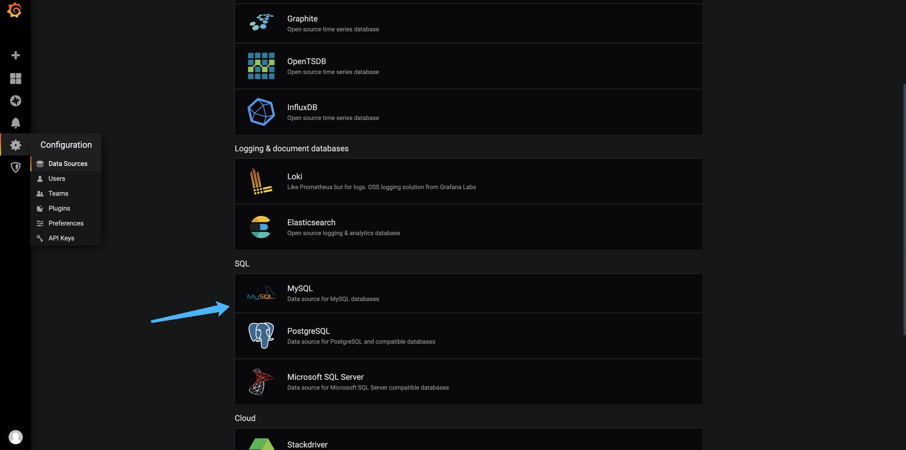
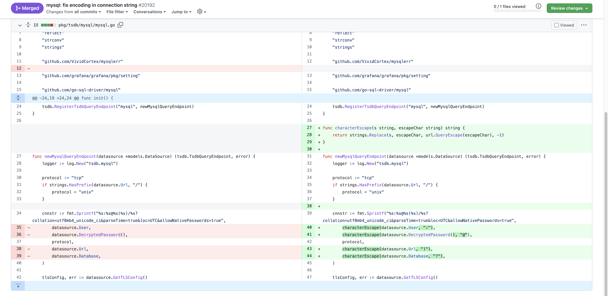
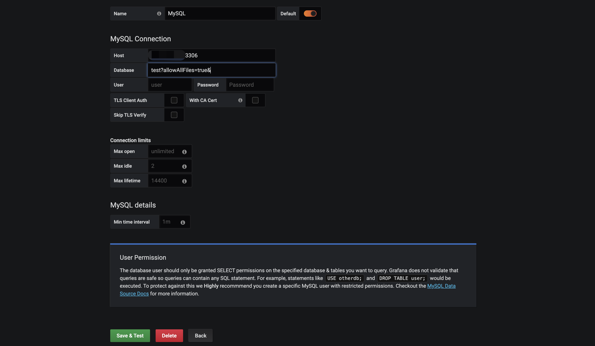
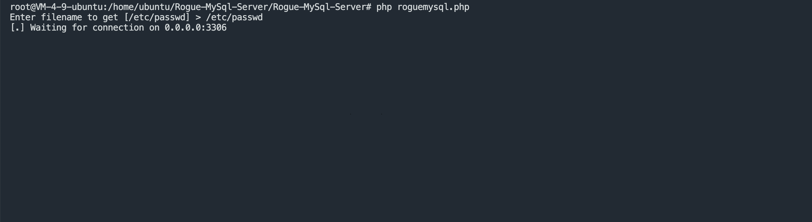
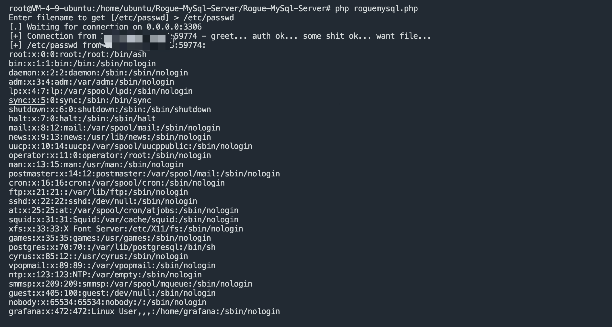

## 核对与使用边界

本文已按保存的全文审阅记录进行文字校订；本轮仅静态核对，未运行 PoC、请求目标或逐图验证。

适用条件与版本记录（来源主张，未列为明确更正的部分仍待权威资料核对）：&lt;6.4.4，实验6.4.3；需配置数据源权限、可控恶意MySQL服务器及网络可达

代码与实验材料：allowAllFiles=true机制清楚，具体数据库名注入和结果主要截图，未全文列请求

来源证据范围：官方PR20192与Rogue-MySql-Server仓库

- **适用与权限边界（1）**：读取边界与配置输入缺文本证据；依据：是恶意MySQL服务诱导Grafana客户端读取本地文件，不是读取数据库服务器文件；正文未给精确数据库名字符串及最低角色。按此限制解释本文结论，版本相同不足以证明所需角色、入口、配置、依赖或可控参数均已满足；原操作和失败记录一并保留。

- **适用与权限边界（2）**：默认口令仅实验条件；依据：admin/admin不能当所有实例认证条件，需标是否初始密码已修改。按此限制解释本文结论，版本相同不足以证明所需角色、入口、配置、依赖或可控参数均已满足；原操作和失败记录一并保留。

历史原文标识：下文原技术材料按来源保留；仅本节明确确认的更正替代相应旧说法，标为待核的观察仍不是事实确认。

# Grafana mysql 后台任意文件读取漏洞 CVE-2019-19499

## 漏洞描述

Grafana 是一个用于分析、监控和数据可视化的开源应用程序。数以千计的公司使用 Grafana，包括 PayPal、eBay 和 Intel 等主要代表。通过登录后台设置Mysql可以读取服务器中的任意文件

## 漏洞影响

```
Grafana < 6.4.4
```

## 环境搭建

```
docker pull grafana/grafana:6.4.3 
docker run -d --name=grafana -p 3000:3000 grafana/grafana:6.4.3 
```

## 漏洞复现

登录后台 admin/admin, 添加数据源 Mysql



[修复漏洞参考](https://github.com/grafana/grafana/pull/20192/files)



修复部分为 database数据库名的用户可控部分，由于 allowAllFiles=true 参数可以禁用对 LOCAL INFILE 请求的保护，再通过之前有关Mysql任意文件读取的漏洞即可获取服务器中的任意文件



再创建一个恶意Mysql： https://github.com/allyshka/Rogue-MySql-Server



执行 Save 即可读取文件



---

> 来源：Threekiii/Vulnerability-Wiki（https://github.com/Threekiii/Vulnerability-Wiki）
