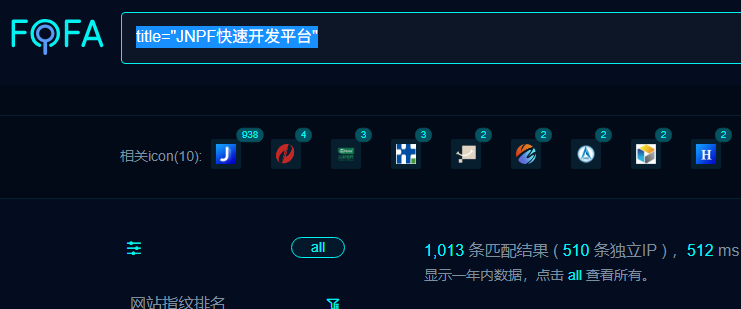
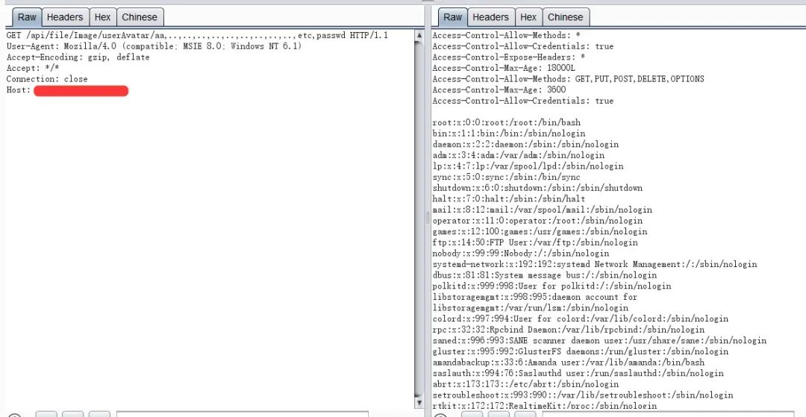
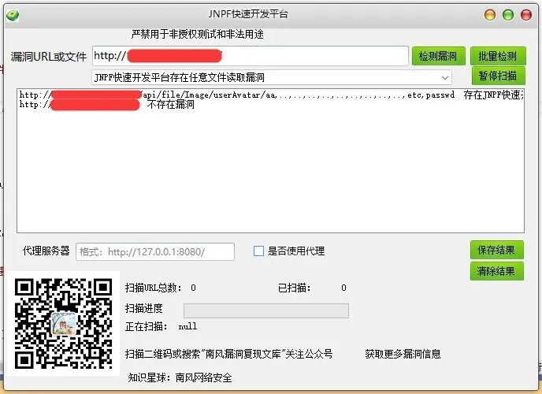

## 核对与使用边界

本文已按保存的全文审阅记录进行文字校订；本轮仅静态核对，未运行 PoC、请求目标或逐图验证。

适用条件与版本记录（来源主张，未列为明确更正的部分仍待权威资料核对）：只有产品名，缺版本、端点、认证条件及修复版本

代码与实验材料：漏洞复现仅一截图，标题附PoC但正文PoC节导向知识星球，没有文本请求

来源证据范围：南风公众号2026-01-06，缺产品公告与公开PoC

- **事实待核（1）**：关键信息不足以建立漏洞实体；依据：未给接口/参数/版本或文字结果，整改仅打补丁；无法与同产品其他文件读区分。该项尚不能从转载本身确定外部事实；下文相应编号、版本或修复说法只作为来源记录，不能据此判定部署受影响或已修复。明确更正另列于本节。

- **来源与引用处置（2）**：营销内容占主要篇幅；依据：工具箱、扫码广告与多个产品截图，复现内容仅图。保留这部分来源材料并与技术结论分开；其引用或宣传内容不能补足本文漏洞的证据。

历史原文标识：下文原技术材料按来源保留；仅本节明确确认的更正替代相应旧说法，标为待核的观察仍不是事实确认。

#  JNPF快速开发平台存在任意文件读取漏洞 附POC  
2026-1-6更新  南风漏洞复现文库   2026-01-06 14:40  
  
   
  
免责声明：请勿利用文章内的相关技术从事非法测试，由于传播、利用此文所提供的信息或者工具而造成的任何直接或者间接的后果及损失，均由使用者本人负责，所产生的一切不良后果与文章作者无关。该文章仅供学习用途使用。  
## 1. JNPF快速开发平台简介  
  
微信公众号搜索：南风漏洞复现文库  
该文章 南风漏洞复现文库 公众号首发  
  
本人只有 南风漏洞复现文库 和 南风网络安全  
 这两个公众号，其他公众号有意冒充，请注意甄别，避免上当受骗。  
  
JNPF快速开发平台  
## 2.漏洞描述  
  
JNPF快速开发平台存在任意文件读取漏洞  
  
CVE编号:  
  
CNNVD编号:  
  
CNVD编号:  
## 3.影响版本  
  
JNPF快速开发平台  
  
  
JNPF快速开发平台存在任意文件读取漏洞  
## 4.fofa查询语句  
  
title="JNPF快速开发平台"  
## 5.漏洞复现  
  
  
  
## 6.POC&EXP  
  
本期漏洞及往期漏洞的批量扫描POC及POC工具箱已经上传知识星球：南风网络安全  
1: 更新poc批量扫描软件，承诺，一周更新8-14个插件吧，我会优先写使用量比较大程序漏洞。  
2: 免登录，免费fofa查询。  
3: 更新其他实用网络安全工具项目。  
4: 免费指纹识别，持续更新指纹库。  
  
  
  
  
  
  
  
  
  
  
  
  
  
  
  
## 7.整改意见  
  
打补丁  
## 8.往期回顾  
  
  
   
  
  
  

---

> 来源：gelusus/wxvl（微信公众号漏洞文章自动归档，原文见文首链接）
