## 核对与使用边界

- 明确更正：本文是金蝶 K3Cloud 的 .NET/IIS/BinaryFormatter 分析；ProcessRequestInternal 是否执行由上层代码调用决定，不是 ASP.NET 自动优先级。
- 保留关键补丁边界：`EnabledKDSVCBinary=false` 不能单独证明所有路径安全，原文还讨论 format4 经 KingdeeXMLPack 到 BinaryFormatter。最低角色、ServiceType/Module 认证和具体构建号仍待补；调试时改配置/重启 IIS 会中断业务。

本文已按保存的全文审阅记录进行文字校订；本轮仅静态核对，未运行 PoC、请求目标或逐图验证。

适用条件与版本记录（来源主张，未列为明确更正的部分仍待权威资料核对）：分析称仅K3Cloud/ManageSite两应用；8.0及以上有KingdeeXml路径，缺具体实验build、原始受影响及固定版本

代码与实验材料：详细handler→format→代理→DeserializeParameters链及ap0/parameters差异；请求/关键源码主要图片，没有完整文本PoC

来源证据范围：微信原文，微软调试文档URL疑漏连字符，无厂商公告/补丁

- **事实待核（1）**：明显分类错误与补丁风险应单列；依据：全文ASP.NET/IIS/BinaryFormatter放Java；EnabledKDSVCBinary=false仍可由format4经KingdeeXMLPack到BinaryFormatter，此绕过结论具重要独立价值需补版本证据。该项尚不能从转载本身确定外部事实；下文相应编号、版本或修复说法只作为来源记录，不能据此判定部署受影响或已修复。明确更正另列于本节。

- **适用与权限边界（2）**：技术描述与认证边界不足；依据：ProcessRequestInternal不是ASP.NET自动优先级而需代码调用；是否安全ServiceType及Module认证流程未解释，不能由链条推无需认证。按此限制解释本文结论，版本相同不足以证明所需角色、入口、配置、依赖或可控参数均已满足；原操作和失败记录一并保留。

- **实验改动边界（3）**：时效性与截图依赖；依据：标题最新/近日无日期，代码仅图；调试重启IIS/配置改动应注明实验环境操作。以下步骤按原实验条件保留；人工改动后的行为只支持该修改环境，不用于证明未修改发行版默认可利用。

历史原文标识：下文原技术材料按来源保留；仅本节明确确认的更正替代相应旧说法，标为待核的观察仍不是事实确认。

# .NET 安全系列 | 某蝶 K3Cloud 最新反序列化分析

> 本文由 [简悦 SimpRead](http://ksria.com/simpread/) 转码， 原文地址 [mp.weixin.qq.com](https://mp.weixin.qq.com/s/pNDqKKCWfRBS50vxKMg1nA)

0x00 前言
-------

K3 CLOUD 是某蝶在移动互联⽹时代基于最新技术研发的⼀款战略性 ERP 产品，该产品于近⽇曝 出反序列化漏洞，攻击者可构造对应的序列化数据包在⽬标部署服务器上执⾏恶意代码。⽬前已有对应的 POC, 以及⼀些相关的分析资料，本⽂只说明其中⽐较重要的⼏个部分。

0x01 漏洞分析
---------

### 一、调试

K3Cloud 采⽤ ASP.NET 开发，由多个 Web App 组成，安装后可在 IIS ⻅多个⽹站和虚拟⽬录

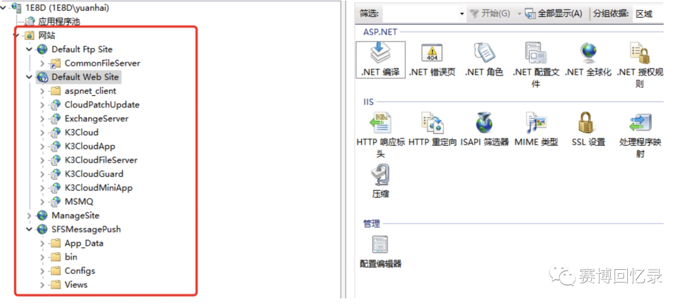

使⽤ dnSpy 对 Web 程序进⾏调试，需使⽤管理员权限运⾏，根据 Poc 所测试的应⽤程序附加到对应的 w3wp 进程中

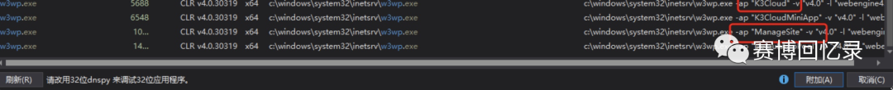

本⽂选择 MangeSite（管理后台）为调试⽬标，调试过程中可能会存在局部变量部分被优化的情况，因为程序都是 Release 发布的，Release 的使⽤ VS 调试⾃带的程序⼀样代码会被优化，微软官⽅提供了对应的解决⽅案 https://learn.microsoft.com/zh-cn/dotnet/framework/debug-trace-profile/making-an-imageeasier-to-debug 需要在 dll 所在⽬录创建⼀个同名的 ini ⽂件，内容如下:

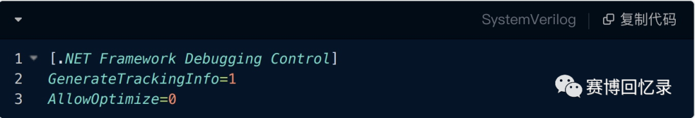

然后重启 IIS 即可。

### 二、handler 处理

本次反序列化漏洞影响只限于 K3Cloud(前台) , ManageSite(后台) 两个应⽤程序。漏洞路径出现在 `Kingdee.BOS.ServiceFacade.ServicesStub.DevReportService.GetBusinessObjectData.common.kdsvc`, 由 kdsvc 后缀结尾，根据 web.config ⾥的 handler 配置信息

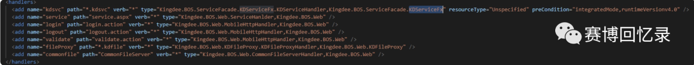

任何由 *.kdsvc 结尾的请求路径均会交由 KDServiceHandler 进⾏处理，不懂. NET 可以把它理解成 JAVA 中的 Servlet，KDServiceHandler 在程序 bin ⽬录下的 Kingdee.BOS.ServiceFacade.KDServiceFx.dll 中。

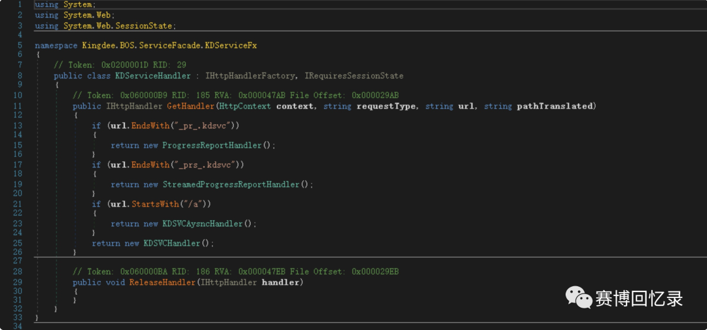

使⽤ DnsPy 进⾏反编译后可以看到，KDServiceHandler ⼜根据开头和结尾字符再次将请求交给不同的 Handler 去处理。 `Kingdee.BOS.ServiceFacade.ServicesStub.DevReportService.GetBusinessObjectData.common.kdsvc`路径并不满⾜上⾯对应的结尾和开头，因此交给 KDSVCHandler 进⾏处理

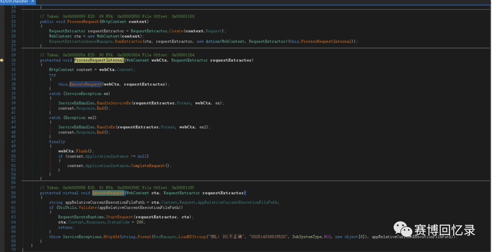

### 三、format 的值

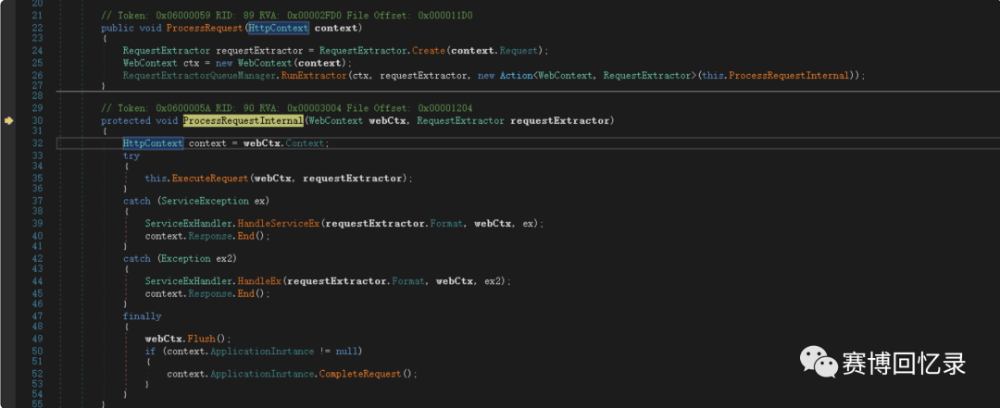

KDSVCHandler 中定义了两个⽅法，ProcessRequest 和 ProcessRequestInternal，根据 ASP.NET 处理 HTTP 请求的优先级会顺序执⾏ ProcessRequest > ProcessRequestInternal ⽅法。

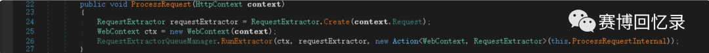

ProcessRequest 中使⽤ RequestExtractor.Create 对请求传输的内容进⾏格式化

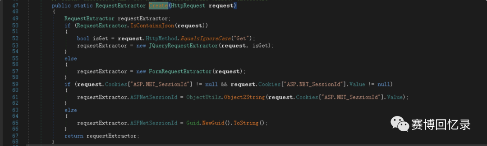

根据不同的 Content-Type 传输类型，选择不同的处理类，payload 中的是 Content-Type: json 所以这⾥会选择 JQueryRequestExtractor 类进⾏处理

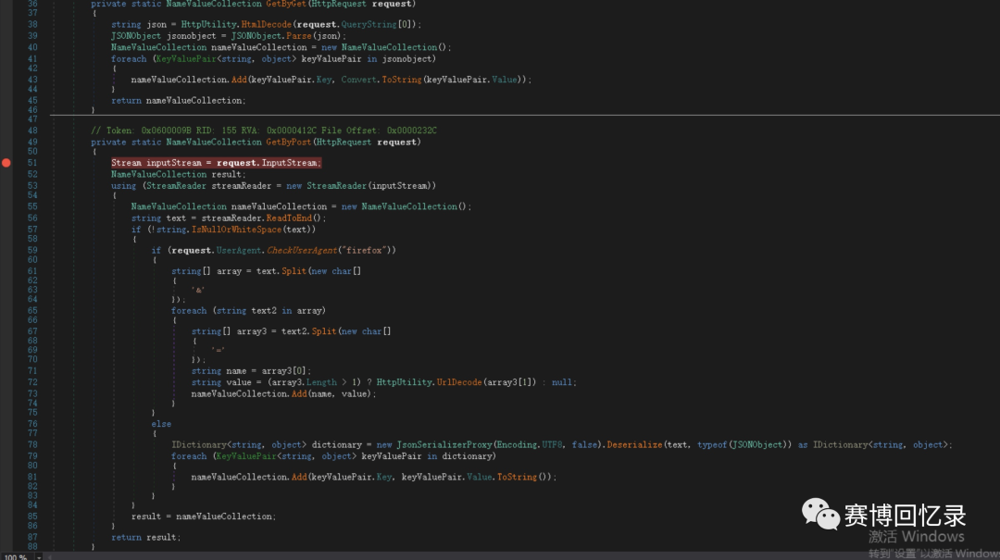

JQueryRequestExtractor 类中再次根据 POST 和 GET 选择对应的处理⽅法，GET 则选择第⼀个参数的内容，POST 则是以 request.InputStream 输⼊流进⾏反序列化，POST ⽅法处理期间还会根据 UserAgent 选择对应的取值⽅式，将所有的键值对存储到 nameValueCollection 对象中。

后续传递参数内容均会从 requestExtractor 对象中获取，包括了 format

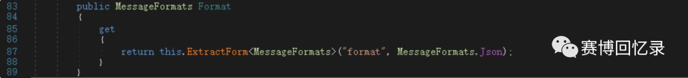

使⽤ ExtractForm 返回对应的值

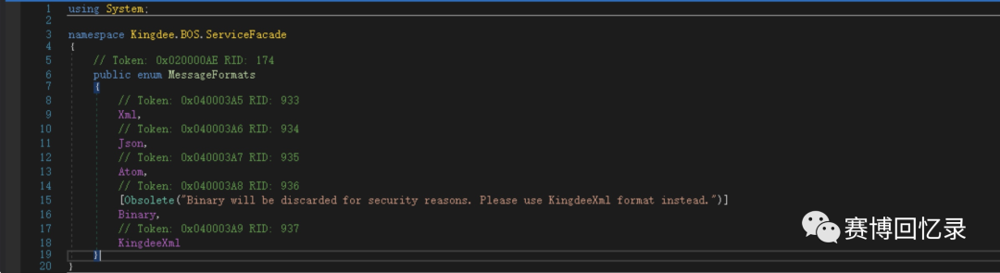

这⾥可以看到定义了多个类型，当 format 为 3 时会返回 Binary，并且此处已经声明 “由于安全原因，⼆进制⽂件将被丢弃。

请改⽤某蝶 Xml 格式”。

### 四、序列化代理的选择

期间会根据请求路径加载对应程序集的操作

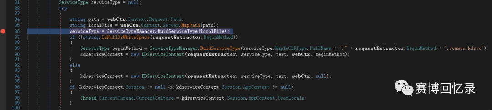

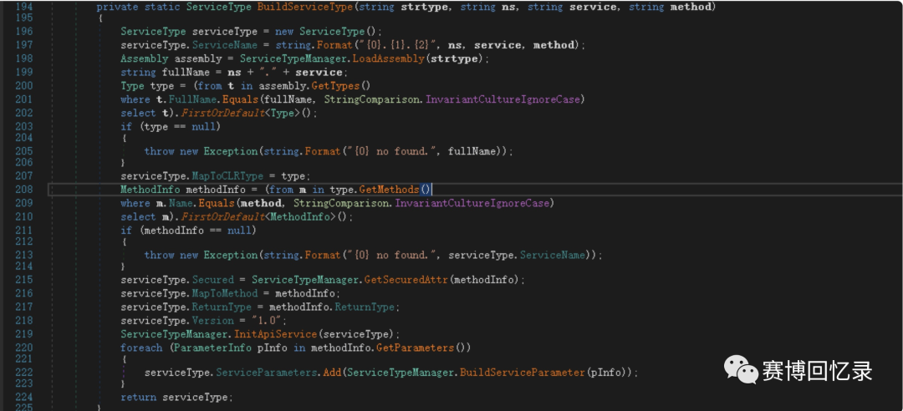

使⽤ ReflectServiceType 构建⼀个 ServiceType 对象，这个对象⾥包含了名称，CLR 类型，对应的⽅法，是否安全，返回类型，版本，和参数等信息。

加载完后，会遍历调⽤⼀些定义好的 Module 类。

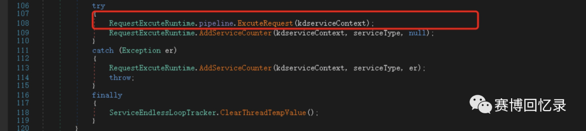

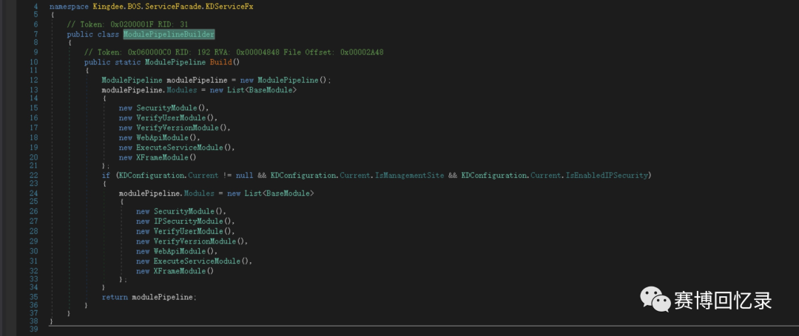

顺序遍历调⽤其中的 OnProcess, 调⽤到第 6 个，ExecuteServiceModule 时，漏洞触发点呈现

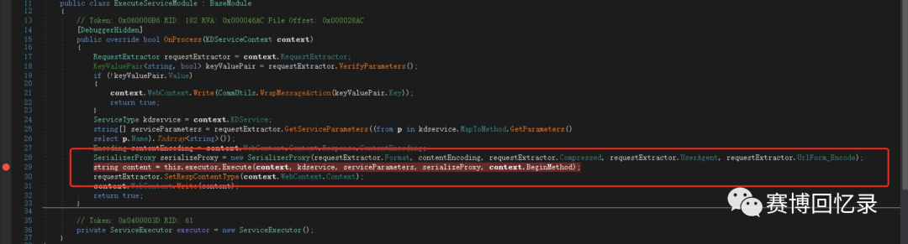

在执⾏过程中会创建⼀个 serializeProxy 序列化代理器，⽽序列化代理器会根据 format 的值创建对应的序列化类

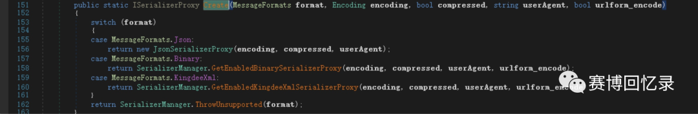

这个在上⽂已经说明，此时的 format 为 Binary，会返回⼀个 BinaryFormatterProxy 类

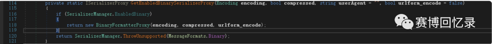

然后进⼊到 Execute ⽅法。

### 五、反序列化触发

在 Execute ⽅法中，会根据之前创建的 ServiceType 对象进⾏⼀些判断

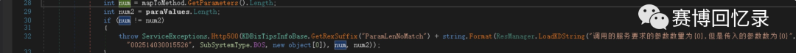

如请求⽅法所需要的参数和传递的参数数量必须要⼀致

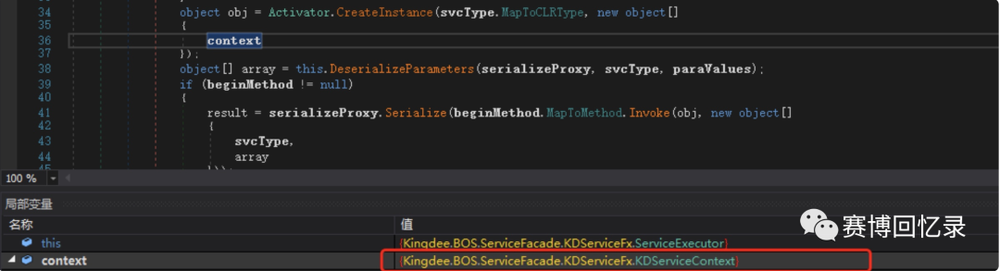

以及 MapToCLRType 类的构造函数需要接收⼀个 Kingdee.BOS.ServiceFacade.KDServiceFx.KDServiceContext 类型的对象。

随后进⼊ DeserializeParameters，也就是漏洞触发点对参数进⾏反序列化。

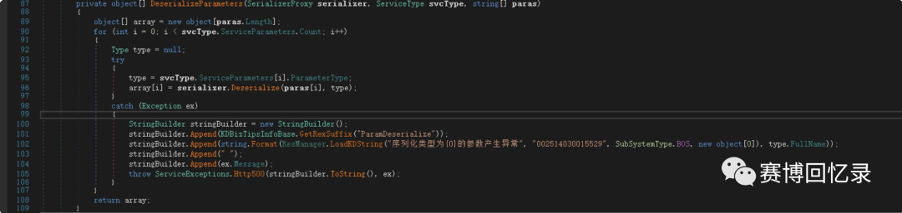

会根据调⽤⽅法所需要的参数数量进⾏单次或者多次循环，并得到对应参数的 Type 类型传递给代理器的 Deserialize 反序列化⽅法。

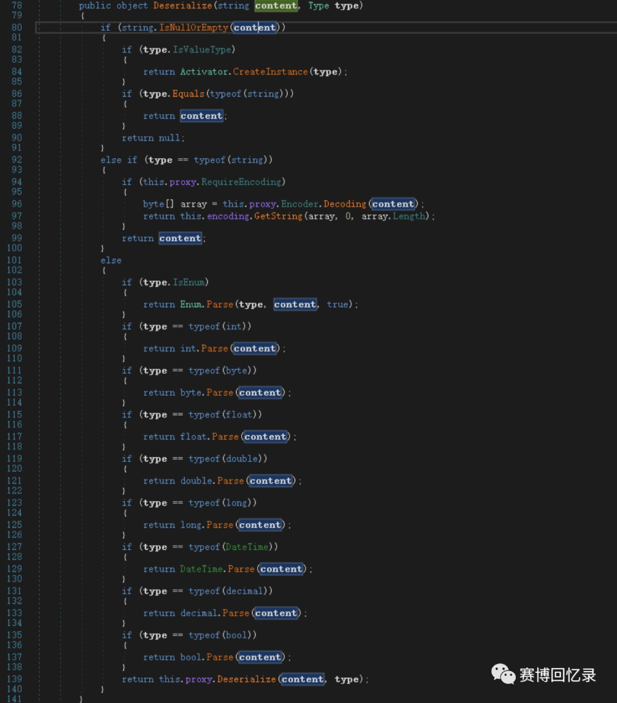

这⾥⼜做了⼀层限制，当接受参数的类型为 string,int,byte,float,double,long,.... 等等类型时，并不会进⼊ 到代理器的 Deserialize ⽅法 因此需要找到⼀个这些类型之外的，如 Object 类型，GetBusinessObjectData 刚好满⾜这⼀条件。

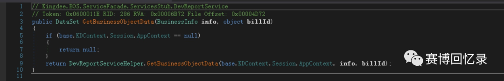

最后进⼊到代理器的 BinaryFormatterProxy.Deserialize ⽅法，导致反序列化漏洞触发。

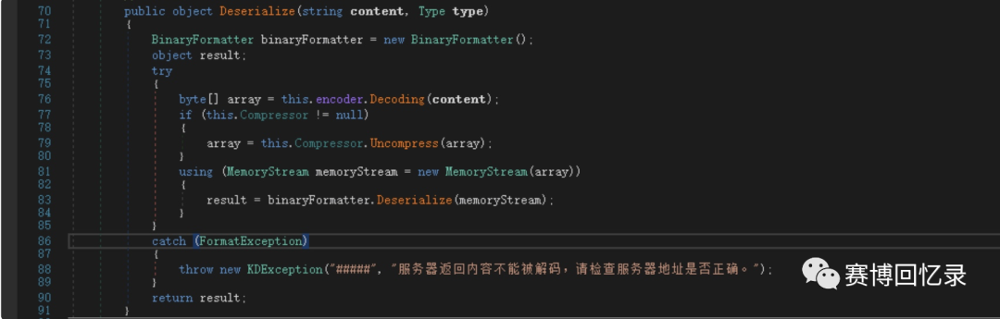

### Qestion

**参数传递过程中必须要设置成 ap0？** 根据传递⽅式进⾏设置，具体看 ExecuteServiceModule 类中的处理

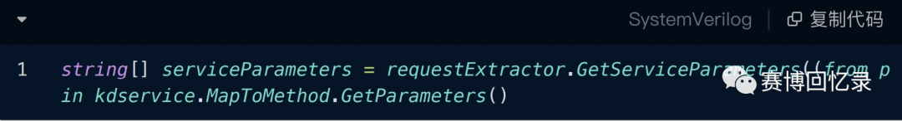

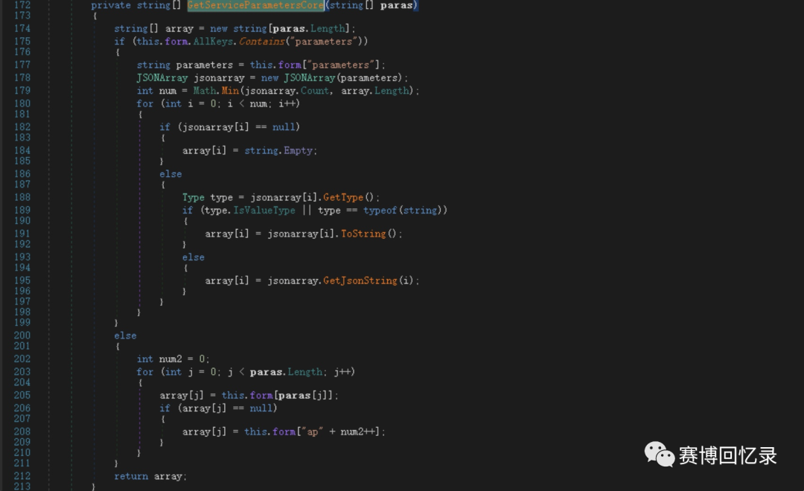

这⾥的 form 存储的是上⽂对传递参数进⾏反序列化后的键值对，如果其中包含 parameters 键，如果存在，将该参数解析为⼀个 JSONArray 对象。

如果不存在，则根据⽅法所需参数数量，进⾏ for 循环，以 “ap” 为开头，依次遍历数字。

当然也可以抛弃 json 格式的内容传递⽅式，使⽤传统的 POST

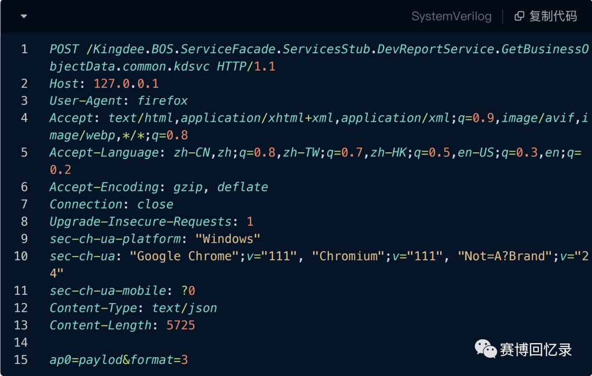

paylod 需要进⾏⼀次 url 编码。

0x02 修复方案
---------

之前某安全公众号有发布对应的临时修复⽅案

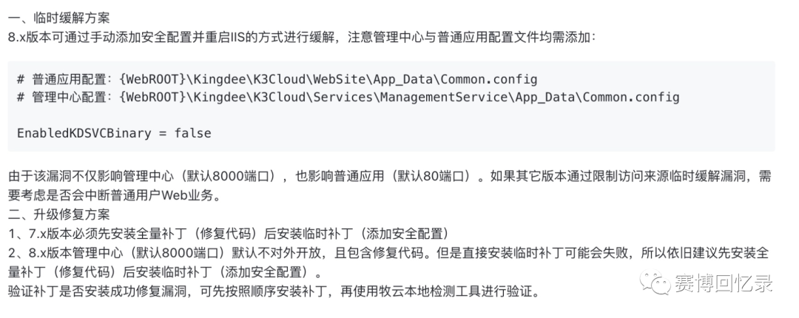

设置 EnabledKDSVCBinary 为 False，因为在创建序列化代理器时，会取值进⾏判断是否开启⼆进制流反序列化名功能。

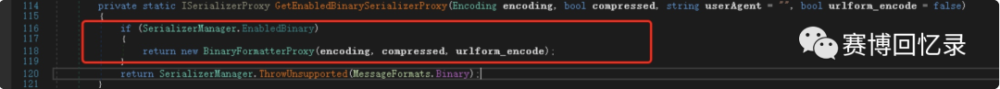

0x03 绕过风险
---------

上⾯修复的⼿段并不完全，即使关闭了⼆进制流的⽅式传递参数内容，但是该系统提供了不只 Binary ⼀种⽅式传递参数，如下：

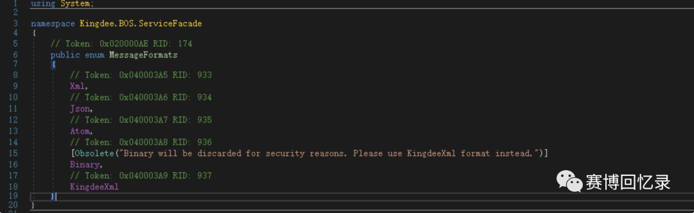

在 8.0 及以上版本，官⽅提供了多种⽅式，其中 KingdeeXml 被推荐使⽤，KingdeeXml ⽐ Binary 更安全？

其实不然，KingdeeXml 本质还是 Bianry。

当 format 为 4 时，赋值为 KingdeeXml，创建⼀个 XmlSerializerProxy 代理器

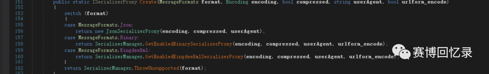

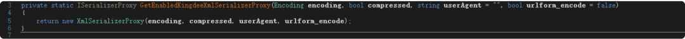

⽽ XmlSerializerProxy 代理中的 Deserialize 其中还是⽤的 BinaryFormatterProxy，只是中间需要经过⼀层 NetDataContractSerializer 反序列化成 KingdeeXMLPack 对象。

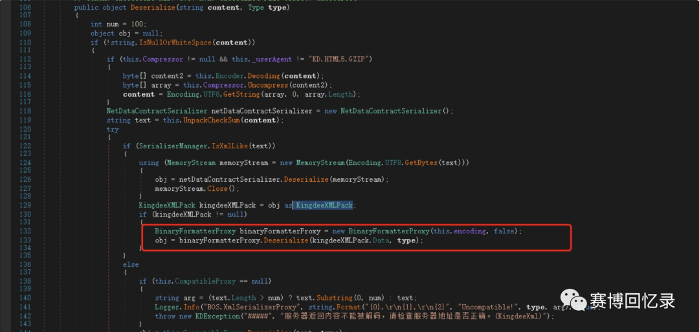

从⽽绕过 EnabledKDSVCBinary 的设置。

---

> 来源：MrWQ/vulnerability-paper（https://github.com/MrWQ/vulnerability-paper）
