## 核对与使用边界

- 明确更正：AjaxPro.NET 是 ASP.NET/.NET 组件。`method.GetParameters()` 取得某个已选方法的参数信息，不是加载全部 Ajax 方法；攻击者不能据此改变服务端方法签名。
- 链成立还需要暴露的 Ajax 方法、允许输入类型和实际 gadget/运行时匹配；影响版本仅截图，不能从下载量推断用户数或将代码片段当默认远程入口。

本文已按保存的全文审阅记录进行文字校订；本轮仅静态核对，未运行 PoC、请求目标或逐图验证。

适用条件与版本记录（来源主张，未列为明确更正的部分仍待权威资料核对）：称确定影响版本但仅截图；可读正文没有版本/固定点，需公开Ajax方法兼容输入类型及gadget依赖

代码与实验材料：UserInfo实验改Object后演示ObjectDataProvider，重要宽类型前提可见；代码反引号碎片粘连，实际HTTP/配置/成功结果均图

来源证据范围：且听安全微信原文，仅一般配置博客，没有厂商公告/具体patch

- **事实待核（1）**：Java目录与.NET产品不符，关键元数据缺失；依据：全篇ASP.NET Web Forms/AjaxPro，影响版本表仅图片；最新无日期。该项尚不能从转载本身确定外部事实；下文相应编号、版本或修复说法只作为来源记录，不能据此判定部署受影响或已修复。明确更正另列于本节。

- **适用与权限边界（2）**：反射与攻击条件说明不准确；依据：method.GetParameters被称加载所有Ajax方法，实际获取某方法参数；需要可控请求类型与服务端允许的Object/子类型，不是攻击者能改服务端方法签名。按此限制解释本文结论，版本相同不足以证明所需角色、入口、配置、依赖或可控参数均已满足；原操作和失败记录一并保留。

- **事实待核（3）**：可复核性不足与使用量来源不清；依据：30.9k被解释用户数量无来源；源码块逐行反引号而无换行，缺版本化修复链接。该项尚不能从转载本身确定外部事实；下文相应编号、版本或修复说法只作为来源记录，不能据此判定部署受影响或已修复。明确更正另列于本节。

历史原文标识：下文原技术材料按来源保留；仅本节明确确认的更正替代相应旧说法，标为待核的观察仍不是事实确认。

# 【最新漏洞预警】开源组件漏洞之CVE-2021-23758 AjaxPro.NET反序列化漏洞

<meta name="referrer" content="no-referrer"/>

> 本文由 [简悦 SimpRead](http://ksria.com/simpread/) 转码， 原文地址 [mp.weixin.qq.com](https://mp.weixin.qq.com/s/7y-iyMMZAoN4B2dGvCFvXg)

  ** 且听安全 ** 聪者听于无形，明者见于未形；专注网络安全，关注漏洞态势；拒绝重复搬运，只做精品原创。 71篇原创内容   公众号

**关注公众号回复“漏洞”获取环境或工具**

  

又一个开源组件漏洞来了！最近某核弹级漏洞让大家认识到，一旦开源中间组件存在漏洞，影响范围之大将难以估量。蹭一波热度，今天给小伙伴们分享另一个开源组件漏洞：CVE-2021-23758 .NET Ajax开源框架AjaxPro.NET反序列化漏洞。  

  

  

  

漏洞信息

  

AjaxPro.Net是一个非常优秀且使用广泛的开源.NET Ajax框架，具有部署简单、使用方便、运行高效等特点。用户量达到了30.9k的数量级。

  

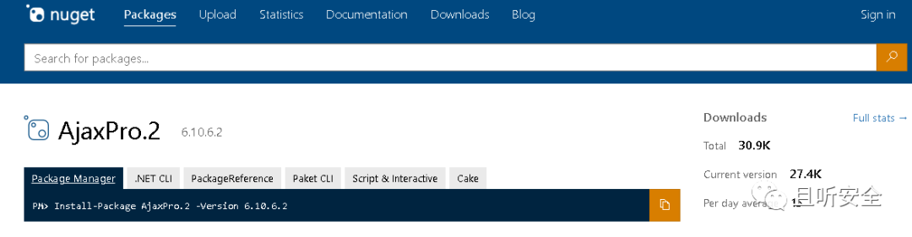

  

近日，网上爆出AjaxPro.Net某版本存在反序列化漏洞CVE-2021-23758，经过反复版本对比与代码审计，最终确定该漏洞影响版本。

  

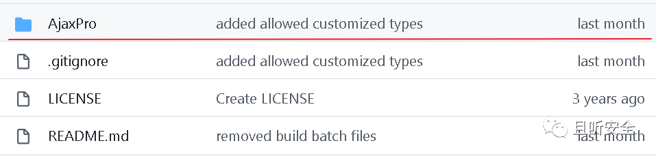

  

漏洞产生的主要原因是作者尝试增加自定义反序列化`Type`类型的功能，由于限制检查不严格，导致出现反序列化漏洞，这和.NET其他的一些反序列化利用链触发原理类似。

  

  

  

环境部署

  

下载AjaxPro.NET存在漏洞的版本，加载到Visual studio新建的解决方案中，然后新建一个`ASP.NET Web Form`工程`web_test`，项目结构如下所示：

  

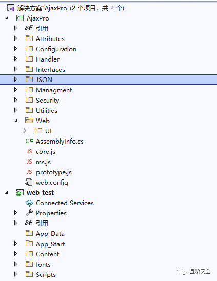

  

在`web_test`中添加对`AjaxPro`的引用：

  

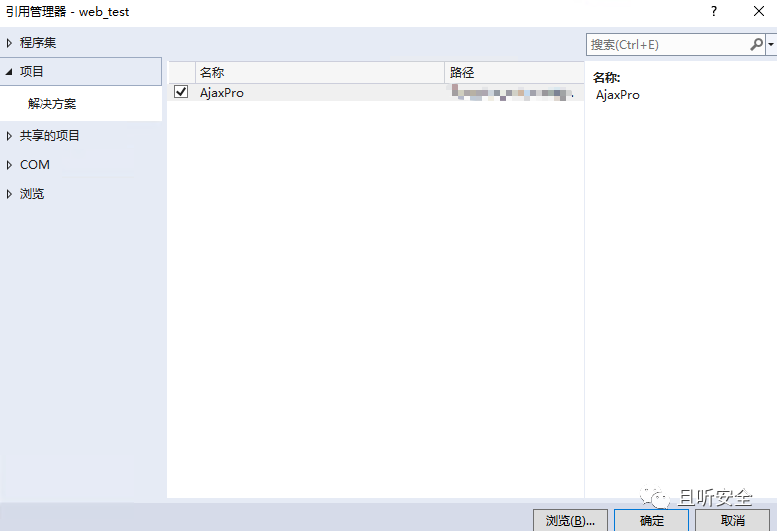

  

修改`web_test`的`web.config`配置文件，加入`AjaxPro`的引用配置：

  

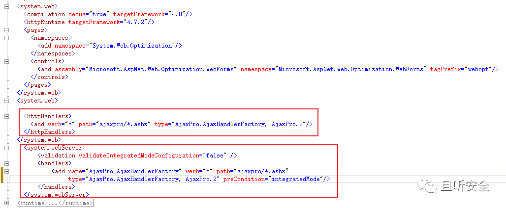

  

为了方便进行分析，自定义一个`UserInfo`类：

  

```
`using System;``using System.Collections.Generic;``using System.Linq;``using System.Web;``namespace web_test``{` `[Serializable]` `public class UserInfo` `{` `public String Name;` `public String Password;` `}``}`
```

  

在新建页面`demo.aspx`的后台代码中加入初始化信息，并定义一个Ajax请求处理方法`GetTest`（采用`[AjaxPro.AjaxMethod]`进行装饰）：

  

```
`using System;``using System.Collections.Generic;``using System.Linq;``using System.Web;``using System.Web.UI;``using System.Web.UI.WebControls;``using AjaxPro;``using System.Text;``namespace web_test``{` `public partial class demo : System.Web.UI.Page` `{` `protected void Page_Load(object sender, EventArgs e)``{` `AjaxPro.Utility.RegisterTypeForAjax(typeof(demo));` `}` `[AjaxPro.AjaxMethod]` `public static String GetTest(UserInfo obj)``{` `return obj.Name;` `}` `}``}`
```

  

`demo.aspx`前端页面定义如下：

  

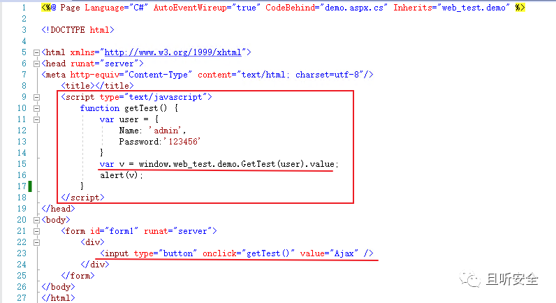

  

启动服务：

  

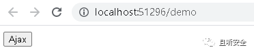

  

此时会在页面中注册几个有关Ajax请求处理的URL信息：

  

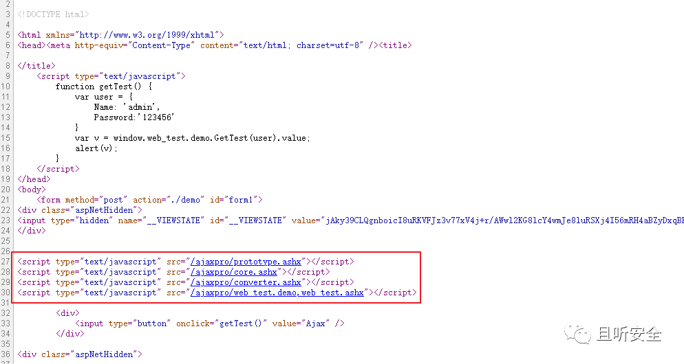

  

点击`Ajax`按钮，将发送Ajax请求，并弹出对话框。抓取发送的Ajax数据包如下：

  

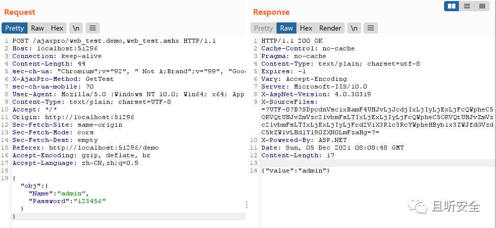

  

请求中的`obj`参数对应我们自定义函数`GetTest`的输入参数`obj`。

  

  

  

漏洞分析

  

**0x01 调用流程分析**  

  

发送Ajax请求后，首先会进入继承于`IHttpHandler`接口的类`AjaxSyncHttpHandler`，调用函数`ProcessRequest`进行处理：

  

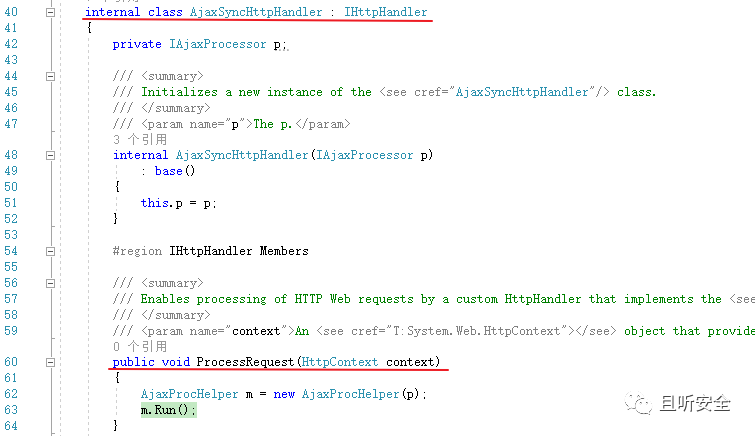

  

接着进入`XmlHttpRequestProcessor#RetreiveParameters`函数：

  

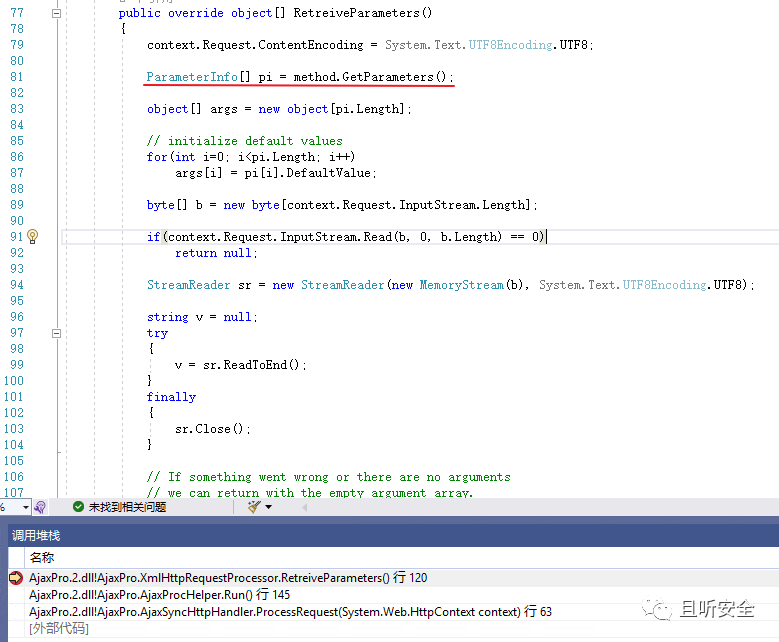

  

其中第81行通过`method.GetParameters`加载自定义的全部Ajax Method，即所有采用`[AjaxPro.AjaxMethod]`进行装饰的函数，比如前面自定义的`GetTest`方法：

  

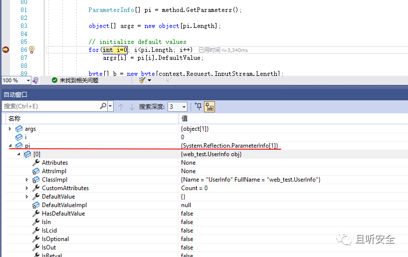

  

接着往下走，第120行通过`JavaScriptDeserializer.DeserializeFromJson`反序列化得到一个`JavaScriptObject`对象，这里指定了`Type`类型，继续往下看：

  

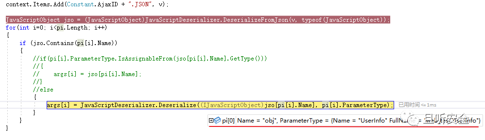

  

进入`JavaScriptDeserializer.Deserialize`：  

  

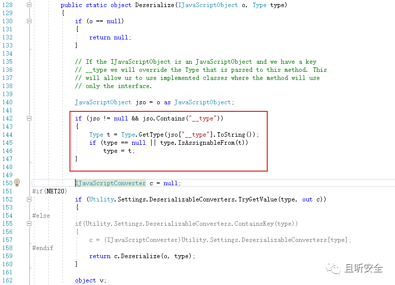

  

这里判断是否存在`__type`参数，如果存在且通过`__type`获取的`Type`对象继承于处理函数输入参数数据类型（`type.IsAssignableFrom(t)`），可以修改反序列化的`type`对象。继续往下走，最终调用`DeserializeCustomObject`函数完成处理，处理过程与.NET JavaScriptSerializer等其他反序列化方式非常类似。

  

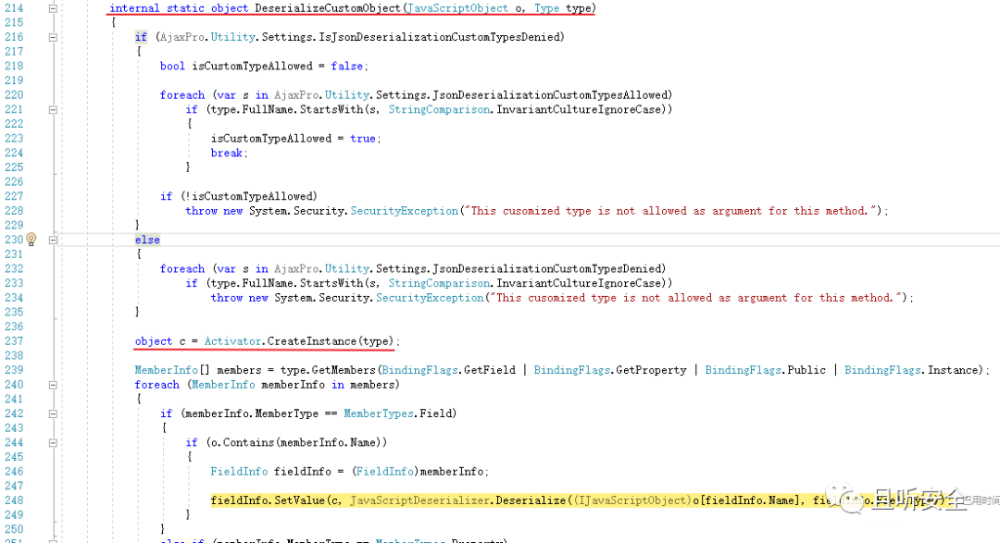

  

**0x02 漏洞复现**  

  

从上面分析可知，如果要控制反序列化操作的`Type`，那么必须保证Ajax处理函数的输入参数类型是可控的，修改`GetTest`函数的输入参数为`Object`类型：

  

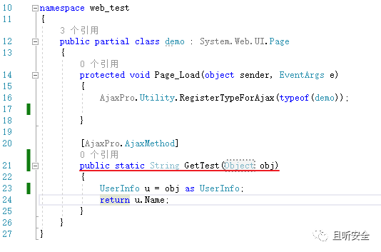

  

修改请求数据包，加入`__type`参数，并加入`ObjectDataProvider`利用链，发送数据包后成功触发RCE。  

  

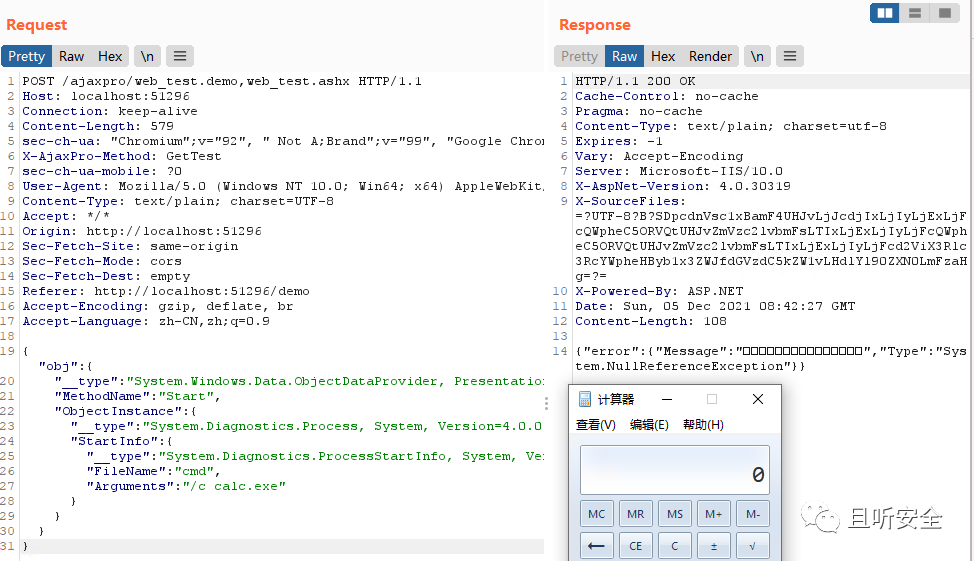

  

可见，只需要找到一个Ajax处理函数的输入参数为`Object`类型即可实现RCE。

  

  

  

修复方式

  

在新版本的`AjaxPro.Net`中，对自定义反序列化类型的操作加入了配置限制，只有预先配置好的`Type`类型才能进行修改，导致恶意类无法被插入。

  

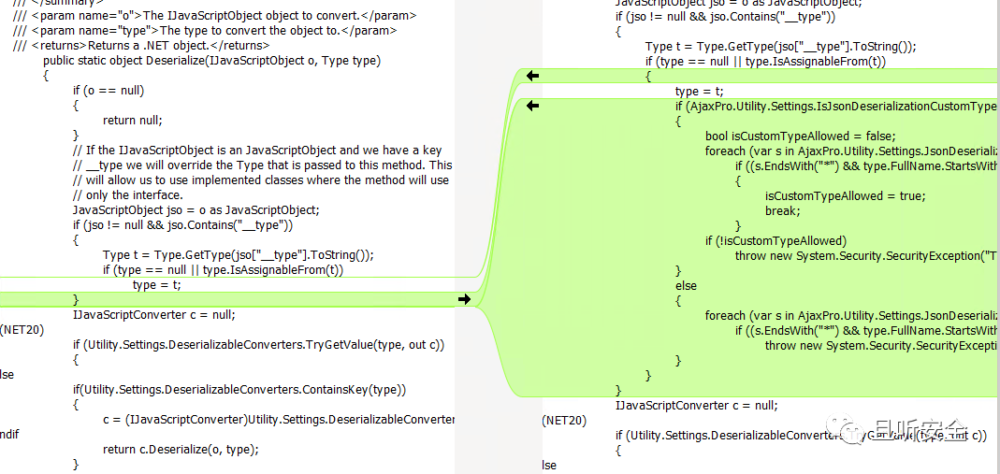

  

  

  

后记

  

AjaxPro.NET是.NET Web Form框架中使用非常广泛的一款开源Ajax处理框架，从上面的分析可知，只需要在使用了AjaxPro.NET漏洞版本的应用程序中，找到一个Ajax处理函数输入参数为`Object`类型，就可以通过构造恶意请求实现RCE。考虑到AjaxPro.NET使用范围较广，有兴趣的小伙伴可以自行寻找潜在受影响的应用系统。

  

  

  

参考  

  

> AjaxPro.NET配置参考
> 
> https://www.cnblogs.com/shenqizhu/p/7360220.html

  

  

**由于传播、利用此文档提供的信息而造成任何直接或间接的后果及损害，均由使用本人负责，且听安全团队及文章作者不为此承担任何责任。**

  

  

  

  

  

点关注，不迷路！


**关注公众号回复“漏洞”获取环境或工具**

---

> 来源：MrWQ/vulnerability-paper（https://github.com/MrWQ/vulnerability-paper）
