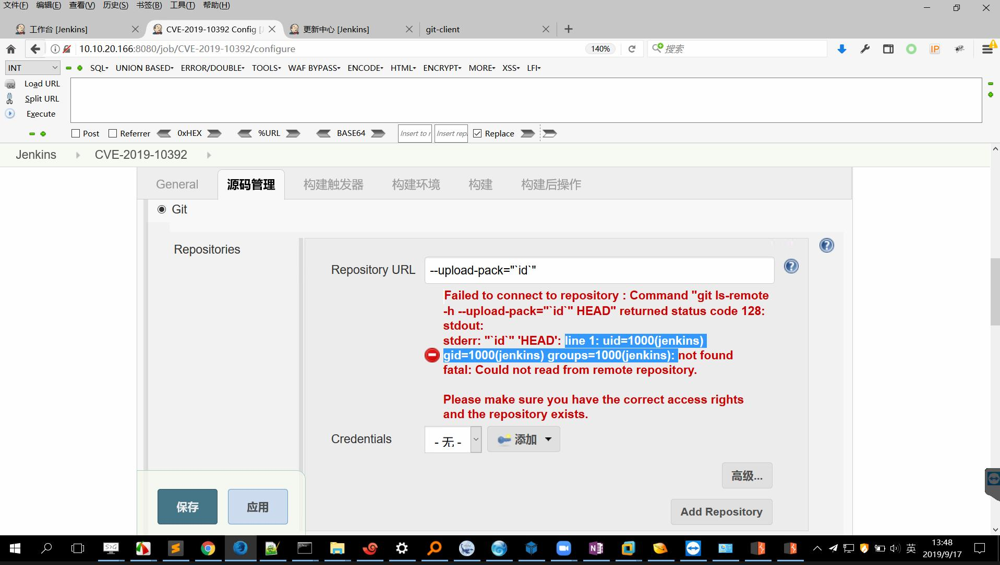
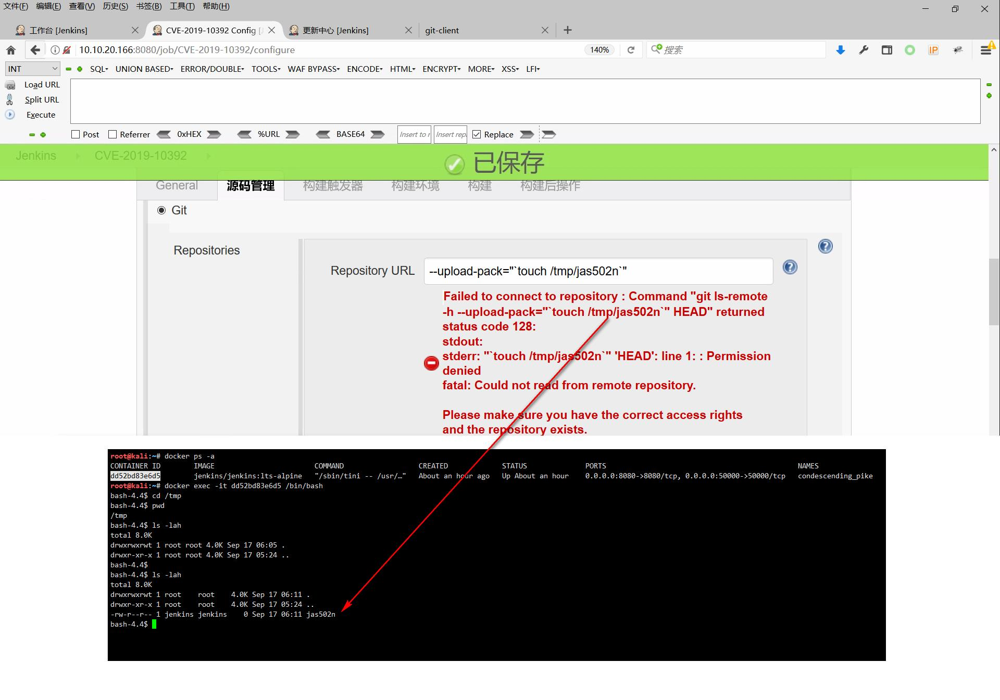

# Jenkins Git client Plugin 仓库 URL 参数注入 CVE-2019-10392

## 对象与权限

Jenkins 官方将 SECURITY-1534 对应到 CVE-2019-10392：Git client Plugin 在验证仓库 URL 时把用户输入传给 `git ls-remote`，不安全的选项处理可使具有 **Job/Configure** 权限的用户以 Jenkins 进程的系统账户执行命令。[1]

这是 Git client Plugin 的问题，不应把所有 Jenkins 2.176.3 都当作相同受影响状态。Jas502n 的公开环境同时列出 Jenkins 2.176.3、Git client Plugin 2.8.2、Git Plugin 3.12.0；命令行 Git 和类 Unix 命令是其截图材料的条件。最低身份边界采用厂商明确给出的 Job/Configure，不把作者截图中的账号当作必须取得管理员权限。[1][2]

## 公开材料与操作序列

原仓库固定提交 `6cc445e2590c7564c38dd60033b2e8fad3ad1b0c` 只有 README 和四张 JPG，没有独立利用脚本。本文已查看四张原图，以下两张保留原始字节，未裁剪、替换测试值或遮盖。

作者先新建一个名为 `CVE-2019-10392` 的自由风格任务，然后进入“源码管理”选择 Git，在 Repository URL 中输入带 `--upload-pack` 的值。验证错误区域出现了 `id` 输出所对应的用户与组信息，具体原始输入和返回见图：

第二个样例让相同入口执行 `touch /tmp/jas502n`。原图将 Jenkins 表单和作者在容器内检查该文件的终端并列：

验证失败、退出码 128 或“无法连接仓库”不等于没有命令执行；作者图中需要结合命令输出或文件观察来判断。相反，单独出现这些通用错误也不证明有漏洞。图中“Permission denied”属于后续命令处理错误，不能据此抹去作者同时展示的文件创建，也不能把它描述成本库复现。

原仓库另有 `script.jpg`，展示的是 `/script` 的 Groovy 控制台请求。该入口与本文 Git URL 校验不是同一权限路径；不能把脚本控制台中的 `/etc/passwd` 输出算作 Git client 参数注入成功的独立证据。新建任务图仅用于还原作者操作顺序。[2]

## 固定修复代码

官方公告给出的稳定分支修复是 Git client Plugin **2.8.5**。其固定版本提交为 `ce1b99ec62038466ee40401894bcd99901934f59`：

- [CliGitAPIImpl.java 第 373–432 行](https://github.com/jenkinsci/git-client-plugin/blob/ce1b99ec62038466ee40401894bcd99901934f59/src/main/java/org/jenkinsci/plugins/gitclient/CliGitAPIImpl.java#L373-L432)加入 `addCheckedRemoteUrl`，默认开启 URL 检查；对非已识别协议/本地路径的输入拒绝危险参数形态，并在 Git 版本至少为 2.8.0 时增加 `--` 参数终止符
- [第 2936–2977 行](https://github.com/jenkinsci/git-client-plugin/blob/ce1b99ec62038466ee40401894bcd99901934f59/src/main/java/org/jenkinsci/plugins/gitclient/CliGitAPIImpl.java#L2936-L2977)显示两个 `getHeadRev` 路径在构造 `ls-remote` 时使用该检查

上述是固定代码相关函数的静态核对，不是整个插件、所有 Git 版本或所有后续安全问题的完整认证。不要关闭修复所用的 `checkRemoteURL` 检查来解决连接问题。

官方在 2019-09-12 发布时指出 3.0.0-rc 尚无对应更新，并建议降回 2.8.5，必要时同时调整 Git Plugin 的预发行依赖。该建议是历史处置记录，不是今天部署旧版本的建议；维护应选择受支持、包含修复且相互兼容的版本。[1]

## 副作用与静态审查边界

原作者的操作会创建或修改任务，并以服务账户启动命令。文件创建、命令输出、任务配置与日志都可能留下状态；不是只读检测，也不自动获得 root。

固定 PoC 树中的 README 和四张 JPG 已全部阅读。图示命令与漏洞演示直接关联，未见另外的下载执行、外传接收器、隐藏持久化、混淆程序或破坏性删除。仓库没有依赖清单、安装器、工作流或可执行附件。原 README 提到 `jenkins/jenkins:lts-alpine` 可变镜像标签；本次没有下载或审计镜像，也没有把它写成经过供应链认证的安装流程。本文技术材料以作者列明的既有环境和固定截图为界，不要求执行该安装命令。

产品代码仅核对上述 URL 检查及相关 `ls-remote` 调用段；没有声称读完全部 3226 行实现。Git/Jenkins 运行时与容器镜像的传递依赖不在完整审计范围。本次未创建任务、运行容器、访问截图中的地址或执行任何示例。

## 来源

1. [Jenkins Security Advisory 2019-09-12](https://www.jenkins.io/security/advisory/2019-09-12/)，SECURITY-1534：版本、权限、影响与修复
2. [Jas502n 的固定 README 和图片目录](https://github.com/jas502n/CVE-2019-10392/tree/6cc445e2590c7564c38dd60033b2e8fad3ad1b0c)，README 第 1–28 行：环境与研究链接；`configure.jpg` / `exploit.jpg`：原始输入与观察
3. [Git client Plugin 2.8.5 固定源码](https://github.com/jenkinsci/git-client-plugin/blob/ce1b99ec62038466ee40401894bcd99901934f59/src/main/java/org/jenkinsci/plugins/gitclient/CliGitAPIImpl.java)，对应修复实现

README 所列 Francesco Soncina 原研究页本轮未取得可读正文，不将其 URL 当作已核对的完整文章；其报告者身份由官方公告确认。未继续展开 README 所列其他 Jenkins 漏洞链。

核对日期：2026-10-05。截图均使用库内相对资源。

