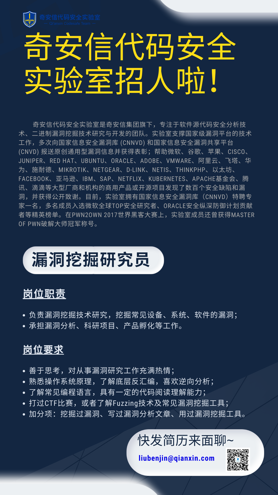

## 核对与使用边界

本文已按保存的全文审阅记录进行文字校订；本轮仅静态核对，未运行 PoC、请求目标或逐图验证。

适用条件与版本记录（来源主张，未列为明确更正的部分仍待权威资料核对）：声称&lt;2.319.2均影响，未拆core与Update Center版本，缺固定版本

代码与实验材料：无PoC；需攻击者能影响被展示插件元数据、兼容/排序条件、受害用户打开插件页面及其权限

来源证据范围：The Hacker News原文链接，Aqua和厂商原报告缺直接引用

- **适用与权限边界（1）**：两组件范围及XSS到RCE前提不充分；依据：统一套2.319.2版本；scriptConsole执行取决于受害者管理员权限；未安装插件仍需浏览插件列表不能叫无交互。按此限制解释本文结论，版本相同不足以证明所需角色、入口、配置、依赖或可控参数均已满足；原操作和失败记录一并保留。

- **适用与权限边界（2）**：历史叙述与翻译；依据：因为XSS也是存储型XSS循环描述；Jenkins公司/Update Center可被注入的发布信任边界不清。按此限制解释本文结论，版本相同不足以证明所需角色、入口、配置、依赖或可控参数均已满足；原操作和失败记录一并保留。

历史原文标识：下文原技术材料按来源保留；仅本节明确确认的更正替代相应旧说法，标为待核的观察仍不是事实确认。

#  Jenkins 出现严重漏洞，可导致代码执行攻击   
Ravie Lakshmanan  代码卫士   2023-03-09 17:39  
  
  
  
   
聚焦源代码安全，网罗国内外最新资讯！  
  
**编译：代码卫士**  
  
**开源自动化服务器 Jenkins 中存在两个严重漏洞（CVE-2023-27898和CVE-2023-27905），可导致攻击者在目标系统上执行代码。**  
  
  
  
这两个漏洞影响 Jenkins 服务器和Update Center，它们被Aqua公司统称为 ‘CorePlague"。Jenkins 2.319.2之前的版本均受影响。  
  
Aqua公司在报告中指出，“利用这些漏洞可导致未认证攻击者在受害者Jenkins服务器上执行任意代码，有可能导致Jenkins服务器完全受陷。”这些漏洞是由Jenkins处理源自Update Center的可用插件方式不当造成的，因此可能导致威胁行动者上传具有恶意payload的插件，并触发跨站点脚本攻击。  
  
报告还指出，“受害者在Jenkins服务器上打开‘可用插件管理器’时，就会触发XSS，从而导致攻击者在使用Script Console API的Jenkins Server上运行任意代码。”  
  
由于XSS攻击也是存储型XSS攻击的一种，因此在无需安装插件甚至无需访问插件URL的情况下，也可触发该漏洞。令人担忧的是，这些漏洞也影响自托管的Jenkins服务器，甚至在无法从互联网中公开访问服务器的场景下也不例外，因为公开的Jenkins Update Center可“遭攻击者注入”。不过攻击的前提是，恶意插件与Jenkins服务器兼容且位于“可用插件管理器”页面的顶端。攻击者提到，可通过“上传描述中所内嵌的所有插件名称和流行关键字的插件”，或提交源自虚假实例的请求，人为地提高插件的下载次数来操纵。  
  
研究人员在2023年1月24日将漏洞告知Jenkins 公司，后者已为 Update Center和服务器发布补丁。建议用户尽快将Jenkins服务器升级至最新可用版本。  
  
  
  
  
  
  
****  
代码卫士试用地址：  
https://codesafe.qianxin.com  
  
开源卫士试用地址：https://oss.qianxin.com  
  
  
  
  
  
  
  
  
  
  
  
  
**推荐阅读**  
  
  
[奇安信入选全球《软件成分分析全景图》代表厂商](http://mp.weixin.qq.com/s?__biz=MzI2NTg4OTc5Nw==&mid=2247515374&idx=1&sn=8b491039bc40f1e5d4e1b29d8c95f9e7&chksm=ea948d84dde30492f8a6c9953f69dbed1f483b6bc9b4480cab641fbc69459d46bab41cdc4859&scene=21#wechat_redirect)  
  
  
[Jenkins 披露插件中未修复的XSS、CSRF等18个0day漏洞](http://mp.weixin.qq.com/s?__biz=MzI2NTg4OTc5Nw==&mid=2247513380&idx=3&sn=643da5e5ad5ec30250e2a3e9dca17e51&chksm=ea94844edde30d581814ce1b634ebb01aa1bda2917e2a9fc451329302585db1df9aa7b51fd8d&scene=21#wechat_redirect)  
  
  
[Jenkins 披露多个组件中的29个未修复0day](http://mp.weixin.qq.com/s?__biz=MzI2NTg4OTc5Nw==&mid=2247512696&idx=1&sn=5cc055e6e0d20676ecdd7c4f69dbef58&chksm=ea948312dde30a04f59e7b9ce79f1435ebf6d7aca4b7f21aaa31c408a774f19337d54bf0fe68&scene=21#wechat_redirect)  
  
  
[开源自动化服务器软件 Jenkins 被曝严重漏洞，可泄露敏感信息](http://mp.weixin.qq.com/s?__biz=MzI2NTg4OTc5Nw==&mid=2247494725&idx=1&sn=6bf29dab175c73db77b72934be87d9a0&chksm=ea94dd2fdde35439bd8c3b7485f574d8020d07f6614e4b0ab18aeb58270939e2f498b50612c0&scene=21#wechat_redirect)  
  
  
[开源服务器 Jenkins 曝漏洞，可用于发动 DDoS 攻击](http://mp.weixin.qq.com/s?__biz=MzI2NTg4OTc5Nw==&mid=2247492309&idx=3&sn=59873a77a41d3216fa315e16d40dde39&chksm=ea94d3bfdde35aa94eb842b53fc793cfbb0512112c1624ac2c32062c7813a79371c62d95ac9f&scene=21#wechat_redirect)  
  
  
  
  
**原文链接**  
  
  
https://thehackernews.com/2023/03/jenkins-security-alert-new-security.html  
  
  
题图：Pexels License  
  
  
**本文由奇安信编译，不代表奇安信观点。转载请注明“转自奇安信代码卫士 https://codesafe.qianxin.com”。**  
  
  
  
  
  
  
  
  
**奇安信代码卫士 (codesafe)**  
  
国内首个专注于软件开发安全的产品线。  
  
     
  
   
觉得不错，就点个 “  
在看  
” 或 "  
赞  
” 吧~  
  

---

> 来源：gelusus/wxvl（微信公众号漏洞文章自动归档，原文见文首链接）
