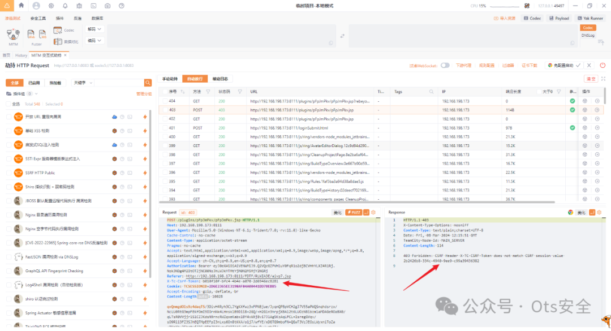
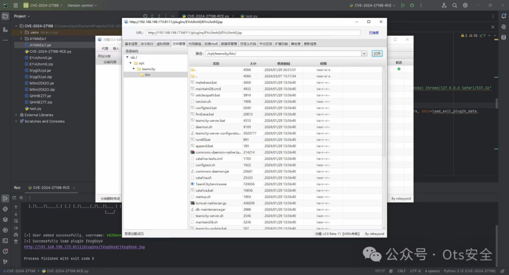
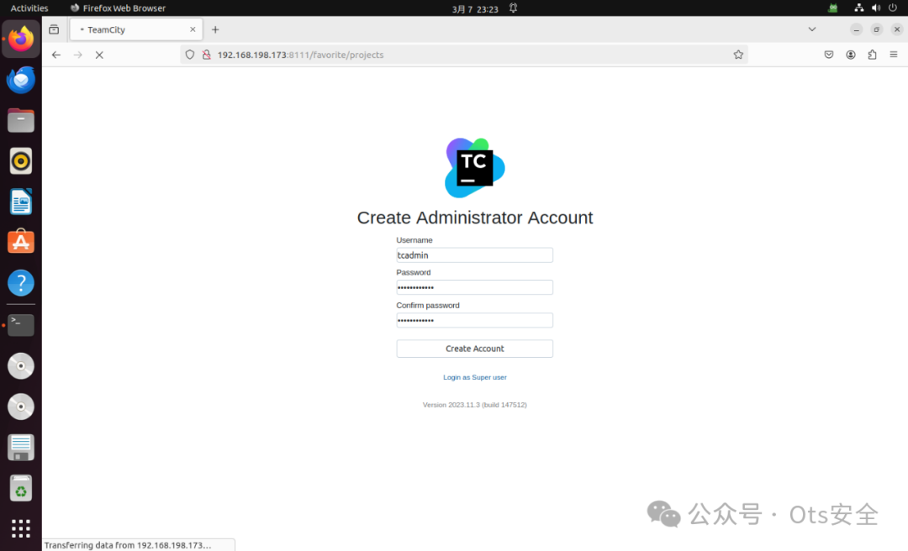
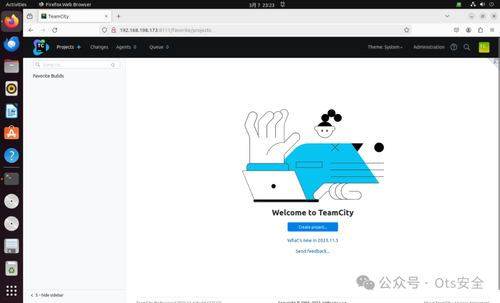

## 核对与使用边界

本文已按保存的全文审阅记录进行文字校订；本轮仅静态核对，未运行 PoC、请求目标或逐图验证。

适用条件与版本记录（来源主张，未列为明确更正的部分仍待权威资料核对）：仅实验2023.11.3，无固定版本；需自托管TeamCity和漏洞接口，工具后续创建/上传持久内容

代码与实验材料：无完整PoC或触发命令，重点Yakit代理上传故障和CSRF token；自身承认尚无插件清理

来源证据范围：W01fh4cker原仓库、Rapid7披露及Chocapikk工具

- **实验改动边界（1）**：环境与后利用风险未充分限定；依据：Docker强制-u root，注释建议ufw disable，放大风险；插件/webshell创建未清理。以下步骤按原实验条件保留；人工改动后的行为只支持该修改环境，不用于证明未修改发行版默认可利用。

- **适用与权限边界（2）**：标题和适用性含混；依据：JetBrains之前版本缺TeamCity具体版本；不使用Yakit就失败是工具问题而非漏洞必需条件，27199需独立说明。按此限制解释本文结论，版本相同不足以证明所需角色、入口、配置、依赖或可控参数均已满足；原操作和失败记录一并保留。

历史原文标识：下文原技术材料按来源保留；仅本节明确确认的更正替代相应旧说法，标为待核的观察仍不是事实确认。

#  CVE-2024-27198 和 CVE-2024-27199 身份验证绕过 --> JetBrains 之前的版本中的 RCE   
W01fh4cker  Ots安全   2024-03-09 13:55  
  
  
  
FOFA：  
```
app="JET_BRAINS-TeamCity"
```  
  
ZoomEye  
```
app:"JetBrains TeamCity"
```  
  
在用Python3.9  
```
pip install requests urllib3 faker
```  
  
  
目前存在一些问题：  
1. 如果不使用yakit代理，恶意插件上传将会失败；  
  
1. webshell上传后，如果想发起post请求，会报错，如下图：  
  
  
  
但这个问题也是可以解决的。只需通过403错误获取会话id对应的X-TC-CSRF-Token即可。比如我上传了behinder3.0的webshell并连接：  
  
  
1. 还有一些细节需要改进，比如去除恶意插件等。如果你有相关的编码技能，你可以提出 Pull Request。  
  
# 漏洞复现环境搭建  
# 使用 docker 拉取有漏洞的镜像并启动它：  
```
sudo docker pull jetbrains/teamcity-server:2023.11.3
sudo docker run -it -d --name teamcity -u root -p 8111:8111 jetbrains/teamcity-server:2023.11.3
# sudo ufw disable
```  
  
然后进行基本设置：  
  
  
  
  
  
#   
# 项目地址：  
  
https://github.com/W01fh4cker/CVE-2024-27198-RCE?tab=readme-ov-file#-problem  
#   
# 参考  
- # https://www.rapid7.com/blog/post/2024/03/04/etr-cve-2024-27198-and-cve-2024-27199-jetbrains-teamcity-multiple-authentication-bypass-vulnerabilities-fixed/  
  
- **https://github.com/Chocapikk/CVE-2024-27198**  
  
  
  
  
  
感谢您抽出  
  
  
  
.  
  
  
  
.  
  
  
  
来阅读本文  
  
  
  
**点它，分享点赞在看都在这里**  
  
  


---

> 来源：gelusus/wxvl（微信公众号漏洞文章自动归档，原文见文首链接）
