## 核对与使用边界

- 明确转录更正：文中 CVE-2024-23197 应与本节标题/分析的 CVE-2024-23917 对照，属于编号转录错位，不能另建新漏洞；`user;.jsp`/`users` 和 `&?jsp_precompile=1` 的多余问号依原请求核对，未改成利用请求。
- CVE-2024-23917 创建管理员会留账号；27199 只针对有限端点的影响，不可与 27198 完整绕过混为无差别 RCE。保留各自基线、源码与失败结果。

本文已按保存的全文审阅记录进行文字校订；本轮仅静态核对，未运行 PoC、请求目标或逐图验证。

适用条件与版本记录（来源主张，未列为明确更正的部分仍待权威资料核对）：23917&lt;=2023.11.2修复2023.11.3；27198/27199&lt;=2023.11.3，官方链接2023.11.4；补丁2018.1/2018.2分界下载链接丢失

代码与实验材料：有未认证基线、不同绕过路径、拦截器/请求栈源码跟踪；23917创建管理员有副作用，27199明确有限端点影响

来源证据范围：两个JetBrains原始公告、官方23917补丁、Rapid7一手研究和补天分析

- **来源与引用处置（1）**：转录错误会影响复现和编号；依据：CVE-2024-23197拼错；/app/rest/user;.jsp与后文users不一致；&amp;?jsp_precompile=1多?；27199补丁下载两项目无链接。保留这部分来源材料并与技术结论分开；其引用或宣传内容不能补足本文漏洞的证据。

- **适用与权限边界（2）**：方法返回值和权限判断解释含混；依据：getJspFromRequest被称返回true但逻辑实际需视图字符串；isAuthenticationRequired的false/拦截关系需原源码确认，不能仅按文字推导。按此限制解释本文结论，版本相同不足以证明所需角色、入口、配置、依赖或可控参数均已满足；原操作和失败记录一并保留。

- **适用与权限边界（3）**：图依赖与客户端路径处理；依据：多数源码仅图片；/../请求须避免客户端提前规范化，未说明；泛称所有admin路径与本篇27199有限列表应区分。按此限制解释本文结论，版本相同不足以证明所需角色、入口、配置、依赖或可控参数均已满足；原操作和失败记录一并保留。

历史原文标识：下文原技术材料按来源保留；仅本节明确确认的更正替代相应旧说法，标为待核的观察仍不是事实确认。

#  TeamCity身份验证绕过漏洞分析（CVE-2024-23917、CVE-2024-27198、CVE-2024-27199）   
原创 元亨-blckder02  中孚安全技术研究   2024-03-27 18:16  
  
1. 前言  
  
**1-1. 简介**  
  
TeamCity是一款由JetBrains开发的持续集成和持续交付（CI/CD）服务器。它提供了一个强大的平台，用于自动化构建、测试和部署软件项目。TeamCity支持多种编程语言和开发环境，并提供了丰富的功能和工具，帮助开发团队构建和交付高质量的软件。  
  
本文简单分析了三个身份验证绕过的漏洞CVE-2024-23917、CVE-2024-27198、CVE-2024-27199。  
  
  
**1-2. 环境搭建**  
  
下载地址：  
https://blog.jetbrains.com/teamcity/2024/02/critical-security-issue-affecting-teamcity-on-premises-cve-2024-23917/  
  
下载对应版本的 TeamCity，按引导进行安装。  
  
创建管理员账号。      
  
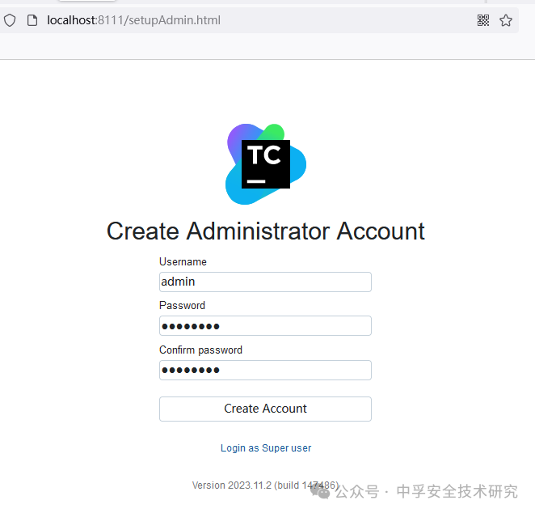  
  
  
  
  
2. CVE-2024-23917  
  
**官方公告**  
  
https://blog.jetbrains.com/teamcity/2024/02/critical-security-issue-affecting-teamcity-on-premises-cve-2024-23917/  
  
**漏洞描述**  
  
该漏洞会使未经身份验  
证的攻击者能够通过 HTTP(S) 访问 TeamCity 服务器来绕过身份验证检查并获得对该 TeamCity 服务器的管理控制。  
  
**影响版本**  
  
2023.11.2 及之前版本      
  
**2-1. 漏洞复现**  
  
未登录状态下访问  
/app/rest/server  
会跳转到登录页面，需要进行身份验证。  
  
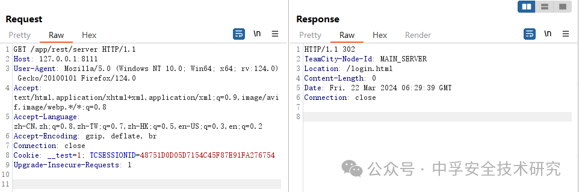  
  
  
构造 URL 为  
/app/rest/server;.jsp?jsp_precompile=1  
，能绕过身份验证，成功获取到目标内容。  
  
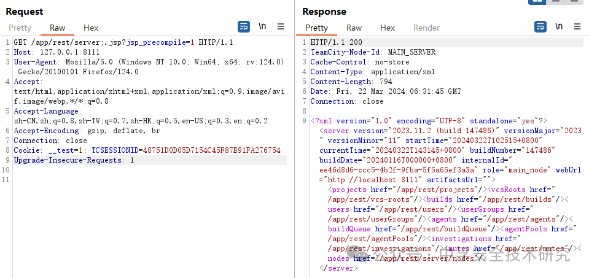  
  
  
  
**2-2. 漏洞分析**  
  
在 buildServerSpringWeb.xml 中列出了不需要身份认证就能访问的路径；    
  
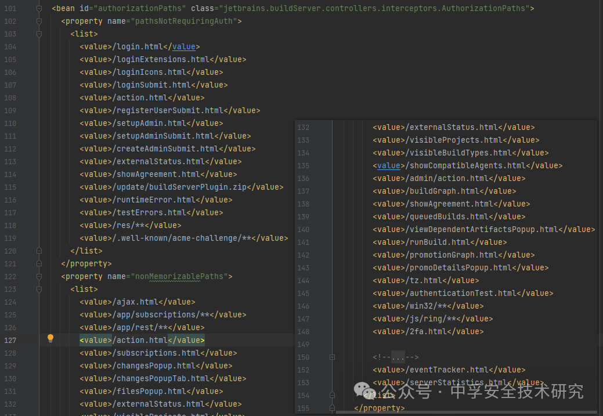  
  
  
jetbrains.buildServer.server.rest.APIController 中声明了  
/app/rest/  
路径下的"/builds/  
/statusIcon  
", "/builds/aggregated/  
/statusIcon  
", "/server/version", "/version", "/apiVersion", "/swagger**", "/server/nodes"这些不需要身份认证。  
  
声明了 MVC 用到的拦截器，其中 AuthorizationInterceptorImpl 是进行身份校验的拦截器。  
  
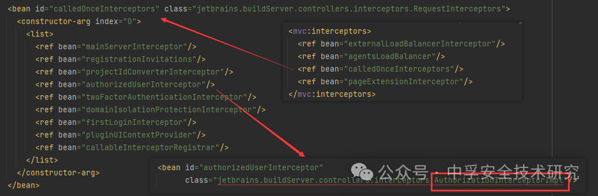  
  
  
进入 RequestInterceptors 拦截器，会进行一个 if 判断，若判断为 false 则会进入 else 遍历它下面的其他拦截器，进而调用到 AuthorizationInterceptorImpl。      
  
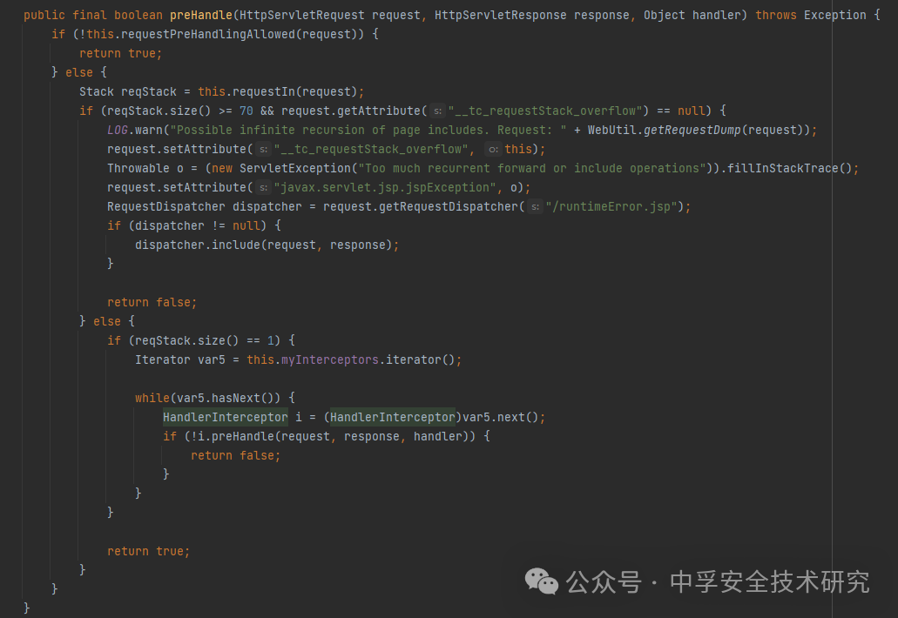  
  
  
若要 if 判断为真，则  
this.requestPreHandlingAllowed(request)  
需返回 false。****  
  
看一下 requestPreHandlingAllowed() 方法，if 中调用了 WebUtil.isJspPrecompilationRequest() ，返回结果是由 URI 决定的。从请求中获取 URI ，若是以  
.jsp  
或  
.jsp  
f  
结尾的，并且传入的  
jsp_precompile  
参数不为 null，就返回 true，进而 requestPreHandlingAllowed() 返回 false。  
  
或者进入 else 分支，满足请求路径与  
this.myPreHandlingDisabled  
中的相匹配，也会返回 false，不过这里访问路径有限制，不如 if 条件的选择自由。  
  
 requestPreHandlingAllowed() 返回 false，不用遍历子拦截器，也就避免了进行身份验证。      
  
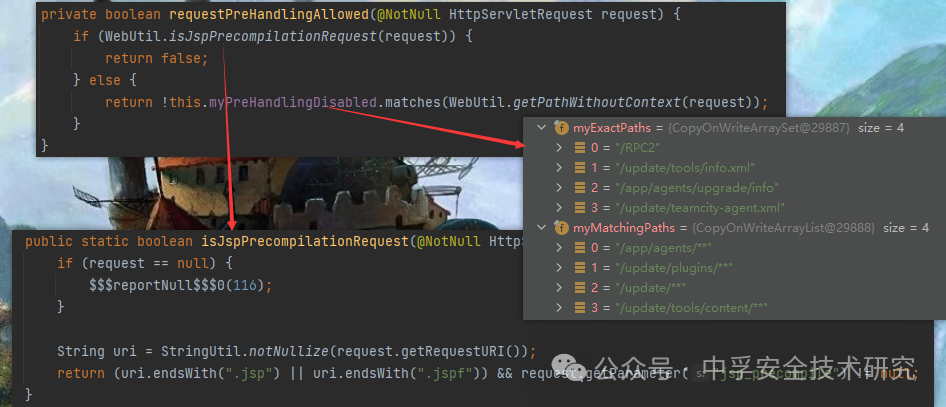  
  
  
TeamCity 提供 REST API，用于集成外部应用程序并创建与 TeamCity 服务器的脚本交互。它允许通过 URL 路径访问资源（  
实体  
）。  
  
访问  
/app/rest/swagger.json  
可以获取到端点列表与格式，以及功能描述。  
  
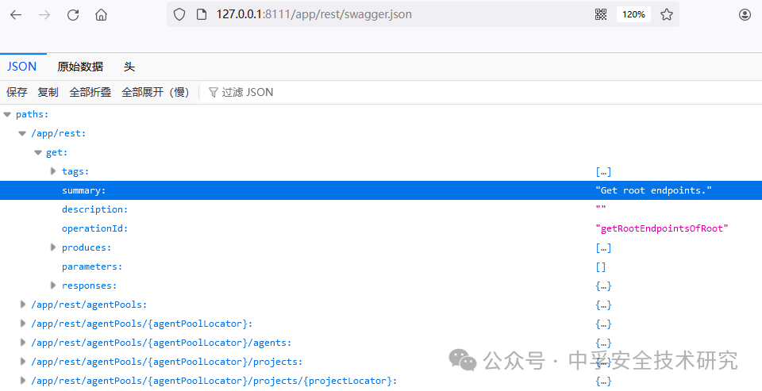  
  
  
TeamCity REST API  
中有较为详细的介绍，  
/app/rest/users  
用来进行用户相关的操作，这是需要进行身份验证才能访问的API，创建一个用户实体，需要的参数如下：      
  
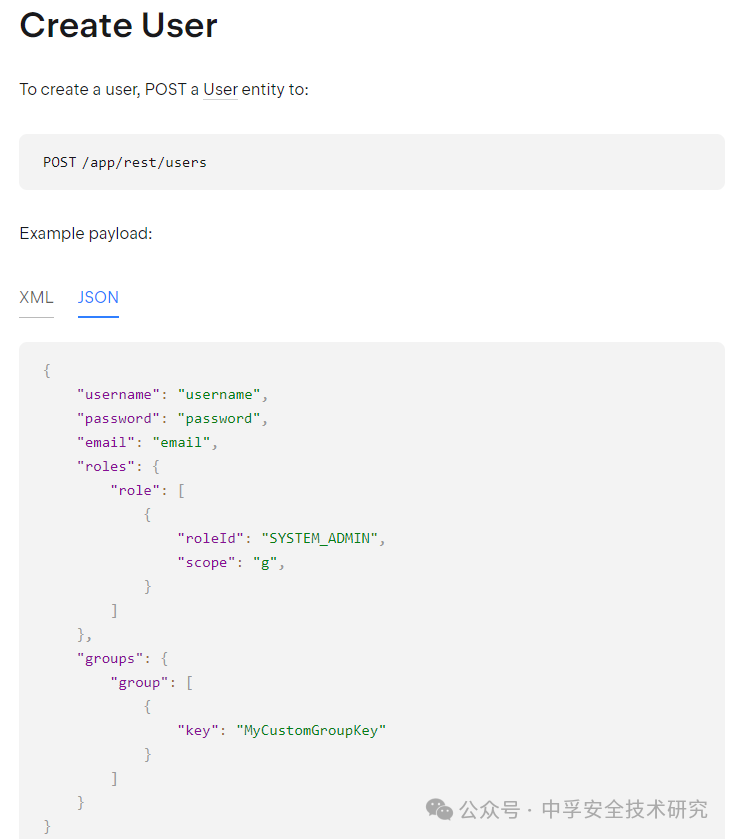  
  
  
构造请求包，满足 URI 以  
.jsp  
或  
.jsp  
f  
结尾，并且传入  
jsp_precompile  
参数不为 null 两个条件，创建一个用户名为  
user1  
，密码为  
user1user1  
，角色权限为  
SYSTEM_ADMIN  
的用户。  
```
{              
    "username":"user1",              
    "password":"user1user1",              
    "email": "123456789@qq.com",              
    "roles": {"role": [{"roleId": "SYSTEM_ADMIN", "scope": "g"}]}              
}
```  
  
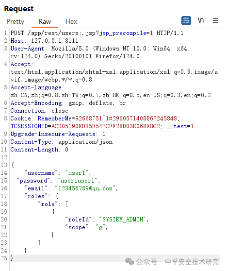  
  
  
开启调试，在 RequestInterceptors.preHandle() 断点开始，      
  
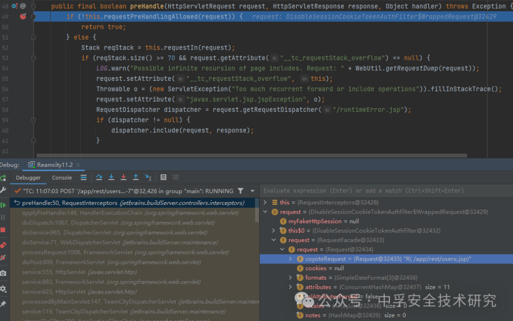  
  
  
跟进 requestPreHandlingAllowed() -> WebUtil.isJspPrecompilationRequest()，此时获取到的 URI 是  
/app/rest/user;.jsp  
，  
jsp_precompile  
参数为1，满足条件，返回 true。  
  
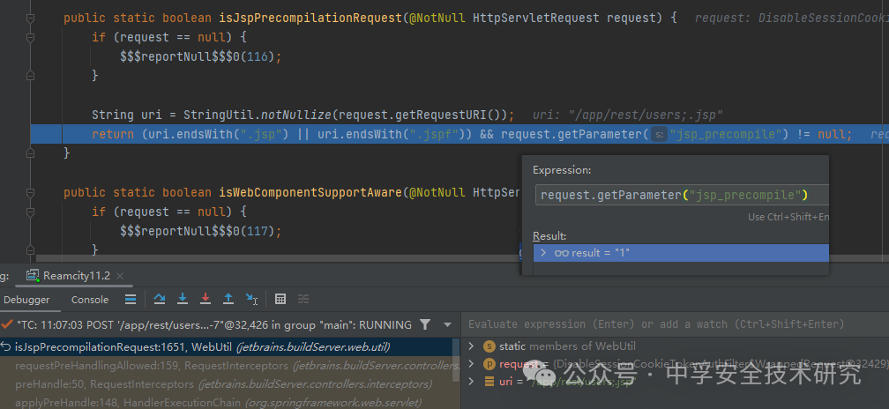  
  
  
于是，结束 RequestInterceptors 拦截器的检查，其他拦截器不会进行拦截。      
  
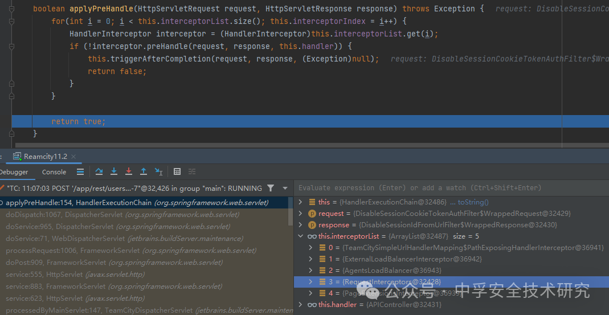  
  
  
后续在路由处理中，由于 Tomcat的特性，会忽略掉  
;.jsp  
，解析到  
/app/rest/users  
对应的功能代码进行创建用户。  
  
简单看一下 AuthorizationInterceptorImpl 的认证过程吧，进入该拦截器后，会判断当前是否有用户登录或者是否有 RememberMe 记录；  
  
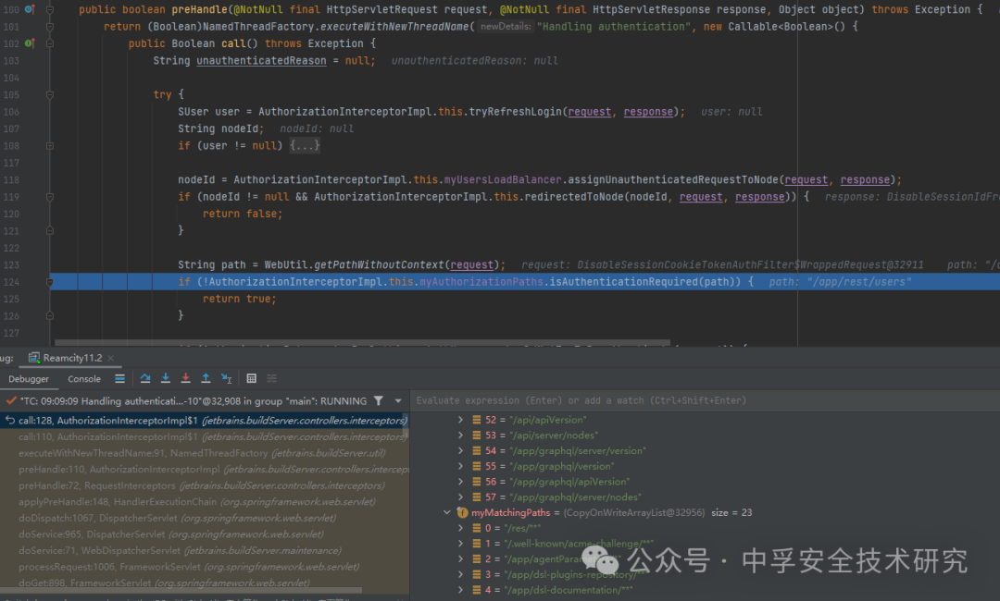  
  
  
没有登录则调用  
isAuthenticationRequired()  
判断当前访问路径是否是  
this.myAuthorizationPaths  
中不需要身份验证的路径，不是就返回 false，后面进行拦截处理。      
  
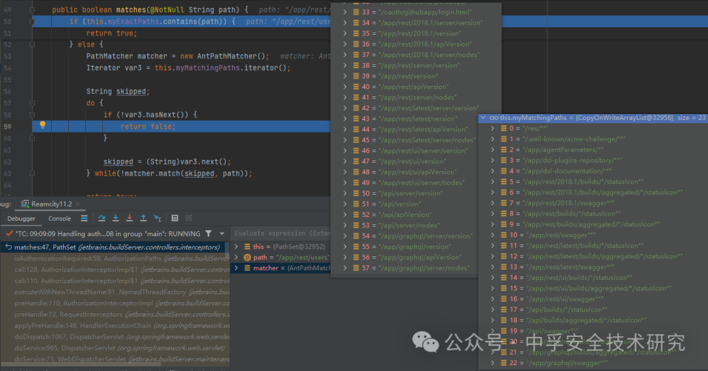  
  
  
补丁下载：  
https://download-cdn.jetbrains.com/teamcity/plugins/internal/fix_CVE_2024_23917.zip  
  
在 2023.11.3 版本中，  
this.interceptorList  
中增加了一个 Proxy 拦截器，会对当前请求进行拦截，导致请求失败。  
  
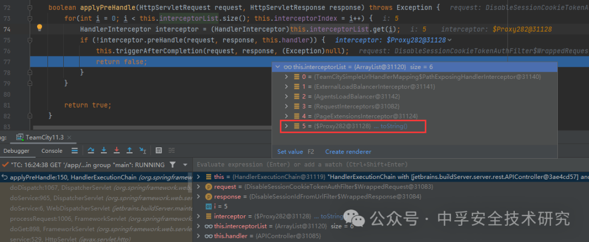  
  
  
  
  
3. CVE-2024-27198  
  
**官方公告**  
  
https://blog.jetbrains.com/teamcity/2024/03/additional-critical-security-issues-affecting-teamcity-on-premises-cve-2024-27198-and-cve-2024-27199-update-to-2023-11-4-now/  
  
**漏洞描述**  
      
  
默认情况下，TeamCity 通过 HTTP 端口 8111 公开 Web 服务器（并且可以选择配置为通过 HTTPS 运行）。攻击者可以精心设计一个 URL，以避免所有身份验证检查，从而允许未经身份验证的攻击者直接访问需要身份验证的端点。未经身份验证的远程攻击者可以利用此漏洞完全控制易受攻击的 TeamCity 服务器。  
  
**影响版本**  
  
2023.11.3及之前版本  
  
**3-1. 漏洞复现**  
  
直接访问  
/app/rest/server  
会跳转到登录页面；  
  
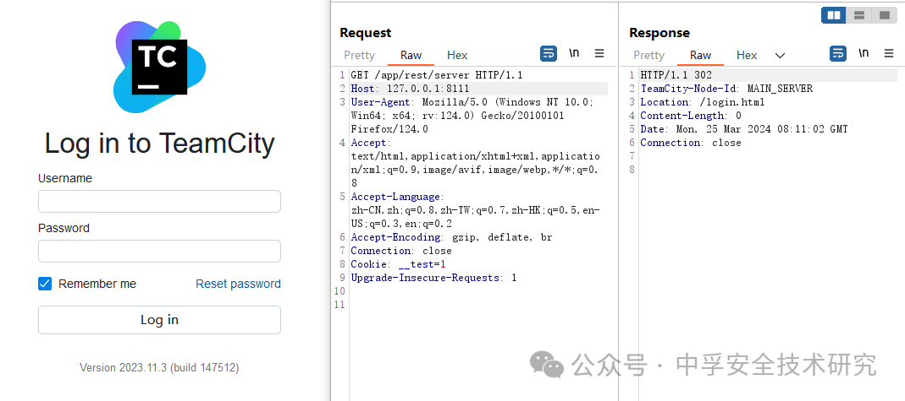  
  
  
构造 URL 为  
/hax?jsp=/app/rest/server;.jsp  
，即可绕过身份验证访问到目标内容。  
  
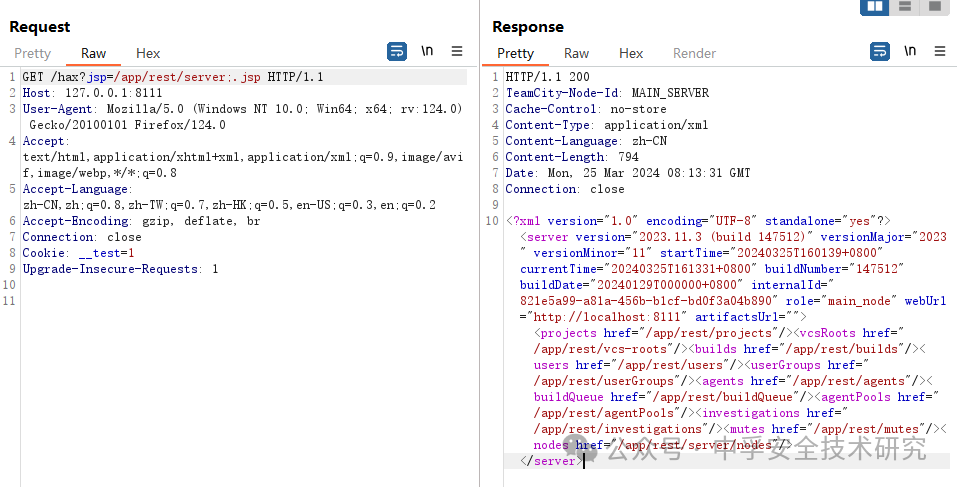  
  
      
  
  
**3-2. 漏洞分析**  
  
跟踪调试看一下，会先解析  
/hax  
路由，由于这是一个不存在的路径，所以由 PageNotFoundController 处理，在获取视图时会返回  
404.jsp  
，servlet 路径为  
/404.html  
；  
  
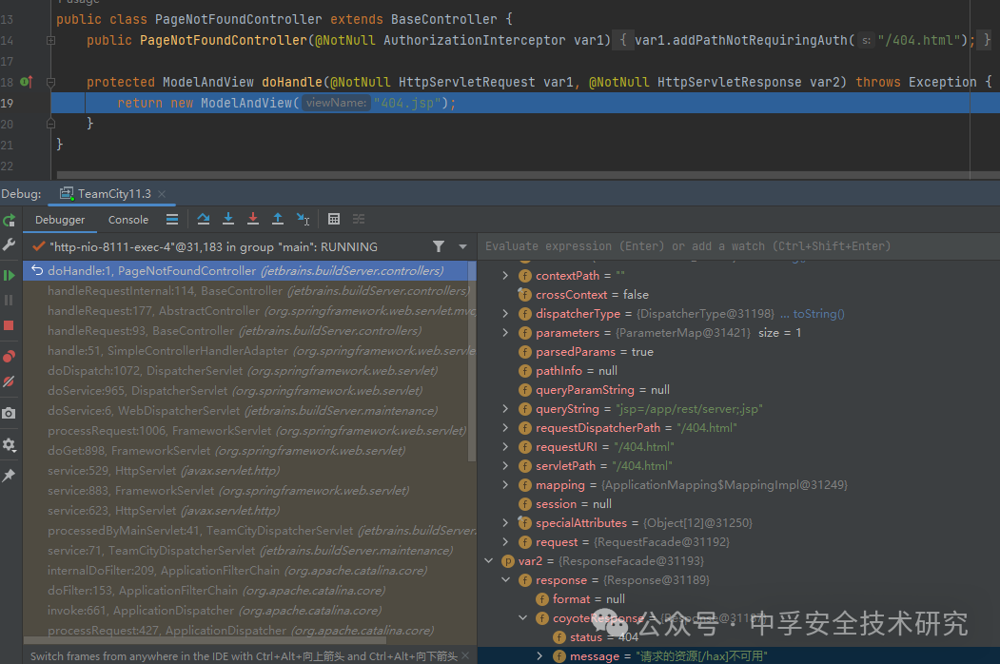  
  
  
PageNotFoundController 是继承 BaseController 的，返回到 BaseController.handleRequestInternal()，调用 updateViewIfRequestHasJspParameter() 方法；  
  
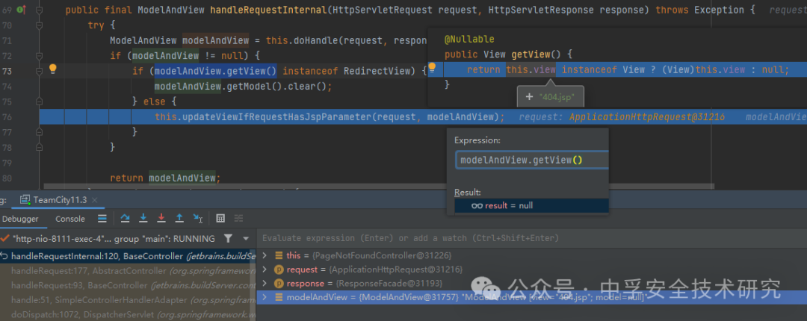  
  
跟进，根据是否存在视图名称以及 servlet 路径是否以  
.jsp  
结尾生成了一个布尔值，然后调用 getJspFromRequest() 方法，从请求中获取  
jsp  
参数值，当参数值为 null 或 以  
.jsp  
结尾，以及值中不包含  
admin/  
字符串，该方法就返回 true；  
  
满足了 if 中的三个条件，就会重新将视图设置为 jsp 参数的值。  
  
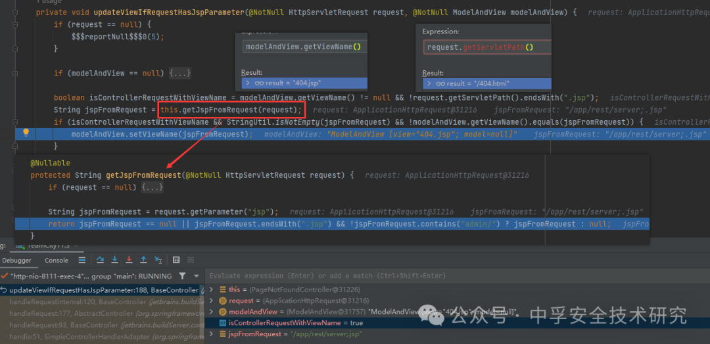  
  
  
整理一下走到这一步需要的条件：  
  
•  
  
初始返回的视图不为 View 类型，且处理的 Controller 是 BaseController的子类  
  
•  
  
视图名称不为null，且当前响应路径不以  
 .jsp  
 结尾  
  
•  
  
请求时传入 jsp 参数，参数值以   
.jsp  
 结尾，且不含  
admin/  
字符串  
  
此时视图名称变为了  
/app/rest/server;.jsp  
，jsp 参数是可控的，可以通过这种方法来访问任意需要身份验证的路径。  
  
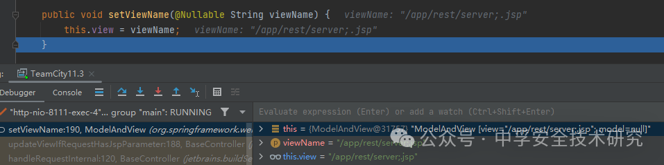  
  
  
处理器执行完后再次进入拦截器校验，但是 AuthorizationInterceptorImpl 并没有重写 postHandle() 方法，所以不会进行拦截。      
  
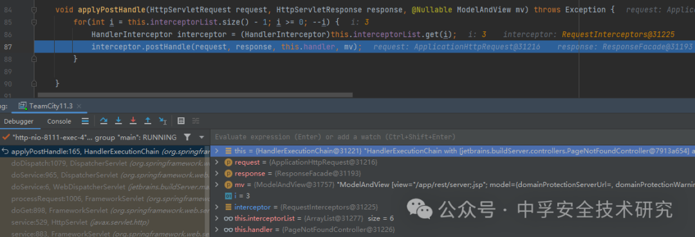  
  
  
后续会像 CVE-2024-23197 一样的过程解析  
/app/rest/server;.jsp  
，在 RequestInterceptors 中，这里没有传入  
jsp_precompile  
参数，所以  
if (!this.requestPreHandlingAllowed(var1))  
为 false，进入后面的代码；  
  
或者同样在 URL 后面拼接传入  
&?jsp_precompile=1  
，这里就能直接返回 true 了。  
  
继续看下面，此时  
__tc_requestStack  
值为2，所以不会再遍历  
this.myInterceptors  
，略过了 AuthorizationInterceptorImpl 的校验，RequestInterceptors.preHandle() 方法返回 true。  
  
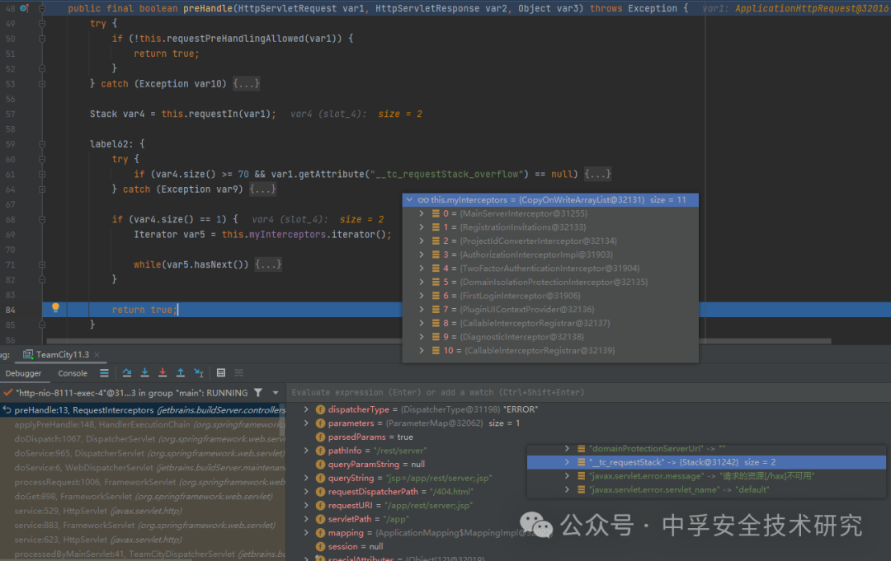  
  
  
关于新增的 Proxy 拦截器，不知道其具体内容，这里也不会拦截。于是通过所有拦截器校验，返回 true。      
  
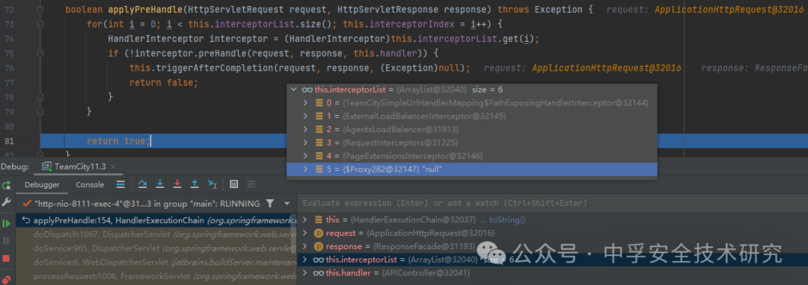  
  
  
后续 Tomcat 会自动忽略掉  
;.jsp  
，就会解析返回  
/app/rest/server  
对应的内容。  
  
  
  
4. CVE-2024  
-27199   
  
**漏洞描述**  
  
 TeamCity Web 服务器中某些旁路允许在没有身份验证的情况下访问有限数量的经过身份验证的端点。未经身份验证的攻击者可以利用此漏洞修改服务器上有限数量的系统设置，并泄露服务器上有限数量的敏感信息。  
  
**影响版本**  
  
2023.11.3及之前版本  
  
**4-1. 漏洞复现**  
  
/admin/diagnostic.jsp  
是一个需要身份验证才能访问的路径，直接请求会跳转到登录页面；  
  
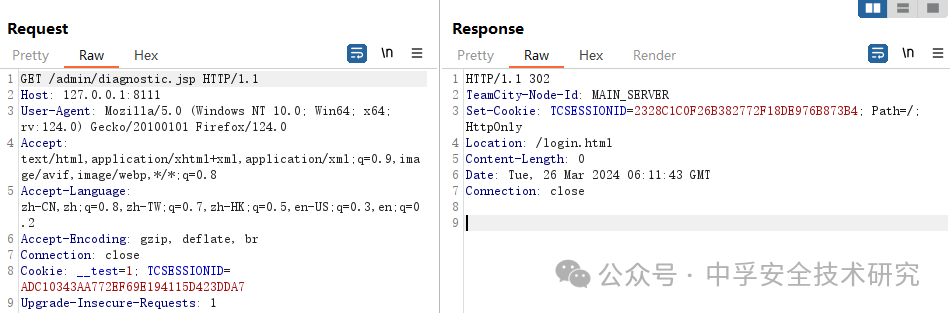  
  
  
构造 URL 为  
/update/../admin/diagnostic.jsp  
，即可成功访问。      
  
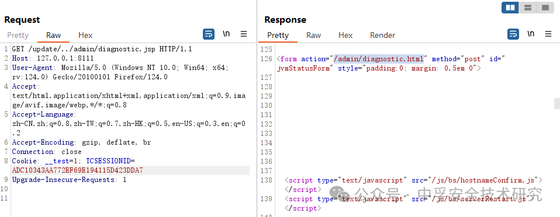  
  
  
能利用的不需要身份验证的路径有：  
  
•  
  
/res/  
  
•  
  
/update/  
  
•  
  
/update/tools/content/  
  
•  
  
/.well-known/acme-challenge/  
  
能通过拼接绕过身份验证进行访问的路口有：  
  
•  
  
/app/availableRunners  
  
•  
  
/app/https/settings/setPort  
  
•  
  
/app/https/settings/certificateInfo  
  
•  
  
/app/https/settings/defaultHttpsPort  
  
•  
  
/app/https/settings/fetchFromAcme  
  
•  
  
/app/https/settings/removeCertificate  
  
•  
  
/app/https/settings/uploadCertificate  
  
•  
  
/app/https/settings/termsOfService  
  
•  
  
/app/https/settings/triggerAcmeChallenge  
  
•  
  
/app/https/settings/cancelAcmeChallenge  
  
•  
  
/app/https/settings/getAcmeOrder  
  
•  
  
/app/https/settings/setRedirectStrategy  
  
•  
  
/app/pipeline  
  
•  
  
/app/oauth/space/createBuild.html  
      
  
  
**4-2. 漏洞分析**  
  
在 RequestInterceptors 拦截器中，和之前的逻辑一样，判断请求路径是否与  
this.myPreHandlingDisabled  
中的路径相匹配；  
  
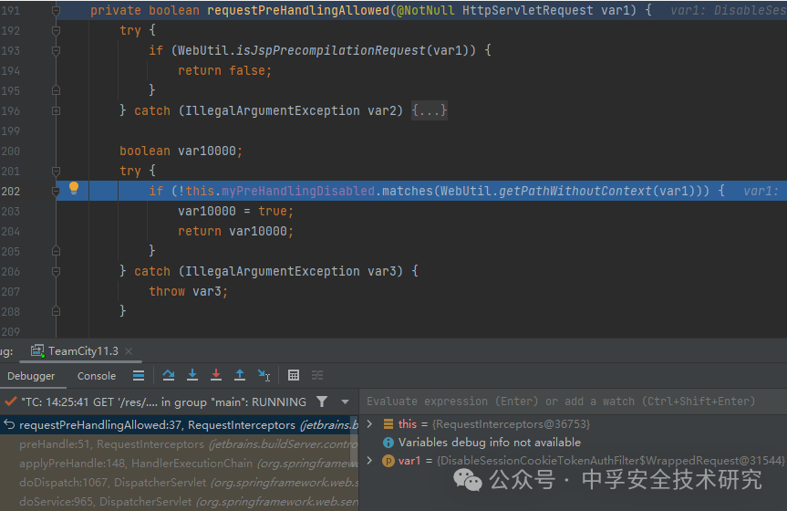  
  
  
在遍历  
this.myMatchingPaths  
时，判断请求路径是否与已定义的路径相符，匹配到了其中的  
/update/**  
，返回 true，这些路径都是不需要身份验证的路径。      
  
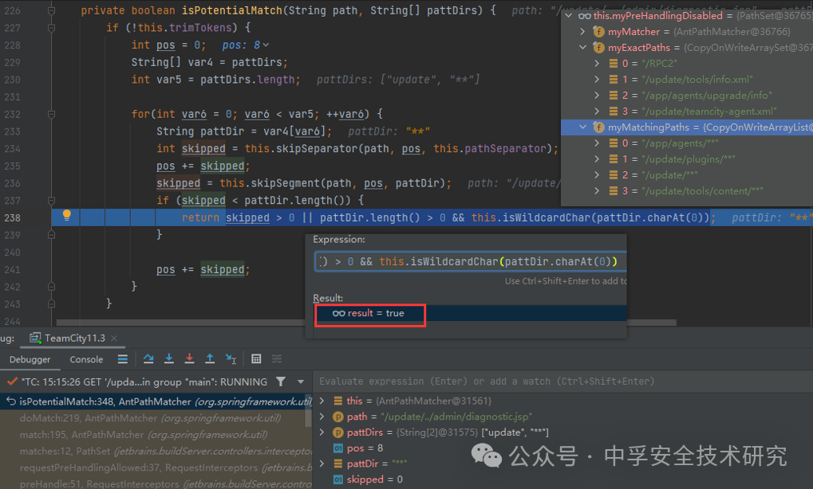  
  
  
于是 requestPreHandlingAllowed() 返回 false，不遍历 RequestInterceptors 的子拦截器，即不用进行身份验证。  
  
在后续处理中，根据路径穿越符号，  
/update/../admin/diagnostic.jsp  
会处理为  
/admin/diagnostic.jsp  
，解析到视图  
  
/admin/diagnostic.html  
，输出对应内容。      
  
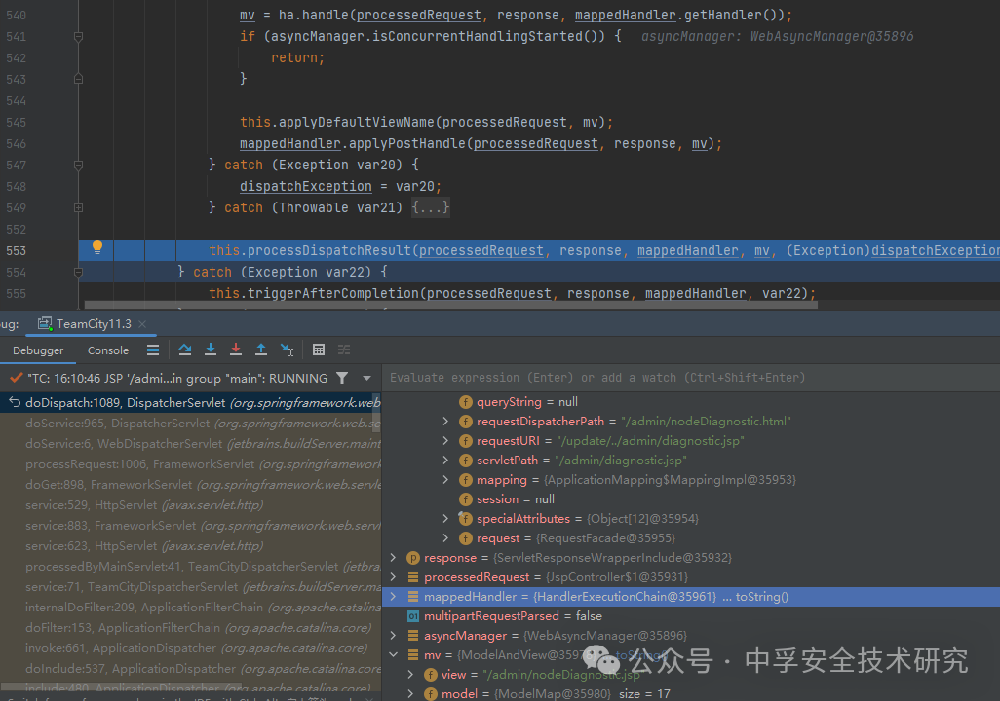  
  
  
同理，  
this.myMatchingPaths  
中的其他含有通配符的路径也可以用于绕过身份验证。  
  
•  
  
/update/plugins/../../admin/diagnostic.jsp  
  
•  
  
/update/tools/content/../../../admin/diagnostic.jsp  
  
/app/agents/**  
不可用是因为获取到的处理器不是 NodeDiagnosticsController，视图返回的就不是  
/admin/diagnostic.jsp  
。  
  
还有一处不需要身份验证的路径列表，就是  
this.myPathsNotRequiringAuthentication  
，当进入 AuthorizationInterceptorImpl 时会进行遍历匹配；  
  
当请求  
/res/../admin/diagnostic.jsp  
时，会匹配到  
/res/**  
，从而顺利通过拦截器校验。      
  
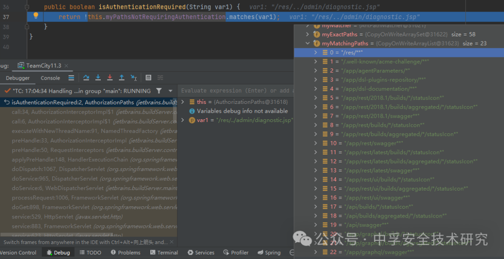  
  
  
同样，  
this.myPathsNotRequiringAuthentication  
其他含有通配符，且处理器为 NodeDiagnosticsController 的路径也能进行利用。  
  
•  
  
/.well-known/acme-challenge/../../admin/diagnostic.jsp  
  
**补丁下载：**  
  
•  
  
TeamCity 2018.2 及更高版本  
  
****  
•  
  
TeamCity 2018.1 及更早版本  
  
                 
  
更多利用方式可参考以下链接：  
  
https://www.rapid7.com/blog/post/2024/03/04/etr-cve-2024-27198-and-cve-2024-27199-jetbrains-teamcity-multiple-authentication-bypass-vulnerabilities-fixed/  
  
https://forum.butian.net/share/2801  
      
  


---

> 来源：gelusus/wxvl（微信公众号漏洞文章自动归档，原文见文首链接）
