## 核对与使用边界

- 明确更正：原影响表中的 3.0.6、2.4.16、2.3.14、2.2.10、2.1.13、2.0.19 是官方要求升级到的修复版本，不应反列为受影响样本；前四组为 nette/application，2.1/2.0 对应 nette/nette。
- 官方还列 3.0.2.1、3.1.0-RC2 等替代修复线；应核实际安装包与锁文件，web-project 3.0.0 模板版本不能代替 application 版本。主编号 CVE-2020-15227 来自正文参考和官方公告，图中最终请求未转录部分仍未补造。

核对来源：[Nette 官方安全发布](https://blog.nette.org/en/cve-2020-15227-potential-remote-code-execution-vulnerability)

本文已按保存的全文审阅记录进行文字校订；本轮仅静态核对，未运行 PoC、请求目标或逐图验证。

适用条件与版本记录（来源主张，未列为明确更正的部分仍待权威资料核对）：列3.0.6、2.4.16、2.3.14、2.2.10、2.1.13、2.0.19但不写比较符，疑把修复版本列作受影响；实验web-project3.0.0不能代替application锁定版本

代码与实验材料：完整路由到MicroPresenter调用链叙述，关键源码及最终请求均图片；PHP内部参数名随版本需核实

来源证据范围：含Nette官方CVE公告和中文文档，来源可追溯未外查

- **事实待核（1）**：影响范围可能反向列出修复版本；依据：影响范围中逐个列3.0.6(or3.0.2.1,3.1.0-RC2 or dev)等发布版本，没有&lt;关系；需以官方公告校正。该项尚不能从转载本身确定外部事实；下文相应编号、版本或修复说法只作为来源记录，不能据此判定部署受影响或已修复。明确更正另列于本节。

- **证据待核（2）**：复现缺依赖锁与文本请求；依据：composer create-project web-project3.0.0@dev不能锁定所有依赖，最终shell_exec请求仅图。保留原引用、截图位置和实验叙述；本项所缺材料未被补造，截图存在或作者宣称成功都不等于已核验其内容。

- **事实待核（3）**：转义残留和元数据漏主CVE；依据：来源Markdown反斜杠、类名双重转义；主CVE藏参考链接。该项尚不能从转载本身确定外部事实；下文相应编号、版本或修复说法只作为来源记录，不能据此判定部署受影响或已修复。明确更正另列于本节。

历史原文标识：下文原技术材料按来源保留；仅本节明确确认的更正替代相应旧说法，标为待核的观察仍不是事实确认。

# Nette 框架未授权任意代码执行漏洞分析

<meta name="referrer" content="no-referrer"/>

> 本文由 [简悦 SimpRead](http://ksria.com/simpread/) 转码， 原文地址 [mp.weixin.qq.com](https://mp.weixin.qq.com/s/55tgbATekW5RxaR7m7q6zw)

****
------------------------------------------------------------------------------------------------------------------------------------------------

**1、前言**
--------

Nette Framework 是个强大，基于组件的事件驱动 PHP 框架，用来创建 web 应用。Nette Framework 是个现代化风格的 PHP 框架，主要用于国外网站开发，因此国内对该框架的研究比较少。**2020 年 10 月，Nette 框架被爆出存在未授权任意代码执行漏洞，可通过自有框架控制器 MicroPresenter 执行任意 PHP 方法，我们对漏洞进行了复现和分析，发现该漏洞危害严重，请广大用户及时进行升级修复。**

**2、环境准备**
----------

通过查询发现该漏洞影响自 2.0 以来的几乎所有大版本，详细的范围如下

nette/application 3.0.6 (or 3.0.2.1, 3.1.0-RC2 or dev)

nette/application 2.4.16

nette/application 2.3.14

nette/application 2.2.10

nette/nette 2.1.13

nette/nette 2.0.19

我们通过 composer 安装受影响的 3.0.0 版本，执行 composer create-project nette/web-project nette-blog 3.0.0@dev，安装完成后整体的目录结构如下：

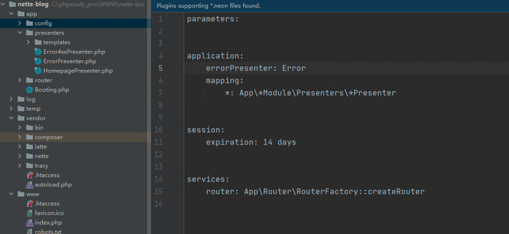

其中 app 为应用程序的主目录，包含 presenters 控制类目录、config 配置文件、router 路由器类目录以及 Booting.php 应用启动文件。而 vendor/nette 目录下包含 Nette 的所有框架文件，www 目录包含整个 Web 程序能够直接访问的文件，如静态资源、入口文件 index.php 等，同时在 index.php 中调用 Booting 中的 boot 方法引导启动。

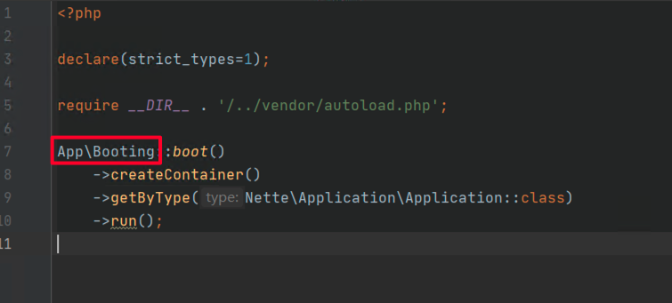

Nette 会创建 Configurator 类对象来对启动环境进行配置，如设置日志文件目录、临时文件目录、加载配置文件等。

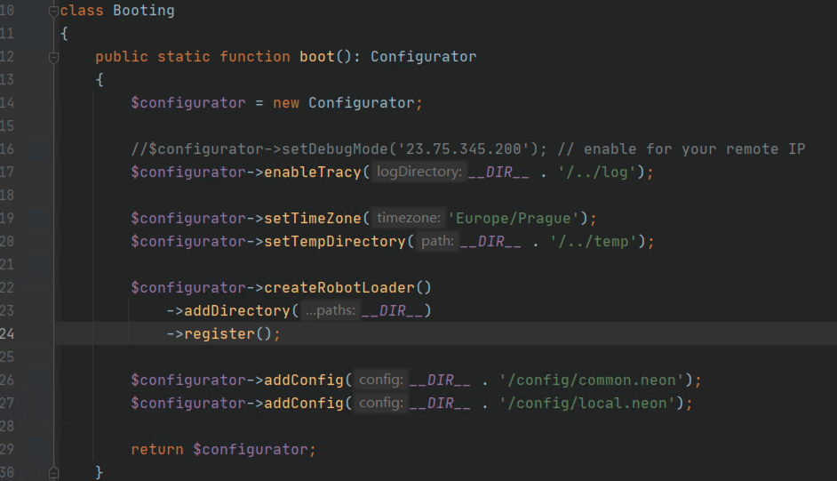

后续会根据配置调用 createContainer 创建一个 DI 容器，并通过 getByType 方法实例化 Nette 框架主程序 Nette\\Application\\Application 对象，最后调用了 Application 对象的 run 方法。

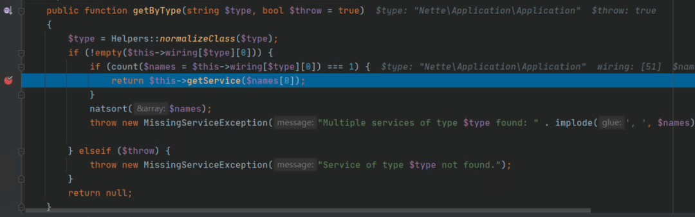

**3、漏洞分析**
----------

我们还是根据网上披露的 POC 来进一步分析代码，从 Application:run 函数处打下断点，函数会调用 createInitialRequest 方法来初始化 Request 对象。

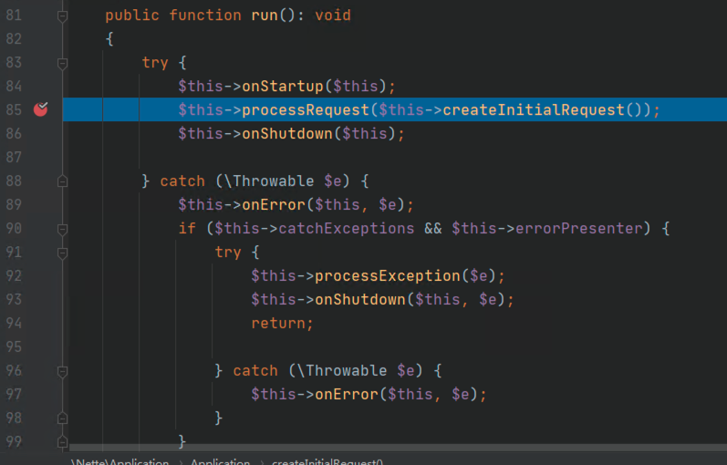

跟进到 createInitialRequest 方法，108 行通过调用路由类的 match 方法来处理 http 请求，109 行则是获取需要调用的控制器类，119 行则是返回处理好的 Request 对象。

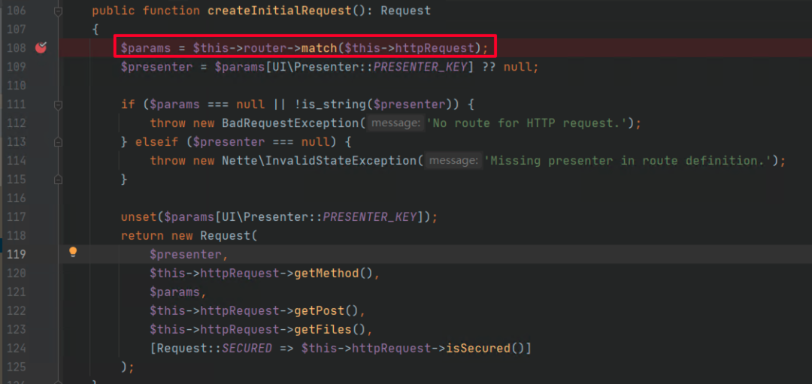

我们跟进 match 方法，发现路由器类的调用路径如下：

Nette\\Application\\Routers\\RouteList->Nette\\Routing\\RouteList->Nette\\Application\\Routers\\Route->Nette\\Routing\\Route::match()，该方法主要将 http 请求处理后转换成数组。121 行将网站请求路径中的基础路径删除赋值给 $path，131 行将 $path 按照 presenter/action/id 形式的正则进行匹配，并将匹配的部分分别标记为 p0、p4、p13，148 行则将匹配出的字符型 key 从 $this->aliases 数组中取出对应的描述字段，其中 p0 对应为 presenter，因此取出的控制器为 $params\[‘presenter’\]= nette.micro。

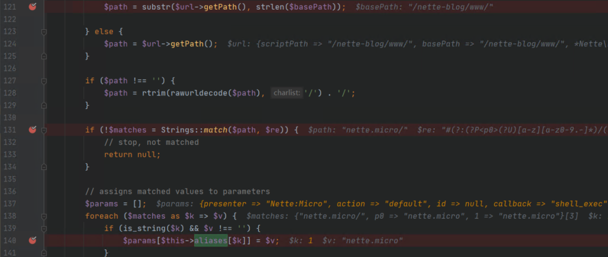

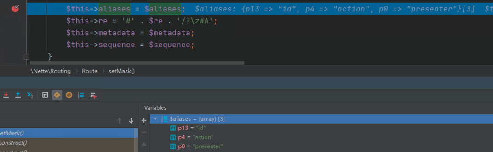

继续跟进到 173 行，调用了 `$params[$name] = $meta[self::FILTER_IN]((string) $params[$name])` 处理 `$params`，其中 `$meta[self::FILTER_IN]` 对应了 `path2presenter` 处理控制器部分，将 `nette.micro` 转成 `Nette:Micro`。

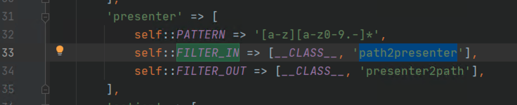

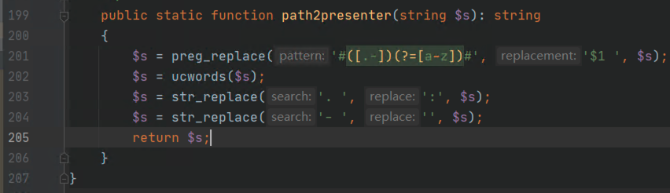

随后我们返回 Application.php 中的 processRequest 方法，这里我们主要关注控制器部分 Nette:Micro 如何被调用的，跟进 114 行到 presenterFactory 类的 formatPresenterClass 方法，调用路径为 createPresenter->getPresenterClass->formatPresenterClass。

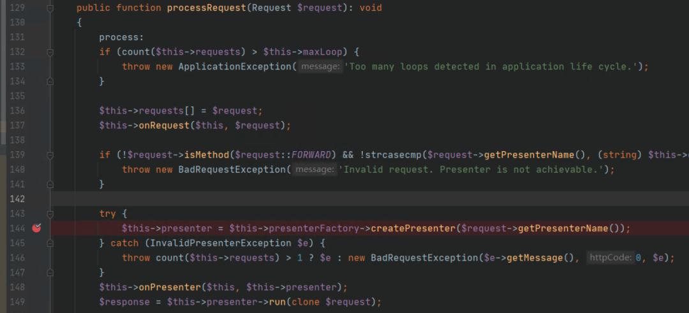

在该方法中，120 行将 $presenter 用冒号分割，并对 $mapping 赋值为 $this->mapping\[‘Nette’\]。

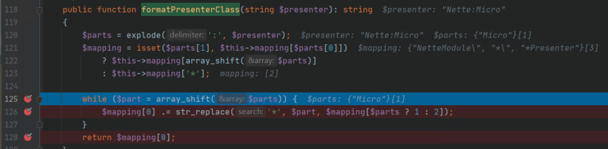

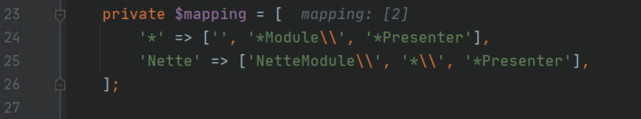

126 行则将 $mapping 的第三个元素 \* Presenter 中的 \* 替换为 Micro，并将 $mapping 的第一个元素和替换后的字符串相连，最终得到控制器为 NetteModule\\MicroPresenter。在 Application.php 的 144-149 行，程序调用了控制器 NetteModule\\MicroPresenter 中的 run 函数，对应为 nette/application/src/Application/MicroPresenter.php，69 行获取传递进来的 GET 参数。

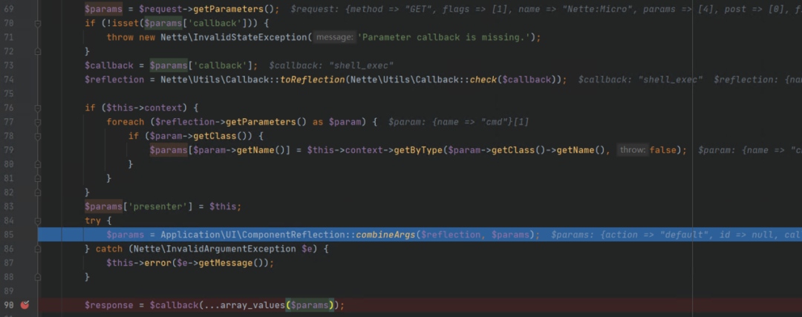

其中 74 行会检查 callback 参数传递进来的变量可否被当做函数调用，85 行调用 combineArgs 方法获取回调函数中的默认参数名，并于 GET 请求传递过来的参数名比对，如果相同则保存在 $res 数组并返回到 $params 中。

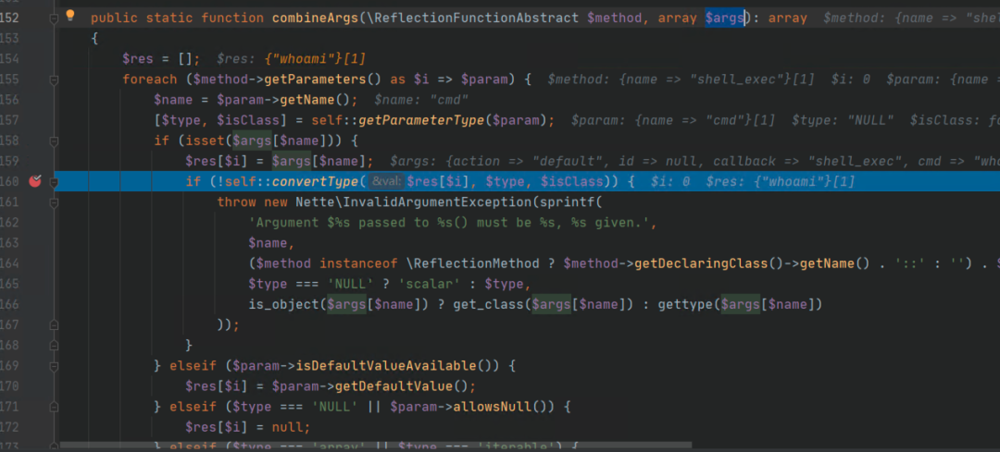

返回到 MicroPresenter.php 的 90 行，这是一个典型的可变函数调用，在诸多 PHP 后门中比较常见，这里函数名 $callback 和参数 $params 都可控，可导致任意代码执行。我们以 shell\_exec 方法为例，默认参数为 cmd，我们构造对应的 POC 请求：

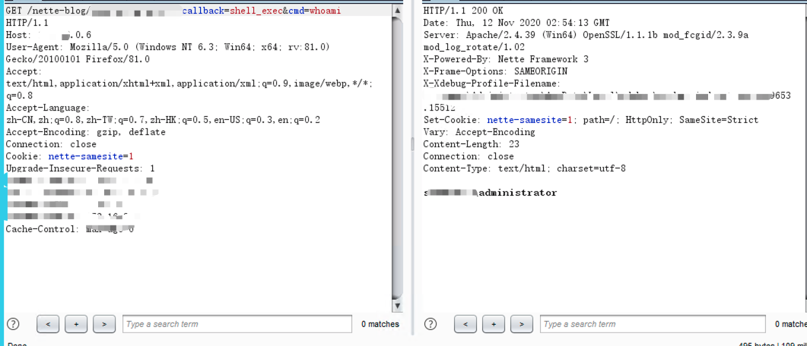

**4、安全产品解决方案**
--------------

百度度御关 WAF、高级威胁感知系统，以及智能安全一体化产品已支持该漏洞的检测和拦截，有需要的用户可以访问 anquan.baidu.com 联系我们。

_参考链接：_

_https://blog.nette.org/en/cve-2020-15227-potential-remote-code-execution-vulnerability_

_https://www.kancloud.cn/aspvb/nette/271800_

**推荐阅读**

**[通达 OA 11.5 版本某处 SQL 注入漏洞复现分析](http://mp.weixin.qq.com/s?__biz=MjM5MTAwNzUzNQ==&mid=2650494316&idx=1&sn=bdbf4281f9d0b9cedd8659c93a1dd86e&chksm=beb3e32c89c46a3a5691ce5cbb13b4f6b94ed2c3b5e7fbd6e44b2dd633042dfbbabf4b8d08f8&scene=21#wechat_redirect)  
**

**[从 CVE-2020-8816 聊聊 shell 参数扩展](http://mp.weixin.qq.com/s?__biz=MjM5MTAwNzUzNQ==&mid=2650493205&idx=1&sn=1e3d4ccba11cc2b708f0fdec82d72587&chksm=beb3e75589c46e43271ec0c997d53ffabcdc8596476718d2aff510fc55b6c01040b5c481fe8b&scene=21#wechat_redirect)  
**

**[Shiro rememberMe 反序列化攻击检测思路](http://mp.weixin.qq.com/s?__biz=MjM5MTAwNzUzNQ==&mid=2650493186&idx=1&sn=39b99df8a3d82534cb9fd255f9e0059d&chksm=beb3e74289c46e5455698fd3c1758b865dbd10fd7b513b3e9f19cce4c5b62d5b0887fcd028b0&scene=21#wechat_redirect)  
**

**[Spring Boot + H2 JNDI 注入漏洞复现分析](http://mp.weixin.qq.com/s?__biz=MjM5MTAwNzUzNQ==&mid=2650492993&idx=2&sn=0b27352db1d34ba1b077ae397d1f08a5&chksm=beb3e60189c46f17b60ee16fd1460679986064211caaeace1e0f6fbfde2a629b17aa43434fe6&scene=21#wechat_redirect)  
**

  

---

> 来源：MrWQ/vulnerability-paper（https://github.com/MrWQ/vulnerability-paper）
